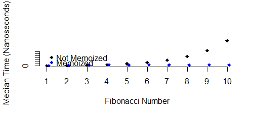
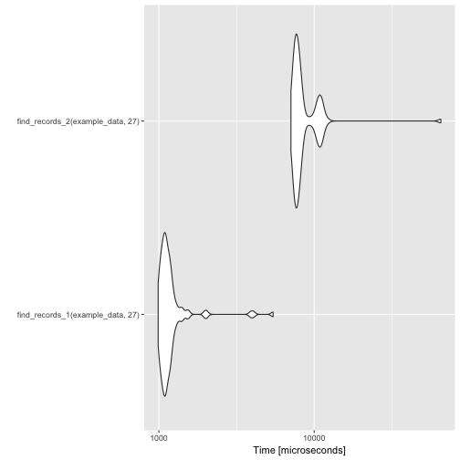
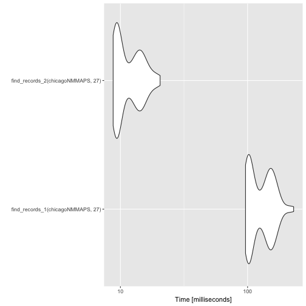

# Advanced R Programming


This course covers advanced topics in R programming that are necessary for developing powerful, robust, and reusable data science tools. Topics covered include functional programming in R, robust error handling, object oriented programming, profiling and benchmarking, debugging, and proper design of functions. Upon completing this course you will be able to identify and abstract common data analysis tasks and to encapsulate them in user-facing functions. Because every data science environment encounters unique data challenges, there is always a need to develop custom software specific to your organization’s mission. You will also be able to define new data types in R and to develop a universe of functionality specific to those data types to enable cleaner execution of data science tasks and stronger reusability within a team.

The learning objectives of the chapter are: 

- Describe the control flow of an R program 
- Write a function that abstracts a single concept/procedure
- Describe functional programming concepts
- Write functional programming code using the `purrr` package
- Manipulate R expressions to "compute on the language"
- Describe the semantics of R environments
- Implement exception handling routines in R functions
- Design and Implement a new S3, S4, or reference class with generics and methods
- Apply debugging tools to identify bugs in R programs
- Apply profiling and timing tools to optimize R code
- Describe the principles of tidyverse functions

## Control Structures

*Note: Some of the material in this section is adapted from [R Programming for Data Science](https://leanpub.com/rprogramming)*.


The learning objectives of the section are: 

- Describe the control flow of an R program 


Control structures in R allow you to control the flow of execution of a series of R expressions. Basically, control structures allow you to put some "logic" into your R code, rather than just always executing the same R code every time. Control structures allow you to respond to inputs or to features of the data and execute different R expressions accordingly.

Commonly used control structures are

- `if` and `else`: testing a condition and acting on it

- `for`: execute a loop a fixed number of times 

- `break`: break the execution of a loop

- `next`: skip an iteration of a loop

Most control structures are not used in interactive sessions, but rather when writing functions or longer expressions. However, these constructs do not have to be used in functions and it's a good idea to become familiar with them before we delve into functions.


### `if`-`else`

The `if`-`else` combination is probably the most commonly used control structure in R (or perhaps any language). This structure allows you to test a condition and act on it depending on whether it's true or false. 

For starters, you can just use the `if` statement.

```r
if(<condition>) {
        ## do something
} 
## Continue with rest of code
```

The above code does nothing if the condition is false. If you have an action you want to execute when the condition is false, then you need an `else` clause.

```r
if(<condition>) {
        ## do something
} else {
        ## do something else
}
```

You can have a series of tests by following the initial `if` with any number of `else if`s.

```r
if(<condition1>) {
        ## do something
} else if(<condition2>)  {
        ## do something different
} else {
        ## do something different
}
```

Here is an example of a valid if/else structure.


```r
## Generate a uniform random number
x <- runif(1, 0, 10)  
if(x > 3) {
        y <- 10
} else {
        y <- 0
}
```

The value of `y` is set depending on whether `x > 3` or not. 

Of course, the `else` clause is not necessary. You could have a series of if clauses that always get executed if their respective conditions are true.

```r
if(<condition1>) {

}

if(<condition2>) {

}
```


### `for` Loops

For loops are pretty much the only looping construct that you will need in R. While you may occasionally find a need for other types of loops, in most data analysis situations, there are very few cases where a for loop isn't sufficient. 

In R, for loops take an iterator variable and assign it successive values from a sequence or vector. For loops are most commonly used for iterating over the elements of an object (list, vector, etc.)


```r
numbers <- rnorm(10)
for(i in 1:10) {
        print(numbers[i])
}
[1] -0.9567815
[1] 1.347491
[1] -0.03158058
[1] 0.5960358
[1] 1.133312
[1] -0.7085361
[1] 1.525453
[1] 1.114152
[1] -0.1214943
[1] -0.2898258
```

This loop takes the `i` variable and in each iteration of the loop gives it values 1, 2, 3, ..., 10, executes the code within the curly braces, and then the loop exits.

The following three loops all have the same behavior.


```r
x <- c("a", "b", "c", "d")

for(i in 1:4) {
        ## Print out each element of 'x'
        print(x[i])  
}
[1] "a"
[1] "b"
[1] "c"
[1] "d"
```

The `seq_along()` function is commonly used in conjunction with for loops in order to generate an integer sequence based on the length of an object (in this case, the object `x`).


```r
## Generate a sequence based on length of 'x'
for(i in seq_along(x)) {   
        print(x[i])
}
[1] "a"
[1] "b"
[1] "c"
[1] "d"
```

It is not necessary to use an index-type variable. 


```r
for(letter in x) {
        print(letter)
}
[1] "a"
[1] "b"
[1] "c"
[1] "d"
```

For one line loops, the curly braces are not strictly necessary.


```r
for(i in 1:4) print(x[i])
[1] "a"
[1] "b"
[1] "c"
[1] "d"
```

However, curly braces are sometimes useful even for one-line loops, because that way if you decide to expand the loop to multiple lines, you won't be burned because you forgot to add curly braces (and you *will* be burned by this).


#### Nested `for` loops

`for` loops can be nested inside of each other.

```r
x <- matrix(1:6, 2, 3)

for(i in seq_len(nrow(x))) {
        for(j in seq_len(ncol(x))) {
                print(x[i, j])
        }   
}
```

Nested loops are commonly needed for multidimensional or hierarchical data structures (e.g. matrices, lists). Be careful with nesting though. Nesting beyond 2 to 3 levels often makes it difficult to read or understand the code. If you find yourself in need of a large number of nested loops, you may want to break up the loops by using functions (discussed later).


### `next`, `break`

`next` is used to skip an iteration of a loop. 


```r
for(i in 1:100) {
        if(i <= 20) {
                ## Skip the first 20 iterations
                next                 
        }
        ## Do something here
}
```

`break` is used to exit a loop immediately, regardless of what
iteration the loop may be on.


```r
for(i in 1:100) {
      print(i)

      if(i > 20) {
              ## Stop loop after 20 iterations
              break  
      }		
}
```


### Summary

- Control structures like `if`-`else` and `for` allow you to
  control the flow of an R program.

- Control structures mentioned here are primarily useful for writing programs; for command-line interactive work, the "apply" functions are typically more useful.

## Functions

The learning objectives of the section are: 

- Write a function that abstracts a single concept/procedure


The development of a functions in R represents the next level of R programming, beyond executing commands at the command line and writing scripts containing multiple R expressions. When writing R functions, one has to consider the following things:


1. Functions are used to **encapsulate** a sequence of expressions that are executed together to achieve a specific goal. A single function typically does "one thing well"---often taking some input and then generating output that can potentially be handed off to another function for further processing. Drawing the lines where functions begin and end is a key skill for writing functions. When writing a function, it's important to ask yourself *what do I want to encapsulate*?

1. There is going to be a **user** who will desire the ability to modify certain aspects of your code to match their specific needs or application. Aspects of your code that can be modified often become *function arguments* that can be specified by the user. This user can range from yourself (at a later date) to people you have never met using your code for purposes you never dreamed of. When writing any function it's important to ask *what will the user want to modify in this function*? Ultimately, the answer to this question will lead to the function's **interface**.

### Code

Often we start out analyzing data by writing straight R code at the console. This code is designed to accomplish a single task---whatever it is that we are trying to do *right now*. For example, consider the following code that operates on download logs published by RStudio from their mirror of the Comprehensive R Archive Network (CRAN). This code counts the number of times the `filehash` package was downloaded on July 20, 2016.


```r
library(readr)
library(dplyr)

## Download data from RStudio (if we haven't already)
if(!file.exists("data/2016-07-20.csv.gz")) {
        download.file("http://cran-logs.rstudio.com/2016/2016-07-20.csv.gz", 
                      "data/2016-07-20.csv.gz")
}
cran <- read_csv("data/2016-07-20.csv.gz", col_types = "ccicccccci")
cran %>% filter(package == "filehash") %>% nrow
[1] 179
```

This computation is fairly straightforward and if one were only interested in knowing the number of downloads for this package on this day, there would be little more to say about the code. However, there are a few aspects of this code that one might want to modify or expand on:

* the **date**: this code only reads data for July 20, 2016. But what about data from other days? Note that we would first need to obtain that data if we were interested in knowing download statistics from other days.

* the **package**: this code only returns the number of downloads for the `filehash` package. However, there are many other packages on CRAN and we may want to know how many times these other packages were downloaded.

Once we've identified which aspects of a block of code we might want to modify or vary, we can take those things and abstract them to be arguments of a function.

### Function interface

The following function has two arguments:

* `pkgname`, the name of the package as a character string

* `date`, a character string indicating the date for which you want download statistics, in year-month-day format

Given the date and package name, the function downloads the appropriate download logs from the RStudio server, reads the CSV file, and then returns the number of downloads for the package.


```r
library(dplyr)
library(readr)

## pkgname: package name (character)
## date: YYYY-MM-DD format (character)
num_download <- function(pkgname, date) {
        ## Construct web URL
        year <- substr(date, 1, 4)
        src <- sprintf("http://cran-logs.rstudio.com/%s/%s.csv.gz",
                       year, date)
        
        ## Construct path for storing local file
        dest <- file.path("data", basename(src))
        
        ## Don't download if the file is already there!
        if(!file.exists(dest))
                download.file(src, dest, quiet = TRUE)
        
        cran <- read_csv(dest, col_types = "ccicccccci", progress = FALSE)
        cran %>% filter(package == pkgname) %>% nrow
}
```

Now we can call our function using whatever date or package name we choose.


```r
num_download("filehash", "2016-07-20")
[1] 179
```

We can look up the downloads for a different package on a different day.


```r
num_download("Rcpp", "2016-07-19")
[1] 13572
```

Note that for this date, the CRAN log file had to be downloaded separately because it had not yet been downloaded.


#### Default values

The way that the `num.download()` function is currently specified, the user must enter the date and package name each time the function is called. However, it may be that there is a logical "default date" for which we always want to know the number of downloads, for any package. We can set a **default value** for the date argument, for example, to be July 20, 2016. In that case, if the `date` argument is not explicitly set by the user, the function can use the default value. The revised function might look as follows:


```r
num_download <- function(pkgname, date = "2016-07-20") {
        year <- substr(date, 1, 4)
        src <- sprintf("http://cran-logs.rstudio.com/%s/%s.csv.gz",
                       year, date)
        dest <- file.path("data", basename(src))
        if(!file.exists(dest))
                download.file(src, dest, quiet = TRUE)
        cran <- read_csv(dest, col_types = "ccicccccci", progress = FALSE)
        cran %>% filter(package == pkgname) %>% nrow
}
```

Now we can call the function in the following manner. Notice that we do not specify the `date` argument.


```r
num_download("Rcpp")
[1] 14761
```

Default values play a critical role in R functions because R functions are often called *interactively*. When using R in interactive mode, it can be a pain to have to specify the value of every argument in every instance of calling the function. Sometimes we want to call a function multiple times while varying a single argument (keeping the other arguments at a sensible default). 

Also, function arguments have a tendency to proliferate. As functions mature and are continuously developed, one way to add more functionality is to increase the number of arguments. But if these new arguments do not have sensible default values, then users will generally have a harder time using the function. 

As a function author, you have tremendous influence over the user's behavior by specifying defaults, so take care in choosing them. However, just note that a judicious use of default values can greatly improve the user experience with respect to your function.


#### Re-factoring code

Now that we have a function written that handles the task at hand in a more general manner (i.e. it can handle any package and any date), it is worth taking a closer look at the function and asking whether it is written in the most useful possible manner. In particular, it could be argued that this function does too many things:

1. Construct the path to the remote and local log file
1. Download the log file (if it doesn't already exist locally)
2. Read the log file into R
3. Find the package and return the number of downloads

It might make sense to abstract the first two things on this list into a separate function. For example, we could create a function called `check_for_logfile()` to see if we need to download the log file and then `num_download()` could call this function.


```r
check_for_logfile <- function(date) {
        year <- substr(date, 1, 4)
        src <- sprintf("http://cran-logs.rstudio.com/%s/%s.csv.gz",
                       year, date)
        dest <- file.path("data", basename(src))
        if(!file.exists(dest)) {
                val <- download.file(src, dest, quiet = TRUE)
                if(!val)
                        stop("unable to download file ", src)
        }
        dest
}
```

This file takes the original download code from `num_download()` and adds a bit of error checking to see if `download.file()` was successful (if not, an error is thrown with `stop()`).

Now the `num_download()` function is somewhat simpler.


```r
num_download <- function(pkgname, date = "2016-07-20") {
        dest <- check_for_logfile(date)
        cran <- read_csv(dest, col_types = "ccicccccci", progress = FALSE)
        cran %>% filter(package == pkgname) %>% nrow
}    
```

In addition to being simpler to read, another key difference is that the `num_download()` function does not need to know anything about downloading or URLs or files. All it knows is that there is a function `check_for_logfile()` that just deals with getting the data to your computer. From there, we can just read the data with `read_csv()` and get the information we need. This is the value of abstraction and writing functions.

#### Dependency Checking

The `num_downloads()` function depends on the `readr` and `dplyr` packages. Without them installed, the function won't run. Sometimes it is useful to check to see that the needed packages are installed so that a useful error message (or other behavior) can be provided for the user. 

We can write a separate function to check that the packages are installed.


```r
check_pkg_deps <- function() {
        if(!require(readr)) {
                message("installing the 'readr' package")
                install.packages("readr")
        }
        if(!require(dplyr))
                stop("the 'dplyr' package needs to be installed first")
}
```

There are a few things to note about this function. First, it uses the `require()` function to attempt to load the `readr` and `dplyr` packages. The `require()` function is similar to `library()`, however `library()` stops with an error if the package cannot be loaded whereas `require()` returns `TRUE` or `FALSE` depending on whether the package can be loaded or not. For both functions, if the package is available, it is loaded and attached to the `search()` path.

Typically, `library()` is good for interactive work because you usually can't go on without a specific package (that's why you're loading it in the first place!). On the other hand, `require()` is good for programming because you may want to engage in different behaviors depending on which packages are not available.

For example, in the above function, if the `readr` package is not available, we go ahead and install the package for the user (along with providing a message). However, if we cannot load the `dplyr` package we throw an error. This distinction in behaviors for `readr` and `dplyr` is a bit arbitrary in this case, but it illustrates the flexibility that is afforded by using `require()` versus `library()`. 

Now, our updated function can check for package dependencies.


```r
num_download <- function(pkgname, date = "2016-07-20") {
        check_pkg_deps()
        dest <- check_for_logfile(date)
        cran <- read_csv(dest, col_types = "ccicccccci", progress = FALSE)
        cran %>% filter(package == pkgname) %>% nrow
}
```

#### Vectorization

One final aspect of this function that is worth noting is that as currently written it is not *vectorized*. This means that each argument must be a single value---a single package name and a single date. However, in R, it is a common paradigm for functions to take vector arguments and for those functions to return vector or list results. Often, users are bitten by unexpected behavior because a function is assumed to be vectorized when it is not.

One way to vectorize this function is to allow the `pkgname` argument to be a character vector of package names. This way we can get download statistics for multiple packages with a single function call. Luckily, this is fairly straightforward to do. The two things we need to do are

1. Adjust our call to `filter()` to grab rows of the data frame that fall within a vector of package names

2. Use a `group_by() %>% summarize()` combination to count the downloads *for each* package.


```r
## 'pkgname' can now be a character vector of names
num_download <- function(pkgname, date = "2016-07-20") {
        check_pkg_deps()
        dest <- check_for_logfile(date)
        cran <- read_csv(dest, col_types = "ccicccccci", progress = FALSE)
        cran %>% filter(package %in% pkgname) %>% 
                group_by(package) %>%
                summarize(n = n())
}    
```

Now we can call the following


```r
num_download(c("filehash", "weathermetrics"))
# A tibble: 2 x 2
         package     n
           <chr> <int>
1       filehash   179
2 weathermetrics     7
```

Note that the output of `num_download()` has changed. While it previously returned an integer vector, the vectorized function returns a data frame. If you are authoring a function that is used by many people, it is usually wise to give them some warning before changing the nature of the output.

Vectorizing the `date` argument is similarly possible, but it has the added complication that for each date you need to download another log file. We leave this as an exercise for the reader.


#### Argument Checking

Checking that the arguments supplied by the reader are proper is a good way to prevent confusing results or error messages from occurring later on in the function. It is also a useful way to enforce documented requirements for a function.

In this case, the `num_download()` function is expecting both the `pkgname` and `date` arguments to be character vectors. In particular, the `date` argument should be a character vector of length 1. We can check the class of an argument using `is.character()` and the length using the `length()` function.

The revised function with argument checking is as follows.


```r
num_download <- function(pkgname, date = "2016-07-20") {
        check_pkg_deps()
        
        ## Check arguments
        if(!is.character(pkgname))
                stop("'pkgname' should be character")
        if(!is.character(date))
                stop("'date' should be character")
        if(length(date) != 1)
                stop("'date' should be length 1")
        
        dest <- check_for_logfile(date)
        cran <- read_csv(dest, col_types = "ccicccccci", 
                         progress = FALSE)
        cran %>% filter(package %in% pkgname) %>% 
                group_by(package) %>%
                summarize(n = n())
}    
```

Note that here, we chose to `stop()` and throw an error if the argument was not of the appropriate type. However, an alternative would have been to simply coerce the argument to be of character type using the `as.character()` function.


```r
num_download("filehash", c("2016-07-20", "2016-0-21"))
Error in num_download("filehash", c("2016-07-20", "2016-0-21")): 'date' should be length 1
```


### R package

R packages are collections of functions that together allow one to conduct a series of related operations. We will not go into detail about R packages here, but we bring them up only to indicate that they are the natural evolution of writing many functions. R packages similarly have an interface or API which specifies to the user what functions he/she can call in their own code. The development and maintenance of R packages is the major focus of the next chapter.


### When Should I Write a Function?

Deciding when to write a function depends on the context in which you are programming in R. For a one-off type of activity, it's probably not worth considering the design of a function or set of functions. However, in our experience, there are relatively few one-off scenarios. In particular, such a scenario implies that whatever you did worked on the very first try.

In reality, we often have to repeat certain tasks or we have to share code with others. Sometimes those "other people" are simply ourselves 3 months later. As the great [Karl Broman](http://kbroman.org) once famously said

> Your closest collaborator is you six months ago, but you don't reply to emails.

This comment relates to the general question of whether some code will ever have any **users**, including yourself later on. If the code will likely have more than one user, they will benefit from the abstraction and simplification afforded by encapsulating the code in functions and providing a clean interface.

In Roger's book, [*Executive Data Science*](https://leanpub.com/eds), he writes about when to write a function:

* If you're going to do something **once** (that does happen on occasion), just write some code and *document it very well*. The important thing is that you want to make sure that you understand what the code does, and so that requires both writing the code well and writing documentation. You want to be able to reproduce it later on if you ever come back to it, or if someone else comes back to it.
* If you're going to do something **twice**, write a function. This allows you to abstract a small piece of code, and it forces you to define an interface, so you have well defined inputs and outputs.
* If you're going to do something **three** times or more, you should think about writing a small package. It doesn't have to be commercial level software, but a small package which encapsulates the set of operations that you're going to be doing in a given analysis. It's also important to write some real documentation so that people can understand what's supposed to be going on, and can apply the software to a different situation if they have to.


### Summary

Developing functions is a key aspect of programming in R and typically involves a bottom-up process.

- Code is written to accomplish a specific task or a specific instance of a task.

- The code is examined to identify key aspects that may be modified by other users; these aspects are abstracted out of the code and made into arguments of a function.

- Functions are written to accomplish more general versions of a task; specific instances of the task are indicated by setting values of function arguments.

- Function code can be re-factored to provide better modularity and to divide functions into specific sub-tasks.

- Functions can be assembled and organized into R packages.


## Functional Programming

The learning objectives of the section are: 

- Describe functional programming concepts
- Write functional programming code using the `purrr` package


### What is Functional Programming?

Functional programming is a programming philosophy based on 
[lambda calculus](https://en.wikipedia.org/wiki/Lambda_calculus). Lambda
calculus was created by
[Alonzo Church](https://en.wikipedia.org/wiki/Alonzo_Church), the PhD adviser
to [Alan Turing](https://en.wikipedia.org/wiki/Alan_Turing) who is known for his
role in cracking the encryption of the Nazi's Enigma machine during World War
Two. Functional programming has been a popular approach ever since it helped
bring down the Third Reich.

Functional programming concentrates on four constructs:

1. Data (numbers, strings, etc)
2. Variables (function arguments)
3. Functions
4. Function Applications (evaluating functions given arguments and/or data)

By now you're used to treating variables inside of functions as data, whether
they're values like numbers and strings, or they're data structures like lists
and vectors. With functional programming you can also consider the possibility
that you can provide a function as an argument to another function, and a
function can return another function as its result.

If you've used functions like `sapply()` or `args()` then it's easy to imagine
how functions as arguments to other functions can be used. In the case of
`sapply()` the provided function is applied to data, and in the case of `args()`
information about the function is returned. What's rarer to see is a function
that returns a function when it's evaluated. Let's look at a small example of
how this can work:


```r
adder_maker <- function(n){
  function(x){
    n + x
  }
}

add2 <- adder_maker(2)
add3 <- adder_maker(3)

add2(5)
[1] 7
add3(5)
[1] 8
```

In the example above the function `adder_maker()` returns a function with no
name. The function returned adds `n` to its only argument `x`.

### Core Functional Programming Functions

There are groups of functions that are essential for functional programming.
In most cases they take a function and a data structure as arguments, and that
function is applied to that data structure in some way. The `purrr` library
contains many of these functions and we'll be using it throughout this section.
Function programming is concerned mostly with lists and vectors. I may refer to
just lists or vectors, but you should know that what applies for lists generally
applies for vectors and vice-versa.

#### Map

The map family of functions applies a function to the elements of a data
structure, usually a list or a vector. The function is evaluated once for each
element of the vector with the vector element as the first argument to the
function. The return value is the same kind if data structure (a list or vector)
but with every element replaced by the result of the function being evaluated
with the corresponding element as the argument to the function. In the `purrr`
package the `map()` function returns a list, while the `map_lgl()`, `map_chr()`,
and `map_dbl()` functions return vectors of logical values, strings, or numbers
respectively. Let's take a look at a few examples:


```r
library(purrr)

map_chr(c(5, 4, 3, 2, 1), function(x){
  c("one", "two", "three", "four", "five")[x]
})
[1] "five"  "four"  "three" "two"   "one"  

map_lgl(c(1, 2, 3, 4, 5), function(x){
  x > 3
})
[1] FALSE FALSE FALSE  TRUE  TRUE
```

Think about evaluating each function above with just one of the arguments in the
specified numeric vector, and then combining all of those function results into
one vector.

The `map_if()` function takes as its arguments a list or vector containing data,
a predicate function, and then a function to be applied. A predicate function is
a function that returns `TRUE` or `FALSE` for each element in the provided list
or vector. In the case of `map_if()`: if the predicate functions evaluates to
`TRUE`, then the function is applied to the corresponding vector element, 
however if the predicate function evaluates to `FALSE` then the function is not
applied. The `map_if()` function always returns a list, so I'm piping the
result of `map_if()` to `unlist()` so it look prettier:


```r
map_if(1:5, function(x){
              x %% 2 == 0
            },
            function(y){
              y^2
            }) %>% unlist()
[1]  1  4  3 16  5
```

Notice how only the even numbers are squared, while the odd numbers are left
alone.

The `map_at()` function only applies the provided function to elements of a
vector specified by their indexes. `map_at()` always returns a list so like
before I'm piping the result to `unlist()`:


```r
map_at(seq(100, 500, 100), c(1, 3, 5), function(x){
  x - 10
}) %>% unlist()
[1]  90 200 290 400 490
```

Like we expected to happen the providied function is only applied to the first,
third, and fifth element of the vector provided.

In each of the examples above we have only been mapping a function over one
data structure, however you can map a function over two data structures with
the `map2()` family of functions. The first two arguments should be two vectors
of the same length, followed by a function which will be evaluated with an
element of the first vector as the first argument and an element of the second
vector as the second argument. For example:


```r
map2_chr(letters, 1:26, paste)
 [1] "a 1"  "b 2"  "c 3"  "d 4"  "e 5"  "f 6"  "g 7"  "h 8"  "i 9"  "j 10"
[11] "k 11" "l 12" "m 13" "n 14" "o 15" "p 16" "q 17" "r 18" "s 19" "t 20"
[21] "u 21" "v 22" "w 23" "x 24" "y 25" "z 26"
```

The `pmap()` family of functions is similar to `map2()`, however instead of
mapping across two vectors or lists, you can map across any number of lists.
The list argument is a list of lists that the function will map over, followed
by the function that will applied:


```r
pmap_chr(list(
  list(1, 2, 3),
  list("one", "two", "three"),
  list("uno", "dos", "tres")
), paste)
[1] "1 one uno"    "2 two dos"    "3 three tres"
```

Mapping is a powerful technique for thinking about how to apply computational
operations to your data.

#### Reduce

List or vector reduction iteratively combines the first element of a vector
with the second element of a vector, then that combined result is combined with
the third element of the vector, and so on until the end of the vector is
reached. The function to be applied should take at least two arguments.
Where mapping returns a vector or a list, reducing should return a
single value. Some examples using `reduce()` are illustrated below:


```r
reduce(c(1, 3, 5, 7), function(x, y){
  message("x is ", x)
  message("y is ", y)
  message("")
  x + y
})
x is 1
y is 3

x is 4
y is 5

x is 9
y is 7

[1] 16
```

On the first iteration `x` has the value 1 and `y` has the value `3`, then the
two values are combined (they're added together). On the second iteration `x` 
has the value of the result from the first iteration (4) and y has the value of
the third element in the provided numeric vector (5). This process is repeated
for each iteration. Here's a similar example using string data:


```r
reduce(letters[1:4], function(x, y){
  message("x is ", x)
  message("y is ", y)
  message("")
  paste0(x, y)
})
x is a
y is b

x is ab
y is c

x is abc
y is d

[1] "abcd"
```

By default `reduce()` starts with the first element of a vector and then the
second element and so on. In contrast the `reduce_right()` function starts with
the last element of a vector and then proceeds to the second to last element of
a vector and so on:


```r
reduce_right(letters[1:4], function(x, y){
  message("x is ", x)
  message("y is ", y)
  message("")
  paste0(x, y)
})
x is d
y is c

x is dc
y is b

x is dcb
y is a

[1] "dcba"
```

#### Search

You can search for specific elements of a vector using the `contains()` and
`detect()` functions. `contains()` will return `TRUE` if a specified element
is present in a vector, otherwise it returns `FALSE`:


```r
contains(letters, "a")
[1] TRUE
contains(letters, "A")
[1] FALSE
```

The `detect()` function takes a vector and a predicate function as arguments and
it returns the first element of the vector for which the predicate function
returns `TRUE`:


```r
detect(20:40, function(x){
  x > 22 && x %% 2 == 0
})
[1] 24
```

The `detect_index()` function takes the same arguments, however it returns the
index of the provided vector which contains the first element that satisfies
the predicate function:


```r
detect_index(20:40, function(x){
  x > 22 && x %% 2 == 0
})
[1] 5
```

#### Filter

The group of functions that includes `keep()`, `discard()`, `every()`, and
`some()` are known as filter functions. Each of these functions takes a vector
and a predicate function. For `keep()` only the elements of the vector that
satisfy the predicate function are returned while all other elements are
removed:


```r
keep(1:20, function(x){
  x %% 2 == 0
})
 [1]  2  4  6  8 10 12 14 16 18 20
```

The `discard()` function works similarly, it only returns elements that don't
satisfy the predicate function:


```r
discard(1:20, function(x){
  x %% 2 == 0
})
 [1]  1  3  5  7  9 11 13 15 17 19
```

The `every()` function returns `TRUE` only if every element in the vector
satisfies the predicate function, while the `some()` function returns `TRUE` if
at least one element in the vector satisfies the predicate function:

```{}
every(1:20, function(x){
  x %% 2 == 0
})

some(1:20, function(x){
  x %% 2 == 0
})
```

#### Compose

Finally, the `compose()` function combines any number of functions into one
function:


```r
n_unique <- compose(length, unique)
# The composition above is the same as:
# n_unique <- function(x){
#   length(unique(x))
# }

rep(1:5, 1:5)
 [1] 1 2 2 3 3 3 4 4 4 4 5 5 5 5 5

n_unique(rep(1:5, 1:5))
[1] 5
```

### Functional Programming Concepts

#### Partial Application

Partial application of functions can allow functions to behave a little like
data structures. Using the `partial()` function from the `purrr` package you
can specify some of the arguments of a function, and then `partial()` will return
a function that only takes the unspecified arguments. Let's take a look at a
simple example:


```r
library(purrr)

mult_three_n <- function(x, y, z){
  x * y * z
}

mult_by_15 <- partial(mult_three_n, x = 3, y = 5)

mult_by_15(z = 4)
[1] 60
```

By using partial application you can bind some data to the arguments of a
function before using that function elsewhere.

#### Side Effects

Side effects of functions occur whenever a function interacts with the "outside
world" -- reading or writing data, printing to the console, and displaying a
graph are all side effects. The results of side effects are one of the main
motivations for writing code in the first place! Side effects can be tricky to
handle though, since the order in which functions with side effects are executed
often matters and there are variables that are external to the program (the
relative location of some data). If you want to evaluate a function across
a data structure you should use the `walk()` function from `purrr`. Here's a
simple example:


```r
library(purrr)

walk(c("Friends, Romans, countrymen,",
       "lend me your ears;",
       "I come to bury Caesar,", 
       "not to praise him."), message)
Friends, Romans, countrymen,
lend me your ears;
I come to bury Caesar,
not to praise him.
```

#### Recursion

Recursion is very powerful tool, both mentally and in software development, for
solving problems. Recursive functions have two main parts: a few easy to solve
problems called "base cases," and then a case for more complicated problems
where **the function is called inside of itself**. The central philosophy of
recursive programming is that problems can be broken down into simpler parts,
and then combining those simple answers results in the answer to a complex
problem.

Imagine you wanted to write a function that adds together all of the numbers in
a vector. You could of course accomplish this with a loop:


```r
vector_sum_loop <- function(v){
  result <- 0
  for(i in v){
    result <- result + i
  }
  result
}

vector_sum_loop(c(5, 40, 91))
[1] 136
```

You could also think about how to solve this problem recursively. First ask
yourself: what's the base case of finding the sum of a vector? If the vector
only contains one element, then the sum is just the value of that element. In
the more complex case the vector has more than one element. We can remove the
first element of the vector, but then what should we do with the rest of the
vector? Thankfully we have a function for computing the sum of all of the
elements of a vector because we're writing that function right now! So we'll add
the value of the first element of the vector to whatever the cumulative sum is
of the rest of the vector. The resulting function is illustrated below:


```r
vector_sum_rec <- function(v){
  if(length(v) == 1){
    v
  } else {
    v[1] + vector_sum_rec(v[-1])
  }
}

vector_sum_rec(c(5, 40, 91))
[1] 136
```

Another useful exercise for thinking about applications for recursion is
computing the Fibonacci sequence. The Fibonacci sequence is a sequence of
integers that starts: 0, 1, 1, 2, 3, 5, 8 where each proceeding integer is the sum
of the previous two integers. This fits into a recursive mental framework very
nicely since each subsequent number depends on the previous two numbers.

Let's write a function to computues the nth digit of the Fibonacci sequence
such that the first number in the sequence is 0, the second number is 1, and
then all proceeding numbers are the sum of the n - 1 and the n - 2 Fibonacci
number. It is immediately evident that there are three base cases:

1. n must be greater than 0.
2. When n is equal to 1, return 0.
3. When n is equal to 2, return 1.

And then the recursive case:

- Otherwise return the sum of the n - 1 Fibonacci number and the n - 2 Fibonacci
number.

Let's turn those words into code:


```r
fib <- function(n){
  stopifnot(n > 0)
  if(n == 1){
    0
  } else if(n == 2){
    1
  } else {
    fib(n - 1) + fib(n - 2)
  }
}

fib(1)
[1] 0
fib(2)
[1] 1
fib(3)
[1] 1
fib(4)
[1] 2
fib(5)
[1] 3
fib(6)
[1] 5
fib(7)
[1] 8

map_dbl(1:12, fib)
 [1]  0  1  1  2  3  5  8 13 21 34 55 89
```

Looks like it's working well! There is one optimization that we could apply here
which comes up in recursive programming often. When you execute the function
`fib(6)`, within that function you'll execute `fib(5)` and `fib(4)`. Then within
the execution of `fib(5)`, `fib(4)` will be executed again. An illustration of
this phenomenon is below:


This duplication of computation slows down your program significantly as you
calculate larger numbers in the Fibonacci sequence. Thankfully you can use a
technique called memoization in order to speed this computation up. Memoization
stores the value of each calculated Fibonacci number in table so that once a 
number is calculated you can look it up instead of needing to recalculate it!

Below is an example of a function that can calculate the first 25 Fibonacci
numbers. First we'll create a very simple table which is just a vector
containing 0, 1, and then 23 `NA`s. First the `fib_mem()` function will check
if the number is in the table, and if it is then it is returned. Otherwise the
Fibonacci number is recursively calculated and stored in the table. Notice that
we're using the complex assignment operator `<<-` in order to modify the table
outside the scope of the function. You'll learn more about the complex operator
in the section titled *Expressions & Environments*.


```r
fib_tbl <- c(0, 1, rep(NA, 23))

fib_mem <- function(n){
  stopifnot(n > 0)
  
  if(!is.na(fib_tbl[n])){
    fib_tbl[n]
  } else {
    fib_tbl[n - 1] <<- fib_mem(n - 1)
    fib_tbl[n - 2] <<- fib_mem(n - 2)
    fib_tbl[n - 1] + fib_tbl[n - 2]
  }
}

map_dbl(1:12, fib_mem)
 [1]  0  1  1  2  3  5  8 13 21 34 55 89
```

It works! But is it any faster than the original `fib()`? Below I'm going to use
the `microbenchmark` package in order assess whether `fib()` or `fib_mem()` is
faster:


```r
library(purrr)
library(microbenchmark)
library(tidyr)
library(magrittr)
library(dplyr)

fib_data <- map(1:10, function(x){microbenchmark(fib(x), times = 100)$time})
names(fib_data) <- paste0(letters[1:10], 1:10)
fib_data <- as.data.frame(fib_data)

fib_data %<>%
  gather(num, time) %>%
  group_by(num) %>%
  summarise(med_time = median(time))

memo_data <- map(1:10, function(x){microbenchmark(fib_mem(x))$time})
names(memo_data) <- paste0(letters[1:10], 1:10)
memo_data <- as.data.frame(memo_data)

memo_data %<>%
  gather(num, time) %>%
  group_by(num) %>%
  summarise(med_time = median(time))

plot(1:10, fib_data$med_time, xlab = "Fibonacci Number", ylab = "Median Time (Nanoseconds)",
     pch = 18, bty = "n", xaxt = "n", yaxt = "n")
axis(1, at = 1:10)
axis(2, at = seq(0, 350000, by = 50000))
points(1:10 + .1, memo_data$med_time, col = "blue", pch = 18)
legend(1, 300000, c("Not Memoized", "Memoized"), pch = 18, 
       col = c("black", "blue"), bty = "n", cex = 1, y.intersp = 1.5)
```



As you can see as higher Fibonacci numbers are calculated the time it takes to
calculate a number with `fib()` grows exponentially, while the time it takes
to do the same task with `fib_mem()` stays constant.

### Summary

- Functional programming is based on lambda calculus.
- This approach concentrates on data, variables, functions, and function applications.
- It's possible for functions to be able to return other functions.
- The core functional programming concepts can be summarized in the following 
categories: map, reduce, search, filter, and compose.
- Partial application of functions allows functions to be used like data
sctructures.
- Side effects are difficult to debug although they motivate a huge fraction of
computer programming.
- The most important part of understanding recursion is understanding recursion.

## Expressions & Environments

The learning objectives of this section are:

- Manipulate R expressions to "compute on the language"
- Describe the semantics of R environments

### Expressions

Expressions are encapsulated operations that can be executed by R. This may
sound complicated, but using expressions allows you manipulate code with code!
You can create an
expression using the `quote()` function. For that function's argument, just type
whatever you would normally type into the R console. For example:


```r
two_plus_two <- quote(2 + 2)
two_plus_two
2 + 2
```

You can execute this expressions using the `eval()` function:


```r
eval(two_plus_two)
[1] 4
```

You might encounter R code that is stored as a string that you want to evaluate
with `eval()`. You can use `parse()` to transform a string into an expression:


```r
tpt_string <- "2 + 2"

tpt_expression <- parse(text = tpt_string)

eval(tpt_expression)
[1] 4
```

You can reverse this process and transform an expression into a string using
`deparse()`:


```r
deparse(two_plus_two)
[1] "2 + 2"
```

One interesting feature about expressions is that you can access and modify 
their contents like you a `list()`. This means that you can change the values
in an expression, or even the function being executed in the expression before
it is evaluated:


```r
sum_expr <- quote(sum(1, 5))
eval(sum_expr)
[1] 6
sum_expr[[1]]
sum
sum_expr[[2]]
[1] 1
sum_expr[[3]]
[1] 5
sum_expr[[1]] <- quote(paste0)
sum_expr[[2]] <- quote(4)
sum_expr[[3]] <- quote(6)
eval(sum_expr)
[1] "46"
```

You can compose expressions using the `call()` function. The first argument is
a string containing the name of a function, followed by the arguments that will
be provided to that function.


```r
sum_40_50_expr <- call("sum", 40, 50)
sum_40_50_expr
sum(40, 50)
eval(sum_40_50_expr)
[1] 90
```

You can capture the the expression an R user typed into the R console when they
executed a function by including `match.call()` in the function the user
executed:


```r
return_expression <- function(...){
  match.call()
}

return_expression(2, col = "blue", FALSE)
return_expression(2, col = "blue", FALSE)
```

You could of course then manipulate this expression inside of the function
you're writing. The exmaple below first uses `match.call()` to capture the
expression that the user entered. The first argument of the function is then
extracted and evaluated. If the first expressions is a number, then a string is
returned describing the first argument, otherwise the string
`"The first argument is not numeric."` is returned.


```r
first_arg <- function(...){
  expr <- match.call()
  first_arg_expr <- expr[[2]]
  first_arg <- eval(first_arg_expr)
  if(is.numeric(first_arg)){
    paste("The first argument is", first_arg)
  } else {
    "The first argument is not numeric."
  }
}

first_arg(2, 4, "seven", FALSE)
[1] "The first argument is 2"

first_arg("two", 4, "seven", FALSE)
[1] "The first argument is not numeric."
```

Expressions are a powerful tool for writing R programs that can manipulate
other R programs.

### Environments

Environments are data structures in R that have special properties with regard
to their role in how R code is executed and how memory in R is organized. You
may not realize it but you're probably already familiar with one environment
called the global environment. Environments formalize relationships between
variable names and values. When you enter `x <- 55` into the R console what
you're saying is: assign the value of 55 to a variable called `x`, and store
this assignment in the global environment. The global environment is
therefore where most R users do most of their programming and analysis.

You can create a new environment using `new.env()`. You can assign variables in
that environment in a similar way to assigning a named element of a list, or
you can use `assign()`. You can retrieve the value of a variable just like you
would retrieve the named element of a list, or you can use `get()`. Notice that
`assign()` and `get()` are opposites:


```r
my_new_env <- new.env()
my_new_env$x <- 4
my_new_env$x
[1] 4

assign("y", 9, envir = my_new_env)
get("y", envir = my_new_env)
[1] 9
my_new_env$y
[1] 9
```

You can get all of the variable names that have been assigned in an environment
using `ls()`, you can remove an association between a variable name and a
value using `rm()`, and you can check if a variable name has been assigned in
an environment using `exists()`:


```r
ls(my_new_env)
[1] "x" "y"
rm(y, envir = my_new_env)
exists("y", envir = my_new_env)
[1] TRUE
exists("x", envir = my_new_env)
[1] TRUE
my_new_env$x
[1] 4
my_new_env$y
NULL
```

Environments are organized in parent/child relationships such that every
environment keeps track of its parent, but parents are unaware of which 
environments are their children. Usually the relationships between environments
is not something you should try to directly control. You can see the
parents of the global environment using the `search()` function:


```r
search()
 [1] ".GlobalEnv"             "package:magrittr"      
 [3] "package:tidyr"          "package:microbenchmark"
 [5] "package:purrr"          "package:bindrcpp"      
 [7] "package:dplyr"          "package:readr"         
 [9] "package:parallel"       "package:knitr"         
[11] "package:stats"          "package:graphics"      
[13] "package:grDevices"      "package:utils"         
[15] "package:datasets"       "Autoloads"             
[17] "package:base"          
```

As you can see package:magrittr is the parent of .GlobalEnv, and
package:tidyr is parent of package:magrittr, and so on. In general the parent
of .GlobalEnv is always the last package that was loaded using `library()`.
Notice that after I load the `ggplot2` package, that package becomes the parent
of .GlobalEnv:


```r
library(ggplot2)
search()
 [1] ".GlobalEnv"             "package:ggplot2"       
 [3] "package:magrittr"       "package:tidyr"         
 [5] "package:microbenchmark" "package:purrr"         
 [7] "package:bindrcpp"       "package:dplyr"         
 [9] "package:readr"          "package:parallel"      
[11] "package:knitr"          "package:stats"         
[13] "package:graphics"       "package:grDevices"     
[15] "package:utils"          "package:datasets"      
[17] "Autoloads"              "package:base"          
```

#### Execution Environments

Although there may be several cases where you need to create a new environment
using `new.env()`, you will more often create new environments whenever you
execute functions. An execution environment is an environment that exists
temporarily within the scope of a function that is being executed. For example
if we have the following code:


```r
x <- 10

my_func <- function(){
  x <- 5
  return(x)
}

my_func()
```

What do you think will be the result of `my_func()`? Make your guess and then
take a look at the executed code below:


```r
x <- 10

my_func <- function(){
  x <- 5
  return(x)
}

my_func()
[1] 5
```

So what exactly is happening above? First the name `x` is bring assigned the
value 10 in the global environment. Then the name `my_func` is being assigned
the value of the function `function(){x <- 5};return(x)}` in the global
environment. When `my_func()` is executed, a new environment is created called
the execution environment which only exists while `my_func()` is running. Inside
of the execution environment the name `x` is assigned the value 5. When
`return()` is executed it looks first in the execution environment for a value
that is assigned to `x`. Then the value 5 is returned. In contrast to the
situation above, take a look at this variation:


```r
x <- 10

another_func <- function(){
  return(x)
}

another_func()
[1] 10
```

In this situation the execution environment inside of `another_func()` does not
contain an assignment for the name `x`, so R looks for an assignment in the
parent environment of the execution environment which is the global environment.
Since `x` is assigned the value 10 in the global environment 10 is returned.


After seeing the cases above you may be curious if it's possible for an
execution environment to manipulate the global environment.
You're already familiar with the assignment operator `<-`, however you should
also be aware that there's another assignment operator called the
*complex assignment operator* which looks like `<<-`. You can use the complex
assignment operator to re-assign or even create name-value bindings in the
global environment from within an execution environment. In this first example,
the function `assign1()` will change the value associated with the name `x`:


```r
x <- 10
x
[1] 10

assign1 <- function(){
  x <<- "Wow!"
}

assign1()
x
[1] "Wow!"
```

You can see that the value associated with `x` has been changed from 10 to
`"Wow!"` in the global environment. You can also use `<<-` to assign names to
values that have not been yet been defined in the global environment
*from inside a function*:


```r
a_variable_name
Error in eval(expr, envir, enclos): object 'a_variable_name' not found
exists("a_variable_name")
[1] FALSE

assign2 <- function(){
  a_variable_name <<- "Magic!"
}

assign2()
exists("a_variable_name")
[1] TRUE
a_variable_name
[1] "Magic!"
```

If you want to see a case for using `<<-` in action, see the section of this
book about functional programming and the discussion there about memoization.

### Summary

- Expressions are a powerful tool for manipulating and executing R code.
- Environments record associations between names and values.
- Execution environments create a scope for variable names inside of functions.

## Error Handling and Generation

The learning objectives of this section are:

- Implement exception handling routines in R functions


### What is an error?

Errors most often occur when code is used in a way that it is not intended to
be used. For example adding two strings together produces the following error:


```r
"hello" + "world"
Error in "hello" + "world": non-numeric argument to binary operator
```

The `+` operator is essentially a function that takes two numbers as arguments
and finds their sum. Since neither `"hello"` nor `"world"` are numbers, the
R interpreter produces an error. Errors will stop the execution of your program,
and they will (hopefully) print an error message to the R console.

In R there are two other constructs which are related to errors:
warnings and messages. Warnings are meant to indicate that something seems to
have gone wrong in your program that should be inspected. Here's a simple
example of a warning being generated:


```r
as.numeric(c("5", "6", "seven"))
Warning: NAs introduced by coercion
[1]  5  6 NA
```

The `as.numeric()` function attempts to convert each string in 
`c("5", "6", "seven")` into a number, however it is impossible to convert
`"seven"`, so a warning is generated. Execution of the code is not halted,
and an `NA` is produced for `"seven"` instead of a number.

Messages simply print to the R console, though they are generated by an
underlying mechanism that is similar to how errors and warning are generated.
Here's a small function that will generate a message:


```r
f <- function(){
  message("This is a message.")
}

f()
This is a message.
```

### Generating Errors

There are a few essential functions for generating errors, warnings, and
messages in R. The `stop()` function will generate an error. Let's generate
an error:


```r
stop("Something erroneous has occurred!")
```


```r
Error: Something erroneous has occurred!
```

If an error occurs inside of a function then the name of that function will
appear in the error message:


```r
name_of_function <- function(){
  stop("Something bad happened.")
}

name_of_function()
Error in name_of_function(): Something bad happened.
```

The `stopifnot()` function takes a series of logical expressions as arguments
and if any of them are false an error is generated specifying which expression
is false. Let's take a look at an example:


```r
error_if_n_is_greater_than_zero <- function(n){
  stopifnot(n <= 0)
  n
}

error_if_n_is_greater_than_zero(5)
Error: n <= 0 is not TRUE
```

The `warning()` function creates a warning, and the function itself is very
similar to the `stop()` function. Remember that a warning does not stop the
execution of a program (unlike an error.)


```r
warning("Consider yourself warned!")
Warning: Consider yourself warned!
```

Just like errors, a warning generated inside of a function will include the name
of the function in which it was generated:


```r
make_NA <- function(x){
  warning("Generating an NA.")
  NA
}

make_NA("Sodium")
Warning in make_NA("Sodium"): Generating an NA.
[1] NA
```

Messages are simpler than errors or warnings; they just print strings to the
R console. You can issue a message with the `message()` function:


```r
message("In a bottle.")
In a bottle.
```

### When to generate errors or warnings

Stopping the execution of your program with `stop()` should only happen in the
event of a catastrophe - meaning only if it is impossible for your program to
continue. If there are conditions that you can anticipate that would cause
your program to create an error then you should document those conditions so
whoever uses your software is aware. Common failure conditions like providing
invalid arguments to a function should be checked at the beginning of your
program so that the user can quickly realize something has gone wrong. Checking function inputs is a typical use of the `stopifnot()` function.

You can think of a function as kind of contract between you and the user: if
the user provides specified arguments, your program will provide predictable
results. Of course it's impossible for you to anticipate all of the potential
uses of your program, so the results of executing a function can only be
predictable with regard to the type of the result. It's appropriate to create
a warning when this contract between you and the user is violated. A perfect
example of this situation is the result of `as.numeric(c("5", "6", "seven"))`,
which we saw before. The user expects a vector of numbers to be returned as the
result of `as.numeric()` but `"seven"` is coerced into being NA, which is not
completely intuitive.

R has largely been developed according to the
[Unix Philosophy](https://en.wikipedia.org/wiki/Unix_philosophy) (which is 
further discussed in Chapter 3), which generally
discourages printing text to the console unless something unexpected has
occurred. Languages that commonly run on Unix systems like C, C++, and Go are
rarely used interactively, meaning that they usually underpin computer
infrastructure (computers "talking" to other computers). Messages printed to the
console are therefore not very useful since nobody will ever read them and it's
not straightforward for other programs to capture and interpret them.
In contrast R code is frequently executed by human beings in the R console, which
serves as an interactive environment between the computer and person at the 
keyboard. If you think your program should produce a message, make sure that
the output of the message is primarily meant for a human to read. You should avoid
signaling a condition or the result of your program to another program by
creating a message.

### How should errors be handled?

Imagine writing a program that will take a long time to complete because of a
complex calculation or because you're handling a large amount of data. If an
error occurs during this computation then you're liable to lose all of the
results that were calculated before the error, or your program may not finish a
critical task that a program further down your pipeline is depending on. If you
anticipate the possibility of errors occurring during the execution of your
program then you can design your program to handle them appropriately.

The `tryCatch()` function is the workhorse of handling errors and warnings in R.
The first argument of this function is any R expression, followed by conditions
which specify how to handle an error or a warning. The last argument, `finally`,
specifies a function or expression that will be executed after the expression
no matter what, even in the event of an error or a warning.

Let's construct a simple function I'm going to call 
[`beera`](https://en.wikipedia.org/wiki/Yogi_Berra) that catches errors and
warnings gracefully.


```r
beera <- function(expr){
  tryCatch(expr,
         error = function(e){
           message("An error occurred:\n", e)
         },
         warning = function(w){
           message("A warning occured:\n", w)
         },
         finally = {
           message("Finally done!")
         })
}
```

This function takes an expression as an argument and tries to evaluate it. If
the expression can be evaluated without any errors or warnings then the result
of the expression is returned and the message `Finally done!` is printed to the
R console. If an error or warning is generated then the functions that are
provided to the `error` or `warning` arguments are printed. Let's try this
function out with a few examples.


```r
beera({
  2 + 2
})
Finally done!
[1] 4

beera({
  "two" + 2
})
An error occurred:
Error in "two" + 2: non-numeric argument to binary operator

Finally done!

beera({
  as.numeric(c(1, "two", 3))
})
A warning occured:
simpleWarning in doTryCatch(return(expr), name, parentenv, handler): NAs introduced by coercion

Finally done!
```

Notice that we've effectively transformed errors and warnings into messages.

Now that you know the basics of generating and catching errors you'll need to
decide when your program should generate an error. My advice to you is to limit
the number of errors your program generates as much as possible. Even if you
design your program so that it's able to catch and handle errors, the error
handling process slows down your program by orders of magnitude. Imagine you
wanted to write a simple function that checks if an argument is an even number.
You might write the following:


```r
is_even <- function(n){
  n %% 2 == 0
}

is_even(768)
[1] TRUE

is_even("two")
Error in n%%2: non-numeric argument to binary operator
```

You can see that providing a string causes this function to raise an error. You
could imagine though that you want to use this function across a list of
different data types, and you only want to know which elements of that list are
even numbers. You might think to write the following:


```r
is_even_error <- function(n){
  tryCatch(n %% 2 == 0,
           error = function(e){
             FALSE
           })
}

is_even_error(714)
[1] TRUE

is_even_error("eight")
[1] FALSE
```

This appears to be working the way you intended, however when applied to more
data this function will be seriously slow compared to alternatives. For example
I could check that `n` is numeric before treating `n` like a number:


```r
is_even_check <- function(n){
  is.numeric(n) && n %% 2 == 0
}

is_even_check(1876)
[1] TRUE

is_even_check("twelve")
[1] FALSE
```

I> Notice that by using `is.numeric()` before the "AND" operator (`&&`) the
I> expression `n %% 2 == 0` is never evaluated. This is a programming language
I> design feature called "short circuiting." The expression can never evaluate to
I> `TRUE` if the left hand side of `&&` evaluates to `FALSE`, so the right hand
I> side is ignored.


To demonstrate the difference in the speed of the code we'll use the
`microbenchmark` package to measure how long it takes for each function to be
applied to the same data.


```r
library(microbenchmark)
microbenchmark(sapply(letters, is_even_check))
```

```
Unit: microseconds
                           expr    min      lq     mean  median      uq     max neval
 sapply(letters, is_even_check) 46.224 47.7975 61.43616 48.6445 58.4755 167.091   100
```


```r
microbenchmark(sapply(letters, is_even_error))
```

```
Unit: microseconds
                           expr     min       lq     mean   median       uq      max neval
 sapply(letters, is_even_error) 640.067 678.0285 906.3037 784.4315 1044.501 2308.931   100
```

The error catching approach is nearly 15 times slower!

Proper error handling is an essential tool for any software developer so that
you can design programs that are error tolerant. Creating clear and informative
error messages is essential for building quality software. One closing tip I
recommend is to put documentation for your software online, including the
meaning of the errors that your software can potentially throw. Often a user's
first instinct when encountering an error is to search online for that error
message, which should lead them to your documentation!

### Summary 

- Errors, warnings, and messages can be generated within R code using the functions `stop`, `stopifnot`, `warning`, and `message`.

- Catching errors, and providing useful error messaging, can improve user experience with functions but can also slow down code substantially.

## Debugging

The learning objectives of this section are:

- Apply debugging tools to identify bugs in R programs


Debugging is the process of getting your expectations to converge with reality. When writing software in any language, we develop a certain set of expectations about how the software should behave and what it should do. But inevitably, when we run the software, it does something *different* from what we expected. In these situations, we need to engage in a process to determine if 

1. Our expectations were incorrect, based on the documented behavior of the software; or

2. There is a problem with the code, such that the programming is not done in a way that will match expectations.

This is the process of debugging.

In the previous section, we discussed what to do when software generates conditions (errors, warnings, messages) in a manner that is completely *expected*. In those cases, we know that certain functions will generate errors and we want to handle them in a manner that is not the usual way.

This section describes the tools for debugging your software in R. R comes with a set of built-in tools for interactive debugging that can be useful for tracking down the source of problems. These functions are

* `browser()`: an interactive debugging environment that allows you to step through code one expression at a time

* `debug()` / `debugonce()`: a function that initiates the browser within a function

* `trace()`: a function that allows you to temporarily insert pieces of code into other functions to modify their behavior

* `recover()`: a function for navigating the function call stack after a function has thrown an error

* `traceback()`: a function that prints out the function call stack after an error occurs but does nothing if there’s no error


### `traceback()`

If an error occurs, the easiest thing to do is to immediately call the `traceback()` function. This function returns the function call stack just before the error occurred so that you can see what level of function calls the error occurred. If you have many functions calling each other in succession, the `traceback()` output can be useful for identifying where to go digging first.

For example, the following code gives an error.


```r
check_n_value <- function(n) {
        if(n > 0) {
                stop("n should be <= 0")
        }
}
error_if_n_is_greater_than_zero <- function(n){
        check_n_value(n)
        n
}
error_if_n_is_greater_than_zero(5)
Error in check_n_value(n): n should be <= 0
```

Running the `traceback()` function immediately after getting this error would give us

```r
traceback()
3: stop("n should be <= 0") at #2
2: check_n_value(n) at #2
1: error_if_n_is_greater_than_zero(5)
```

From the traceback, we can see that the error occurred in the `check_n_value()` function. Put another way, the `stop()` function was called from within the `check_n_value()` function. 


### Browsing a Function Environment

From the traceback output, it is often possible to determine in which function and on which line of code an error occurs. If you are the author of the code in question, one easy thing to do is to insert a call to the `browser()` function in the vicinity of the error (ideally, *before* the error occurs). The `browser()` function takes no arguments and is just placed wherever you want in the function. Once it is called, you will be in the browser environment, which is much like the regular R workspace environment except that you are inside a function.


```r
check_n_value <- function(n) {
        if(n > 0) {
                browser()  ## Error occurs around here
                stop("n should be <= 0")
        }
}
```

Now, when we call `error_if_n_is_greater_than_zero(5)`, we will see the following.

```r
error_if_n_is_greater_than_zero(5)
Called from: check_n_value(n)
Browse[1]> 
```

### Tracing Functions

If you have easy access to the source code of a function (and can modify the code), then it's usually easiest to insert `browser()` calls directly into the code as you track down various bugs. However, if you do not have easy access to a function's code, or perhaps a function is inside a package that would require rebuilding after each edit, it is sometimes easier to make use of the `trace()` function to make temporary code modifications. 


The simplest use of `trace()` is to just call `trace()` on a function without any other arguments.


```r
trace("check_n_value")
Error in trace("check_n_value"): could not find function "check_n_value"
```

Now, whenever `check_n_value()` is called by any other functions, you will see a message printed to the console indicating that the function was called. 


```r
error_if_n_is_greater_than_zero(5)
Error in check_n_value(n): n should be <= 0
```

Here we can see that `check_n_value()` was called once before the error occurred. But we can do more with `trace()`, such as inserting a call to `browser()` in a specific place, such as right before the call to `stop()`.

We can obtain the expression numbers of each part of a function by calling `as.list()` on the `body()` of a function.


```r
as.list(body(check_n_value))
[[1]]
`{`

[[2]]
if (n > 0) {
    stop("n should be <= 0")
}
```

Here, the `if` statement is the second expression in the function (the first "expression" being the very beginning of the function). We can further break down the second expression as follows.


```r
as.list(body(check_n_value)[[2]])
[[1]]
`if`

[[2]]
n > 0

[[3]]
{
    stop("n should be <= 0")
}
```

Now we can see the call to `stop()` is the third sub-expression within the second expression of the overall function. We can specify this to `trace()` by passing an integer vector wrapped in a list to the `at` argument.


```r
trace("check_n_value", browser, at = list(c(2, 3)))
Error in getFunction(what, where = whereF): no function 'check_n_value' found
```

The `trace()` function has a side effect of modifying the function and converting into a new object of class "function".


```r
check_n_value
function(n) {
        if(n > 0) {
                stop("n should be <= 0")
        }
}
<environment: 0x7f936d035a40>
```

You can see the internally modified code by calling


```r
body(check_n_value)
{
    if (n > 0) {
        stop("n should be <= 0")
    }
}
```

Here we can see that the code has been altered to add a call to `browser()` just before the call to `stop()`.


We can add more complex expressions to a function by wrapping them in a call to `quote()` within the the `trace()` function. For example, we may only want to invoke certain behaviors depending on the local conditions of the function.


```r
trace("check_n_value", quote({
        if(n == 5) {
                message("invoking the browser")
                browser()
        }
}), at = 2)
Error in getFunction(what, where = whereF): no function 'check_n_value' found
```

Here, we only invoke the `browser()` if `n` is specifically 5. 


```r
body(check_n_value)
{
    if (n > 0) {
        stop("n should be <= 0")
    }
}
```

Debugging functions within a package is another key use case for `trace()`. For example, if we wanted to insert tracing code into the `glm()` function within the `stats` package, the only addition to the `trace()` call we would need is to provide the namespace information via the `where` argument.


```r
trace("glm", browser, at = 4, where = asNamespace("stats"))
Tracing function "glm" in package "namespace:stats"
[1] "glm"
```

Here we show the first few expressions of the modified `glm()` function.


```r
body(stats::glm)[1:5]
{
    call <- match.call()
    if (is.character(family)) 
        family <- get(family, mode = "function", envir = parent.frame())
    {
        .doTrace(browser(), "step 4")
        if (is.function(family)) 
            family <- family()
    }
    if (is.null(family$family)) {
        print(family)
        stop("'family' not recognized")
    }
}
```

### Using `debug()` and `debugonce()`

The `debug()` and `debugonce()` functions can be called on other functions to turn on the "debugging state" of a function. Calling `debug()` on a function makes it such that when that function is called, you immediately enter a browser and can step through the code one expression at a time.


```r
## Turn on debugging state for 'lm' function
debug(lm)
```

A call to `debug(f)` where `f` is a function is basically equivalent to `trace(f, browser)` which will call the `browser()` function upon entering the function.

The debugging state is persistent, so once a function is flagged for debugging, it will remain flagged. Because it is easy to forget about the debugging state of a function, the `debugonce()` function turns on the debugging state the next time the function is called, but then turns it off after the browser is exited. 

### `recover()`

The `recover()` function is not often used but can be an essential tool when debugging complex code. Typically, you do not call `recover()` directly, but rather set it as the function to invoke anytime an error occurs in code. This can be done via the `options()` function.


```r
options(error = recover)
```

Usually, when an error occurs in code, the code stops execution and you are brought back to the usual R console prompt. However, when `recover()` is in use and an error occurs, you are given the function call stack and a menu.

```r
error_if_n_is_greater_than_zero(5)
Error in check_n_value(n) : n should be <= 0

Enter a frame number, or 0 to exit   

1: error_if_n_is_greater_than_zero(5)
2: #2: check_n_value(n)

Selection:
```

Selecting a number from this menu will bring you into that function on the call stack and you will be placed in a browser environment. You can exit the browser and then return to this menu to jump to another function in the call stack. 

The `recover()` function is very useful if an error is deep inside a nested series of function calls and it is difficult to pinpoint exactly where an error is occurring (so that you might use `browser()` or `trace()`). In such cases, the `debug()` function is often of little practical use because you may need to step through many many expressions before the error actually occurs. Another scenario is when there is a stochastic element to your code so that errors occur in an unpredictable way. Using `recover()` will allow you to browse the function environment only when the error eventually does occur.


### Final Thoughts on Debugging

The debugging tools in any programming language can be essential for tracking down problems in code, especially when the code becomes complex and spans many lines. However, one should not lean on them too heavily so that they become a regular part of the programming process. It is easy to get into a situation where you "throw some code out there" and then let the debugger catch it before something bad happens. If you find yourself coding up a function and then immediately calling `debug()` on it, you are in this situation.

A better approach is to think carefully about what a function should do and then consider how to code it up. A few minutes of careful forethought can often save the hapless programmer hours of debugging.

### Summary 

- Debugging in R is facilitated with the functions `browser`, `debug`, `trace`, `recover`, and `traceback`. 

- These debugging tools should not be used as a crutch when developing functions.

## Profiling and Benchmarking

The learning objectives of this section are:

- Apply profiling and timing tools to optimize R code


Some of the R code that you write will be slow. Slow code often isn't worth fixing in a script that you will only evaluate a few times, as the time it will take to optimize the code will probably exceed the time it takes the computer to run it. However, if you are writing functions that will be used repeatedly, it is often worthwhile to identify slow sections of the code so you can try to improve speed in those sections. 

In this section, we will introduce the basics of profiling R code, using functions from two packages, `microbenchmark` and `profvis`. The `profvis` package is fairly new and requires recent versions of both R (version 3.0 or higher) and RStudio. If you are having problems running either package, you should try updating both R and RStudio (the Preview version of RStudio, which will provide full functionality for `profvis`, is available for download [here](https://www.rstudio.com/products/rstudio/download/preview-release-notes/)).

### `microbenchmark`

The `microbenchmark` package is useful for running small sections of code to assess performance, as well as for comparing the speed of several functions that do the same thing. The `microbenchmark` function from this package will run code multiple times (100 times is the default) and provide summary statistics describing how long the code took to run across those iterations. The process of timing a function takes a certain amount of time itself. The `microbenchmark` function adjusts for this overhead time by running a certain number of "warm-up" iterations before running the iterations used to time the code. 

You can use the `times` argument in `microbenchmark` to customize how many iterations are used. For example, if you are working with a function that is a bit slow, you might want to run the code fewer times when benchmarking (although with slower or more complex code, it likely will make more sense to use a different tool for profiling, like `profvis`). 

You can include multiple lines of code within a single call to `microbenchmark`. However, to get separate benchmarks of line of code, you must separate each line by a comma: 


```r
library(microbenchmark)
microbenchmark(a <- rnorm(1000), 
               b <- mean(rnorm(1000)))
Unit: microseconds
                   expr    min      lq     mean  median      uq     max
       a <- rnorm(1000) 76.614 77.7215 81.22646 78.4665 80.8625 110.617
 b <- mean(rnorm(1000)) 82.699 83.5910 89.79009 86.1315 89.5465 156.994
 neval
   100
   100
```

The `microbenchmark` function is particularly useful for comparing functions that take the same inputs and return the same outputs. As an example, say we need a function that can identify days that meet two conditions: (1) the temperature equals or exceeds a threshold temperature (27 degrees Celsius in the examples) and (2) the temperature equals or exceeds the hottest temperature in the data before that day. We are aiming for a function that can input a data frame that includes a column named `temp` with daily mean temperature in Celsius, like this data frame: 

```
date          temp
2015-07-01    26.5
2015-07-02    27.2
2015-07-03    28.0
2015-07-04    26.9
2015-07-05    27.5
2015-07-06    25.9
2015-07-07    28.0
2015-07-08    28.2
```

and outputs a data frame that has an additional binary `record_temp` column, specifying if that day meet the two conditions, like this: 

```
date          temp    record_temp
2015-07-01    26.5    FALSE   
2015-07-02    27.2    TRUE    
2015-07-03    28.0    TRUE    
2015-07-04    26.9    FALSE   
2015-07-05    27.5    FALSE   
2015-07-06    25.9    FALSE   
2015-07-07    28.0    TRUE    
2015-07-08    28.2    TRUE    
```

Below are two example functions that can perform these actions. Since the `record_temp` column depends on temperatures up to that day, one option is to use a loop to create this value. The first function takes this approach. The second function instead uses tidyverse functions to perform the same tasks. 


```r
# Function that uses a loop 
find_records_1 <- function(datafr, threshold){
  highest_temp <- c()
  record_temp <- c()
  for(i in 1:nrow(datafr)){
    highest_temp <- max(highest_temp, datafr$temp[i])
    record_temp[i] <- datafr$temp[i] >= threshold & 
      datafr$temp[i] >= highest_temp
  }
  datafr <- cbind(datafr, record_temp)
  return(datafr)
}

# Function that uses tidyverse functions
find_records_2 <- function(datafr, threshold){
  datafr <- datafr %>%
    mutate_(over_threshold = ~ temp >= threshold,
            cummax_temp = ~ temp == cummax(temp),
            record_temp = ~ over_threshold & cummax_temp) %>%
    select_(.dots = c("-over_threshold", "-cummax_temp"))
  return(as.data.frame(datafr))
}
```

If you apply the two functions to the small example data set, you can see that they both create the desired output:


```r
example_data <- data_frame(date = c("2015-07-01", "2015-07-02",
                                    "2015-07-03", "2015-07-04",
                                    "2015-07-05", "2015-07-06",
                                    "2015-07-07", "2015-07-08"),
                           temp = c(26.5, 27.2, 28.0, 26.9, 
                                    27.5, 25.9, 28.0, 28.2))

(test_1 <- find_records_1(example_data, 27))
        date temp record_temp
1 2015-07-01 26.5       FALSE
2 2015-07-02 27.2        TRUE
3 2015-07-03 28.0        TRUE
4 2015-07-04 26.9       FALSE
5 2015-07-05 27.5       FALSE
6 2015-07-06 25.9       FALSE
7 2015-07-07 28.0        TRUE
8 2015-07-08 28.2        TRUE

(test_2 <- find_records_2(example_data, 27))
        date temp record_temp
1 2015-07-01 26.5       FALSE
2 2015-07-02 27.2        TRUE
3 2015-07-03 28.0        TRUE
4 2015-07-04 26.9       FALSE
5 2015-07-05 27.5       FALSE
6 2015-07-06 25.9       FALSE
7 2015-07-07 28.0        TRUE
8 2015-07-08 28.2        TRUE

all.equal(test_1, test_2)
[1] TRUE
```

The performance of these two functions can be compared using `microbenchmark`: 

```r
record_temp_perf <- microbenchmark(find_records_1(example_data, 27), 
                                   find_records_2(example_data, 27))
record_temp_perf
Unit: microseconds
                             expr      min       lq     mean   median
 find_records_1(example_data, 27)  989.388 1056.757 1246.748 1111.494
 find_records_2(example_data, 27) 7085.523 7565.083 9041.619 7889.555
       uq       max neval
 1182.503  5436.882   100
 8843.517 65405.110   100
```

This output gives summary statistics (`min`, `lq`, `mean`, `median`, `uq`, and `max`) describing the time it took to run the two function over the 100 iterations of each function call. By default, these times are given in a reasonable unit, based on the observed profiling times (units are given in microseconds in this case). 

It's useful to check next to see if the relative performance of the two functions is similar for a bigger data set. The `chicagoNMMAPS` data set from the `dlnm` package includes temperature data over 15 years in Chicago, IL. Here are the results when we benchmark the two functions with that data (note, this code takes a minute or two to run): 


```r
library(dlnm)
data("chicagoNMMAPS")

record_temp_perf_2 <- microbenchmark(find_records_1(chicagoNMMAPS, 27), 
                                     find_records_2(chicagoNMMAPS, 27))
record_temp_perf_2
Unit: milliseconds
                              expr       min         lq      mean   median
 find_records_1(chicagoNMMAPS, 27) 96.325490 100.988483 129.53268 122.8496
 find_records_2(chicagoNMMAPS, 27)  8.766734   9.350496  11.83752  10.2483
        uq       max neval
 152.26331 230.22434   100
  14.15806  20.52119   100
```

While the function with the loop (`find_records_1`) performed better with the very small sample data, the function that uses tidyverse functions (`find_records_2`) performs much, much better with a larger data set. 

The `microbenchmark` function returns an object of the "microbenchmark" class. This class has two methods for plotting results, `autoplot.microbenchmark` and `boxplot.microbenchmark`. To use the `autoplot` method, you will need to have `ggplot2` loaded in your R session.


```r
library(ggplot2)
# For small example data
autoplot(record_temp_perf)
```



```r
# For larger data set
autoplot(record_temp_perf_2)
```



By default, this plot gives the "Time" axis on a log scale. You can change this with the argument `log = FALSE`. 

### `profvis`

Once you've identified slower code, you'll likely want to figure out which parts of the code are causing bottlenecks. The `profvis` function from the `profvis` package is very useful for this type of profiling. This function uses the `RProf` function from base R to profile code, and then displays it in an interactive visualization in RStudio. This profiling is done by sampling, with the `RProf` function writing out the call stack every 10 milliseconds while running the code. 

To profile code with `profvis`, just input the code (in braces if it is mutli-line) into `profvis` within RStudio. For example, we found that the `find_records_1` function was slow when used with a large data set. To profile the code in that function, run: 


```r
library(profvis)
datafr <- chicagoNMMAPS
threshold <- 27

profvis({
  highest_temp <- c()
  record_temp <- c()
  for(i in 1:nrow(datafr)){
    highest_temp <- max(highest_temp, datafr$temp[i])
    record_temp[i] <- datafr$temp[i] >= threshold & 
      datafr$temp[i] >= highest_temp
  }
  datafr <- cbind(datafr, record_temp)
})
```

The `profvis` output gives you two options for visualization: "Flame Graph" or "Data" (a button to toggle between the two is given in the top left of the `profvis` visualization created when you profile code). The "Data" output defaults to show you the time usage of each first-level function call. Each of these calls can be expanded to show deeper and deeper functions calls within the call stack. This expandable interface allows you to dig down within a call stack to determine what calls are causing big bottlenecks. For functions that are part of a package you have loaded with `devtools::load_all`, this output includes a column with the file name where a given function is defined. This functionality makes this "Data" output pane particularly useful in profiling functions in a package you are creating.  

The "Flame Graph" view in `profvis` output gives you two panels. The top panel shows the code called, with bars on the right to show memory use and time spent on the line. The bottom panel also visualizes the time used by each line of code, but in this case it shows time use horizontally and shows the full call stack at each time sample, with initial calls shown at the bottom of the graph, and calls deeper in the call stack higher in the graph. Clicking on a block in the bottom panel will show more information about a call, including which file it was called from, how much time it took, how much memory it took, and its depth in the call stack. 

Figure \@ref(fig:profvisexample) shows example output from profiling the code in the `find_records_1` function defined earlier in this section. 


Based on this visualization, most of the time is spent on line 6, filling in the `record_temp` vector. Now that we know this, we could try to improve the function, for example by doing a better job of initializing vectors before running the loop.

The `profvis` visualization can be used to profile code in functions you're writing as part of a package. If some of the functions in the code you are profiling are in a package currently loaded with loaded with `devtools::load_all`, the top panel in the Flame Graph output will include the code defining those functions, which allows you to explore speed and memory use within the code for each function. You can also profile code within functions from other packages-- for more details on the proper set-up, see the "FAQ" section of [RStudio's `profvis` documentation](https://rstudio.github.io/profvis/index.html).

The `profvis` function will not be able to profile code that runs to quickly. Trying to profile functions that are too fast will give you the following error message: 

```
Error in parse_rprof(prof_output, expr_source) : 
  No parsing data available. Maybe your function was too fast?
```

You can use the argument `interval` in `profvis` to customize the sampling interval. The default is to sample every 10 milliseconds (`interval = 0.01`), but you can decrease this sampling interval. In some cases, you may be able to use this option to profile faster-running code. However, you should avoid using an interval smaller than about 5 milliseconds, as below that you will get inaccurate estimates with `profvis`. If you are running very fast code, you're better off profiling with `microbenchmark`, which can give accurate estimates at finer time intervals.

Here are some tips for optimizing your use of `profvis`: 

- You may find it convenient to use the "Show in new window" button on the RStudio pane with profiling results to expand this window while you are interpreting results. 
- An "Options" button near the top right gives different options for how to display the profiling results, including whether to include memory profiling results and whether to include lines of code with zero time. 
- You can click-and-drag results in the bottom visualization panel, as well as pan in and out.
- You may need to update your version of RStudio to be able to use the full functionality of `profvis`. You can download a Preview version of RStudio [here](https://www.rstudio.com/products/rstudio/download/preview-release-notes/).
- If you'd like to share code profiling results from `profvis` publicly, you can do that by using the "Publish" button on the top right of the rendered profile visualization to publish the visualization to RPubs. The "FAQ" section of RStudio's `profvis` documentation includes more tips for sharing a code profile visualization online.
- If you get a lot of blocks labeled "\<Anonymous\>", try updating your version of R. In newer versions of R, functions called using `package::function()` syntax or `list$function()` syntax are labeled in profiling blocks in a more meaningful way. This is likely to be a particular concern if you are profiling code in a package you are developing, as you will often be using `package::function()` syntax extensively to pass CRAN checks.

### Find out more

If you'd like to learn more about profiling R code, or improving performance of R code once you've profiled, you might find these resources helpful: 

- [RStudio's `profvis` documentation](https://rstudio.github.io/profvis/index.html)
- [Section on performant code](http://adv-r.had.co.nz/Performance.html) in Hadley Wickham's *Advanced R* book
- ["FasteR! HigheR! StrongeR! - A Guide to Speeding Up R Code for Busy People"](http://www.noamross.net/blog/2013/4/25/faster-talk.html), an article by Noam Ross

### Summary

- Profiling can help you identify bottlenecks in R code. 

- The `microbenchmark` package helps you profile short pieces of code and compare functions with each other. It runs the code many times and provides summary statistics across the iterations. 

- The `profvis` package allows you to visualize performance across more extensive code. It can be used to profile code within functions being developed for a package, as long as the package source code has been loaded locally using `devtools::load_all`. 

## Non-standard Evaluation

Functions from packages like `dplyr`, `tidyr`, and `ggplot2` are excellent for creating efficient and easy-to-read code that cleans and displays data. However, they allow shortcuts in calling columns in data frames that allow some room for ambiguity when you move from evaluating code interactively to writing functions for others to use. The non-standard evaluation used within these functions mean that, if you use them as you would in an interactive session, you'll get a lot of "no visible bindings" warnings when you run CRAN checks on your package. These warnings will look something like this: 

```
map_counties: no visible binding for global variable ‘fips’
map_counties: no visible binding for global variable ‘storm_dist’
map_counties: no visible binding for global variable ‘tot_precip’
Undefined global functions or variables:
  fips storm_dist tot_precip
```

When you write a function for others to use, you need to avoid non-standard evaluation and so avoid all of these functions (culprits include many `dplyr` and `tidyr` functions-- including `mutate`, `select`, `filter`, `group_by`, `summarize`, `gather`, `spread`-- but also some functions in `ggplot2`, including `aes`). Fortunately, these functions all have standard evaluation alternatives, which typically have the same function name followed by an underscore (for example, the standard evaluation version of `mutate` is `mutate_`). 

The input to the function call will need to be a bit different for standard evaluation versions of these functions. In many cases, this change is as easy as using formula notation (`~`) within the call, but in some cases it requires something more complex, including using the `.dots` argument. 

Here is a table with examples of non-standard evaluation calls and their standard evaluation alternatives (these are all written assuming that the function is being used as a step in a piping flow, where the input data frame has already been defined earlier in the piping sequence):


|Non-standard evaluation version       |Standard evaluation version                      |
|:-------------------------------------|:------------------------------------------------|
|`filter(fips %in% counties)`          |`filter_(~ fips %in% counties)`                  |
|`mutate(max_rain = max(tot_precip)`   |`mutate_(max_rain = ~ max(tot_precip)`           |
|`summarize(tot_precip = sum(precip))` |`summarize_(tot_precip = ~ sum(precip))`         |
|`group_by(storm_id, fips)`            |`group_by_(~ storm_id, ~ fips)`                  |
|`aes(x = long, y = lat)`              |`aes_(x = ~ long, y = ~ lat)`                    |
|`select(-start_date, -end_date)`      |`select_(.dots = c('start_date', 'end_date'))`   |
|`select(-start_date, -end_date)`      |`select_(.dots = c('-start_date', '-end_date'))` |
|`spread(key, mean)`                   |`spread_(key_col = 'key', value_col = 'mean')`   |
|`gather(key, mean)`                   |`gather_(key_col = 'key', value_col = 'mean')`   |

If you have any non-standard evaluation in your package code (which you'll notice because of the "no visible bindings" warnings you'll get when you check the package), go through and change any instances to use standard evaluation alternatives. This change prevents these warnings when you check your package and will also ensure that the functions behave like you expect them to when they are run by other users in their own R sessions.

In this section, we've explained only how to convert from functions that use non-standard evaluation to those that use standard evaluation, to help in passing CRAN checks as you go from coding scripts to writing functions for packages. If you would like to learn more about non-standard evaluation in R, you should check out the [chapter on non-standard evaluation](http://adv-r.had.co.nz/Computing-on-the-language.html) in Hadley Wickham's *Advanced R* book.

### Summary

- Functions that use non-standard evaluation can cause problems within functions written for a package. 

- The NSE functions in tidyverse packages all have standard evaluation analogues that should be used when writing functions that will be used by others. 


## Object Oriented Programming

The learning objectives of this section are:

- Design and Implement a new S3, S4, or reference class with generics and methods

### Introduction

Object oriented programming is one of the most successful and widespread
philosophies of programming and is a cornerstone of many programming languages
including Java, Ruby, Python, and C++. R has three object oriented systems
because the roots of R date back to 1976, when the idea of object orientiented
programming was barely [four years old](https://en.wikipedia.org/wiki/Smalltalk).
New object oriented paradigms were added to R as they were invented, so some of
the ideas in R about object oriented programming have gone stale in the years
since. It's still important to understand these older systems since a huge
amount of R code is written with them, and they're still useful and interesting!
Long time object oriented programmers reading this book may find these old ideas
refreshing.

The two older object oriented systems in R are called S3 and S4, and the modern
system is called RC which stands for "reference classes." Programmers who are
already familiar with object oriented programming will feel at home using RC.

### Object Oriented Principles

There a several key principles in object oriented programming which span across
R's object systems and other programming languages. The first are the ideas of a
**class** and an **object**. The world is made up of physical objects - the chair you're
sitting in, the clock next to your bed, the bus you ride every day, etc. Just
like the world is full of physical objects, your programs can be made of objects
as well. A class is a blueprint for an object: it describes the parts of an
object, how to make an object, and what the object is able to do. If you were to
think about a class for a bus (as in the public buses that roam the roads) this
class would describe attributes for the bus like the number of seats on the bus,
the number of windows, the top speed of the bus, and the maximum distance the
bus can drive on one tank of gas. 

Buses in general can perform the same actions,
and these actions are also described in the class: a bus can open and close its
doors, the bus can steer, and the accelerator or the brake can be used to slow
down or speed up the bus. Each of these actions can be described as a **method**
which is a **function** that is associated with a particular class. We'll be
using this class in order to create individual bus objects, so we should
provide a **constructor** which is a method where we can specify attributes of
the bus as arguments. This constructor method will then return an individual bus
object with the attributes that we specified.

You could also imagine that after making the bus class you might want to make
a special kind of class for a [party bus](https://en.wikipedia.org/wiki/Party_bus).
Party buses have all of the same attributes and methods as our bus class, but
they also have additional attributes and methods like the number of
refrigerators, window blinds that can be opened and closed, and smoke machines
that can be turned on and off. Instead of rewriting the entire bus class and
then adding new attributes and methods, it is possible for the party bus class
to **inherit** all of the attributes and methods from the bus class. In this
framework of inheritance, we talk about the bus class as the super-class of the
party bus, and the party bus is the sub-class of the bus. What this relationship
means is that the party bus has all of the same attributes and methods as the
bus class plus additional attributes and methods.

### S3

Conveniently everything in R is an object. By "everything" I mean every single
"thing" in R including numbers, functions, strings, data frames, lists, etc. If
you want to know the class of an object in R you can simply use the `class()`
function:


```r
class(2)
[1] "numeric"
class("is in session.")
[1] "character"
class(class)
[1] "function"
```

Now it's time to wade into some of the quirks of R's object oriented systems. In
the S3 system you can arbitrarily assign a class to any object, which goes
against most of what we discussed in the *Object Oriented Principles* section.
Class assignments can be made using the `structure()` function, or you can
assign the class using `class()` and `<-`:


```r
special_num_1 <- structure(1, class = "special_number")
class(special_num_1)
[1] "special_number"

special_num_2 <- 2
class(special_num_2)
[1] "numeric"
class(special_num_2) <- "special_number"
class(special_num_2)
[1] "special_number"
```

This is completely legal R code, but if you want to have a better behaved S3
class you should create a constructor which returns an S3 object. The
`shape_S3()` function below is a constructor that returns a shape_S3 object:


```r
shape_s3 <- function(side_lengths){
  structure(list(side_lengths = side_lengths), class = "shape_S3")
}

square_4 <- shape_s3(c(4, 4, 4, 4))
class(square_4)
[1] "shape_S3"

triangle_3 <- shape_s3(c(3, 3, 3))
class(triangle_3)
[1] "shape_S3"
```

We've now made two shape_S3 objects: `square_4` and `triangle_3`, which are both
instantiations of the shape_S3 class. Imagine that you wanted to create a method
that would return `TRUE` if a shape_S3 object was a square, `FALSE` if a
shape_S3 object was not a square, and `NA` if the object providied as an
argument to the method was not a shape_s3 object. This can be achieved using
R's **generic methods** system. A generic method can return different values
based depending on the class of its input. For example `mean()` is a generic
method that can find the average of a vector of number or it can find the
"average day" from a vector of dates. The following snippet demonstrates this
behavior:


```r
mean(c(2, 3, 7))
[1] 4
mean(c(as.Date("2016-09-01"), as.Date("2016-09-03")))
[1] "2016-09-02"
```

Now let's create a generic method for identifying shape_S3 objects that are
squares. The creation of every generic method uses the `UseMethod()` function
in the following way with only slight variations:

```
[name of method] <- function(x) UseMethod("[name of method]")
```

Let's call this method `is_square`:


```r
is_square <- function(x) UseMethod("is_square")
```

Now we can add the actual function definition for detecting whether or not a
shape is a square by specifying `is_square.shape_S3`. By putting a dot (`.`)
and then the name of the class after `is_squre`, we can create a method that
associates `is_squre` with the `shape_S3` class:


```r
is_square.shape_S3 <- function(x){
  length(x$side_lengths) == 4 &&
    x$side_lengths[1] == x$side_lengths[2] &&
    x$side_lengths[2] == x$side_lengths[3] &&
    x$side_lengths[3] == x$side_lengths[4]
}

is_square(square_4)
[1] TRUE
is_square(triangle_3)
[1] FALSE
```

Seems to be working well! We also want `is_square()` to return `NA` when its
argument is not a shape_S3. We can specify `is_square.default` as a last resort
if there is not method associated with the object passed to `is_square()`.


```r
is_square.default <- function(x){
  NA
}

is_square("square")
[1] NA
is_square(c(1, 1, 1, 1))
[1] NA
```

Let's try printing `square_4`:


```r
print(square_4)
$side_lengths
[1] 4 4 4 4

attr(,"class")
[1] "shape_S3"
```

Doesn't that look ugly? Lucky for us `print()` is a generic method, so we can
specify a print method for the shape_S3 class:


```r
print.shape_S3 <- function(x){
  if(length(x$side_lengths) == 3){
    paste("A triangle with side lengths of", x$side_lengths[1], 
          x$side_lengths[2], "and", x$side_lengths[3])
  } else if(length(x$side_lengths) == 4) {
    if(is_square(x)){
      paste("A square with four sides of length", x$side_lengths[1])
    } else {
      paste("A quadrilateral with side lengths of", x$side_lengths[1],
            x$side_lengths[2], x$side_lengths[3], "and", x$side_lengths[4])
    }
  } else {
    paste("A shape with", length(x$side_lengths), "slides.")
  }
}

print(square_4)
[1] "A square with four sides of length 4"
print(triangle_3)
[1] "A triangle with side lengths of 3 3 and 3"
print(shape_s3(c(10, 10, 20, 20, 15)))
[1] "A shape with 5 slides."
print(shape_s3(c(2, 3, 4, 5)))
[1] "A quadrilateral with side lengths of 2 3 4 and 5"
```

Since printing an object to the console is one of the most common things to do
in R, nearly every class has an assocaited print method! To see all of the
methods associated with a generic like `print()` use the `methods()` function:


```r
head(methods(print), 10)
 [1] "print,ANY-method"            "print,diagonalMatrix-method"
 [3] "print,sparseMatrix-method"   "print.acf"                  
 [5] "print.all_vars"              "print.anova"                
 [7] "print.anova.gam"             "print.anova.lme"            
 [9] "print.any_vars"              "print.aov"                  
```

One last note on S3 with regard to inheritance. In the previous section we
discussed how a sub-class can inhert attributes and methods from a super-class.
Since you can assign any class to an object in S3, you can specify a super
class for an object the same way you would specify a class for an object:


```r
class(square_4)
[1] "shape_S3"
class(square_4) <- c("shape_S3", "square")
class(square_4)
[1] "shape_S3" "square"  
```

To check if an object is a sub-class of a specified class you can use the
`inherits()` function:


```r
inherits(square_4, "square")
[1] TRUE
```


#### Example: S3 Class/Methods for Polygons


The S3 system doesn't have a formal way to define a class but typically, we use a list to define the class and elements of the list serve as data elements.

Here is our definition of a polygon represented using Cartesian coordinates. The class contains an element called `xcoord` and `ycoord` for the x- and y-coordinates, respectively. The `make_poly()` function is the "constructor" function for polygon objects. It takes as arguments a numeric vector of x-coordinates and a corresponding numeric vector of y-coordinates.


```r
## Constructor function for polygon objects
## x a numeric vector of x coordinates
## y a numeric vector of y coordinates
make_poly <- function(x, y) {
        if(length(x) != length(y))
                stop("'x' and 'y' should be the same length")
        
        ## Create the "polygon" object 
        object <- list(xcoord = x, ycoord = y)
        
        ## Set the class name
        class(object) <- "polygon"
        object
}
```

Now that we have a class definition, we can develop some methods for operating on objects from that class. 

The first method we'll define is the `print()` method. The `print()` method should just show some simple information about the object and should not be too verbose---just enough information that the user knows what the object is. 

Here the `print()` method just shows the user how many vertices the polygon has. It is a convention for `print()` methods to return the object `x` invisibly.


```r
## Print method for polygon objects
## x an object of class "polygon"
print.polygon <- function(x, ...) {
        cat("a polygon with", length(x$xcoord), 
            "vertices\n")
        invisible(x)
}
```


Next is the `summary()` method. The `summary()` method typically shows a bit more information and may even do some calculations. This `summary()` method computes the ranges of the x- and y-coordinates.

The typical approach for `summary()` methods is to allow the summary method to compute something, but to *not* print something. The strategy is

1. The `summary()` method returns an object of class "summary_'class name'"

2. There is a separate `print()` method for "summary_'class name'" objects.

For example, here is the `summary()` method.


```r
## Summary method for polygon objects
## object an object of class "polygon"

summary.polygon <- function(object, ...) {
        object <- list(rng.x = range(object$xcoord),
                       rng.y = range(object$ycoord))
        class(object) <- "summary_polygon"
        object
}
```

Note that it simply returns an object of class `summary_polygon`. Now the corresponding `print()` method.


```r
## Print method for summary.polygon objects
## x an object of class "summary_polygon"
print.summary_polygon <- function(x, ...) {
        cat("x:", x$rng.x[1], "-->", x$rng.x[2], "\n")
        cat("y:", x$rng.y[1], "-->", x$rng.y[2], "\n")
        invisible(x)
}
```

Now we can make use of our new class and methods.


```r
## Construct a new "polygon" object
x <- make_poly(1:4, c(1, 5, 2, 1))
```

We can use the `print()` to see what the object is.


```r
print(x)
a polygon with 4 vertices
```

And we can use the `summary()` method to get a bit more information about the object.


```r
out <- summary(x)
class(out)
[1] "summary_polygon"
print(out)
x: 1 --> 4 
y: 1 --> 5 
```

Because of auto-printing we can just call the `summary()` method and let the results auto-print.


```r
summary(x)
$rng.x
[1] 1 4

$rng.y
[1] 1 5

attr(,"class")
[1] "summary_polygon"
```

From here, we could build other methods for interacting with our `polygon` object. For example, it may make sense to define a `plot()` method or maybe methods for intersecting two polygons together.


### S4

The S4 system is slightly more restrictive than S3, but it's similar in many
ways. To create a new class in S4 you need to use the `setClass()` function.
You need to specify two or three arguments for this function: `Class` which
is the name of the class as a string, `slots`, which is a named list of
attributes for the class with the class of those attributes specified, and
optionally `contains` which includes the super-class of they class you're
specifying (if there is a super-class). Take look at the class definition for
a `bus_S4` and a `party_bus_S4` below:


```r
setClass("bus_S4",
         slots = list(n_seats = "numeric", 
                      top_speed = "numeric",
                      current_speed = "numeric",
                      brand = "character"))
setClass("party_bus_S4",
         slots = list(n_subwoofers = "numeric",
                      smoke_machine_on = "logical"),
         contains = "bus_S4")
```

Now that we've created the `bus_S4` and the `party_bus_S4` classes we can
create bus objects using the `new()` function. The `new()` function's arguments
are the name of the class and values for each "slot" in our S4 object.


```r
my_bus <- new("bus_S4", n_seats = 20, top_speed = 80, 
              current_speed = 0, brand = "Volvo")
my_bus
An object of class "bus_S4"
Slot "n_seats":
[1] 20

Slot "top_speed":
[1] 80

Slot "current_speed":
[1] 0

Slot "brand":
[1] "Volvo"
my_party_bus <- new("party_bus_S4", n_seats = 10, top_speed = 100,
                    current_speed = 0, brand = "Mercedes-Benz", 
                    n_subwoofers = 2, smoke_machine_on = FALSE)
my_party_bus
An object of class "party_bus_S4"
Slot "n_subwoofers":
[1] 2

Slot "smoke_machine_on":
[1] FALSE

Slot "n_seats":
[1] 10

Slot "top_speed":
[1] 100

Slot "current_speed":
[1] 0

Slot "brand":
[1] "Mercedes-Benz"
```

You can use the `@` operator to access the slots of an S4 object:


```r
my_bus@n_seats
[1] 20
my_party_bus@top_speed
[1] 100
```

This is essentially the same as using the `$` operator with a list or an
environment.

S4 classes use a generic method system that is similar to S3 classes. In order
to implement a new generic method you need to use the `setGeneric()` function
and the `standardGeneric()` function in the following way:

```
setGeneric("new_generic", function(x){
  standardGeneric("new_generic")
})
```

Let's create a generic function called `is_bus_moving()` to see if a bus_S4
object is in motion:


```r
setGeneric("is_bus_moving", function(x){
  standardGeneric("is_bus_moving")
})
[1] "is_bus_moving"
```

Now we need to actually define the function which we can to with
`setMethod()`. The `setMethod()` functions takes as arguments the name of the
method as a stirng, the method signature which specifies the class of each
argument for the method, and then the function definition of the method:


```r
setMethod("is_bus_moving",
          c(x = "bus_S4"),
          function(x){
            x@current_speed > 0
          })
[1] "is_bus_moving"

is_bus_moving(my_bus)
[1] FALSE
my_bus@current_speed <- 1
is_bus_moving(my_bus)
[1] TRUE
```

In addition to creating your own generic methods, you can also create a method
for your new class from an existing generic. First use the `setGeneric()`
function with the name of the existing method you want to use with your class, 
and then use the `setMethod()` function like in the previous example. Let's
make a `print()` method for the bus_S4 class:


```r
setGeneric("print")
[1] "print"

setMethod("print",
          c(x = "bus_S4"),
          function(x){
            paste("This", x@brand, "bus is traveling at a speed of", x@current_speed)
          })
[1] "print"

print(my_bus)
[1] "This Volvo bus is traveling at a speed of 1"
print(my_party_bus)
[1] "This Mercedes-Benz bus is traveling at a speed of 0"
```


### Reference Classes

With reference classes we leave the world of R's old object oriented systems
and enter the philosophies of other prominent object oriented programming
languages. We can use the `setRefClass()` function to define a class' fields,
methods, and super-classes. Let's make a reference class that represents a
student:


```r
Student <- setRefClass("Student",
                      fields = list(name = "character",
                                    grad_year = "numeric",
                                    credits = "numeric",
                                    id = "character",
                                    courses = "list"),
                      methods = list(
                        hello = function(){
                          paste("Hi! My name is", name)
                        },
                        add_credits = function(n){
                          credits <<- credits + n
                        },
                        get_email = function(){
                          paste0(id, "@jhu.edu")
                        }
                      ))
```

To recap: we've created a class definition called `Student` which defines the
student class. This class has five fields and three methods. To create a Student
object use the `new()` method:


```r
brooke <- Student$new(name = "Brooke", grad_year = 2019, credits = 40,
                    id = "ba123", courses = list("Ecology", "Calculus III"))
roger <- Student$new(name = "Roger", grad_year = 2020, credits = 10,
                    id = "rp456", courses = list("Puppetry", "Elementary Algebra"))
```

You can access the fields and methods of each object using the `$` operator:


```r
brooke$credits
[1] 40
roger$hello()
[1] "Hi! My name is Roger"
roger$get_email()
[1] "rp456@jhu.edu"
```

Methods can change the state of an object, for instanct in the case of the
`add_credits()` function:


```r
brooke$credits
[1] 40
brooke$add_credits(4)
brooke$credits
[1] 44
```

Notice that the `add_credits()` method uses the complex assignment
operator (`<<-`). You need to use this operator if you want to modify one 
of the fields of an object with a method. You'll learn more about this operator
in the Expressions & Environments section.

Reference classes can inheret from other classes by specifying the `contains`
argument when they're defined. Let's create a sub-class of Student called
Grad_Student which includes a few extra features:


```r
Grad_Student <- setRefClass("Grad_Student",
                            contains = "Student",
                            fields = list(thesis_topic = "character"),
                            methods = list(
                              defend = function(){
                                paste0(thesis_topic, ". QED.")
                              }
                            ))

jeff <- Grad_Student$new(name = "Jeff", grad_year = 2021, credits = 8,
                    id = "jl55", courses = list("Fitbit Repair", 
                                                "Advanced Base Graphics"),
                    thesis_topic = "Batch Effects")

jeff$defend()
[1] "Batch Effects. QED."
```

### Summary

- R has three object oriented systems: S3, S4, and Reference Classes. 
- Reference Classes are the most similar to classes and objects in other
programming languages.
- Classes are blueprints for an object.
- Objects are individual instances of a class.
- Methods are functions that are associaed with a particular class.
- Constructors are methods that create objects.
- Everything in R is an object.
- S3 is a liberal object oriented system that allows you to assign a class to
any object.
- S4 is a more strict object oriented system that build upon ideas in S3.
- Reference Classes are a modern object oriented system that is similar to Java,
C++, Python, or Ruby.

## Gaining Your 'tidyverse' Citizenship

The learning objectives of this section are:

- Describe the principles of tidyverse functions


Many of the tools that we discuss in this book revolve around the so-called "tidyverse" set of tools. These tools, largely developed by Hadley Wickham but also including a diverse community of developers, have a set of principles that are adhered to when they are being developed. Hadley Wicham laid out these principles in his [Tidy Tools Manifesto](https://cran.r-project.org/web/packages/tidyverse/vignettes/manifesto.html), a vignette within the `tidyverse` package.

The four basic principles of the tidyverse are:

### Reuse existing data structures 

R has a number of data structures (data frames, vectors, etc.) that people have grown accustomed to over the many years of R's existence. While it is often tempting to develop custom data structures, for example, by using S3 or S4 classes, it is often worthwhile to consider reusing a commonly used structure. You'll notice that many tidyverse functions make heavy use of the data frame (typically as their first argument), because the data frame is a well-known, well-understood structure used by many analysts. Data frames have a well-known and reasonably standardized corresponding file format in the CSV file. 

While common data structures like the data frame may not be perfectly suited to your needs as you develop your own software, it is worth considering using them anyway because the enormous value to the community that is already familiar with them. If the user community feels familiar with the data structures required by your code, they are likely to adopt them quicker. 


### Compose simple functions with the pipe

One of the [original principles of the Unix operating system](http://www.catb.org/esr/writings/taoup/html/ch01s06.html#id2877537) was that every program should do "one thing well". The limitation of only doing one thing (but well!) was removed by being able to easily pipe the output of one function to be the input of another function (the pipe operator on Unix was the `|` symbol). Typical Unix commands would contain long strings commands piped together to (eventually) produce some useful output. On Unix systems, the unifying concept that allowed programs to pipe to each other was the use of [textual formats]. All data was rendered in textual formats so that if you wrote a new program, you would not need to worry about decoding some obscure proprietary format.

Much like the original Unix systems, the tidyverse eschews building monolithic functions that have many bells and whistles. Rather, once you are finished writing a simple function, it is better to start afresh and work off the input of another function to produce new output (using the `%>%` operator, for example). The key to this type of development is having *clean interfaces* between functions and an expectation that the output of every function may serve as the input to another function. This is why the first principle (reuse existing data structures) is important, because the reuse of data structures that are well-understood and characterized lessens the burden on other developers who are developing new code and would prefer not to worry about new-fangled data structures at every turn. 


### Embrace functional programming

This can be a tough principle for people coming from other non-functional programming languages. But the reality is, R is a functional programming language (with its roots in Scheme) and it's best not to go against the grain. In our section on Functional Programming, we outlined many of the principles that are fundamental to functional-style programming. In particular, the `purrr` package implements many of those ideas.

One benefit to functional programming is that it can at times be easier to reason about when simply looking at the code. The inability to modify arguments enables us to predict what the output of a function will be given a certain input, allowing for things like memoization. Functional programming also allows for simple parallelization, so that we can quickly parallelize any code that uses `lapply()` or `map()`.


### Design for humans

Making your code *readable* and *usable* by people is goal that is overlooked surprisingly often. The result is things like function names that are obscure and do not actually communicate what they do. When writing code, using things like good, explicit, function names, with descriptive arguments, can allow for users to quickly learn your API. If you have a set of functions with a similar purpose, they might share a prefix (see e.g. `geom_point()`, `geom_line()`, etc.). If you have an argument like `color` that could either take arguments `1`, `2`, and `3`, or `black`, `red`, and `green`, think about which set of arguments might be easier for humans to handle.


