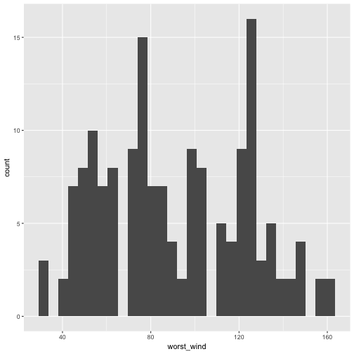
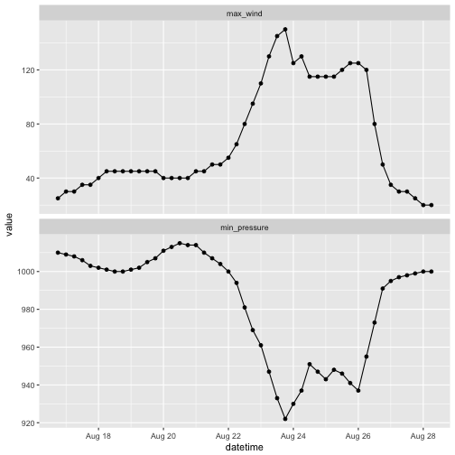
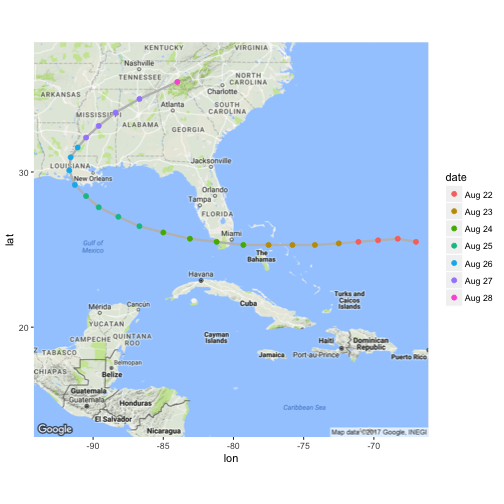

# The R Programming Environment


This chapter provides a rigorous introduction to the R programming language, with a  particular focus on using R for software development in a data science setting. Whether you are part of a data science team or working individually within a community of developers, this chapter will give you the knowledge of R needed to make useful contributions in those settings. 

As the first chapter in this book, the chapter provides the essential foundation of R needed for the following chapters. We cover basic R concepts and language fundamentals, key concepts like tidy data and related "tidyverse" tools, processing and manipulation of complex and large datasets, handling textual data, and basic data science tasks. Upon finishing this chapter, you will have fluency at the R console and will be able to create tidy datasets from a wide range of possible data sources.


The learning objectives for this chapter are to: 

- Develop fluency in using R at the console     
- Execute basic arithmetic operations
- Subset and index R objects
- Remove missing values from an R object
- Modify object attributes and metadata
- Describe differences in different R classes and data types
- Read tabular data into R and read in web data via web scraping tools and APIs
- Define tidy data and to transform non-tidy data into tidy data
- Manipulate and transform a variety of data types, including dates, times, and text data
- Describe how memory is used in R sessions to store R objects
- Read and manipulate large datasets
- Describe how to diagnose programming problems and to look up answers from the web or forums


## Crash Course on R Syntax

*Note: Some of the material in this section is taken from [R Programming for Data Science](https://leanpub.com/rprogramming)*.

The learning objectives for this section are to: 

- Develop fluency in using R at the console     
- Execute basic arithmetic operations
- Subset and index R objects
- Remove missing values from an R object
- Modify object attributes and metadata
- Describe differences in different R classes and data types


At the R prompt we type expressions. The `<-` symbol (*gets arrow*) is the assignment
operator.


```r
x <- 1
print(x)
[1] 1
x
[1] 1
msg <- "hello"
```

The grammar of the language determines whether an expression is
complete or not.

```r
x <-  ## Incomplete expression
```

The # character indicates a comment. Anything to the right of the #
(including the # itself) is ignored. This is the only comment
character in R. Unlike some other languages, R does not support
multi-line comments or comment blocks.


### Evaluation

When a complete expression is entered at the prompt, it is evaluated
and the result of the evaluated expression is returned. The result may
be *auto-printed*.


```r
x <- 5  ## nothing printed
x       ## auto-printing occurs
[1] 5
print(x)  ## explicit printing
[1] 5
```

The `[1]` shown in the output indicates that `x` is a vector and `5`
is its first element. 

Typically with interactive work, we do not explicitly print objects
with the `print` function; it is much easier to just auto-print them
by typing the name of the object and hitting return/enter. However,
when writing scripts, functions, or longer programs, there is
sometimes a need to explicitly print objects because auto-printing
does not work in those settings.

When an R vector is printed you will notice that an index for the
vector is printed in square brackets `[]` on the side. For example,
see this integer sequence of length 20.


```r
x <- 11:30
x
 [1] 11 12 13 14 15 16 17 18 19 20 21 22
[13] 23 24 25 26 27 28 29 30
```


The numbers in the square brackets are not part of the vector itself,
they are merely part of the *printed output*. 

With R, it's important that one understand that there is a difference
between the actual R object and the manner in which that R object is
printed to the console. Often, the printed output may have additional
bells and whistles to make the output more friendly to the
users. However, these bells and whistles are not inherently part of
the object.

Note that the `:` operator is used to create integer sequences.


### R Objects

R has five basic or "atomic" classes of objects:

-   character

-   numeric (real numbers)

-   integer

-   complex

-   logical (True/False)

The most basic type of R object is a vector. Empty vectors can be
created with the `vector()` function.  There is really only one rule
about vectors in R, which is: **A vector can only contain objects
of the same class**.

But of course, like any good rule, there is an exception, which is a
*list*, which we will get to a bit later. A list is represented as a
vector but can contain objects of different classes. Indeed, that's
usually why we use them.

There is also a class for "raw" objects, but they are not commonly
used directly in data analysis and we won't cover them here.


### Numbers

Numbers in R are generally treated as numeric objects (i.e. double
precision real numbers). This means that even if you see a number like
"1" or "2" in R, which you might think of as integers, they are likely
represented behind the scenes as numeric objects (so something like
"1.00" or "2.00"). This isn't important most of the time...except when
it is.

If you explicitly want an integer, you need to specify the `L`
suffix. So entering `1` in R gives you a numeric object; entering `1L`
explicitly gives you an integer object.

There is also a special number `Inf` which represents infinity. This
allows us to represent entities like `1 / 0`. This way, `Inf` can be
used in ordinary calculations; e.g. `1 / Inf` is 0.

The value `NaN` represents an undefined value ("not a number"); e.g. 0
/ 0; `NaN` can also be thought of as a missing value (more on that
later)


### Creating Vectors

[Watch a video of this section](https://youtu.be/w8_XdYI3reU)

The `c()` function can be used to create vectors of objects by
concatenating things together.


```r
x <- c(0.5, 0.6)       ## numeric
x <- c(TRUE, FALSE)    ## logical
x <- c(T, F)           ## logical
x <- c("a", "b", "c")  ## character
x <- 9:29              ## integer
x <- c(1+0i, 2+4i)     ## complex
```

Note that in the above example, `T` and `F` are short-hand ways to
specify `TRUE` and `FALSE`. However, in general one should try to use
the explicit `TRUE` and `FALSE` values when indicating logical
values. The `T` and `F` values are primarily there for when you're
feeling lazy.

You can also use the `vector()` function to initialize vectors.


```r
x <- vector("numeric", length = 10) 
x
 [1] 0 0 0 0 0 0 0 0 0 0
```

### Mixing Objects

There are occasions when different classes of R objects get mixed
together. Sometimes this happens by accident but it can also happen on
purpose. So what happens with the following code?


```r
y <- c(1.7, "a")   ## character
y <- c(TRUE, 2)    ## numeric
y <- c("a", TRUE)  ## character
```

In each case above, we are mixing objects of two different classes in
a vector. But remember that the only rule about vectors says this is
not allowed. When different objects are mixed in a vector, _coercion_
occurs so that every element in the vector is of the same class.

In the example above, we see the effect of *implicit coercion*. What R
tries to do is find a way to represent all of the objects in the
vector in a reasonable fashion. Sometimes this does exactly what you
want and...sometimes not. For example, combining a numeric object with
a character object will create a character vector, because numbers can
usually be easily represented as strings.


### Explicit Coercion

Objects can be explicitly coerced from one class to another using the
`as.*` functions, if available.


```r
x <- 0:6
class(x)
[1] "integer"
as.numeric(x)
[1] 0 1 2 3 4 5 6
as.logical(x)
[1] FALSE  TRUE  TRUE  TRUE  TRUE  TRUE  TRUE
as.character(x)
[1] "0" "1" "2" "3" "4" "5" "6"
```

Sometimes, R can't figure out how to coerce an object and this can
result in `NA`s being produced.


```r
x <- c("a", "b", "c")
as.numeric(x)
Warning: NAs introduced by coercion
[1] NA NA NA
as.logical(x)
[1] NA NA NA
as.complex(x)
Warning: NAs introduced by coercion
[1] NA NA NA
```

When nonsensical coercion takes place, you will usually get a warning
from R.


### Matrices

Matrices are vectors with a _dimension_ attribute. The dimension
attribute is itself an integer vector of length 2 (number of rows,
number of columns)


```r
m <- matrix(nrow = 2, ncol = 3) 
m
     [,1] [,2] [,3]
[1,]   NA   NA   NA
[2,]   NA   NA   NA
dim(m)
[1] 2 3
attributes(m)
$dim
[1] 2 3
```

Matrices are constructed _column-wise_, so entries can be thought of
starting in the "upper left" corner and running down the columns.


```r
m <- matrix(1:6, nrow = 2, ncol = 3) 
m
     [,1] [,2] [,3]
[1,]    1    3    5
[2,]    2    4    6
```

Matrices can also be created directly from vectors by adding a
dimension attribute.


```r
m <- 1:10 
m
 [1]  1  2  3  4  5  6  7  8  9 10
dim(m) <- c(2, 5)
m
     [,1] [,2] [,3] [,4] [,5]
[1,]    1    3    5    7    9
[2,]    2    4    6    8   10
```

Matrices can be created by _column-binding_ or _row-binding_ with the
`cbind()` and `rbind()` functions.


```r
x <- 1:3
y <- 10:12
cbind(x, y)
     x  y
[1,] 1 10
[2,] 2 11
[3,] 3 12
rbind(x, y) 
  [,1] [,2] [,3]
x    1    2    3
y   10   11   12
```

### Lists

Lists are a special type of vector that can contain elements of
different classes. Lists are a very important data type in R and you
should get to know them well. Lists, in combination with the various
"apply" functions discussed later, make for a powerful combination.

Lists can be explicitly created using the `list()` function, which
takes an arbitrary number of arguments.


```r
x <- list(1, "a", TRUE, 1 + 4i) 
x
[[1]]
[1] 1

[[2]]
[1] "a"

[[3]]
[1] TRUE

[[4]]
[1] 1+4i
```

We can also create an empty list of a prespecified length with the
`vector()` function


```r
x <- vector("list", length = 5)
x
[[1]]
NULL

[[2]]
NULL

[[3]]
NULL

[[4]]
NULL

[[5]]
NULL
```

### Factors

Factors are used to represent categorical data and can be unordered or
ordered. One can think of a factor as an integer vector where each
integer has a _label_. Factors are important in statistical modeling
and are treated specially by modelling functions like `lm()` and
`glm()`.

Using factors with labels is _better_ than using integers because
factors are self-describing. Having a variable that has values "Male"
and "Female" is better than a variable that has values 1 and 2.

Factor objects can be created with the `factor()` function.


```r
x <- factor(c("yes", "yes", "no", "yes", "no")) 
x
[1] yes yes no  yes no 
Levels: no yes
table(x) 
x
 no yes 
  2   3 
## See the underlying representation of factor
unclass(x)  
[1] 2 2 1 2 1
attr(,"levels")
[1] "no"  "yes"
```

Often factors will be automatically created for you when you read a
dataset in using a function like `read.table()`. Those functions often, as a
default, create factors when they encounter data that look like
characters or strings.

The order of the levels of a factor can be set using the `levels`
argument to `factor()`. This can be important in linear modelling
because the first level is used as the baseline level. This feature can also be used to customize order in plots that include factors, since by default factors are plotted in the order of their levels.


```r
x <- factor(c("yes", "yes", "no", "yes", "no"))
x  ## Levels are put in alphabetical order
[1] yes yes no  yes no 
Levels: no yes
x <- factor(c("yes", "yes", "no", "yes", "no"),
            levels = c("yes", "no"))
x
[1] yes yes no  yes no 
Levels: yes no
```

### Missing Values

Missing values are denoted by `NA` or `NaN` for undefined
mathematical operations.

- `is.na()` is used to test objects if they are `NA`

- `is.nan()` is used to test for `NaN`

- `NA` values have a class also, so there are integer `NA`, character
  `NA`, etc.

- A `NaN` value is also `NA` but the converse is not true


```r
## Create a vector with NAs in it
x <- c(1, 2, NA, 10, 3)  
## Return a logical vector indicating which elements are NA
is.na(x)    
[1] FALSE FALSE  TRUE FALSE FALSE
## Return a logical vector indicating which elements are NaN
is.nan(x)   
[1] FALSE FALSE FALSE FALSE FALSE
```


```r
## Now create a vector with both NA and NaN values
x <- c(1, 2, NaN, NA, 4)
is.na(x)
[1] FALSE FALSE  TRUE  TRUE FALSE
is.nan(x)
[1] FALSE FALSE  TRUE FALSE FALSE
```

### Data Frames

Data frames are used to store tabular data in R. They are an important
type of object in R and are used in a variety of statistical modeling
applications. Hadley Wickham's package
[dplyr](https://github.com/hadley/dplyr) has an optimized set of
functions designed to work efficiently with data frames, and `ggplot2` 
plotting functions work best with data stored in data frames.

Data frames are represented as a special type of list where every
element of the list has to have the same length. Each element of the
list can be thought of as a column and the length of each element of
the list is the number of rows.

Unlike matrices, data frames can store different classes of objects in
each column. Matrices must have every element be the same class
(e.g. all integers or all numeric).

In addition to column names, indicating the names of the variables or
predictors, data frames have a special attribute called `row.names`
which indicate information about each row of the data frame.

Data frames are usually created by reading in a dataset using the
`read.table()` or `read.csv()`. However, data frames can also be
created explicitly with the `data.frame()` function or they can be
coerced from other types of objects like lists.

Data frames can be converted to a matrix by calling
`data.matrix()`. While it might seem that the `as.matrix()` function
should be used to coerce a data frame to a matrix, almost always, what
you want is the result of `data.matrix()`.


```r
x <- data.frame(foo = 1:4, bar = c(T, T, F, F)) 
x
  foo   bar
1   1  TRUE
2   2  TRUE
3   3 FALSE
4   4 FALSE
nrow(x)
[1] 4
ncol(x)
[1] 2
```

### Names

R objects can have names, which is very useful for writing readable
code and self-describing objects. Here is an example of assigning
names to an integer vector.


```r
x <- 1:3
names(x)
NULL
names(x) <- c("New York", "Seattle", "Los Angeles") 
x
   New York     Seattle Los Angeles 
          1           2           3 
names(x)
[1] "New York"    "Seattle"     "Los Angeles"
```

Lists can also have names, which is often very useful.


```r
x <- list("Los Angeles" = 1, Boston = 2, London = 3) 
x
$`Los Angeles`
[1] 1

$Boston
[1] 2

$London
[1] 3
names(x)
[1] "Los Angeles" "Boston"      "London"     
```

Matrices can have both column and row names.


```r
m <- matrix(1:4, nrow = 2, ncol = 2)
dimnames(m) <- list(c("a", "b"), c("c", "d")) 
m
  c d
a 1 3
b 2 4
```

Column names and row names can be set separately using the
`colnames()` and `rownames()` functions.


```r
colnames(m) <- c("h", "f")
rownames(m) <- c("x", "z")
m
  h f
x 1 3
z 2 4
```

Note that for data frames, there is a separate function for setting
the row names, the `row.names()` function. Also, data frames do not
have column names, they just have names (like lists). So to set the
column names of a data frame just use the `names()` function. Yes, I
know its confusing. Here's a quick summary:

| Object | Set column names | Set row names |
| ------ | ---------------- | ------------- |
| data frame | `names()` | `row.names()` |
| matrix | `colnames()` | `rownames()` |


### Attributes

In general, R objects can have attributes, which are like metadata for the
object. These metadata can be very useful in that they help to
describe the object. For example, column names on a data frame help to
tell us what data are contained in each of the columns. Some examples
of R object attributes are

-   names, dimnames

-   dimensions (e.g. matrices, arrays)

-   class (e.g. integer, numeric)

-   length

-   other user-defined attributes/metadata

Attributes of an object (if any) can be accessed using the
`attributes()` function. Not all R objects contain attributes, in
which case the `attributes()` function returns `NULL`.


### Summary

There are a variety of different builtin-data types in R. In this
section we have reviewed the following

- atomic classes: numeric, logical, character, integer, complex

- vectors, lists

- factors

- missing values

- data frames and matrices

All R objects can have attributes that help to describe what is in the
object. Perhaps the most useful attributes are names, such as column and
row names in a data frame, or simply names in a vector or
list. Attributes like dimensions are also important as they can modify
the behavior of objects, like turning a vector into a matrix.

## The Importance of Tidy Data

The learning objectives for this section are to: 

- Define tidy data and to transform non-tidy data into tidy data


One unifying concept of this book is the notion of **tidy data**. As defined by Hadley Wickham in his 2014 paper published in the *Journal of Statistical Software*, a [tidy dataset](https://www.jstatsoft.org/article/view/v059i10) has the following properties:

1. Each variable forms a column.

2. Each observation forms a row.

3. Each type of observational unit forms a table.

The purpose of defining tidy data is to highlight the fact that *most data do not start out life as tidy*. In fact, much of the work of data analysis may involve simply making the data tidy (at least this has been our experience). Once a dataset is tidy, it can be used as input into a variety of other functions that may transform, model, or visualize the data.

As a quick example, consider the following data illustrating death rates in Virginia in 1940 in a classic table format:


```
      Rural Male Rural Female Urban Male Urban Female
50-54       11.7          8.7       15.4          8.4
55-59       18.1         11.7       24.3         13.6
60-64       26.9         20.3       37.0         19.3
65-69       41.0         30.9       54.6         35.1
70-74       66.0         54.3       71.1         50.0
```

While this format is canonical and is useful for quickly observing the relationship between multiple variables, it is not tidy. This format violates the tidy form because there are variables in both the rows and columns. In this case the variables are age category, gender, and urban-ness. Finally, the death rate itself, which is the fourth variable, is presented inside the table. 

Converting this data to tidy format would give us


```r
library(tidyr)
library(dplyr)

VADeaths %>%
  tbl_df() %>%
  mutate(age = row.names(VADeaths)) %>%
  gather(key, death_rate, -age) %>%
  separate(key, c("urban", "gender"), sep = " ") %>%
  mutate(age = factor(age), urban = factor(urban), gender = factor(gender))
# A tibble: 20 x 4
      age  urban gender death_rate
   <fctr> <fctr> <fctr>      <dbl>
 1  50-54  Rural   Male       11.7
 2  55-59  Rural   Male       18.1
 3  60-64  Rural   Male       26.9
 4  65-69  Rural   Male       41.0
 5  70-74  Rural   Male       66.0
 6  50-54  Rural Female        8.7
 7  55-59  Rural Female       11.7
 8  60-64  Rural Female       20.3
 9  65-69  Rural Female       30.9
10  70-74  Rural Female       54.3
11  50-54  Urban   Male       15.4
12  55-59  Urban   Male       24.3
13  60-64  Urban   Male       37.0
14  65-69  Urban   Male       54.6
15  70-74  Urban   Male       71.1
16  50-54  Urban Female        8.4
17  55-59  Urban Female       13.6
18  60-64  Urban Female       19.3
19  65-69  Urban Female       35.1
20  70-74  Urban Female       50.0
```

### The "Tidyverse"

There are a number of R packages that take advantage of the tidy data form and can be used to do interesting things with data. Many (but not all) of these packages are written by Hadley Wickham and the collection of packages is sometimes referred to as the "tidyverse" because of their dependence on and presumption of tidy data. "Tidyverse" packages include

* [ggplot2](https://cran.r-project.org/package=ggplot2): a plotting system based on the grammar of graphics

* [magrittr](https://cran.r-project.org/package=magrittr"): defines the `%>%` operator for chaining functions together in a series of operations on data

* [dplyr](https://cran.r-project.org/package=dplyr): a suite of (fast) functions for working with data frames

* [tidyr](https://cran.r-project.org/package=tidyr): easily  tidy data with `spread()` and `gather()` functions

We will be using these packages extensively in this book.

The "tidyverse" package can be used to install all of the packages in the tidyverse at once. For example, instead of starting an R script with this: 


```r
library(dplyr)
library(tidyr)
library(readr)
library(ggplot2)
```

You can start with this: 


```r
library(tidyverse)
```

## Reading Tabular Data with the `readr` Package

The learning objectives for this section are to: 

- Read tabular data into R and read in web data via web scraping tools and APIs


The `readr` package is the primary means by which we will read tablular data, most notably, comma-separated-value (CSV) files. The `readr` package has a few functions in it for reading and writing tabular data---we will focus on the `read_csv` function. The `readr` package is [available on CRAN](https://cran.r-project.org/package=readr) and the code for the package is maintained [on GitHub](https://github.com/hadley/readr).

The importance of the `read_csv` function is perhaps better understood from an historical perspective. R's built in `read.csv` function similarly reads CSV files, but the `read_csv` function in `readr` builds on that by removing some of the quirks and "gotchas" of `read.csv` as well as dramatically optimizing the speed with which it can read data into R. The `read_csv` function also adds some nice user-oriented features like a progress meter and a compact method for specifying column types.

The only required argument to `read_csv` is a character string specifying the path to the file to read. A typical call to `read_csv` will look as follows.


```r
library(readr)
teams <- read_csv("data/team_standings.csv")
Parsed with column specification:
cols(
  Standing = col_integer(),
  Team = col_character()
)
teams
# A tibble: 32 x 2
   Standing        Team
      <int>       <chr>
 1        1       Spain
 2        2 Netherlands
 3        3     Germany
 4        4     Uruguay
 5        5   Argentina
 6        6      Brazil
 7        7       Ghana
 8        8    Paraguay
 9        9       Japan
10       10       Chile
# ... with 22 more rows
```

By default, `read_csv` will open a CSV file and read it in line-by-line. It will also (by default), read in the first few rows of the table in order to figure out the type of each column (i.e. integer, character, etc.). In the code example above, you can see that `read_csv` has correctly assigned an integer class to the "Standing" variable in the input data and a character class to the "Team" variable. From the `read_csv` help page:

> If [the argument for `col_types` is] 'NULL', all column types will be imputed from the first 1000 rows on the input. This is convenient (and fast), but not robust. If the imputation fails, you'll need to supply the correct types yourself.

You can also specify the type of each column with the `col_types` argument. In general, it's a good idea to specify the column types explicitly. This rules out any possible guessing errors on the part of `read_csv`. Also, specifying the column types explicitly provides a useful safety check in case anything about the dataset should change without you knowing about it.


```r
teams <- read_csv("data/team_standings.csv", col_types = "cc")
```

Note that the `col_types` argument accepts a compact representation. Here `"cc"` indicates that the first column is `character` and the second column is `character` (there are only two columns). Using the `col_types` argument is useful because often it is not easy to automatically figure out the type of a column by looking at a few rows (especially if a column has many missing values).

The `read_csv` function will also read compressed files automatically. There is no need to decompress the file first or use the `gzfile` connection function. The following call reads a gzip-compressed CSV file containing download logs from the RStudio CRAN mirror.


```r
logs <- read_csv("data/2016-07-19.csv.gz", n_max = 10)
Parsed with column specification:
cols(
  date = col_date(format = ""),
  time = col_time(format = ""),
  size = col_integer(),
  r_version = col_character(),
  r_arch = col_character(),
  r_os = col_character(),
  package = col_character(),
  version = col_character(),
  country = col_character(),
  ip_id = col_integer()
)
```
Note that the message ("Parse with column specification ...") printed after the call indicates that `read_csv` may have had some difficulty identifying the type of each column. This can be solved by using the `col_types` argument.


```r
logs <- read_csv("data/2016-07-20.csv.gz", col_types = "ccicccccci", n_max = 10)
logs
# A tibble: 10 x 10
         date     time    size r_version r_arch      r_os     package
        <chr>    <chr>   <int>     <chr>  <chr>     <chr>       <chr>
 1 2016-07-20 06:04:55  144723     3.3.1   i386   mingw32      gtools
 2 2016-07-20 06:04:51 2049711     3.3.0   i386   mingw32   rmarkdown
 3 2016-07-20 06:04:35   26252      <NA>   <NA>      <NA> R.methodsS3
 4 2016-07-20 06:04:34  556091    2.13.1 x86_64   mingw32      tibble
 5 2016-07-20 06:03:46  313363    2.13.1 x86_64   mingw32   iterators
 6 2016-07-20 06:03:47  378892     3.3.1 x86_64   mingw32     foreach
 7 2016-07-20 06:04:46   41228     3.3.1 x86_64 linux-gnu     moments
 8 2016-07-20 06:04:34  403177      <NA>   <NA>      <NA>        R.oo
 9 2016-07-20 06:04:53     525     3.3.0 x86_64 linux-gnu         rgl
10 2016-07-20 06:04:29  755720     3.2.5 x86_64   mingw32   geosphere
# ... with 3 more variables: version <chr>, country <chr>, ip_id <int>
```

You can specify the column type in a more detailed fashion by using the various `col_*` functions. For example, in the log data above, the first column is actually a date, so it might make more sense to read it in as a Date variable. If we wanted to just read in that first column, we could do


```r
logdates <- read_csv("data/2016-07-20.csv.gz", 
                     col_types = cols_only(date = col_date()),
                     n_max = 10)
logdates
# A tibble: 10 x 1
         date
       <date>
 1 2016-07-20
 2 2016-07-20
 3 2016-07-20
 4 2016-07-20
 5 2016-07-20
 6 2016-07-20
 7 2016-07-20
 8 2016-07-20
 9 2016-07-20
10 2016-07-20
```

Now the `date` column is stored as a `Date` object which can be used for relevant date-related computations (for example, see the `lubridate` package).


A> The `read_csv` function has a `progress` option that defaults to TRUE. This options provides a nice progress meter while the CSV file is being read. However, if you are using `read_csv` in a function, or perhaps embedding it in a loop, it's probably best to set `progress = FALSE`.

The `readr` package includes a variety of functions in the `read_*` family that allow you to read in data from different formats of flat files. The following table gives a guide to several functions in the `read_*` family. 


|`readr` function |Use                                          |
|:----------------|:--------------------------------------------|
|`read_csv`       |Reads comma-separated file                   |
|`read_csv2`      |Reads semicolon-separated file               |
|`read_tsv`       |Reads tab-separated file                     |
|`read_delim`     |General function for reading delimited files |
|`read_fwf`       |Reads fixed width files                      |
|`read_log`       |Reads log files                              |


## Reading Web-Based Data

The learning objectives for this section are to: 

- Read in web data via web scraping tools and APIs


Not only can you read in data locally stored on your computer, with R it is also fairly easy to read in data stored on the web. 

### Flat files online

The simplest way to do this is if the data is available online as a flat file (see note below). For example, the "Extended Best Tracks" for the North Atlantic are hurricane tracks that include both the best estimate of the central location of each storm and also gives estimates of how far winds of certain speeds extended from the storm's center in four quadrants of the storm (northeast, northwest, southeast, southwest) at each measurement point. You can see this file online [here](http://rammb.cira.colostate.edu/research/tropical_cyclones/tc_extended_best_track_dataset/data/ebtrk_atlc_1988_2015.txt).

A> How can you tell if you've found a flat file online? Here are a couple of clues: 
A> 
A> - It will not have any formatting. Instead, it will look online as if you opened a file in a text editor on your own computer. 
A> - It will often have a web address that ends with a typical flat file extension (`".csv"`, `".txt"`, or `".fwf"`, for example).
A> 
A> Here are a couple of examples of flat files available online: 
A> 
A> - [Population mean county centers for Colorado counties, from the US Census](http://www2.census.gov/geo/docs/reference/cenpop2010/county/CenPop2010_Mean_CO08.txt)
A> - [Weather in Fort Collins, Colorado, in 2015, from Weather Underground](http://www.wunderground.com/history/airport/KFNL/2015
/1/1/CustomHistory.html?dayend=31&monthend=12&yearend=2015&req_city=&
req\_state=&req\_statename=&reqdb.zip=&reqdb.magic=&reqdb.wmo=&format=1)

If you copy and paste the web address for this file, you'll see that the url for this example hurricane data file is non-secure (starts with `http:`) and that it ends with a typical flat file extension (`.txt`, in this case). You can read this file into your R session using the same `readr` function that you would use to read it in if the file were stored on your computer.

First, you can create an R object with the filepath to the file. In the case of online files, that's the url. To fit the long web address comfortably in an R script window, you can use the `paste0` function to paste pieces of the web address together:


```r
ext_tracks_file <- paste0("http://rammb.cira.colostate.edu/research/",
                          "tropical_cyclones/tc_extended_best_track_dataset/",
                          "data/ebtrk_atlc_1988_2015.txt")
```

Next, since this web-based file is a fixed width file, you'll need to define the width of each column, so that R will know where to split between columns. You can then use the  `read_fwf` function from the `readr` package to read the file into your R session. This data, like a lot of weather data, uses the string `"-99"` for missing data, and you can specify that missing value character with the `na` argument in `read_fwf`. Also, the online file does not include column names, so you'll have to use the [data documentation file](http://rammb.cira.colostate.edu/research/tropical_cyclones/tc_extended_best_track_dataset/docs/ebtrk_readme.txt) for the dataset to determine and set those yourself.


```r
library(readr)

# Create a vector of the width of each column
ext_tracks_widths <- c(7, 10, 2, 2, 3, 5, 5, 6, 4, 5, 4, 4, 5, 3, 4, 3, 3, 3,
                       4, 3, 3, 3, 4, 3, 3, 3, 2, 6, 1)

# Create a vector of column names, based on the online documentation for this data
ext_tracks_colnames <- c("storm_id", "storm_name", "month", "day",
                          "hour", "year", "latitude", "longitude",
                          "max_wind", "min_pressure", "rad_max_wind",
                          "eye_diameter", "pressure_1", "pressure_2",
                          paste("radius_34", c("ne", "se", "sw", "nw"), sep = "_"),
                          paste("radius_50", c("ne", "se", "sw", "nw"), sep = "_"),
                          paste("radius_64", c("ne", "se", "sw", "nw"), sep = "_"),
                          "storm_type", "distance_to_land", "final")

# Read the file in from its url
ext_tracks <- read_fwf(ext_tracks_file, 
                       fwf_widths(ext_tracks_widths, ext_tracks_colnames),
                       na = "-99")
ext_tracks[1:3, 1:9]
# A tibble: 3 x 9
  storm_id storm_name month   day  hour  year latitude longitude max_wind
     <chr>      <chr> <chr> <chr> <chr> <int>    <dbl>     <dbl>    <int>
1   AL0188    ALBERTO    08    05    18  1988     32.0      77.5       20
2   AL0188    ALBERTO    08    06    00  1988     32.8      76.2       20
3   AL0188    ALBERTO    08    06    06  1988     34.0      75.2       20
```

A> For some fixed width files, you may be able to save the trouble of counting column widths by using the `fwf_empty` function in the `readr` package. This function guesses the widths of columns based on the positions of empty columns. However, the example hurricane dataset we are using here is a bit too messy for this-- in some cases, there are values from different columns that are not separated by white space. Just as it is typically safer for you to specify column types yourself, rather than relying on R to correctly guess them, it is also safer when reading in a fixed width file to specify column widths yourself.

You can use some `dplyr` functions to check out the dataset once it's in R (there will be much more about `dplyr` in the next section). For example, the following call prints a sample of four rows of data from Hurricane Katrina, with, for each row, the date and time, maximum wind speed, minimum pressure, and the radius of maximum winds of the storm for that observation:


```r
library(dplyr)

ext_tracks %>%
  filter(storm_name == "KATRINA") %>%
  select(month, day, hour, max_wind, min_pressure, rad_max_wind) %>%
  sample_n(4)
# A tibble: 4 x 6
  month   day  hour max_wind min_pressure rad_max_wind
  <chr> <chr> <chr>    <int>        <int>        <int>
1    08    30    12       30          985           30
2    08    31    06       25          996           NA
3    10    29    18       35         1000           40
4    10    31    12       25         1008           90
```

With the functions in the `readr` package, you can also read in flat files from secure urls (ones that starts with `https:`). (This is not true with the `read.table` family of functions from base R.) One example where it is common to find flat files on secure sites is on GitHub. If you find a file with a flat file extension in a GitHub repository, you can usually click on it and then choose to view the "Raw" version of the file, and get to the flat file version of the file. 

For example, the CDC Epidemic Prediction Initiative has a GitHub repository with data on Zika cases, including files on cases in Brazil. When we wrote this, the most current file was available [here](https://github.com/cdcepi/zika/blob/master/Brazil/COES_Microcephaly/data/COES_Microcephaly-2016-06-25.csv), with the raw version (i.e., a flat file) available [by clicking the "Raw" button on the top right of the first site](https://github.com/cdcepi/zika/raw/master/Brazil/COES_Microcephaly/data/COES_Microcephaly-2016-06-25.csv). 


```r
zika_file <- paste0("https://raw.githubusercontent.com/cdcepi/zika/master/",
                    "Brazil/COES_Microcephaly/data/COES_Microcephaly-2016-06-25.csv")
zika_brazil <- read_csv(zika_file)

zika_brazil %>%
  select(location, value, unit)
# A tibble: 210 x 3
                  location value  unit
                     <chr> <int> <chr>
 1             Brazil-Acre     2 cases
 2          Brazil-Alagoas    75 cases
 3            Brazil-Amapa     7 cases
 4         Brazil-Amazonas     8 cases
 5            Brazil-Bahia   263 cases
 6            Brazil-Ceara   124 cases
 7 Brazil-Distrito_Federal     5 cases
 8   Brazil-Espirito_Santo    13 cases
 9            Brazil-Goias    14 cases
10         Brazil-Maranhao   131 cases
# ... with 200 more rows
```

### Requesting data through a web API

Web APIs are growing in popularity as a way to access open data from government agencies, companies, and other organizations. "API" stands for "Application Program Interface""; an API provides the rules for software applications to interact. In the case of open data APIs, they provide the rules you need to know to write R code to request and pull data from the organization's web server into your R session. Usually, some of the computational burden of querying and subsetting the data is taken on by the source's server, to create the subset of requested data to pass to your computer. In practice, this means you can often pull the subset of data you want from a very large available dataset without having to download the full dataset and load it locally into your R session. 

As an overview, the basic steps for accessing and using data from a web API when working in R are: 

- Figure out the API rules for HTTP requests
- Write R code to create a request in the proper format 
- Send the request using GET or POST HTTP methods
- Once you get back data from the request, parse it into an easier-to-use format if necessary 

To get the data from an API, you should first read the organization's API documentation. An organization will post details on what data is available through their API(s), as well as how to set up HTTP requests to get that data-- to request the data through the API, you will typically need to send the organization's web server an HTTP request using a GET or POST method. The API documentation details will typically show an example GET or POST request for the API, including the base URL to use and the possible query parameters that can be used to customize the dataset request. 

For example, the National Aeronautics and Space Administration (NASA) has an API for pulling [the Astronomy Picture of the Day](http://apod.nasa.gov/apod/astropix.html). In [their API documentation](https://api.nasa.gov/api.html#apod), they specify that the base URL for the API request should be "https://api.nasa.gov/planetary/apod" and that you can include parameters to specify the date of the daily picture you want, whether to pull a high-resolution version of the picture, and a NOAA API key you have requested from NOAA. 

Many organizations will require you to get an API key and use this key in each of your API requests. This key allows the organization to control API access, including enforcing rate limits per user. API rate limits restrict how often you can request data (e.g., an hourly limit of 1,000 requests per user for NASA APIs). 

API keys should be kept private, so if you are writing code that includes an API key, be very careful not to include the actual key in any code made public (including any code in public GitHub repositories). One way to do this is to save the value of your key in a file named `.Renviron` in your home directory. This file should be a plain text file and must end in a blank line. Once you've saved your API key to a global variable in that file (e.g., with a line added to the `.Renviron` file like `NOAA_API_KEY="abdafjsiopnab038"`), you can assign the key value to an R object in an R session using the `Sys.getenv` function (e.g., `noaa_api_key <- Sys.getenv("NOAA_API_KEY")`), and then use this object (`noaa_api_key`) anywhere you would otherwise have used the character string with your API key.

I> To find more R packages for accessing and exploring open data, check out the [Open Data CRAN task view](https://github.com/ropensci/opendata). You can also browse through the [ROpenSci packages](https://ropensci.org/packages/), all of which have GitHub repositories where you can further explore how each package works. ROpenSci is an organization with the mission to create open software tools for science. If you create your own package to access data relevant to scientific research through an API, consider submitting it for peer-review through ROpenSci.

The `riem` package, developed by Maelle Salmon and an ROpenSci package, is an excellent and straightforward example of how you can use R to pull open data through a web API. This package allows you to pull weather data from airports around the world directly from the [Iowa Environmental Mesonet](https://mesonet.agron.iastate.edu). To show you how to pull data into R through an API, in this section we will walk you through code in the `riem` package or code based closely on code in the package. 

To get a certain set of weather data from the Iowa Environmental Mesonet, you can send an HTTP request specifying a base URL, "https://mesonet.agron.iastate.edu/cgi-bin/request/asos.py/", as well as some parameters describing the subset of dataset you want (e.g., date ranges, weather variables, output format). Once you know the rules for the names and possible values of these parameters (more on that below), you can submit an HTTP GET request using the `GET` function from the `httr` package. 

When you are making an HTTP request using the `GET` or `POST` functions from the `httr` package, you can include the key-value pairs for any query parameters as a list object in the `query` argurment of the function. For example, suppose you want to get wind speed in miles per hour (`data = "sped"`) for Denver, CO, (`station = "DEN"`) for the month of June 2016 (`year1 = "2016"`, `month1 = "6"`, etc.) in Denver's local time zone (`tz = "America/Denver"`) and in a comma-separated file (`format = "comma"`). To get this weather dataset, you can run:


```r
library(httr)
meso_url <- "https://mesonet.agron.iastate.edu/cgi-bin/request/asos.py/"
denver <- GET(url = meso_url,
                    query = list(station = "DEN",
                                 data = "sped",
                                 year1 = "2016",
                                 month1 = "6",
                                 day1 = "1",
                                 year2 = "2016",
                                 month2 = "6",
                                 day2 = "30",
                                 tz = "America/Denver",
                                 format = "comma")) %>%
  content() %>% 
  read_csv(skip = 5, na = "M") 

denver %>% slice(1:3)
# A tibble: 3 x 3
  station               valid  sped
    <chr>              <dttm> <dbl>
1     DEN 2016-06-01 00:00:00   9.2
2     DEN 2016-06-01 00:05:00   9.2
3     DEN 2016-06-01 00:10:00   6.9
```

A> The `content` call in this code extracts the content from the response to the HTTP request sent by the `GET` function. The Iowa Environmental Mesonet API offers the option to return the requested data in a comma-separated file (`format = "comma"` in the GET request), so here `content` and `read_csv` are used to extract and read in that csv file. Usually, data will be returned in a JSON format instead. We include more details later in this section on parsing data returned in a JSON format. 

The only tricky part of this process is figuring out the available parameter names (e.g., `station`) and possible values for each (e.g., `"DEN"` for Denver). Currently, the details you can send in an HTTP request through Iowa Environmental Mesonet's API include:

- A four-character weather station identifier (`station`)
- The weather variables (e.g., temperature, wind speed) to include (`data`)
- Starting and ending dates describing the range for which you'd like to pull data (`year1`, `month1`, `day1`, `year2`, `month2`, `day2`)
- The time zone to use for date-times for the weather observations (`tz`)
- Different formatting options (e.g., delimiter to use in the resulting data file [`format`], whether to include longitude and latitude)

Typically, these parameter names and possible values are explained in the API documentation. In some cases, however, the documentation will be limited. In that case, you may be able to figure out possible values, especially if the API specifies a GET rather than POST method, by playing around with the website's point-and-click interface and then looking at the url for the resulting data pages. For example, if you look at the [Iowa Environmental Mesonet's page for accessing this data](https://mesonet.agron.iastate.edu/request/download.phtml?network=IN__ASOS), you'll notice that the point-and-click web interface allows you the options in the list above, and if you click through to access a dataset using this interface, the web address of the data page includes these parameter names and values. 

The `riem` package implements all these ideas in three very clean and straightforward functions. You can explore the code behind this package and see how these ideas can be incorporated into a small R package, in the `/R` directory of the [package's GitHub page](https://github.com/ropenscilabs/riem). 

R packages already exist for many open data APIs. If an R package already exists for an API, you can use functions from that package directly, rather than writing your own code using the API protocols and `httr` functions. Other examples of existing R packages to interact with open data APIs include: 

- `twitteR`: Twitter 
- `rnoaa`: National Oceanic and Atmospheric Administration
- `Quandl`: Quandl (financial data)
- `RGoogleAnalytics`: Google Analytics
- `censusr`, `acs`: United States Census
- `WDI`, `wbstats`: World Bank
- `GuardianR`, `rdian`: The Guardian Media Group
- `blsAPI`: Bureau of Labor Statistics
- `rtimes`: New York Times
- `dataRetrieval`, `waterData`: United States Geological Survey

If an R package doesn't exist for an open API and you'd like to write your own package, find out more about writing API packages with [this vignette for the httr package](https://cran.r-project.org/web/packages/httr/vignettes/api-packages.html). This document includes advice on error handling within R code that accesses data through an open API.

### Scraping web data

You can also use R to pull and clean web-based data that is not accessible through a web API or as an online flat file. In this case, the strategy will often be to pull in the full web page file (often in HTML or XML) and then parse or clean it within R. 

The `rvest` package is a good entry point for handling more complex collection and cleaning of web-based data. This package includes functions, for example, that allow you to select certain elements from the code for a web page (e.g., using the `html_node` and `xml_node` functions), to parse tables in an HTML document into R data frames (`html_table`), and to parse, fill out, and submit HTML forms (`html_form`, `set_values`, `submit_form`). Further details on web scraping with R are beyond the scope of this course, but if you're interested, you can find out more through the [rvest GitHub README](https://github.com/hadley/rvest).

### Parsing JSON, XML, or HTML data

Often, data collected from the web, including the data returned from an open API or obtained by scraping a web page, will be in JSON, XML, or HTML format. To use data in a JSON, XML, or HTML format in R, you need to parse the file from its current format and convert it into an R object more useful for analysis.

Typically, JSON-, XML-, or HTML-formatted data is parsed into a list in R, since list objects allow for a lot of flexibility in the structure of the data. However, if the data is structured appropriately, you can often parse data into another type of object (a data frame, for example, if the data fits well into a two-dimensional format of rows and columns). If the data structure of the data that you are pulling in is complex but consistent across different observations, you may alternatively want to create a custom object type to parse the data into.

There are a number of packages for parsing data from these formats, including `jsonlite` and `xml2`. To find out more about parsing data from typical web formats, and for more on working with web-based documents and data, see the [CRAN task view for Web Technologies and Services ](https://cran.r-project.org/web/views/WebTechnologies.html)


## Basic Data Manipulation

The learning objectives for this section are to: 

- Transform non-tidy data into tidy data
- Manipulate and transform a variety of data types, including dates, times, and text data

The two packages `dplyr` and `tidyr`, both "tidyverse" packages, allow you to quickly and fairly easily clean up your data. These packages are not very old, and so much of the example R code you might find in books or online might not use the functions we use in examples in this section (although this is quickly changing for new books and for online examples). Further, there are many people who are used to using R base functionality to clean up their data, and some of them still do not use these packages much when cleaning data. We think, however, that `dplyr` is easier for people new to R to learn than learning how to clean up data using base R functions, and we also think it produces code that is much easier to read, which is useful in maintaining and sharing code. 

For many of the examples in this section, we will use the `ext_tracks` hurricane dataset we input from a url as an example in a previous section of this book. If you need to load a version of that data, we have also saved it locally, so you can create an R object with the example data for this section by running: 


```r
ext_tracks_file <- "data/ebtrk_atlc_1988_2015.txt"
ext_tracks_widths <- c(7, 10, 2, 2, 3, 5, 5, 6, 4, 5, 4, 4, 5, 3, 4, 3, 3, 3,
                       4, 3, 3, 3, 4, 3, 3, 3, 2, 6, 1)
ext_tracks_colnames <- c("storm_id", "storm_name", "month", "day",
                          "hour", "year", "latitude", "longitude",
                          "max_wind", "min_pressure", "rad_max_wind",
                          "eye_diameter", "pressure_1", "pressure_2",
                          paste("radius_34", c("ne", "se", "sw", "nw"), sep = "_"),
                          paste("radius_50", c("ne", "se", "sw", "nw"), sep = "_"),
                          paste("radius_64", c("ne", "se", "sw", "nw"), sep = "_"),
                          "storm_type", "distance_to_land", "final")
ext_tracks <- read_fwf(ext_tracks_file, 
                       fwf_widths(ext_tracks_widths, ext_tracks_colnames),
                       na = "-99")
```

### Piping

The `dplyr` and `tidyr` functions are often used in conjunction with piping, which is done with the `%>%` function from the `magrittr` package. Piping can be done with many R functions, but is especially common with `dplyr` and `tidyr` functions. The concept is straightforward-- the pipe passes the data frame output that results from the function right before the pipe to input it as the first argument of the function right after the pipe. 

Here is a generic view of how this works in code, for a pseudo-function named `function` that inputs a data frame as its first argument: 


```r
# Without piping
function(dataframe, argument_2, argument_3)

# With piping
dataframe %>%
  function(argument_2, argument_3)
```

For example, without piping, if you wanted to see the time, date, and maximum winds for Katrina from the first three rows of the `ext_tracks` hurricane data, you could run:


```r
katrina <- filter(ext_tracks, storm_name == "KATRINA")
katrina_reduced <- select(katrina, month, day, hour, max_wind)
head(katrina_reduced, 3)
# A tibble: 3 x 4
  month   day  hour max_wind
  <chr> <chr> <chr>    <int>
1    10    28    18       30
2    10    29    00       30
3    10    29    06       30
```

In this code, you are creating new R objects at each step, which makes the code cluttered and also requires copying the data frame several times into memory. As an alternative, you could just wrap one function inside another:


```r
head(select(filter(ext_tracks, storm_name == "KATRINA"),
            month, day, hour, max_wind), 3)
# A tibble: 3 x 4
  month   day  hour max_wind
  <chr> <chr> <chr>    <int>
1    10    28    18       30
2    10    29    00       30
3    10    29    06       30
```

This avoids re-assigning the data frame at each step, but quickly becomes ungainly, and it's easy to put arguments in the wrong layer of parentheses. Piping avoids these problems, since at each step you can send the output from the last function into the next function as that next function's first argument: 


```r
ext_tracks %>%
  filter(storm_name == "KATRINA") %>%
  select(month, day, hour, max_wind) %>%
  head(3)
# A tibble: 3 x 4
  month   day  hour max_wind
  <chr> <chr> <chr>    <int>
1    10    28    18       30
2    10    29    00       30
3    10    29    06       30
```

### Summarizing data

The `dplyr` and `tidyr` packages have numerous functions (sometimes referred to as "verbs") for cleaning up data. We'll start with the functions to summarize data. 

The primary of these is `summarize`, which inputs a data frame and creates a new data frame with the requested summaries. In conjunction with `summarize`, you can use other functions from `dplyr` (e.g., `n`, which counts the number of observations in a given column) to create this summary. You can also use R functions from other packages or base R functions to create the summary.

For example, say we want a summary of the number of observations in the `ext_tracks` hurricane dataset, as well as the highest measured maximum windspeed (given by the column `max_wind` in the dataset) in any of the storms, and the lowest minimum pressure (`min_pressure`). To create this summary, you can run:


```r
ext_tracks %>%
  summarize(n_obs = n(),
            worst_wind = max(max_wind),
            worst_pressure = min(min_pressure))
# A tibble: 1 x 3
  n_obs worst_wind worst_pressure
  <int>      <dbl>          <dbl>
1 11824        160              0
```

This summary provides particularly useful information for this example data, because it gives an unrealistic value for minimum pressure (0 hPa). This shows that this dataset will need some cleaning. The highest wind speed observed for any of the storms, 160 knots, is more reasonable. 

You can also use `summarize` with functions you've written yourself, which gives you a lot of power in summarizing data in interesting ways. As a simple example, if you wanted to present the maximum wind speed in the summary above using miles per hour rather than knots, you could write a function to perform the conversion, and then use that function within the `summarize` call: 


```r
knots_to_mph <- function(knots){
  mph <- 1.152 * knots
}

ext_tracks %>%
  summarize(n_obs = n(),
            worst_wind = knots_to_mph(max(max_wind)),
            worst_pressure = min(min_pressure))
# A tibble: 1 x 3
  n_obs worst_wind worst_pressure
  <int>      <dbl>          <dbl>
1 11824     184.32              0
```

So far, we've only used `summarize` to create a single-line summary of the data frame. In other words, the summary functions are applied across the entire dataset, to return a single value for each summary statistic. However, often you might want summaries stratified by a certain grouping characteristic of the data. For the hurricane data, for example, you might want to get the worst wind and worst pressure by storm, rather than across all storms. 

You can do this by grouping your data frame by one of its column variables, using the function `group_by`, and then using `summarize`. The `group_by` function does not make a visible change to a data frame, although you can see, if you print out a grouped data frame, that the new grouping variable will be listed under "Groups" at the top of a print-out:


```r
ext_tracks %>%
  group_by(storm_name, year) %>%
  head()
# A tibble: 6 x 29
# Groups:   storm_name, year [1]
  storm_id storm_name month   day  hour  year latitude longitude max_wind
     <chr>      <chr> <chr> <chr> <chr> <int>    <dbl>     <dbl>    <int>
1   AL0188    ALBERTO    08    05    18  1988     32.0      77.5       20
2   AL0188    ALBERTO    08    06    00  1988     32.8      76.2       20
3   AL0188    ALBERTO    08    06    06  1988     34.0      75.2       20
4   AL0188    ALBERTO    08    06    12  1988     35.2      74.6       25
5   AL0188    ALBERTO    08    06    18  1988     37.0      73.5       25
6   AL0188    ALBERTO    08    07    00  1988     38.7      72.4       25
# ... with 20 more variables: min_pressure <int>, rad_max_wind <int>,
#   eye_diameter <int>, pressure_1 <int>, pressure_2 <int>,
#   radius_34_ne <int>, radius_34_se <int>, radius_34_sw <int>,
#   radius_34_nw <int>, radius_50_ne <int>, radius_50_se <int>,
#   radius_50_sw <int>, radius_50_nw <int>, radius_64_ne <int>,
#   radius_64_se <int>, radius_64_sw <int>, radius_64_nw <int>,
#   storm_type <chr>, distance_to_land <int>, final <chr>
```

As a note, since hurricane storm names repeat at regular intervals until they are retired, to get a separate summary for each unique storm, this example requires grouping by both `storm_name` and `year`. 

Even though applying the `group_by` function does not cause a noticeable change to the data frame itself, you'll notice the difference in grouped and ungrouped data frames when you use `summarize` on the data frame. If a data frame is grouped, all summaries are calculated and given separately for each unique value of the grouping variable:


```r
ext_tracks %>%
  group_by(storm_name, year) %>%
  summarize(n_obs = n(),
            worst_wind = max(max_wind),
            worst_pressure = min(min_pressure))
# A tibble: 378 x 5
# Groups:   storm_name [?]
   storm_name  year n_obs worst_wind worst_pressure
        <chr> <int> <int>      <dbl>          <dbl>
 1    ALBERTO  1988    13         35           1002
 2    ALBERTO  1994    31         55            993
 3    ALBERTO  2000    87        110            950
 4    ALBERTO  2006    37         60            969
 5    ALBERTO  2012    20         50            995
 6       ALEX  1998    26         45           1002
 7       ALEX  2004    25        105            957
 8       ALEX  2010    30         90            948
 9    ALLISON  1989    28         45            999
10    ALLISON  1995    33         65            982
# ... with 368 more rows
```

This grouping / summarizing combination can be very useful for quickly plotting interesting summaries of a dataset. For example, to plot a histogram of maximum wind speed observed for each storm (Figure \@ref(fig:windhistogram)), you could run:


```r
library(ggplot2)
ext_tracks %>%
  group_by(storm_name) %>%
  summarize(worst_wind = max(max_wind)) %>%
  ggplot(aes(x = worst_wind)) + geom_histogram() 
```



A> We will show a few basic examples of plotting using `ggplot2` functions in this chapter of the book. We will cover plotting much more thoroughly in a later section of the specialization.

From Figure \@ref(fig:windhistogram), we can see that only two storms had maximum wind speeds at or above 160 knots (we'll check this later with some other `dplyr` functions).

T> You cannot make changes to a variable that is being used to group a dataframe. If you try, you will get the error `Error: cannot modify grouping variable`. If you get this error, use the `ungroup` function to remove grouping within a data frame, and then you will be able to mutate any of the variables in the data.

### Selecting and filtering data

When cleaning up data, you will need to be able to create subsets of the data, by selecting certain columns or filtering down to certain rows. These actions can be done using the `dplyr` functions `select` and `filter`. 

The `select` function subsets certain columns of a data frame. The most basic way to use `select` is select certain columns by specifying their full column names. For example, to select the storm name, date, time, latitude, longitude, and maximum wind speed from the `ext_tracks` dataset, you can run:


```r
ext_tracks %>%
  select(storm_name, month, day, hour, year, latitude, longitude, max_wind)
# A tibble: 11,824 x 8
   storm_name month   day  hour  year latitude longitude max_wind
        <chr> <chr> <chr> <chr> <int>    <dbl>     <dbl>    <int>
 1    ALBERTO    08    05    18  1988     32.0      77.5       20
 2    ALBERTO    08    06    00  1988     32.8      76.2       20
 3    ALBERTO    08    06    06  1988     34.0      75.2       20
 4    ALBERTO    08    06    12  1988     35.2      74.6       25
 5    ALBERTO    08    06    18  1988     37.0      73.5       25
 6    ALBERTO    08    07    00  1988     38.7      72.4       25
 7    ALBERTO    08    07    06  1988     40.0      70.8       30
 8    ALBERTO    08    07    12  1988     41.5      69.0       35
 9    ALBERTO    08    07    18  1988     43.0      67.5       35
10    ALBERTO    08    08    00  1988     45.0      65.5       35
# ... with 11,814 more rows
```

There are several functions you can use with `select` that give you more flexibility, and so allow you to select columns without specifying the full names of each column. For example, the `starts_with` function can be used within a `select` function to pick out all the columns that start with a certain text string. As an example of using `starts_with` in conjunction with `select`, in the `ext_tracks` hurricane data, there are a number of columns that say how far from the storm center winds of certain speeds extend. Tropical storms often have asymmetrical wind fields, so these wind radii are given for each quadrant of the storm (northeast, southeast, northwest, and southeast of the storm's center). All of the columns with the radius to which winds of 34 knots or more extend start with "radius_34". To get a dataset with storm names, location, and radii of winds of 34 knots, you could run:


```r
ext_tracks %>%
  select(storm_name, latitude, longitude, starts_with("radius_34"))
# A tibble: 11,824 x 7
   storm_name latitude longitude radius_34_ne radius_34_se radius_34_sw
        <chr>    <dbl>     <dbl>        <int>        <int>        <int>
 1    ALBERTO     32.0      77.5            0            0            0
 2    ALBERTO     32.8      76.2            0            0            0
 3    ALBERTO     34.0      75.2            0            0            0
 4    ALBERTO     35.2      74.6            0            0            0
 5    ALBERTO     37.0      73.5            0            0            0
 6    ALBERTO     38.7      72.4            0            0            0
 7    ALBERTO     40.0      70.8            0            0            0
 8    ALBERTO     41.5      69.0          100          100           50
 9    ALBERTO     43.0      67.5          100          100           50
10    ALBERTO     45.0      65.5           NA           NA           NA
# ... with 11,814 more rows, and 1 more variables: radius_34_nw <int>
```

Other functions that can be used with `select` in  a similar way include: 

- `ends_with`: Select all columns that end with a certain string (for example, `select(ext_tracks, ends_with("ne"))` to get all the wind radii for the northeast quadrant of a storm for the hurricane example data)
- `contains`: Select all columns that include a certain string (`select(ext_tracks, contains("34"))` to get all wind radii for 34-knot winds)
- `matches`: Select all columns that match a certain relative expression (`select(ext_tracks, matches("_[0-9][0-9]_"))` to get all columns where the column name includes two numbers between two underscores, a pattern that matches all of the wind radii columns)

While `select` picks out certain columns of the data frame, `filter` picks out certain rows. With `filter`, you can specify certain conditions using R's logical operators, and the function will return rows that meet those conditions.

R's logical operators include: 

| Operator | Meaning | Example
|---------:|--------:|---------:|
| `==` | Equals | `storm_name == KATRINA` | 
| `!=` | Does not equal | `min_pressure != 0` | 
| `>` | Greater than | `latitude > 25` | 
| `>=` | Greater than or equal to | `max_wind >= 160` | 
| `<` | Less than | `min_pressure < 900` | 
| `<=` | Less than or equal to | `distance_to_land <= 0`| 
| `%in%` | Included in | `storm_name %in% c("KATRINA", "ANDREW")` | 
| `is.na()` | Is a missing value | `is.na(radius_34_ne)` |

If you are ever unsure of how to write a logical statement, but know how to write its opposite, you can use the `!` operator to negate the whole statement. For example, if you wanted to get all storms *except* those named "KATRINA" and "ANDREW", you could use `!(storm_name %in% c("KATRINA", "ANDREW"))`. A common use of this is to identify observations with non-missing data (e.g., `!(is.na(radius_34_ne))`).

A logical statement, run by itself on a vector, will return a vector of the same length with `TRUE` every time the condition is met and `FALSE` every time it is not. 


```r
head(ext_tracks$hour)
[1] "18" "00" "06" "12" "18" "00"
head(ext_tracks$hour == "00")
[1] FALSE  TRUE FALSE FALSE FALSE  TRUE
```

When you use a logical statement within `filter`, it will return just the rows where the logical statement is true: 


```r
ext_tracks %>% 
  select(storm_name, hour, max_wind) %>%
  head(9)
# A tibble: 9 x 3
  storm_name  hour max_wind
       <chr> <chr>    <int>
1    ALBERTO    18       20
2    ALBERTO    00       20
3    ALBERTO    06       20
4    ALBERTO    12       25
5    ALBERTO    18       25
6    ALBERTO    00       25
7    ALBERTO    06       30
8    ALBERTO    12       35
9    ALBERTO    18       35

ext_tracks %>%
  select(storm_name, hour, max_wind) %>%
  filter(hour == "00") %>%
  head(3)
# A tibble: 3 x 3
  storm_name  hour max_wind
       <chr> <chr>    <int>
1    ALBERTO    00       20
2    ALBERTO    00       25
3    ALBERTO    00       35
```

Filtering can also be done after summarizing data. For example, to determine which storms had maximum wind speed equal to or above 160 knots, run: 


```r
ext_tracks %>%
  group_by(storm_name, year) %>%
  summarize(worst_wind = max(max_wind)) %>%
  filter(worst_wind >= 160)
# A tibble: 2 x 3
# Groups:   storm_name [2]
  storm_name  year worst_wind
       <chr> <int>      <dbl>
1    GILBERT  1988        160
2      WILMA  2005        160
```

If you would like to string several logical conditions together and select rows where all or any of the conditions are true, you can use the "and" (`&`) or "or" (`|`) operators. For example, to pull out observations for Hurricane Andrew when it was at or above Category 5 strength (137 knots or higher), you could run: 


```r
ext_tracks %>%
  select(storm_name, month, day, hour, latitude, longitude, max_wind) %>%
  filter(storm_name == "ANDREW" & max_wind >= 137) 
# A tibble: 2 x 7
  storm_name month   day  hour latitude longitude max_wind
       <chr> <chr> <chr> <chr>    <dbl>     <dbl>    <int>
1     ANDREW    08    23    12     25.4      74.2      145
2     ANDREW    08    23    18     25.4      75.8      150
```

W> Some common errors that come up when using logical operators in R are: 
W> 
W> - If you want to check that two things are equal, make sure you use double equal signs (`==`), not a single one. At best, a single equals sign won't work; in some cases, it will cause a variable to be re-assigned (`=` can be used for assignment, just like `<-`).
W> - If you are trying to check if one thing is equal to one of several things, use `%in%` rather than `==`. For example, if you want to filter to rows of `ext_tracks` with storm names of "KATRINA" and "ANDREW", you need to use `storm_name %in% c("KATRINA", "ANDREW")`, not `storm_name == c("KATRINA", "ANDREW")`.
W> - If you want to identify observations with missing values (or without missing values), you must use the `is.na` function, not `==` or `!=`. For example, `is.na(radius_34_ne)` will work, but `radius_34_ne == NA` will not.


### Adding, changing, or renaming columns

The `mutate` function in `dplyr` can be used to add new columns to a data frame or change existing columns in the data frame. As an example, I'll use the `worldcup` dataset from the package `faraway`, which statistics from the 2010 World Cup. To load this example data frame, you can run:


```r
library(faraway)
data(worldcup)
```

This dataset has observations by player, including the player's team, position, amount of time played in this World Cup, and number of shots, passes, tackles, and saves. This dataset is currently not tidy, as it has one of the variables (players' names) as rownames, rather than as a column of the data frame. You can use the `mutate` function to move the player names to its own column: 


```r
worldcup <- worldcup %>%
  mutate(player_name = rownames(worldcup))

worldcup %>% slice(1:3)
# A tibble: 3 x 8
     Team   Position  Time Shots Passes Tackles Saves player_name
   <fctr>     <fctr> <int> <int>  <int>   <int> <int>       <chr>
1 Algeria Midfielder    16     0      6       0     0      Abdoun
2   Japan Midfielder   351     0    101      14     0         Abe
3  France   Defender   180     0     91       6     0      Abidal
```

You can also use `mutate` in coordination with `group_by` to create new columns that give summaries within certain windows of the data. For example, the following code will add a column with the average number of shots for a player's position added as a new column. While this code is summarizing the original data to generate the values in this column, `mutate` will add these repeated summary values to the original dataset by group, rather than returning a dataframe with a single row for each of the grouping variables (try replacing `mutate` with `summarize` in this code to make sure you understand the difference). 


```r
worldcup <- worldcup %>% 
  group_by(Position) %>%
  mutate(ave_shots = mean(Shots)) %>%
  ungroup()

worldcup %>% slice(1:3)
# A tibble: 3 x 9
     Team   Position  Time Shots Passes Tackles Saves player_name
   <fctr>     <fctr> <int> <int>  <int>   <int> <int>       <chr>
1 Algeria Midfielder    16     0      6       0     0      Abdoun
2   Japan Midfielder   351     0    101      14     0         Abe
3  France   Defender   180     0     91       6     0      Abidal
# ... with 1 more variables: ave_shots <dbl>
```

If there is a column that you want to rename, but not change, you can use the `rename` function. For example: 


```r
worldcup %>% 
  rename(Name = player_name) %>%
  slice(1:3)
# A tibble: 3 x 9
     Team   Position  Time Shots Passes Tackles Saves   Name ave_shots
   <fctr>     <fctr> <int> <int>  <int>   <int> <int>  <chr>     <dbl>
1 Algeria Midfielder    16     0      6       0     0 Abdoun  2.394737
2   Japan Midfielder   351     0    101      14     0    Abe  2.394737
3  France   Defender   180     0     91       6     0 Abidal  1.164894
```

### Spreading and gathering data

The `tidyr` package includes functions to transfer a data frame between *long* and *wide*. Wide format data tends to have different attributes or variables describing an observation placed in separate columns. Long format data tends to have different attributes encoded as levels of a single variable, followed by another column that contains tha values of the observation at those different levels. 

In the section on tidy data, we showed an example that used `gather` to convert data into a tidy format. The data is first in an untidy format: 


```r
data("VADeaths")
head(VADeaths)
      Rural Male Rural Female Urban Male Urban Female
50-54       11.7          8.7       15.4          8.4
55-59       18.1         11.7       24.3         13.6
60-64       26.9         20.3       37.0         19.3
65-69       41.0         30.9       54.6         35.1
70-74       66.0         54.3       71.1         50.0
```

After changing the age categories from row names to a variable (which can be done with the `mutate` function), the key problem with the tidyness of the data is that the variables of urban / rural and male / female are not in their own columns, but rather are embedded in the structure of the columns. To fix this, you can use the `gather` function to gather values spread across several columns into a single column, with the column names gathered into a "key" column. When gathering, exclude any columns that you don't want "gathered" (`age` in this case) by including the column names with a the minus sign in the `gather` function. For example:


```r
data("VADeaths")
library(tidyr)

# Move age from row names into a column
VADeaths  <- VADeaths %>%
  tbl_df() %>%
  mutate(age = row.names(VADeaths)) 
VADeaths
# A tibble: 5 x 5
  `Rural Male` `Rural Female` `Urban Male` `Urban Female`   age
         <dbl>          <dbl>        <dbl>          <dbl> <chr>
1         11.7            8.7         15.4            8.4 50-54
2         18.1           11.7         24.3           13.6 55-59
3         26.9           20.3         37.0           19.3 60-64
4         41.0           30.9         54.6           35.1 65-69
5         66.0           54.3         71.1           50.0 70-74

# Gather everything but age to tidy data
VADeaths %>%
  gather(key = key, value = death_rate, -age)
# A tibble: 20 x 3
     age          key death_rate
   <chr>        <chr>      <dbl>
 1 50-54   Rural Male       11.7
 2 55-59   Rural Male       18.1
 3 60-64   Rural Male       26.9
 4 65-69   Rural Male       41.0
 5 70-74   Rural Male       66.0
 6 50-54 Rural Female        8.7
 7 55-59 Rural Female       11.7
 8 60-64 Rural Female       20.3
 9 65-69 Rural Female       30.9
10 70-74 Rural Female       54.3
11 50-54   Urban Male       15.4
12 55-59   Urban Male       24.3
13 60-64   Urban Male       37.0
14 65-69   Urban Male       54.6
15 70-74   Urban Male       71.1
16 50-54 Urban Female        8.4
17 55-59 Urban Female       13.6
18 60-64 Urban Female       19.3
19 65-69 Urban Female       35.1
20 70-74 Urban Female       50.0
```

Even if your data is in a tidy format, `gather` is occasionally useful for pulling data together to take advantage of faceting, or plotting separate plots based on a grouping variable. For example, if you'd like to plot the relationship between the time a player played in the World Cup and his number of saves, tackles, and shots, with a separate graph for each position (Figure \@ref(fig:facetworldcup)), you can use `gather` to pull all the numbers of saves, tackles, and shots into a single column (`Number`) and then use faceting to plot them as separate graphs:


```r
library(tidyr)
library(ggplot2)
worldcup %>%
  select(Position, Time, Shots, Tackles, Saves) %>% 
  gather(Type, Number, -Position, -Time) %>%
  ggplot(aes(x = Time, y = Number)) + 
  geom_point() + 
  facet_grid(Type ~ Position)
```


The `spread` function is less commonly needed to tidy data. It can, however, be useful for creating summary tables. For example, if you wanted to print a table of the average number and range of passes by position for the top four teams in this World Cup (Spain, Netherlands, Uruguay, and Germany), you could run:


```r
library(knitr)

# Summarize the data to create the summary statistics you want
wc_table <- worldcup %>% 
  filter(Team %in% c("Spain", "Netherlands", "Uruguay", "Germany")) %>%
  select(Team, Position, Passes) %>%
  group_by(Team, Position) %>%
  summarize(ave_passes = mean(Passes),
            min_passes = min(Passes),
            max_passes = max(Passes),
            pass_summary = paste0(round(ave_passes), " (", 
                                  min_passes, ", ",
                                  max_passes, ")")) %>%
  select(Team, Position, pass_summary)
# What the data looks like before using `spread`
wc_table
# A tibble: 16 x 3
# Groups:   Team [4]
          Team   Position   pass_summary
        <fctr>     <fctr>          <chr>
 1     Germany   Defender  190 (44, 360)
 2     Germany    Forward    90 (5, 217)
 3     Germany Goalkeeper    99 (99, 99)
 4     Germany Midfielder   177 (6, 423)
 5 Netherlands   Defender  182 (30, 271)
 6 Netherlands    Forward   97 (12, 248)
 7 Netherlands Goalkeeper 149 (149, 149)
 8 Netherlands Midfielder  170 (22, 307)
 9       Spain   Defender   213 (1, 402)
10       Spain    Forward   77 (12, 169)
11       Spain Goalkeeper    67 (67, 67)
12       Spain Midfielder  212 (16, 563)
13     Uruguay   Defender   83 (22, 141)
14     Uruguay    Forward   100 (5, 202)
15     Uruguay Goalkeeper    75 (75, 75)
16     Uruguay Midfielder   100 (1, 252)

# Use spread to create a prettier format for a table
wc_table %>%
  spread(Position, pass_summary) %>%
  kable()
```


|Team        |Defender      |Forward      |Goalkeeper     |Midfielder    |
|:-----------|:-------------|:------------|:--------------|:-------------|
|Germany     |190 (44, 360) |90 (5, 217)  |99 (99, 99)    |177 (6, 423)  |
|Netherlands |182 (30, 271) |97 (12, 248) |149 (149, 149) |170 (22, 307) |
|Spain       |213 (1, 402)  |77 (12, 169) |67 (67, 67)    |212 (16, 563) |
|Uruguay     |83 (22, 141)  |100 (5, 202) |75 (75, 75)    |100 (1, 252)  |

Notice in this example how `spread` has been used at the very end of the code sequence to convert the summarized data into a shape that offers a better tabular presentation for a report. In the `spread` call, you first specify the name of the column to use for the new column names (`Position` in this example) and then specify the column to use for the cell values (`pass_summary` here).

A> In this code, I've used the `kable` function from the `knitr` package to create the summary table in a table format, rather than as basic R output. This function is very useful for formatting basic tables in R markdown documents. For more complex tables, check out the `pander` and `xtable` packages.

### Merging datasets

Often, you will have data in two separate datasets that you'd like to combine based on a common variable or variables. For example, for the World Cup example data we've been using, it would be interesting to add in a column with the final standing of each player's team. We've included data with that information in a file called "team_standings.csv", which can be read into the R object `team_standings` with the call:


```r
team_standings <- read_csv("data/team_standings.csv")
team_standings %>% slice(1:3)
# A tibble: 3 x 2
  Standing        Team
     <int>       <chr>
1        1       Spain
2        2 Netherlands
3        3     Germany
```

This data frame has one observation per team, and the team names are consistent with the team names in the `worldcup` data frame. 

You can use the different functions from the `*_join` family to merge this team standing data with the player statistics in the `worldcup` data frame. Once you've done that, you can use other data cleaning tools from `dplyr` to quickly pull and explore interesting parts of the dataset. The main arguments for the `*_join` functions are the object names of the two data frames to join and `by`, which specifies which variables to use to match up observations from the two dataframes.

There are several functions in the `*_join` family. These functions all merge together two data frames; they differ in how they handle observations that exist in one but not both data frames. Here are the four functions from this family that you will likely use the most often: 


|Function     |What it includes in merged data frame                                                                     |
|:------------|:---------------------------------------------------------------------------------------------------------|
|`left_join`  |Includes all observations in the left data frame, whether or not there is a match in the right data frame |
|`right_join` |Includes all observations in the right data frame, whether or not there is a match in the left data frame |
|`inner_join` |Includes only observations that are in both data frames                                                   |
|`full_join`  |Includes all observations from both data frames                                                           |

In this table, the "left" data frame refers to the first data frame input in the `*_join` call, while the "right" data frame refers to the second data frame input into the function. For example, in the call 


```r
left_join(world_cup, team_standings, by = "Team")
```

the `world_cup` data frame is the "left" data frame and the `team_standings` data frame is the "right" data frame. Therefore, using `left_join` would include all rows from `world_cup`, whether or not the player had a team listed in `team_standings`, while `right_join` would include all the rows from `team_standings`, whether or not there were any players from that team in `world_cup`. 

W> Remember that if you are using piping, the first data frame ("left" for these functions) is by default the dataframe created by the code right before the pipe. When you merge data frames as a step in piped code, therefore, the "left" data frame is the one piped into the function while the "right" data frame is the one stated in the `*_join` function call. 

As an example of merging, say you want to create a table of the top 5 players by shots on goal, as well as the final standing for each of these player's teams, using the `worldcup` and `team_standings` data. You can do this by running: 


```r
data(worldcup)
worldcup %>% 
  mutate(Name = rownames(worldcup),
         Team = as.character(Team)) %>%
  select(Name, Position, Shots, Team) %>%
  arrange(desc(Shots)) %>%
  slice(1:5) %>%
  left_join(team_standings, by = "Team") %>% # Merge in team standings
  rename("Team Standing" = Standing) %>%
  kable()
```


|Name |Position | Shots|Team      | Team Standing|
|:----|:--------|-----:|:---------|-------------:|
|212  |Forward  |    27|Ghana     |             7|
|560  |Forward  |    22|Spain     |             1|
|370  |Forward  |    21|Argentina |             5|
|514  |Forward  |    19|Uruguay   |             4|
|174  |Forward  |    18|Uruguay   |             4|

In addition to the merging in this code, there are a few other interesting things to point out: 

- The code uses the `as.character` function within a `mutate` call to change the team name from a factor to a character in the `worldcup` data frame. When merging two data frames, it's safest if the column you're using to merge has the same class in each data frame. The "Team" column is a character class in the `team_standings` data frame but a factor class in the `worldcup` data frame, so this call converts that column to a character class in `worldcup`. The `left_join` function will still perform a merge if you don't include this call, but it will throw a warning that it is coercing the column in `worldcup` to a character vector. It's generally safer to do this yourself explictly.
- It uses the `select` function both to remove columns we're not interested in and also to put the columns we want to keep in the order we'd like for the final table. 
- It uses `arrange` followed by `slice` to pull out the top 5 players and order them by number of shots. 
- For one of the column names, we want to use "Team Standing" rather than the current column name of "Standing". This code uses `rename` at the very end to make this change right before creating the table. You can also use the `col.names` argument in the `kable` function to customize all the column names in the final table, but this `rename` call is a quick fix since we just want to change one column name.

## Working with Dates, Times, Time Zones

The learning objectives for this section are to: 

- Transform non-tidy data into tidy data
- Manipulate and transform a variety of data types, including dates, times, and text data

R has special object classes for dates and date-times. It is often worthwhile to convert a column in a data frame to one of these special object types, because you can do some very useful things with date or date-time objects, including pull out the month or day of the week from the observations in the object, or determine the time difference between two values.

Many of the examples in this section use the `ext_tracks` object loaded earlier in the book. If you need to reload that, you can use the following code to do so: 


```r
ext_tracks_file <- "data/ebtrk_atlc_1988_2015.txt"
ext_tracks_widths <- c(7, 10, 2, 2, 3, 5, 5, 6, 4, 5, 4, 4, 5, 3, 4, 3, 3, 3,
                       4, 3, 3, 3, 4, 3, 3, 3, 2, 6, 1)
ext_tracks_colnames <- c("storm_id", "storm_name", "month", "day",
                          "hour", "year", "latitude", "longitude",
                          "max_wind", "min_pressure", "rad_max_wind",
                          "eye_diameter", "pressure_1", "pressure_2",
                          paste("radius_34", c("ne", "se", "sw", "nw"), sep = "_"),
                          paste("radius_50", c("ne", "se", "sw", "nw"), sep = "_"),
                          paste("radius_64", c("ne", "se", "sw", "nw"), sep = "_"),
                          "storm_type", "distance_to_land", "final")
ext_tracks <- read_fwf(ext_tracks_file, 
                       fwf_widths(ext_tracks_widths, ext_tracks_colnames),
                       na = "-99")
```

### Converting to a date or date-time class

The `lubridate` package (another package from the "tidyverse") has some excellent functions for working with dates in R. First, this package includes functions to transform objects into date or date-time classes. For example, the `ymd_hm` function (along with other functions in the same family: `ymd`, `ymd_h`, and `ymd_hms`) can be used to convert a vector from character class to R's data and datetime classes, POSIXlt and POSIXct, respectively. 

Functions in this family can be used to parse character strings into dates, regardless of how the date is formatted, as long as the date is in the order: year, month, day (and, for time values, hour, minute). For example:


```r
library(lubridate)

ymd("2006-03-12")
[1] "2006-03-12"
ymd("'06 March 12")
[1] "2006-03-12"
ymd_hm("06/3/12 6:30 pm")
[1] "2006-03-12 18:30:00 UTC"
```

The following code shows how to use the `ymd_h` function to transform the date and time information in a subset of the hurricane example data called `andrew_tracks` (the storm tracks for Hurricane Andrew) to a date-time class (`POSIXct`). This code also uses the `unite` function from the `tidyr` package to join together date components that were originally in separate columns before applying `ymd_h`.


```r
library(dplyr)
library(tidyr)

andrew_tracks <- ext_tracks %>%
  filter(storm_name == "ANDREW" & year == "1992") %>%
  select(year, month, day, hour, max_wind, min_pressure) %>%
  unite(datetime, year, month, day, hour) %>%
  mutate(datetime = ymd_h(datetime))

head(andrew_tracks, 3)
# A tibble: 3 x 3
             datetime max_wind min_pressure
               <dttm>    <int>        <int>
1 1992-08-16 18:00:00       25         1010
2 1992-08-17 00:00:00       30         1009
3 1992-08-17 06:00:00       30         1008
class(andrew_tracks$datetime)
[1] "POSIXct" "POSIXt" 
```

Now that the `datetime` variable in this dataset has been converted to a date-time class, the variable becomes much more useful. For example, if you plot a time series using `datetime`, `ggplot2` can recognize that this object is a date-time and will make sensible axis labels. The following code plots maximum wind speed and minimum air pressure at different observation times for Hurricane Andrew (Figure \@ref(fig:andrewwind))-- check the axis labels to see how they've been formatted. Note that this code uses `gather` from the `tidyr` package to enable easy faceting, to create separate plots for wind speed and air pressure.


```r
andrew_tracks %>%
  gather(measure, value, -datetime) %>%
  ggplot(aes(x = datetime, y = value)) + 
  geom_point() + geom_line() + 
  facet_wrap(~ measure, ncol = 1, scales = "free_y")
```



### Pulling out date and time elements

Once an object is in a date or date-time class (`POSIXlt` or `POSIXct`, respectively), there are other functions in the `lubridate` package you can use to pull certain elements out of it. For example, you can use the functions `year`, `months`, `mday`, `wday`, `yday`, `weekdays`, `hour`, `minute`, and `second` to pull the year, month, month day, etc., of the date. The following code uses the `datetime` variable in the Hurricane Andrew track data to add new columns for the year, month, weekday, year day, and hour of each observation:


```r
andrew_tracks %>%
  select(datetime) %>%
  mutate(year = year(datetime),
         month = months(datetime),
         weekday = weekdays(datetime),
         yday = yday(datetime),
         hour = hour(datetime)) %>%
  slice(1:3)
# A tibble: 3 x 6
             datetime  year  month weekday  yday  hour
               <dttm> <dbl>  <chr>   <chr> <dbl> <int>
1 1992-08-16 18:00:00  1992 August  Sunday   229    18
2 1992-08-17 00:00:00  1992 August  Monday   230     0
3 1992-08-17 06:00:00  1992 August  Monday   230     6
```

This functionality makes it easy to look at patterns in the `max_wind` value by different time groupings, like weekday and month. For example, the following code puts together some of the `dplyr` and `tidyr` data cleaning tools and `ggplot2` plotting functions with these `lubridate` functions to look at the average value of `max_wind` storm observations by day of the week and by month (Figure \@ref(fig:stormbytimegroups)). 


```r
check_tracks <- ext_tracks %>%
  select(month, day, hour, year, max_wind) %>%
  unite(datetime, year, month, day, hour) %>%
  mutate(datetime = ymd_h(datetime),
         weekday = weekdays(datetime),
         weekday = factor(weekday, levels = c("Sunday", "Monday",
                                              "Tuesday", "Wednesday",
                                              "Thursday", "Friday",
                                              "Saturday")),
         month = months(datetime),
         month = factor(month, levels = c("April", "May", "June",
                                          "July", "August", "September",
                                          "October", "November", 
                                          "December", "January")))

check_weekdays <- check_tracks %>%
  group_by(weekday) %>%
  summarize(ave_max_wind = mean(max_wind)) %>%
  rename(grouping = weekday)
check_months <- check_tracks %>%
  group_by(month) %>%
  summarize(ave_max_wind = mean(max_wind)) %>%
  rename(grouping = month)
  
a <- ggplot(check_weekdays, aes(x = grouping, y = ave_max_wind)) + 
  geom_bar(stat = "identity") + xlab("")
b <- a %+% check_months

library(gridExtra)
grid.arrange(a, b, ncol = 1)
```


Based on Figure \@ref(fig:stormbytimegroups), there's little pattern in storm intensity by day of the week, but there is a pattern by month, with the highest average wind speed measurements in observations in September and neighboring months (and no storm observations in February or March). 

There are a few other interesting things to note about this code: 

- To get the weekday and month values in the right order, the code uses the `factor` function in conjunction with the `levels` option, to control the order in which R sets the factor levels. By specifying the order we want to use with `levels`, the plot prints out using this order, rather than alphabetical order (try the code without the `factor` calls for month and weekday and compare the resulting graphs to the ones shown here).
- The `grid.arrange` function, from the `gridExtra` package, allows you to arrange different `ggplot` objects in the same plot area. Here, I've used it to put the bar charts for weekday (`a`) and for month (`b`) together in one column (`ncol = 1`).
- If you ever have `ggplot` code that you would like to re-use for a new plot with a different data frame, you can save a lot of copying and pasting by using the `%+%` function. This function takes a ggplot object (`a` in this case, which is the bar chart by weekday) and substitutes a different data frame (`check_months`) for the original one (`check_weekdays`), but otherwise maintains all code. Note that we used `rename` to give the x-variable the same name in both datasets so we could take advantage of the `%+%` function.

### Working with time zones

The `lubridate` package also has functions for handling time zones. The hurricane tracks date-times are, as is true for a lot of weather data, in Coordinated Universal Time (UTC). This means that you can plot the storm track by date, but the dates will be based on UTC rather than local time near where the storm hit. Figure \@ref(fig:andrewutc) shows the location of Hurricane Andrew by date as it neared and crossed the United States, based on date-time observations in UTC.


```r
andrew_tracks <- ext_tracks %>%
  filter(storm_name == "ANDREW") %>% 
  slice(23:47) %>%
  select(year, month, day, hour, latitude, longitude) %>%
  unite(datetime, year, month, day, hour) %>%
  mutate(datetime = ymd_h(datetime),
         date = format(datetime, "%b %d")) 
  
library(ggmap)
miami <- get_map("miami", zoom = 5)
ggmap(miami) + 
  geom_path(data = andrew_tracks, aes(x = -longitude, y = latitude),
            color = "gray", size = 1.1) + 
  geom_point(data = andrew_tracks,
             aes(x = -longitude, y = latitude, color = date),
             size = 2)
```


To create this plot using local time for Miami, FL, rather than UTC (Figure \@ref(fig:andrewlocal)), you can use the `with_tz` function from `lubridate` to convert the `datetime` variable in the track data from UTC to local time. This function inputs a date-time object in the `POSIXct` class, as well as a character string with the time zone of the location for which you'd like to get local time, and returns the corresponding local time for that location.


```r
andrew_tracks <- andrew_tracks %>%
  mutate(datetime = with_tz(datetime, tzone = "America/New_York"),
         date = format(datetime, "%b %d")) 
  
ggmap(miami) + 
  geom_path(data = andrew_tracks, aes(x = -longitude, y = latitude),
            color = "gray", size = 1.1) + 
  geom_point(data = andrew_tracks,
             aes(x = -longitude, y = latitude, color = date),
             size = 2)
```



With Figure \@ref(fig:andrewlocal), it is clearer that Andrew made landfall in Florida on the morning of August 24 local time.

I> This section has only skimmed the surface of the date-time manipulations you can do with the `lubridate` package. For more on what this package can do, check out Garrett Grolemund and Hadley Wickham's article in the *Journal of Statistical Software* on the package-- ["Dates and Times Made Easy with `lubridate`"](https://www.jstatsoft.org/article/view/v040i03)-- or the current package vignette.

## Text Processing and Regular Expressions

The learning objectives for this section are to: 

- Transform non-tidy data into tidy data
- Manipulate and transform a variety of data types, including dates, times, and text data


Most common types of data are encoded in text, even if that text is representing
numerical values, so being able to manipulate text as a software developer is
essential. R provides several built-in tools for manipulating text, and there
is a rich ecosystem of packages for R for text based analysis. First let's
concentrate on some basic text manipulation functions.

### Text Manipulation Functions in R

Text in R is represented as a string object, which looks like a phrase
surrounded by quotation marks in the R console. For example `"Hello!"` and
`'Strings are fun!'` are both strings. You can tell whether an object is a
string using the `is.character()` function. Strings are also known as characters
in R.

You can combine several strings using the `paste()` function:


```r
paste("Square", "Circle", "Triangle")
[1] "Square Circle Triangle"
```

By default the `paste()` function inserts a space between each word. You can
insert a different string between each word by specifying the `sep` argument:


```r
paste("Square", "Circle", "Triangle", sep = "+")
[1] "Square+Circle+Triangle"
```

A shortcut for combining all of the string arguments without any characters
in between each of them is to use the `paste0()` function:


```r
paste0("Square", "Circle", "Triangle")
[1] "SquareCircleTriangle"
```

You can also provide a vector of strings as an argument to `paste()`. For
example:


```r
shapes <- c("Square", "Circle", "Triangle")
paste("My favorite shape is a", shapes)
[1] "My favorite shape is a Square"   "My favorite shape is a Circle"  
[3] "My favorite shape is a Triangle"

two_cities <- c("best", "worst")
paste("It was the", two_cities, "of times.")
[1] "It was the best of times."  "It was the worst of times."
```

As you can see, all of the possible string combinations are produced when you
provide a vector of strings as an argument to `paste()`. You can also collapse
all of the elements of a vector of strings into a single string by specifying
the `collapse` argument:


```r
paste(shapes, collapse = " ")
[1] "Square Circle Triangle"
```

Besides pasting strings together, there are a few other basic string
manipulation functions you should be made aware of. The `nchar()` function
counts the number of characters in a string:


```r
nchar("Supercalifragilisticexpialidocious")
[1] 34
```

The `toupper()` and `tolower()` functions make strings all uppercase or
lowercase respectively:


```r
cases <- c("CAPS", "low", "Title")
tolower(cases)
[1] "caps"  "low"   "title"
toupper(cases)
[1] "CAPS"  "LOW"   "TITLE"
```

### Regular Expressions

Now that we've covered the basics of string manipulation in R, let's discuss
the more advanced topic of regular expressions. A regular expression is a string
that defines a pattern that could be contained within another string. A regular
expression can be used for searching for a string, searching within a string,
or replacing one part of a string with another string. In this section I might
refer to a regular expression as a regex, just know that they're the same
thing.

Regular expressions use characters to define patterns of other
characters. Although that approach may seem [problematic](https://xkcd.com/1171/) at first, we'll discuss meta-characters (characters that describe other
characters) and how you can use them to create powerful regular expressions.

One of the most basic functions in R that uses regular expressions is the
`grepl()` function, which takes two arguments: a regular expression and a
string to be searched. If the string contains the specified regular expression
then `grepl()` will return `TRUE`, otherwise it will return `FALSE`. Let's take
a look at one example:


```r
regular_expression <- "a"
string_to_search <- "Maryland"

grepl(regular_expression, string_to_search)
[1] TRUE
```

In the example above we specify the regular expression `"a"` and store it in a
variable called `regular_expression`. Remember that regular expressions are just
strings! We also store the string `"Maryland"` in a variable called 
`string_to_search`. The regular expression `"a"` represents a single occurrence
of the character `"a"`. Since `"a"` is contained within `"Maryland"`, `grepl()`
returns the value `TRUE`. Let's try another simple example:


```r
regular_expression <- "u"
string_to_search <- "Maryland"

grepl(regular_expression, string_to_search)
[1] FALSE
```

The regular expression `"u"` represents a single occurrence of the character
`"u"`, which is not a sub-string of `"Maryland"`, therefore `grepl()` returns
the value `FALSE`. Regular expressions can be much longer than single
characters. You could for example search for smaller strings inside of a larger
string:


```r
grepl("land", "Maryland")
[1] TRUE
grepl("ryla", "Maryland")
[1] TRUE
grepl("Marly", "Maryland")
[1] FALSE
grepl("dany", "Maryland")
[1] FALSE
```

Since `"land"` and `"ryla"` are sub-strings of `"Maryland"`, `grepl()` returns
`TRUE`, however when a regular expression like `"Marly"` or `"dany"` is searched
`grepl()` returns `FALSE` because neither are sub-strings of `"Maryland"`.

There's a dataset that comes with R called `state.name` which is a vector of
Strings, one for each state in the United States of America. We're going to use
this vector in several of the following examples.


```r
head(state.name)
[1] "Alabama"    "Alaska"     "Arizona"    "Arkansas"   "California"
[6] "Colorado"  
```

Let's build a regular expression for identifying several strings in this vector,
specifically a regular expression that will match names of states that both
start and end with a vowel. The state name could start and end with any vowel,
so we won't be able to match exact sub-strings like in the previous examples.
Thankfully we can use metacharacters to look for vowels and other parts of
strings. The first metacharacter that we'll discuss is `"."`. The
metacharacter that only consists of a period represents any character other
than a new line (we'll discuss new lines soon). Let's take a look at some
examples using the peroid regex:


```r
grepl(".", "Maryland")
[1] TRUE
grepl(".", "*&2[0+,%<@#~|}")
[1] TRUE
grepl(".", "")
[1] FALSE
```

As you can see the period metacharacter is very liberal. This metacharacter is
most userful when you don't care about a set of characters in a regular
expression. For example:


```r
grepl("a.b", c("aaa", "aab", "abb", "acadb"))
[1] FALSE  TRUE  TRUE  TRUE
```

In the case above `grepl()` returns `TRUE` for all strings that contain an `a`
followed by any other character followed by a `b`.

You can specify a regular expression that contains a certain number of
characters or metacharacters using the enumeration metacharacters. The `+`
metacharacter indicates that one or more of the preceding expression should b
present and `*` indicates that zero or more of the preceding expression is
present. Let's take a look at some examples using these metacharacters:


```r
# Does "Maryland" contain one or more of "a" ?
grepl("a+", "Maryland")
[1] TRUE

# Does "Maryland" contain one or more of "x" ?
grepl("x+", "Maryland")
[1] FALSE

# Does "Maryland" contain zero or more of "x" ?
grepl("x*", "Maryland")
[1] TRUE
```

You can also specify exact numbers of expressions using curly brackets `{}`.
For example `"a{5}"` specifies "a exactly five times," `"a{2,5}"` specifies
"a between 2 and 5 times," and `"a{2,}"` specifies "a at least 2 times." Let's
take a look at some examples:


```r
# Does "Mississippi" contain exactly 2 adjacent "s" ?
grepl("s{2}", "Mississippi")
[1] TRUE

# This is equivalent to the expression above:
grepl("ss", "Mississippi")
[1] TRUE

# Does "Mississippi" contain between 1 and 3 adjacent "s" ?
grepl("s{2,3}", "Mississippi")
[1] TRUE

# Does "Mississippi" contain between 2 and 3 adjacent "i" ?
grepl("i{2,3}", "Mississippi")
[1] FALSE

# Does "Mississippi" contain between 2 adjacent "iss" ?
grepl("(iss){2}", "Mississippi")
[1] TRUE

# Does "Mississippi" contain between 2 adjacent "ss" ?
grepl("(ss){2}", "Mississippi")
[1] FALSE

# Does "Mississippi" contain the pattern of an "i" followed by 
# 2 of any character, with that pattern repeated three times adjacently?
grepl("(i.{2}){3}", "Mississippi")
[1] TRUE
```

In the last three examples I used parentheses `()` to create a capturing group.
A capturing group allows you to use quantifiers on other regular expressions.
In the last example I first created the regex `"i.{2}"` which matches `i`
followed by any two characters ("iss" or "ipp"). I then used a capture group to
to wrap that regex, and to specify exactly three adjacent occurrences of
that regex.

You can specify sets of characters with regular expressions, some of which come
built in, but you can build your own character sets too. First we'll discuss
the built in character sets: words (`"\\w"`), digits (`"\\d"`), and whitespace
characters (`"\\s"`). Words specify any letter, digit, or a underscore, digits
specify the digits 0 through 9, and whitespace specifies line breaks, tabs, or
spaces. Each of these character sets have their own compliments: not words
(`"\\W"`), not digits (`"\\D"`), and not whitespace characters (`"\\S"`). Each
specifies all of the characters not included in their corresponding character
sets. Let's take a look at a few exmaples:


```r
grepl("\\w", "abcdefghijklmnopqrstuvwxyz0123456789")
[1] TRUE

grepl("\\d", "0123456789")
[1] TRUE

# "\n" is the metacharacter for a new line
# "\t" is the metacharacter for a tab
grepl("\\s", "\n\t   ")
[1] TRUE

grepl("\\d", "abcdefghijklmnopqrstuvwxyz")
[1] FALSE

grepl("\\D", "abcdefghijklmnopqrstuvwxyz")
[1] TRUE

grepl("\\w", "\n\t   ")
[1] FALSE
```

You can also specify specific character sets using straight brackets `[]`. For
example a character set of just the vowels would look like: `"[aeiou]"`. You can
find the complement to a specific character by putting a carrot `^` after the
first bracket. For example `"[^aeiou]"` matches all characters except the
lowercase vowels. You can also specify ranges of characters using a hyphen `-`
inside of the brackets. For example `"[a-m]"` matches all of the lowercase
characters between `a` and `m`, while `"[5-8]"` matches any digit between 5 and
8 inclusive. Let's take a  look at some examples using custom character sets:


```r
grepl("[aeiou]", "rhythms")
[1] FALSE

grepl("[^aeiou]", "rhythms")
[1] TRUE

grepl("[a-m]", "xyz")
[1] FALSE

grepl("[a-m]", "ABC")
[1] FALSE

grepl("[a-mA-M]", "ABC")
[1] TRUE
```

You might be wondering how you can use regular expressions to match a particular punctuation mark since many punctuation marks are used as metacharacters! 
Putting two backslashes before a punctuation mark that is also a metacharacter
indicates that you are looking for the symbol and not the metacharacter meaning.
For example `"\\."` indicates you are trying to match a period in a string.
Let's take a look at a few examples:


```r
grepl("\\+", "tragedy + time = humor")
[1] TRUE

grepl("\\.", "http://www.jhsph.edu/")
[1] TRUE
```

There are also metacharacters for matching the beginning and the end of a string
which are `"^"` and `"$"` respectively. Let's take a look at a few examples:


```r
grepl("^a", c("bab", "aab"))
[1] FALSE  TRUE

grepl("b$", c("bab", "aab"))
[1] TRUE TRUE

grepl("^[ab]+$", c("bab", "aab", "abc"))
[1]  TRUE  TRUE FALSE
```

The last metacharacter we'll discuss is the OR metacharacter (`"|"`). The OR
metacharacter matches either the regex on the left or the regex on the right
side of this character. A few examples:


```r
grepl("a|b", c("abc", "bcd", "cde"))
[1]  TRUE  TRUE FALSE

grepl("North|South", c("South Dakota", "North Carolina", "West Virginia"))
[1]  TRUE  TRUE FALSE
```

Finally we've learned enough to create a regular expression that matches all
state names that both begin and end with a vowel: 

1. We match the beginning of a string.
2. We create a character set of just capitalized vowels.
3. We specify one instance of that set.
4. Then any number of characters until:
5. A character set of just lowercase vowels.
6. We specify one instance of that set.
7. We match the end of a string.


```r
start_end_vowel <- "^[AEIOU]{1}.+[aeiou]{1}$"
vowel_state_lgl <- grepl(start_end_vowel, state.name)
head(vowel_state_lgl)
[1]  TRUE  TRUE  TRUE FALSE FALSE FALSE

state.name[vowel_state_lgl]
[1] "Alabama"  "Alaska"   "Arizona"  "Idaho"    "Indiana"  "Iowa"    
[7] "Ohio"     "Oklahoma"
```

Below is a table of several important metacharacters:


| Metacharacter |               Meaning                |
|:-------------:|:------------------------------------:|
|       .       |            Any Character             |
|      \\w      |                A Word                |
|      \\W      |              Not a Word              |
|      \\d      |               A Digit                |
|      \\D      |             Not a Digit              |
|      \\s      |              Whitespace              |
|      \\S      |            Not Whitespace            |
|     [xyz]     |         A Set of Characters          |
|    [^xyz]     |           Negation of Set            |
|     [a-z]     |        A Range of Characters         |
|       ^       |         Beginning of String          |
|       $       |            End of String             |
|      \\n      |               Newline                |
|       +       |       One or More of Previous        |
|       *       |       Zero or More of Previous       |
|       ?       |       Zero or One of Previous        |
|    &#124;     | Either the Previous or the Following |
|      {5}      |        Exactly 5 of Previous         |
|    {2, 5}     |     Between 2 and 5 or Previous      |
|     {2, }     |       More than 2 of Previous        |

### RegEx Functions in R

So far we've been using `grepl()` to see if a regex matches a string. There are
a few other built in reged functions you should be aware of. First we'll review
our workhorse of this chapter, `grepl()` which stands for "grep logical."


```r
grepl("[Ii]", c("Hawaii", "Illinois", "Kentucky"))
[1]  TRUE  TRUE FALSE
```

Then there's old fashioned `grep()` which returns the indices of the vector
that match the regex:


```r
grep("[Ii]", c("Hawaii", "Illinois", "Kentucky"))
[1] 1 2
```

The `sub()` function takes as arguments a regex, a "replacement," and a vector
of strings. This function will replace the first instance of that regex found
in each string.


```r
sub("[Ii]", "1", c("Hawaii", "Illinois", "Kentucky"))
[1] "Hawa1i"   "1llinois" "Kentucky"
```

The `gsub()` function is nearly the same as `sub()` except it will replace
every instance of the regex that is matched in each string.


```r
gsub("[Ii]", "1", c("Hawaii", "Illinois", "Kentucky"))
[1] "Hawa11"   "1ll1no1s" "Kentucky"
```

The `strsplit()` function will split up strings according to the provided regex.
If `strsplit()` is provided with a vector of strings it will return a list of
string vectors.


```r
two_s <- state.name[grep("ss", state.name)]
two_s
[1] "Massachusetts" "Mississippi"   "Missouri"      "Tennessee"    
strsplit(two_s, "ss")
[[1]]
[1] "Ma"        "achusetts"

[[2]]
[1] "Mi"   "i"    "ippi"

[[3]]
[1] "Mi"   "ouri"

[[4]]
[1] "Tenne" "ee"   
```

### The stringr Package

The [`stringr`](https://github.com/hadley/stringr)
package, written by [Hadley Wickham](http://hadley.nz/), is part of
the [Tidyverse](https://twitter.com/hadleywickham/status/751805589425000450)
group of R packages. This package takes a "data first" approach to functions
involving regex, so usually the string is the first argument and the regex is
the second argument. The majority of the function names in `stringr` begin with
`str_`.

The `str_extract()` function returns the sub-string of a string that matches the
providied regular expression.


```r
library(stringr)
state_tbl <- paste(state.name, state.area, state.abb)
head(state_tbl)
[1] "Alabama 51609 AL"     "Alaska 589757 AK"     "Arizona 113909 AZ"   
[4] "Arkansas 53104 AR"    "California 158693 CA" "Colorado 104247 CO"  
str_extract(state_tbl, "[0-9]+")
 [1] "51609"  "589757" "113909" "53104"  "158693" "104247" "5009"  
 [8] "2057"   "58560"  "58876"  "6450"   "83557"  "56400"  "36291" 
[15] "56290"  "82264"  "40395"  "48523"  "33215"  "10577"  "8257"  
[22] "58216"  "84068"  "47716"  "69686"  "147138" "77227"  "110540"
[29] "9304"   "7836"   "121666" "49576"  "52586"  "70665"  "41222" 
[36] "69919"  "96981"  "45333"  "1214"   "31055"  "77047"  "42244" 
[43] "267339" "84916"  "9609"   "40815"  "68192"  "24181"  "56154" 
[50] "97914" 
```

The `str_order()` function returns a numeric vector that corresponds to the
alphabetical order of the strings in the provided vector.


```r
head(state.name)
[1] "Alabama"    "Alaska"     "Arizona"    "Arkansas"   "California"
[6] "Colorado"  
str_order(state.name)
 [1]  1  2  3  4  5  6  7  8  9 10 11 12 13 14 15 16 17 18 19 20 21 22 23
[24] 24 25 26 27 28 29 30 31 32 33 34 35 36 37 38 39 40 41 42 43 44 45 46
[47] 47 48 49 50

head(state.abb)
[1] "AL" "AK" "AZ" "AR" "CA" "CO"
str_order(state.abb)
 [1]  2  1  4  3  5  6  7  8  9 10 11 15 12 13 14 16 17 18 21 20 19 22 23
[24] 25 24 26 33 34 27 29 30 31 28 32 35 36 37 38 39 40 41 42 43 44 46 45
[47] 47 49 48 50
```

The `str_pad()` function pads strings with other characters which is often
useful when the string is going to be eventually printed for a person to read.


```r
str_pad("Thai", width = 8, side = "left", pad = "-")
[1] "----Thai"
str_pad("Thai", width = 8, side = "right", pad = "-")
[1] "Thai----"
str_pad("Thai", width = 8, side = "both", pad = "-")
[1] "--Thai--"
```

The `str_to_title()` function acts just like `tolower()` and `toupper()` except
it puts strings into Title Case.


```r
cases <- c("CAPS", "low", "Title")
str_to_title(cases)
[1] "Caps"  "Low"   "Title"
```

The `str_trim()` function deletes whitespace from both sides of a string.


```r
to_trim <- c("   space", "the    ", "    final frontier  ")
str_trim(to_trim)
[1] "space"          "the"            "final frontier"
```

The `str_wrap()` function inserts newlines in strings so that when the string
is printed each line's length is limited.


```r
pasted_states <- paste(state.name[1:20], collapse = " ")

cat(str_wrap(pasted_states, width = 80))
Alabama Alaska Arizona Arkansas California Colorado Connecticut Delaware Florida
Georgia Hawaii Idaho Illinois Indiana Iowa Kansas Kentucky Louisiana Maine
Maryland
cat(str_wrap(pasted_states, width = 30))
Alabama Alaska Arizona
Arkansas California Colorado
Connecticut Delaware Florida
Georgia Hawaii Idaho Illinois
Indiana Iowa Kansas Kentucky
Louisiana Maine Maryland
```

The `word()` function allows you to index each word in a string as if it were
a vector.


```r
a_tale <- "It was the best of times it was the worst of times it was the age of wisdom it was the age of foolishness"

word(a_tale, 2)
[1] "was"

word(a_tale, end = 3)
[1] "It was the"

word(a_tale, start = 11, end = 15)
[1] "of times it was the"
```

### Summary

String manipulation in R is useful for data cleaning,
plus it can be fun!
For prototyping your first regular expressions I highly recommend checking out
http://regexr.com/. If you're interested in what some people call a more
"humane" way of constructing regular expressions you should check out the
[rex](https://github.com/kevinushey/rex) package by 
[Kevin Ushey](https://github.com/kevinushey) 
and [Jim Hester](http://www.jimhester.com/). If you'd like to find out more
about text analysis I highly recommend reading 
[Tidy Text Mining in R](http://tidytextmining.com/) by
[Julia Silge](http://juliasilge.com/) and
[David Robinson](http://varianceexplained.org/).

## The Role of Physical Memory

The learning objectives of this section are to:

- Describe how memory is used in R sessions to store R objects


Generally speaking, R stores and manipulates all objects in the physical memory of your computer (i.e. the RAM). Therefore, it's important to be aware of the limits of your computing environment with respect to available memory and how that may affect your ability to use R. In the event that your computer's physical memory is insufficient for some of your work, there have been some developments that allow R users to deal with objects out of physical memory and we will discuss them below.

The first thing that is worth keeping in mind as you use R is how much physical memory your computer actually has. Typically, you can figure this out by looking at your operating system's settings. For example, as of this writing, Roger has a 2015-era Macbook with 8 GB of RAM. Of course, the amount of RAM available to R will be quite a bit less than that, but it's a useful upper bound. If you plan to read into R an object that is 16 GB on this computer, you're going to have ask Roger for a new computer.

The `pryr` package provides a number of useful functions for interrogating the memory usage of your R session. Perhaps the most basic is the `mem_used()` function, which tells you how much memory your current R session is using.


```r
library(pryr)
mem_used()
147 MB
```

The primary use of this function is to make sure your memory usage in R isn't getting too big. If the output from `mem_used()` is in the neighborhood of 75%-80% of your total physical RAM, you might need to consider a few things. 

First, you might consider removing a few very large objects in your workspace. You can see the memory usage of objects in your workspace by calling the `object_size()` function.


```r
ls()  ## Show objects in workspace
 [1] "a"                   "a_tale"              "andrew_tracks"      
 [4] "b"                   "cases"               "check_months"       
 [7] "check_tracks"        "check_weekdays"      "denver"             
[10] "ext_tracks"          "ext_tracks_colnames" "ext_tracks_file"    
[13] "ext_tracks_widths"   "input"               "join_funcs"         
[16] "katrina"             "katrina_reduced"     "knots_to_mph"       
[19] "logdates"            "logs"                "m"                  
[22] "mc_tibl"             "meso_url"            "miami"              
[25] "msg"                 "old"                 "pasted_states"      
[28] "readr_functions"     "regular_expression"  "shapes"             
[31] "start_end_vowel"     "state_tbl"           "string_to_search"   
[34] "team_standings"      "teams"               "to_trim"            
[37] "two_cities"          "two_s"               "VADeaths"           
[40] "vowel_state_lgl"     "wc_table"            "worldcup"           
[43] "x"                   "y"                   "zika_brazil"        
[46] "zika_file"          
object_size(worldcup)
61.2 kB
```

The `object_size()` function will print the number of bytes (or kilobytes, or megabytes) that a given object is using in your R session. If you want see what the memory usage of the largest 5 objects in your workspace is, you can use the following code.


```r
library(magrittr)
sapply(ls(), function(x) object.size(get(x))) %>% sort %>% tail(5)
    worldcup       denver check_tracks   ext_tracks        miami 
       61424       222768       239848      1842472     13121608 
```

Note: We have had to use the `object.size()` function here (see note below) because the current version of `object_size()` in `pryr` throws an error for certain types of objects.

Here we can see that the `miami` and `ext_tracks` objects (created in previous chapters of this book) are currently taking up the most memory in our R session. Since we no longer need those objects, we can remove them from the workspace and free up some memory.


```r
mem_used()
147 MB
rm(ext_tracks, miami)
mem_used()
145 MB
```

Here you can see how much memory we save by deleting these two objects. But you may be wondering why there isn't a larger savings, given the number reported by `object_size()`. This has to do with the internal representation of the `miami` object, which is of the class  `ggmap`. Occasionally, certain types of R objects can appear to take up more memory than the actually do, in which case functions like `object_size()` will get confused.

Viewing the change in memory usage by executing an R expression can actually be simplified using the `mem_change()` function. We can see what happens when we remove the next three largest objects.


```r
mem_change(rm(check_tracks, denver, b))
-460 kB
```

Here the decrease is about 400 KB. 


A> R has a built in function called `object.size()` that also calculates the size of an object, but it uses a slightly different calculation than `object_size()` in `pryr`. While the two functions will generally agree for most objects, for things like functions and formulas, which have enclosing environments attached to them, they will differ. Similarly, objects with shared elements (i.e. character vectors) may result in different computations of their size. The `compare_size()` function in `pryr` allows you to see how the two functions compare in their calculations. We will discuss these concepts more in the next chapter.

### Back of the Envelope Calculations

When reading in large datasets or creating large R objects, it's often useful to do a back of the envelope calculation of how much memory the object will occupy in the R session (ideally *before* creating the object). To do this it's useful to know roughly how much memory different types of atomic data types in R use. 

It's difficult to generalize how much memory is used by data types in R, but on most 64 bit systems today, integers are 32 bits (4 bytes) and double-precision floating point numbers (numerics in R) are 64 bits (8 bytes). Furthermore, character data are usually 1 byte per character. Because most data come in the form of numbers (integer or numeric) and letters, just knowing these three bits of information can be useful for doing many back of the envelope calculations.

For example, an integer vector is roughly 4 bytes times the number of elements in the vector. We can see that for a zero-length vector, that still requires some memory to represent the data structure.


```r
object_size(integer(0))
40 B
```

However, for longer vectors, the overhead stays roughly constant, and the size of the object is determined by the number of elements.


```r
object_size(integer(1000))  ## 4 bytes per integer
4.04 kB
object_size(numeric(1000))  ## 8 bytes per numeric
8.04 kB
```

If you are reading in tabular data of integers and floating point numbers, you can roughly estimate the memory requirements for that table by multiplying the number of rows by the memory required for each of the columns. This can be a useful exercise to do before reading in large datasets. If you accidentally read in a dataset that requires more memory than your computer has available, you may end up freezing your R session (or even your computer).

The `.Machine` object in R (found in the `base` package) can give you specific details about how your computer/operation system stores different types of data.


```r
str(.Machine)
List of 18
 $ double.eps           : num 2.22e-16
 $ double.neg.eps       : num 1.11e-16
 $ double.xmin          : num 2.23e-308
 $ double.xmax          : num 1.8e+308
 $ double.base          : int 2
 $ double.digits        : int 53
 $ double.rounding      : int 5
 $ double.guard         : int 0
 $ double.ulp.digits    : int -52
 $ double.neg.ulp.digits: int -53
 $ double.exponent      : int 11
 $ double.min.exp       : int -1022
 $ double.max.exp       : int 1024
 $ integer.max          : int 2147483647
 $ sizeof.long          : int 8
 $ sizeof.longlong      : int 8
 $ sizeof.longdouble    : int 16
 $ sizeof.pointer       : int 8
```

The floating point representation of a decimal number contains a set of bits representing the *exponent* and another set of bits representing the *significand* or the *mantissa*. Here the number of bits used for the exponent is 11, from `double.exponent`, and the number of bits for the significand is 53, from the `double.digits` element. Together, each double precision floating point number requires 64 bits, or 8 bytes to store.

For integers, we can see that the maximum integer indicated by the `integer.max` is 2147483647, we can take the base 2 log of that number and see that it requires 31 bits to encode. Because we need another bit to encode the sign of the number, the total number of bits for an integer is 32, or 4 bytes.

Much of the point of this discussion of memory is to determine if your computer has sufficient memory to do the work you want to do. If you determine that the data you're working with cannot be completely stored in memory for a given R session, then you may need to resort to alternate tactics. We discuss one such alternative in the section below, "Working with large datasets".


### Internal Memory Management in R

If you're familiar with other programming languages like C, you'll notice that you do not need to explicitly allocate and de-allocate memory for objects in R. This is because R has a garbage collection system that recycles unused memory and gives it back to R. This happens automatically without the need for user intervention. 

Roughly, R will periodically cycle through all of the objects that have been created and see if there are still any references to the object somewhere in the session. If there are no references, the object is garbage-collected and the memory returned. Under normal usage, the garbage collection is not noticeable, but occasionally, when working with very large R objects, you may notice a "hiccup" in your R session when R triggers a garbage collection to reclaim unused memory. There's not really anything you can do about this except not panic when it happens.

The `gc()` function in the `base` package can be used to explicitly trigger a garbage collection in R. Calling `gc()` explicitly is never actually needed, but it does produce some output that is worth understanding.


```r
gc()
          used  (Mb) gc trigger  (Mb) max used  (Mb)
Ncells 1924769 102.8    3205452 171.2  3205452 171.2
Vcells 4624490  35.3   15377211 117.4 19221372 146.7
```

The `used` column gives you the amount of memory currently being used by R. The distinction between `Ncells` and `Vcells` is not important---the `mem_used()` function in `pryr` essentially gives you the sum of this column. The `gc trigger` column gives you the amount of memory that can be used before a garbage collection is triggered. Generally, you will see this number go up as you allocate more objects and use more memory. The `max used` column shows the maximum space used since the last call to `gc(reset = TRUE)` and is not particularly useful.


## Working with Large Datasets

The learning objectives of this section are to:

- Read and manipulate large datasets

R now offers a variety of options for working with large datasets. We won't try to cover all these options in detail here, but rather give an overview of strategies to consider if you need to work with a large dataset, as well as point you to additional resources to learn more about working with large datasets in R. 

A> While there are a variety of definitions of how large a dataset must be to qualify as "large", in this section we don't formally define a limit. Instead, this section is meant to give you some strategies anytime you work with a dataset large enough that you notice it's causing problems. For example, data large enough for R to be noticeably slow to read or manipulate the data, or large enough it's difficult to store the data locally on your computer. 

### In-memory strategies

A> In this section, we introduce the basics of why and how to use `data.table` to work with large datasets in R. We have included a video demonstration online showing how functions from the `data.table` package can be used to load and explore a large dataset more efficiently.

The `data.table` package can help you read a large dataset into R and explore it more efficiently. The `fread` function in this package, for example, can read large flat files in much more quickly than comparable base R packages. Since all of the `data.table` functions will work with smaller datasets, as well, we'll illustrate using `data.table` with the Zika data accessed from GitHub in an earlier section of this chapter. We've saved that data locally to illustrate how to read it in and work with it using `data.table`. 

First, to read this data in using `fread`, you can run:


```r
library(data.table)
brazil_zika <- fread("data/COES_Microcephaly-2016-06-25.csv")
head(brazil_zika, 2)
   report_date       location location_type             data_field
1:  2016-06-25    Brazil-Acre         state microcephaly_confirmed
2:  2016-06-25 Brazil-Alagoas         state microcephaly_confirmed
   data_field_code time_period time_period_type value  unit
1:          BR0002          NA               NA     2 cases
2:          BR0002          NA               NA    75 cases
class(brazil_zika)
[1] "data.table" "data.frame"
```

If you are working with a very large dataset, `data.table` will provide a status bar showing your progress towards loading the code as you read it in using `fread`. 

If you have a large dataset for which you only want to read in certain columns, you can save time when using `data.table` by only reading in the columns you want with the `select` argument in `fread`. This argument takes a vector of either the names or positions of the columns that you want to read in:


```r
fread("data/COES_Microcephaly-2016-06-25.csv",
      select = c("location", "value", "unit")) %>%
  dplyr::slice(1:3)
# A tibble: 3 x 3
        location value  unit
           <chr> <int> <chr>
1    Brazil-Acre     2 cases
2 Brazil-Alagoas    75 cases
3   Brazil-Amapa     7 cases
```

Many of the `fread` arguments are counterparts to arguments in the `read.table` family of functions in base R (for example, `na.strings`, `sep`, `skip`, `colClasses`). One that is particular useful is `nrows`. If you're working with data that takes a while to read in, using `nrows = 20` or some other small number will allow you to make sure you have set all of the arguments in `fread` appropriately for the dataset before you read in the full dataset.

If you already have a dataset loaded to your R session, you can use the `data.table` function to convert a data frame into a `data.table` object. (Note: if you use `fread`, the data is automatically read into a `data.table` object.) A `data.table` object also has the class `data.frame`; this means that you can use all of your usual methods for manipulating a data frame with a `data.table` object. However, for extra speed, use `data.table` functions to manipulate, clean, and explore the data in a `data.table` object. You can find out more about using `data.table` functions at the [`data.table` wiki](https://github.com/Rdatatable/data.table/wiki).

A> Many of the functions in `data.table`, like many in `ddplyr`, use non-standard evaluation. This means that, while they'll work fine in interactive programming, you'll need to take some extra steps when you use them to write functions for packages. We'll cover non-standard evaluation in the context of developing packages in a later section.

When you are working with datasets that are large, but can still fit in-memory, you'll want to optimize your code as much as possible. There are more details on profiling and optimizing code in a later chapter, but one strategy for speeding up R code is to write some of the code in C++ and connect it to R using the `Rcpp` package. Since C++ is a compiled rather than an interpreted language, it runs much faster than similar code written in R. If you are more comfortable coding in another compiled language (C or FORTRAN, for example), you can also use those, although the `Rcpp` package is very nicely written and well-maintained, which makes C++ an excellent first choice for creating compiled code to speed up R. 

Further, a variety of R packages have been written that help you run R code in parallel, either locally or on a cluster. Parallel strategies may be work pursuing if you are working with very large datasets, and if the coding tasks can be split to run in parallel. To get more ideas and find relevant packages, visit CRAN's [High-Performance and Parallel Computing with R task view](https://cran.r-project.org/web/views/HighPerformanceComputing.html). 

### Out-of-memory strategies

If you need to work with a very large dataset, there are also some options to explore and model the dataset without ever loading it into R, while still using R commands and working from the R console or an R script. These options can make working with large datasets more efficient, because they let other software handle the heavy lifting of sifting through the data and / or avoid loading large datasets into RAM, instead using data stored on hard drive.  

For example, database management systems are optimized to more efficiently store and better search through large sets of data; popular examples include Oracle, MySQL, and PostgreSQL. There are several R packages that allow you to connect your R session to a database. With these packages, you can use functions from the R console or an R script to search and subset data without loading the whole dataset into R, and so take advantage of the improved efficiency of the database management system in handling data, as well as work with data too big to fit in memory.

The `DBI` package is particularly convenient for interfacing R code with a database management system, as it provides a top-level interface to a number of different database management systems, with system-specific code applied by a lower-level, more specific R package (Figure \@ref(fig:rdbi)). 


The `DBI` package therefore allows you to use the same commands for working with database-stored data in R, without worrying about details specific to the exact type of database management system you're connecting to. The following table outlines the `DBI` functions you can use to perform a variety of tasks when working with data stored in a database:


|Task                                                     |DBI Function    |
|:--------------------------------------------------------|:---------------|
|Create a new driver object for an instance of a database |`dbDriver`      |
|Connect to database instance                             |`dbConnect`     |
|Find available tables in a connected database instance   |`dbListTables`  |
|Find available fields within a table                     |`dbListFields`  |
|Query a connected database instance                      |`dbSendQuery`   |
|Pull a data frame into R from a query result             |`dbFetch`       |
|Jointly query and pull data from a database instance     |`dbGetQuery`    |
|Close result set from a query                            |`dbClearResult` |
|Write a new table in a database instance                 |`dbWriteTable`  |
|Remove a table from a database instance                  |`dbRemoveTable` |
|Disconnect from a database instance                      |`dbDisconnect`  |

The `DBI` package depends on lower-level R packages to translate its generic commands to work for specific database management systems. DBI-compliant R packages have not been written for every database management system, so there are some databases for which DBI commands will not work. DBI-compliant R packages that are available include:


|Database Management System |R packages   |
|:--------------------------|:------------|
|Oracle                     |`ROracle`    |
|MySQL                      |`RMySQL`     |
|Microsoft SQL Server       |`RSQLServer` |
|PostgreSQL                 |`RPostgres`  |
|SQLite                     |`RSQLite`    |

I> For more on the `DBI` package, including its history, see [the package's GitHub README page](https://github.com/rstats-db/DBI).

The packages for working with database management systems require you to send commands to the database management system in that system's command syntax (e.g., SQL). You can, however, do "SELECT" database queries directly using `dplyr` syntax for some database systems, rather than with SQL syntax. While this functionality is limited to "SELECT" calls, often this is all you'll need within a data analysis script. For more details, see the [dplyr database vignette](https://cran.r-project.org/web/packages/dplyr/vignettes/databases.html).

In addition to database management systems, there are other options for working with large data out-of-memory in R. For example, the `bigmemory` and associated packages can be used to access and work with large matrices stored on hard drive rather than in RAM, by storing the data in a C++ matrix structure and loading to R pointers to the data, rather than the full dataset. This family of packages includes packages that can be used to summarize and model the data (`biglm`, `bigglm`, `biganalytics`, `bigtabulate`, `bigalgebra`). One limitation is that these packages only work with matrices, not data frames; matrices require all elements share a class (e.g., all numeric).

Finally, there are some packages that allow you to write R code that uses other software to load and work with data through an R API provided by the other software. For example, the `h2o` package allows you to write R code to load and fit machine learning models in [H2O](http://www.h2o.ai), which is open-source software that facilitates distributed machine learning. H2O includes functions to fit and evaluate numerous machine learning models, including ensemble models, which would take quite a while to fit within R with a large training dataset. Since processing is done using compiled code, models can be fit on large datasets more quickly. However, while the `h2o` package allows you to use R-like code from within an R console to explore and model your data, it is not actually running R, but instead is using the R code, through the R API, to run Java-encoded functions. As a result, you only have access to a small subset of R's total functionality, since you can only run the R-like functions written into H2O's own software.

## Diagnosing Problems

The learning objectives of this section are to:

- Describe how to diagnose programming problems and to look up answers from the web or forums


Inevitably, no matter what your level of expertise, you will get to a point in your R programming where you're stuck. It happens to us every single day. 

The first question is always "How do you know you have a problem?" Two things must be satisfied in this situation:

1. You had a certain expectation for what was supposed to happen
2. Something *other* than that expectation actually happened

While it might seem overly didactic to separate out these two things, one common mistake is to only focus on the second part, i.e. what actually happened. Typically, we see an error message or a warning or some other bad sign and we intuitively know that there is a problem. While it's important to recognize these warning signs, it's equally important to be able to say specifically what your expectation was. What output were you expecting to see? What did you think the answer was going to be? 

The more specific you can be with your expectation, the more likely you'll be able to figure out what went wrong. In particular, in many cases it might be that your expectations were incorrect. For example, you might think it's a bug that the `log()` function returns `NaN` when called on a negative number. If you were expecting there to be an error in this situation, then your expectation is incorrect because the `log()` function was specifically designed to return the `NaN` value (indicating an undefined operation) and give a warning when called with negative numbers. 

There are two basic approaches to diagnosing and solving problems.

1. Googling
2. Asking a human

Before asking a human, it's usually best to see if you can Google your way out. This can be a real timesaver for all involved. We discuss both approaches below.


### How to Google Your Way Out of a Jam

Like with any other programming language, it's essential that you know how to Google your way out of a jam. A related resource in this situation is the [Stack Overflow](http://stackoverflow.com) web site, which is a popular Q&A web site for programming related questions. However, often results from Google will simply point you to Stack Overflow, so Google can serve as useful wrapper around a variety of web site like this.

While we don't exactly have an algorithm for getting unstuck from a jam, here are few tips.

* If you get an error message, **copy and paste the entire error message into Google**. Why? Because, almost surely, someone else has gotten this very same error and has asked a question about it on some forum that Google has indexed. Chances are, that person copy-and-pasted the error message into that forum posting and, presto! You have your answer. Or something close to it. 

* For working with certain high-level functions, you can simply Google the name of the function, perhaps with the phrase "R function" following it in case it is a somewhat generic function name. This will usually bring up the help page for the function first, but it will also commonly bring up various tutorials that people have written that use this function. Often, seeing how other people use a certain function can be very helpful in understanding how a function works.

* If you're trying to learn a new R package, Google "[package name] vignette" and "[package name] tutorial". Often, someone will have written course slides, a blog post, or a document that walks you through how to use the package. 

* If you are struggling with how to write the code for a plot, try using Google Images. Google "r [name or description of plot]" (e.g., "r pareto plot") and then choose the "Images" tab in the results. Scroll through to find something that looks like the plot you want to create, and then check the image's website. It will often include the R code used to create the image.

### Asking for Help

In the event that Googling around does not find you an answer, you may need to wade into a forum like Stack Overflow, Reddit, or perhaps the R-help mailing list to get help with a problem. When asking questions on a forum, there are some general rules that are always worth following.

* Read the posting guide for the forum, if there is one. This may cover the rules of posting to the forum and will save you a bit of grief later on.

* If the forum has a FAQ, read it. The answer to your question may already be there.

* State the problem you're trying to solve, along with the approach that you took that lead to your problem. In particular, **state what you were expecting to see from your code**. Sometimes the source of your problem lies higher up the chain than you might think. In particular, **your expectations may be incorrect**.

* Show that you've done your homework and have tried to diagnose the problem yourself, read the help page, Googled for answers, etc.

* **Provide a reproducible example of your problem**. This cannot be stressed enough. In order for others to help you, it's critical that they can reproduce the problem on their own machines. Otherwise, they will have to diagnose your problem from afar, and much like with human beings, this is often very difficult to do. If your problem involves massive amounts of computation, try to come up with a simple example that reproduces the same problem. Other people will not download your 100 GB dataset just so they can reproduce your error message.


