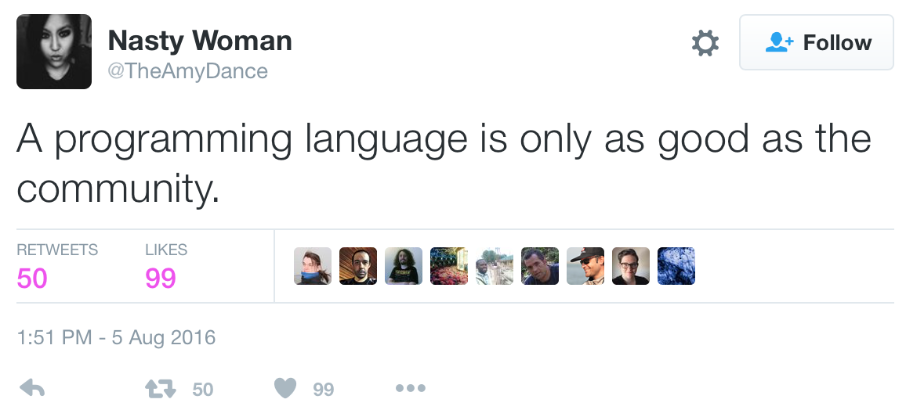

# Building R Packages


This section covers building R packages. Writing good code for data science is only part of the job. In order to maximize the usefulness and reusability of data science software, code must be organized and distributed in a manner that adheres to community-based standards and provides a good user experience. This section covers the primary means by which R software is organized and distributed to others. We cover R package development, writing good documentation and vignettes, writing robust software, cross-platform development, continuous integration tools, and distributing packages via CRAN and GitHub. Learners will produce R packages that satisfy the criteria for submission to CRAN.

The Learning objectives for this section are: 

* Recognize the basic structure and purpose of an R package
* Create a simple R package skeleton using the devtools package
* Recognize the key directives in a NAMESPACE file
* Create R function documentation using roxygen2
* Create vignettes using knitr and R Markdown
* Create an R package that contains data (and associated documentation)
* Create unit tests for an R package using the testthat package
* Categorize errors in the R CMD check process
* Recall the principles of open source software
* Recall two open source licenses
* Create create a GitHub repository for an R package
* Create an R package that is tested and deployed on Travis
* Create an R package that is tested and deployed on Appveyor
* Recognize characteristics of R packages that are not cross-platform

## Before You Start

Building R packages requires a toolchain that must be in place before you begin developing. If you are developing packages that contain only R code, then the tools you need come with R and RStudio. However, if you want to build packages with compiled C, C++, or Fortran code (or which to build other people's packages with such code), then you will need to install additional tools. Which tools you install depends on what platform you are running.


### Mac OS

For developing in Mac OS, you will first need to download the Xcode development environment. While you do not need the IDE that comes with Xcode to develop R packages you need many of the tools that come with it, including the C compiler (`clang`). Xcode can be obtained from either the [Mac App Store](https://itunes.apple.com/us/app/xcode/id497799835?mt=12) or from Apple's [Xcode developer's page](https://developer.apple.com/xcode/). Once this is installed you will have the C compiler as well as a number of additional Unix shell tools. You will also have necessary header files for compiling C code.

While it's unlikely that you will be building your own packages with Fortran code, many older packages (including R itself) contain Fortran code. Therefore, in order to build these packages, you need a Fortran compiler. Mac OS does not come with one by default and so you can download the [GNU Fortran Compiler](http://r.research.att.com/gfortran-4.2.3.dmg) from the R for Mac tools page.

There are more details provided on the [R for Mac tools package](http://r.research.att.com/tools/) maintained by Simon Urbanek, particularly for older versions of Mac OS. 


### Windows

On Windows, the R Core has put together a package of tools that you can download all at once and install via a simple installer tool. The [Rtools](https://cran.r-project.org/bin/windows/Rtools/) package comes in different versions, depending on the version of R that you are using. Make sure to get the version of Rtools that matches your version of R. Once you have installed this, you will have most of the tools needed to build R packages. You can optionally install a few other tools, documented [here](https://cran.r-project.org/bin/windows/Rtools/Rtools.txt). 

### Unix/Linux

If you are using R on a Unix-like system then you may have already have the tools for building R packages. In particular, if you built R from the sources, then you already have a C compiler and Fortran compiler. If, however, you installed R from a package management system, then you may need to install the compilers, as well as the header files. These usually coming in packages with the suffix `-devel`. For example, the header files for the `readline` package may come in the package `readline-devel`. The catch is that these `-devel` packages are not needed to run R, only to build R packages from the sources.


## R Packages

The objectives of this section are: 

* Recognize the basic structure and purpose of an R package
* Recognize the key directives in a NAMESPACE file


An R package is a mechanism for extending the basic functionality of R. It is the natural extension of writing functions that each do a specific thing well. In the previous chapter, we discussed how writing functions abstracts the behavior of a set of R expressions by providing a defined interface, with inputs (i.e. function arguments) and outputs (i.e. return values). The use of functions simplifies things for the user because the user no longer needs to be knowledgeable of the details of the underlying code. They only need to understand the inputs and outputs.

Once one has developed many functions, it becomes natural to group them in to collections of functions that are aimed at achieving an overall goal. This collection of functions can be assembled into an R package. R packages represent another level of abstraction, where the interface presented to the user is a set of **user-facing functions**. These functions provide access to the underlying functionality of the package and simplify the user experience because the one does not need to be concerned with the many other helper functions that are required.

R packages are a *much* better way to distribute code to others because they provide a clean and uniform user experience for people who want to interact with your code. R packages require documentation in a standardized format, and the various tools that come with R (and RStudio) help to check your packages so that they do not contain inconsistencies or errors. R users are already familiar with how to use R packages, and so they will be able to quickly adopt your code if is presented in this format.

This chapter highlights the key elements of building R packages. The fine details of building a package can be found in the [Writing R Extensions](https://cran.r-project.org/doc/manuals/r-release/R-exts.html) manual.


### Basic Structure of an R Package

An R package begins life as a directory on your computer. This directory has a specific layout with specific files and sub-directories. The two required sub-directories are

* `R`, which contains all of your R code files

* `man`, which contains your documentation files.

At the top level of your package directory you will have a `DESCRIPTION` file and a `NAMESPACE` file. This represents the minimal requirements for an R package. Other files and sub-directories can be added and will discuss how and why in the sections below.

I> While RStudio is not required to build R packages, it contains a number of convenient features that make the development process easier and faster. That said, in order to use RStudio for package development, you must setup the environment properly. Details of how to do this can be found in Roger's [RStudio package development pre-flight check list](https://github.com/rdpeng/daprocedures/blob/master/lists/Rpackage_preflight.md).

### DESCRIPTION File

The DESCRIPTION file is an essential part of an R package because it contains key metadata for the package that is used by repositories like CRAN and by R itself. In particular, this file contains the package name, the version number, the author and maintainer contact information, the license information, as well as any dependencies on other packages.

As an example, here is the DESCRIPTION file for the `mvtsplot` package on CRAN. This package provides a function for plotting multivariate time series data.

```
Package:  mvtsplot
Version:  1.0-3
Date:  2016-05-13
Depends:  R (>= 3.0.0)
Imports: splines, graphics, grDevices, stats, RColorBrewer
Title:  Multivariate Time Series Plot
Author:  Roger D. Peng <rpeng@jhsph.edu>
Maintainer:  Roger D. Peng <rpeng@jhsph.edu>
Description:  A function for plotting multivariate time series data.
License:  GPL (>= 2)
URL: https://github.com/rdpeng/mvtsplot
```


### NAMESPACE File

The NAMESPACE file specifies the interface to the package that is presented to the user. This is done via a series of `export()` statements, which indicate which functions in the package are exported to the user. Functions that are not exported cannot be called directly by the user (although see below). In addition to exports, the NAMESPACE file also specifies what functions or packages are *imported* by the package. If your package depends on functions from another package, you must import them via the NAMESPACE file. 

Below is the NAMESPACE file for the `mvtsplot` package described above.

```
export("mvtsplot")

import(splines)
import(RColorBrewer)
importFrom("grDevices", "colorRampPalette", "gray")
importFrom("graphics", "abline", "axis", "box", "image", "layout",
           "lines", "par", "plot", "points", "segments", "strwidth",
           "text", "Axis")
importFrom("stats", "complete.cases", "lm", "na.exclude", "predict",
           "quantile")
```

Here we can see that only a single function is exported from the package (the `mvtsplot()` function). There are two types of import statements: 

* `import()`, simply takes a package name as an argument, and the interpretation is that all exported functions from that external package will be accessible to your package

* `importFrom()`, takes a package and a series of function names as arguments. This directive allows you to specify exactly which function you need from an external package. For example, this package imports the `colorRampPalette()` and `gray()` functions from the `grDevices` package.

Generally speaking, it is better to use `importFrom()` and to be specific about which function you need from an external package. However, in some cases when you truly need almost every function in a package, it may be more efficient to simply `import()` the entire package. 

With respect to exporting functions, it is important to think through carefully which functions you want to export. First and foremost, exported functions must be documented and supported. Users will generally expect exported functions to be there in subsequent iterations of the package. It's usually best to limit the number of functions that you export (if possible). It's always possible to export something later if it is needed, but removing an exported function once people have gotten used to having it available can result in upset users. Finally, exporting a long list of functions has the effect of cluttering a user's namespace with function names that may conflict with functions from other packages. Minimizing the number of exports reduces the chances of a conflict with other packages (using more package-specific function names is another way).


#### Namespace Function Notation

As you start to use many packages in R, the likelihood of two functions having the same name increases. For example, the commonly used `dplyr` package has a function named `filter()`, which is also the name of a function in the `stats` package. If one has both packages loaded (a more than likely scenario) how can one specific exactly which `filter()` function they want to call?

In R, every function has a full name, which includes the package namespace as part of the name. This format is along the lines of

```
<package name>::<exported function name>
```

For example, the `filter()` function from the `dplyr` package can be referenced as `dplyr::filter()`. This way, there is no confusion over which `filter()` function we are calling. While in principle every function can be referenced in this way, it can be tiresome for interactive work. However, for programming, it is often safer to reference a function using the full name if there is even a chance that there might be confusion. 

It is possible to call functions that are *not* exported by package by using the namespace notation. The `:::` operator can be used for this purpose, as in `<package name>:::<unexported function name>`. This can be useful for examining the code of an unexported function (e.g. for debugging purposes) or for temporarily accessing some unexported feature of a package. However, it's not a good idea to make this a habit as such unexported functions may change or even be eliminated in future versions of the package. Furthermore, use of the `:::` operator is not allowed for packages that reside on CRAN.

#### Loading and Attaching a Package Namespace

When dealing with R packages, it's useful to understand the distinction between *loading* a package namespace and *attaching* it. When package `A` imports the namespace of package `B`, package `A` loads the namespace of package `B` in order to gain access to the exported functions of package `B`. However, when the namespace of package `B` is loaded, it is only available to package `A`; it is not placed on the search list and is not visible to the user or to other packages.

Attaching a package namespace places that namespace on the search list, making it visible to the user and to other packages. Sometimes this is needed because certain functions need to be made visible to the user and not just to a given package.


### The R Sub-directory

The `R` sub-directory contains all of your R code, either in a single file, or in multiple files. For larger packages it's usually best to split code up into multiple files that logically group functions together. The names of the R code files do not matter, but generally it's not a good idea to have spaces in the file names. 

### The man Sub-directory

The `man` sub-directory contains the documentation files for all of the exported objects of a package. With older versions of R one had to write the documentation of R objects directly into the `man` directory using a LaTeX-style notation. However, with the development of the `roxygen2` package, we no longer need to do that and can write the documentation directly into the R code files. Therefore, you will likely have little interaction with the `man` directory as all of the files in there will be auto-generated by the `roxygen2` package. 


### Summary

R packages provide a convenient and standardized mechanism for distributing R code to a wide audience. As part of building an R package you design an interface to a collection of functions that users can access to make use of the functionality you provide. R packages are directories containing R code, documentation files, package metadata, and export/import information. Exported functions are functions that are accessible by the user; imported functions are functions in other packages that are used by your package.


## The `devtools` Package

The objective of this section is

* Create a simple R package skeleton using the devtools package

R package development has become substantially easier in recent years with the introduction of a package by Hadley Wickham called `devtools`. As the package name suggests, this includes a variety of functions that facilitate software development in R. 

I> Hands down, the best resource for mastering the `devtools` package is the book *R Packages* by Hadley Wickham. The full book is available online for free at http://r-pkgs.had.co.nz. It is also available as a hard copy book published by O'Reilly. If you plan to develop a lot of R packages, it is well worth your time to read this book closely.

### Key `devtools` functions

Here are some of the key functions included in `devtools` and what they do, roughly in the order you are likely to use them as you develop an R package:

| Function | Use                                                        |
|:---------|:-----------------------------------------------------------|
| `create` | Create the file structure for a new package | 
| `load_all` | Load the code for all functions in the package | 
| `document` | Create `\man` documentation files and the "NAMESPACE" file from `roxygen2` code |
| `use_data` | Save an object in your R session as a dataset in the package |
| `use_package` | Add a package you're using to the DESCRIPTION file |
| `use_vignette` | Set up the package to include a vignette |
| `use_readme_rmd` | Set up the package to include a README file in R Markdown format |
| `use_build_ignore` | Specify files that should be ignored when building the R package (for example, if you have a folder where you're drafting a journal article about the package, you can include all related files in a folder that you set to be ignored during the package build) | 
| `check` | Check the full R package for any ERRORs, WARNINGs, or NOTEs|
| `build_win` | Build a version of the package for Windows and send it to be checked on a Windows machine. You'll receive an email with a link to the results. | 
| `use_travis` | Set the package up to facilitate using Travis CI with the package | 
| `use_cran_comments` | Create a file where you can add comments to include with your CRAN submission. | 
| `submit_cran` | Submit the package to CRAN | 
| `use_news_md` | Add a file to the package to give news on changes in new versions | 

Some of these functions you'll only need to use once for a package. The one-time (per package) functions are mostly those that set up a certain type of infrastructure for the package. For example, if you want to use R Markdown to create a README file for a package you are posting to GitHub, you can create the proper infrastructure with the `use_readme_rmd` function. This function adds a starter README file in the main directory of the package with the name "README.Rmd". You can edit this file and render it to Markdown to provide GitHub users more information about your package. However, you will have problems with your CRAN checks if there is a README file in this top-level directory of the package, so the `use_readme_rmd` function also adds the files names for the R Markdown README file, and the Markdown file it creates, in the ".Rbuildignore" file, so it is not included when the package is built. 

### Creating a package

The earliest infrastructure function you will use from the `devtools` package is `create`. This function inputs the filepath for the directory where you would like to create the package and creates the initial package structure (as a note, this directory should not yet exist). You will then add the elements (code, data, etc.) for the package within this structure. As an alternative to `create`, you can also initialize an R package in RStudio by selecting "File" -> "New Project" -> "New Direction" -> "R Package".

I> In addition to starting a package using `create` or by creating a new project in RStudio, you could also create the package by hand, creating and then filling a directory. However, it's hard to think of any circumstances where there would be a good reason to do that rather than using some of the more convenient tools offered by `devtools` and RStudio. 


Figure \@ref(fig:initialpackagestructure) gives an example of what the new package directory will look like after you create an initial package structure with `create` or via the RStudio "New Project" interface. This initial package directory includes an `R` subdirectory, where you will save R scripts with all code defining R functions for the package. It also includes two files that will store metadata and interface information about your package (`DESCRIPTION` and `NAMESPACE`), as well as an R project file (`.Rproj` extension) that saves some project options for the directory. Finally, the initial package structure includes two files that can be used to exclude some files in the directory from either being followed by git (`.gitignore`) or included when the package is built (`.Rbuildignore`). These two files have names that start with a dot, so they may not be listed if you look at the package directory structure in a file manager like "Finder" on Macs. These "dot-files" will, however, be listed in the "Files" tab that shows up in one of the RStudio panes when you open an R project like a package directory, as shown in this figure.


### Other functions

In contrast to the `devtools` infrastructure functions that you will only use once per package, there are other `devtools` functions you'll use many times as you develop a package. Two of the workhorses of `devtools` are `load_all` and `document`. The `load_all` function loads the entire package (by default, based on the current working directory, although you can also give the filepath to load a package directory elsewhere). In addition to loading all R functions, it also loads all package data and compiles and connects C, C++, and FORTRAN code in the package. As you add to a package, you can use `load_all` to ensure you're using the latest version of all package functions and data. The `document` function rewrites the help files and NAMESPACE file based on the latest version of the `roxygen2` comments for each function (writing `roxygen2` is covered in more detail in the next section).

I> RStudio has created a very helpful Package Development Cheatsheet that covers many of the `devtools` functions. A pdf of this cheatsheet is available [here](https://www.rstudio.com/wp-content/uploads/2015/06/devtools-cheatsheet.pdf).

### Summary 

The `devtools` package contains functions that help with R package development. These functions include `create`, which creates the initial structure for a new package, as well as a number of functions for adding useful infrastructure to the package directory and functions to load and document the package.

## Documentation 

The objectives of this section are:

* Create R function documentation using roxygen2
* Create vignettes using knitr and R Markdown

There are two main types of documentation you may want to include with packages: 

- Longer documents that give tutorials or overviews for the whole package
- Shorter, function-specific help files for each function or group of related functions

You can create the first type of document using package vignettes, README files, or both. For the function-specific help files, the easiest way to create these is with the `roxygen2` package. 

In this section, we'll cover why and how to create this documentation. In addition, vignette / README documentation can be done using `knitr` to create R Markdown documents that mix R code and text, so we'll include more details on that process.  

### Vignettes and README files

You will likely want to create a document that walks users through the basics of how to use your package. You can do this through two formats:

- Vignette: This document is bundled with your R package, so it becomes locally available to a user once they install your package from CRAN. They will also have it available if they install the package from GitHub, as long as they use the `build_vignettes = TRUE` option when running `install_github`. 
- README file: If you have your package on GitHub, this document will show up on the main page of the repository.

A package likely only needs a README file if you are posting the package to GitHub. For any GitHub repository, if there is a README.md file in the top directory of the repository, it will be rendered on the main GitHub repository page below the listed repository content. For an example, visit https://github.com/geanders/countytimezones and scroll down. You'll see a list of all the files and subdirectories included in the package repository and below that is the content in the package's `README.md` file, which gives a tutorial on using the package. 

If the README file does not need to include R code, you can write it directly as an `.md` file, using Markdown syntax, which is explained in more detail in the next section. If you want to include R code, you should start with a `README.Rmd` file, which you can then render to Markdown using `knitr`. You can use the `devtools` package to add either a `README.md` or `README.Rmd` file to a package directory using `use_readme_md` or `use_readme_rmd`, respectively. These functions will add the appropriate file to the top level of the package directory and will also add the file name to ".Rbuildignore", since having one of these files in the top level of the package directory could otherwise cause some problems when building the package. 

The README file is a useful way to give GitHub users information about your package, but it will not be included in builds of the package or be available through CRAN for packages that are posted there. Instead, if you want to create tutorials or overview documents that are included in a package build, you should do that by adding one or more package vignettes. Vignettes are stored in a `vignettes` subdirectory within the package directory. 

To add a vignette file, saved within this subdirectory (which will be created if you do not already have it), use the `use_vignette` function from `devtools`. This function takes as arguments the file name of the vignette you'd like to create and the package for which you'd like to create it (the default is the package in the current working directory). For example, if you are currently working in your package's top-level directory and you would like to add a vignette called "model_details", you can do that with the code: 


```r
use_vignette("model_details")
```


You can have more than one vignette per package, which can be useful if you want to include one vignette that gives a more general overview of the package as well as a few vignettes that go into greater detail about particular aspects or applications.

T> Once you create a vignette with `use_vignette`, be sure to update the Vignette Index Entry in the vignette's YAML (the code at the top of an R Markdown document). Replace "Vignette Title" there with the actual title you use for the vignette.

### Knitr / Markdown

Both vignettes and README files can be written as R Markdown files, which will allow you to include R code examples and results from your package. One of the most exciting tools in R is the `knitr` system for combining code and text to create a reproducible document. In terms of the power you get for time invested in learning a tool, `knitr` probably can't be beat. Everything you need to know to create and "knit" a reproducible document can be learned in about 20 minutes, and while there is a lot more you can do to customize this process if you want to, probably 80% of what you'll ever want to do with `knitr` you'll learn in those first 20 minutes. 

R Markdown files are mostly written using Markdown. To write R Markdown files, you need to understand what markup languages like Markdown are and how they work. In Word and other word processing programs you have used, you can add formatting using buttons and keyboard shortcuts (e.g., "Ctrl-B" for bold). The file saves the words you type. It also saves the formatting, but you see the final output, rather than the formatting markup, when you edit the file (WYSIWYG -- what you see is what you get). In markup languages, on the other hand, you markup the document directly to show what formatting the final version should have (e.g., you type `**bold**` in the file to end up with a document with **bold**). Examples of markup languages include:

- HTML (HyperText Markup Language)
- LaTex
- Markdown (a "lightweight" markup language)

### Common Markdown formatting elements

To write a file in Markdown, you'll need to learn the conventions for creating formatting. This table shows what you would need to write in a flat file for some common formatting choices:


|Code                     |Rendering              |Explanation         |
|:------------------------|:----------------------|:-------------------|
|`**text**`               |**text**               |boldface            |
|`*text*`                 |*text*                 |italicized          |
|`[text](www.google.com)` |[text](www.google.com) |hyperlink           |
|`# text`                 |                       |first-level header  |
|`## text`                |                       |second-level header |

Some other simple things you can do in Markdown include:

- Lists (ordered or bulleted)
- Equations
- Tables
- Figures from files
- Block quotes
- Superscripts

The start of a Markdown file gives some metadata for the file (authors, title, format) in a language called YAML. For example, the YAML section of a package vignette might look like this: 

```
---
title: "Model Details for example_package"
author: "Jane Doe"
date: "2017-06-26"
output: rmarkdown::html_vignette
vignette: >
  %\VignetteIndexEntry{Model Details for example_package}
  %\VignetteEngine{knitr::rmarkdown}
  %\VignetteEncoding{UTF-8}
---
```

When creating R Markdown documents using the RStudio toolbar, much of this YAML will be automatically generated based on your specifications when opening the initial file. However, this is not the case with package vignettes, for which you'll need to go into the YAML and add the authors and title yourself. Leave the vignette engine, vignette encoding, output, and date as their default values.

For more Markdown conventions, see [RStudio's R Markdown Reference Guide](https://www.rstudio.com/wp-content/uploads/2015/03/rmarkdown-reference.pdf) (link also available through "Help" in RStudio). 

R Markdown files work a lot like Markdown files, but add the ability to include R code that will be run before rendering the final document. This functionality is based on *literate programming*, an idea developed by Donald Knuth, to mix executable code with regular text. The files you create can then be "knitted", to run any embedded code. The final output will have results from your code and the regular text. 

The basic steps of opening and rendering an R Markdown file in RStudio are:

- To open a new R Markdown file, go to "File" -> "New File" -> "RMarkdown...". To start, choose a "Document" in "HTML" format.
- This will open a new R Markdown file in RStudio. The file extension for R Markdown files is ".Rmd". 
- The new file comes with some example code and text. You can run the file as-is to try out the example. You will ultimately delete this example code and text and replace it with your own.
- Once you "knit" the R Markdown file, R will render an HTML file with the output. This is automatically saved in the same directory where you saved your .Rmd file.
- Write everything besides R code using Markdown syntax.

The `knit` function from the `knitr` package works by taking a document in R Markdown format (among a few possible formats), reading through it for any markers of the start of R code, running any of the code between that "start" marker and a marker showing a return to regular Markdown, writing any of the relevant results from R code into the Markdown file in Markdown format, and then passing the entire document to software that can render from Markdown to the desired output format (for example, compile a pdf, Word, or HTML document).

This means that all a user needs to do to include R code within a document is to properly separate it from other parts of the document through the appropriate markers. To indicate R code in an RMarkdown document, you need to separate off the code chunk using the following syntax:

    ```{r}
    my_vec <- 1:10
    ```
    
This syntax tells R how to find the start and end of pieces of R code (*code chunks*) when the file is rendered. R will walk through, find each piece of R code, run it and create output (printed output or figures, for example), and then pass the file along to another program to complete rendering (e.g., Tex for pdf files).

You can specify a name for each chunk, if you'd like, by including it after "r" when you begin your chunk. For example, to give the name `load_mtcars` to a code chunk that loads the `mtcars` dataset, specify that name in the start of the code chunk: 

    ```{r load_mtcars}
    data(mtcars)
    ```

T> Here are a couple of tips for naming code chunks: 
T> 
T> - Chunk names must be unique across a document.
T> - Any chunks you don't name are given ordered numbers by `knitr`.

You do not have to name each chunk. However, there are some advantages: 

- It will be easier to find any errors.  
- You can use the chunk labels in referencing for figure labels. 
- You can reference chunks later by name.

### Common knitr chunk options

You can also add options when you start a chunk. Many of these options can be set as TRUE / FALSE and include:


|Option     |Action                                              |
|:----------|:---------------------------------------------------|
|`echo`     |Print out the R code?                               |
|`eval`     |Run the R code?                                     |
|`messages` |Print out messages?                                 |
|`warnings` |Print out warnings?                                 |
|`include`  |If FALSE, run code, but don't print code or results |

Other chunk options take values other than TRUE / FALSE. Some you might want to include are:


|Option       |Action                                                                           |
|:------------|:--------------------------------------------------------------------------------|
|`results`    |How to print results (e.g., `hide` runs the code, but doesn't print the results) |
|`fig.width`  |Width to print your figure, in inches (e.g., `fig.width = 4`)                    |
|`fig.height` |Height to print your figure                                                      |

To include any of these options, add the option and value in the opening brackets and separate multiple options with commas:

    ```{r  messages = FALSE, echo = FALSE}
    mtcars[1, 1:3]
    ```
    
You can set "global" options at the beginning of the document. This will create new defaults for all of the chunks in the document. For example, if you want `echo`, `warning`, and `message` to be `FALSE` by default in all code chunks, you can run: 

    ```{r  global_options}
    knitr::opts_chunk$set(echo = FALSE, message = FALSE,
      warning = FALSE)
    ```

If you set both global and local chunk options that you set specifically for a chunk will take precedence over global options. For example, running a document with:

    ```{r  global_options}
    knitr::opts_chunk$set(echo = FALSE, message = FALSE,
      warning = FALSE)
    ```


    ```{r  check_mtcars, echo = TRUE}
    head(mtcars, 1)
    ```
    
**would** print the code for the `check_mtcars` chunk, because the option specified for that specific chunk (`echo = TRUE`) would override the global option (`echo = FALSE`).

You can also include R output directly in your text ("inline") using backticks: \bigskip

"There are `` `r nrow(mtcars)` `` observations in the `mtcars` data set. The average miles per gallon is `` `r mean(mtcars$mpg, na.rm = TRUE)` ``."

\bigskip

Once the file is rendered, this gives: \bigskip

"There are 32 observations in the `mtcars` data set. The average miles per gallon is 20.090625."

\bigskip

T> Here are some tips that will help you diagnose some problems rendering R Markdown files:
T>
T> - Be sure to save your R Markdown file before you run it.
T> - All the code in the file will run "from scratch"--- as if you just opened a new R session.
T> - The code will run using, as a working directory, the directory where you saved the R Markdown file.
T> - To use the latest version of functions in a package you are developing in an R Markdown document, rebuild the package before knitting the document. You can build a package using the "Build" tab in one of the RStudio panes.

You'll want to try out pieces of your code as you write an R Markdown document. There are a few ways you can do that:

- You can run code in chunks just like you can run code from a script (Ctrl-Return or the "Run" button). 
- You can run all the code in a chunk (or all the code in all chunks) using the different options under the "Run" button in RStudio. 
- All the "Run" options have keyboard shortcuts, so you can use those.

I> Two excellent books for learning more about creating reproducible documents with R are *Dynamic Documents with R and knitr* by Yihui Xie (the creator of `knitr`) and *Reproducible Research with R and RStudio* by Christopher Gandrud. The first goes into the technical details of how `knitr` and related code works, which gives you the tools to extensively customize a document. The second provides an extensive view of how to use tools from R and other open source software to conduct, write up, and present research in a reproducible and efficient way. RStudio's [R Markdown Cheatsheet](https://www.rstudio.com/wp-content/uploads/2015/02/rmarkdown-cheatsheet.pdf) is another very useful reference.

### Help files and roxygen2

In addition to writing tutorials that give an overview of your whole package, you should also write specific documentation showing users how to use and interpret any functions you expect users to directly call. 

These help files will ultimately go in a folder called `/man` of your package, in an R documentation format (`.Rd` file extensions) that is fairly similar to LaTeX. You used to have to write all of these files as separate files. However, the `roxygen2` package lets you put all of the help information directly in the code where you define each function. Further, `roxygen2` documentation allows you to include tags (`@export`, `@importFrom`) that will automate writing the package NAMESPACE file, so you don't need to edit that file by hand.

With `roxygen2`, you add the help file information directly above the code where you define each functions, in the R scripts saved in the `R` subdirectory of the package directory. You start each line of the `roxygen2` documentation with `#'` (the second character is an apostrophe, not a backtick). The first line of the documentation should give a short title for the function, and the next block of documentation should be a longer description. After that, you will use tags that start with `@` to define each element you're including. You should leave an empty line between each section of documentation, and you can use indentation for second and later lines of elements to make the code easier to read. 

Here is a basic example of how this `roxygen2` documentation would look for a simple "Hello world" function:

```
#' Print "Hello world" 
#'
#' This is a simple function that, by default, prints "Hello world". You can 
#' customize the text to print (using the \code{to_print} argument) and add
#' an exclamation point (\code{excited = TRUE}).
#'
#' @param to_print A character string giving the text the function will print
#' @param excited Logical value specifying whether to include an exclamation
#'    point after the text
#' 
#' @return This function returns a phrase to print, with or without an 
#'    exclamation point added. As a side effect, this function also prints out
#'    the phrase. 
#'
#' @examples
#' hello_world()
#' hello_world(excited = TRUE)
#' hello_world(to_print = "Hi world")
#'
#' @export
hello_world <- function(to_print = "Hello world", excited = FALSE){
    if(excited) to_print <- paste0(to_print, "!")
    print(to_print)
}
```

You can run the `document` function from the `devtools` package at any time to render the latest version of these `roxygen2` comments for each of your functions. This will create function-specific help files in the package's "man" subdirectory as well as update the package's NAMESPACE file.

### Common `roxygen2` tags

Here are some of the common `roxygen2` tags to use in creating this documentation:

| Tag | Meaning                                                               |
|:---------|:-----------------------------------------------------------------|
| `@return` | A description of the object returned by the function | 
| `@parameter` | Explanation of a function parameter | 
| `@inheritParams` | Name of a function from which to get parameter definitions |
| `@examples` | Example code showing how to use the function |
| `@details` | Add more details on how the function works (for example, specifics of the algorithm being used) | 
| `@note` | Add notes on the function or its use | 
| `@source` | Add any details on the source of the code or ideas for the function | 
| `@references` | Add any references relevant to the function |
| `@importFrom` | Import a function from another package to use in this function (this is especially useful for inline functions like `%>%` and `%within%`) | 
| `@export` | Export the function, so users will have direct access to it when they load the package

Here are a few things to keep in mind when writing help files using `roxygen2`:

- The tags `@example` and `@examples` do different things. You should *always* use the `@examples` (plural) tag for example code, or you will get errors when you build the documentation.
- The `@inheritParams` function can save you a lot of time, because if you are using the same parameters in multiple functions in your package, you can write and edit those parameter descriptions just in one place. However, keep in mind that you must point `@inheritParams` to the function where you originally define the parameters using `@param`, not another function where you use the parameters but define them using an `@inheritParams` pointer. 
- If you want users to be able to directly use the function, you must include `@export` in your `roxygen2` documentation. If you have written a function but then find it isn't being found when you try to compile a README file or vignette, a common culprit is that you have forgotten to export the function. 

### Common roxygen2 formatting tags

You can include formatting (lists, etc.) and equations in the `roxygen2` documentation. Here are some of the common formatting tags you might want to use:

| Tag | Meaning                                                               |
|:---------|:-----------------------------------------------------------------|
| `\code{}` | Format in a typeface to look like code | 
| `\dontrun{}` | Use with examples, to avoid running the example code during package builds and testing | 
| `\link{}` | Link to another R function | 
| `\eqn{}{}` | Include an inline equation | 
| `\deqn{}{}` | Include a display equation (i.e., shown on its own line) | 
| `\itemize{}` | Create an itemized list |
| `\url{}` | Include a web link |
| `\href{}{}` | Include a web link | 

Some tips on using the R documentation format: 

- Usually, you'll want you use the `\link` tag only in combination with the `\code` tag, since you're linking to another R function. Make sure you use these with `\code` wrapping `\link`, not the other way around (`\code{\link{other_function}}`), or you'll get an error.
- Some of the equation formatting, including superscripts and subscripts, won't parse in Markdown-based documentation (but will for pdf-based documentation). With the `\eqn` and `deqn` tags, you can include two versions of an equation, one with full formatting, which will be fully compiled by pdf-based documentation, and one with a reduced form that looks better in Markdown-based documentation (for example, `\deqn{ \frac{X^2}{Y} }{ X2 / Y }`). 
- For any examples in help files that take a while to run, you'll want to wrap the example code in the `\dontrun` tag. 
- The tags `\url` and `\href` both include a web link. The difference between the two is that `\url` will print out the web address in the help documentation, `href` allows you to use text other than the web address for the anchor text of the link. For example: `"For more information, see \url{www.google.com}."`; `"For more information, \href{www.google.com}{Google it}."`.

In addition to document functions, you should also document any data that comes with your package. To do that, create a file in the `/R` folder of the package called "data.R" to use to documentation all of the package's datasets. You can use `roxygen2` to document each dataset, and end each with the name of the dataset in quotation marks. There are more details on documenting package data using `roxygen2` in the next section.

I> As you prepare a package for sharing with others, you may want to create a pdf manual, which provides a more user-friendly format for proofreading all the package help files. You can create one with the `R CMD Rd2pdf` shell command. To use this, open a shell and navigate to the parent directory of your R package directory (an easy way to do this is to open a shell using the "Shell" option for the gear button in the Git pane in RStudio and then running `cd ..` to move up one directory). Then, from the shell, run `R CMD Rd2pdf` followed by your package's name (e.g., for a package named "examplepackage", run `R CMD Rd2pdf examplepackage`). This command builds your package and creates and opens a pdf with the text of all help files for exported functions. Check out [this StackOverflow thread](http://stackoverflow.com/questions/16986422/r-create-reference-manual-with-r-cmd-check) for more.
```

### Summary

You should include documentation to help others use your package, both longer-form documentation through vignettes or README files and function-specific help files. Longer-form documentation can be written using R Markdown files, which can include executable R code examples, while function-specific help files can be written using `roxygen2` comments within the R scripts where each function is defined.

## Data Within a Package

The objective of this section is:

* Create an R package that contains data (and associated documentation)


Many R packages are designed to manipulate, visualize, and model data so it may
be a good idea for you to include some data in your package. The primary reason
most developers include data in their package is to demonstrate how to use the 
functions included in the package with the included data. Creating a package
as a means to distribute data is also a method that is gaining popularity.
Additionally you may want to include data that your package uses internally,
but is not available to somebody who is using your package. When including
data in your package consider the fact that your compressed package file should
be smaller than 5MB, which is the largest package size that CRAN allows. If
your package is larger than 5MB make sure to inform users in the instructions
for downloading and installing your package.

### Data for Demos

#### Data Objects

Including data in your package is easy thanks to the `devtools` package. To
include datasets in a package, first create the objects that you would like to
include in your package inside of the global environment. You can include any
R object in a package, not just data frames. Then make sure you're in your
package directory and use the `use_data()` function, listing each object that
you want to include in your package. The names of the objects that you pass as
arguments to `use_data()` will be the names of the objects when a user loads the
package, so make sure you like the variable names that you're using.

You should then document each data object that you're including in the package.
This way package users can use common R help syntax like `?dataset` to find out
more information about the included data set. You should create one R file
called `data.R` in the `R/` directory of your package. You can write the data
documentation in the `data.R` file. Let's take a look at some documentation
examples from the `minimap` package. First we'll look at the documentation for
a data frame called `maple`:


```r
#' Production and farm value of maple products in Canada
#'
#' @source Statistics Canada. Table 001-0008 - Production and farm value of
#'  maple products, annual. \url{http://www5.statcan.gc.ca/cansim/}
#' @format A data frame with columns:
#' \describe{
#'  \item{Year}{A value between 1924 and 2015.}
#'  \item{Syrup}{Maple products expressed as syrup, total in thousands of gallons.}
#'  \item{CAD}{Gross value of maple products in thousands of Canadian dollars.}
#'  \item{Region}{Postal code abbreviation for territory or province.}
#' }
#' @examples
#' \dontrun{
#'  maple
#' }
"maple"
```

Data frames that you include in your package should follow the general schema
above where the documentation page has the following attributes:

- An informative title describing the object.
- A `@source` tag describing where the data was found.
- A `@format` tag which describes the data in each column of the data frame.
- And then finally a string with the name of the object.

The `minimap` package also includes a few vectors. Let's look at the
documentation for `mexico_abb`:


```r
#' Postal Abbreviations for Mexico
#'
#' @examples
#' \dontrun{
#'  mexico_abb
#' }
"mexico_abb"
```

You should always include a title for a description of a vector or any other
object. If you need to elaborate on the details of a vector you can include
a description in the documentation or a `@source` tag. Just like with data
frames the documentation for a vector should end with a string containing the
name of the object.

#### Raw Data

A common task for R packages is to take raw data from files and to import them
into R objects so that they can be analyzed. You might want to include some
sample raw data files so you can show different methods and options for
importing the data. To include raw data files in your package you should create
a directory under `inst/extdata` in your R package. If you stored a data
file in this directory called `response.json` in `inst/extdata` and your package
is named `mypackage` then a user could access the path to this file with
`system.file("extdata", "response.json", package = "mypackage")`. Include that
line of code in the documentation to your package so that your users know how
to access the raw data file.

### Internal Data

Functions in your package may need to have access to data that you don't want
your users to be able to access. For example the `swirl` package contains
translations for menu items into languages other than English, however that data
has nothing to do with the purpose of the `swirl` package and so it's hidden
from the user. To add internal data to your package you can use the `use_data()`
function from `devtools`, however you must specify the `internal = TRUE`
argument. All of the objects you pass to `use_data(..., internal = TRUE)` can
be referenced by the same name within your R package. All of these objects will
be saved to one file called `R/sysdata.rda`.

### Data Packages

There are several packages which were created for the sole purpose of
distributing data including
[janeaustenr](https://github.com/juliasilge/janeaustenr),
[gapminder](https://github.com/jennybc/gapminder),
[babynames](https://github.com/hadley/babynames),
and [lego](https://github.com/seankross/lego).
Using an R package as a means of distributing data has advantages and 
disadvantages. On one hand the data is extremely easy to load into R, as a user
only needs to install and load the package. This can be useful for teaching
folks who are new to R and may not be familiar with importing and cleaning data.
Data packages also allow you document datasets using `roxygen2`, which provides
a much cleaner and more programmer-friendly kind of code book compared to
including a file that describes the data. On the other hand data in a data
package is not accessible to people who are not using R, though there's nothing
stopping you from distributing the data in multiple ways.

If you decide to create a data package you should document the process that you
used to obtain, clean, and save the data. One approach to doing this is to use
the `use_data_raw()` function from `devtools`. This will create a directory
inside of your package called `data_raw`. Inside of this directory you should
include any raw files that the data objects in your package are derived from. 
You should also include one or
more R scripts which import, clean, and save those data objects in your R 
package. Theoretically if you needed to update the data package with new data 
files you should be able to just run these scripts again in order to rebuild
your package.

### Summary

Including data in a package is useful for showing new users how to use your
package, using data internally, and sharing and documenting datasets. The
`devtools` package includes several useful functions to help you add data to
your package including `use_data()` and `use_data_raw()`. You can document
data within your package just like you would document a function.


## Software Testing Framework for R Packages

The objective of this section is:

* Create unit tests for an R package using the testthat package

Once you've written code for an R package and have gotten that code to a point where you believe it's working, it may be a good time to step back and consider a few things about your code. 

* **How do you know it's working?** Given that you wrote the functions, you have a certain set of *expectations* about how the functions should behave. Specifically, for a given set of inputs you expect a certain output. Having these expectations clearly in mind is an important aspect of knowing whether code is "working". 

* **Have you already tested your code?** Chances are, throughout the development of your code, you ran little tests to see if your functions were working. Assuming these tests were valid for the code you were testing, it's worth keeping these tests on hand and making them part of your package.

Setting up a battery of tests for the code in your package can play a big role in maintaining the ongoing smooth operation of the package in hunting down bugs in the code, should they arise. Over time, many aspects of a package can change. Specifically:

* As you actively develop your code, you may change/break older code without knowing it. For example, modifying a helper function that lots of other functions rely on may be better for some functions but may break behavior for other functions. Without a comprehensive testing framework, you might not know that some behavior is broken until a user reports it to you.

* The environment in which your package runs can change. The version of R, libraries, web sites and any other external resources, and packages can all change without warning. In such cases, your code may be unchanged, but because of an external change, your code may not produce the expected output given a set of inputs. Having tests in place that are run regularly can help to catch these changes even if your package isn't under active development.

* As you fix bugs in your code, it's often a good idea to include a specific test that addresses each bug so that you can be sure that the bug does not "return" in a future version of the package (this is also known as a regression). 

Testing your code effectively has some implications for code design. In particular, it may be more useful to divide your code into smaller functions so that you can test individual pieces more effectively. For example, if you have one large function that returns `TRUE` or `FALSE`, it is easy to test this function, but ultimately it may not be possible to identify problems deep in the code by simply checking if the function returns the correct logical value. It may be better to divide up large function into smaller functions so that core elements of the function can be tested separately to ensure that they are behaving appropriately.


### The `testthat` Package

The `testthat` package is designed to make it easy to setup a battery of tests for your R package. A nice introduction to the package can be found in Hadley Wickham's [article](https://journal.r-project.org/archive/2011-1/RJournal_2011-1_Wickham.pdf) in the *R Journal*. Essentially, the package contains a suite of functions for testing function/expression output with the expected output. The simplest use of the package is for testing a simple expression:


```r
library(testthat)
expect_that(sqrt(3) * sqrt(3), equals(3))
```

Note that the `equals()` function allows for some numerical fuzz, which is why this expression actually passes the test. When a test fails, `expect_that()` throws an error and does not return something.

```r
## Use a strict test of equality (this test fails)
expect_that(sqrt(3) * sqrt(3), is_identical_to(3))

Error: sqrt(3) * sqrt(3) not identical to 3.
Objects equal but not identical
```


The `expect_that()` function can be used to wrap many different kinds of test, beyond just numerical output. The table below provides a brief summary of the types of comparisons that can be made.

|Expectation | Description |
|:---|:---|
| `equals()` | check for equality with numerical fuzz |
| `is_identical_to()` | strict equality via `identical()`|
| `is_equivalent_to()` | like `equals()` but ignores object attributes|
| `is_a()` | checks the class of an object (using `inherits()`) |
| `matches()` | checks that a string matches a regular expression | 
| `prints_text()` | checks that an expression prints to the console|
| `shows_message()` | checks for a message being generated| 
| `gives_warning()` | checks that an expression gives a warning | 
| `throws_error()` | checks that an expression (properly) throws an error|
| `is_true()` | checks that an expression is `TRUE` | 


A collection of calls to `expect_that()` can be put together with the `test_that()` function, as in


```r
test_that("model fitting", {
        data(airquality)
        fit <- lm(Ozone ~ Wind, data = airquality)
        expect_that(fit, is_a("lm"))
        expect_that(1 + 1, equals(2))
})
```

Typically, you would put your tests in an R file. If you have multiple sets of tests that test different domains of a package, you might put those tests in different files. Individual files can have their tests run with the `test_file()` function. A collection of tests files can be placed in a directory and tested all together with the `test_dir()` function. 

In the context of an R package, it makes sense to put the test files in the `tests` directory. This way, when running `R CMD check` (see the next section) all of the tests will be run as part of the process of checking the entire package. If any of your tests fail, then the entire package checking process will fail and will prevent you from distributing buggy code. If you want users to be able to easily see the tests from an installed package, you can place the tests in the `inst/tests` directory and have a separate file in the `tests` directory to run all of the tests.


## Passing CRAN checks

The objective of this section is:

* Categorize errors in the R CMD check process

Before submitting a package to CRAN, you must pass a battery of tests that are run by the R itself via the `R CMD check` program. In RStudio, if you are in an R Package "Project" you can run `R CMD check` by clicking the `Check` button in the build tab. This will run a series of tests that check the metadata in your package, the NAMESPACE file, the code, the documentation, run any tests, build any vignettes, and many others. 

Here is an example of the output form `R CMD check` for the `filehash` package which currently passes all tests.

```r
* using R version 3.3.2 (2016-10-31)
* using platform: x86_64-apple-darwin13.4.0 (64-bit)
* using session charset: UTF-8
* checking for file 'filehash/DESCRIPTION' ... OK
* this is package 'filehash' version '2.3'
* checking package namespace information ... OK
* checking package dependencies ... OK
* checking if this is a source package ... OK
* checking if there is a namespace ... OK
* checking for executable files ... OK
* checking for hidden files and directories ... OK
* checking for portable file names ... OK
* checking for sufficient/correct file permissions ... OK
* checking whether package 'filehash' can be installed ... OK
* checking installed package size ... OK
* checking package directory ... OK
* checking 'build' directory ... OK
* checking DESCRIPTION meta-information ... OK
* checking top-level files ... OK
* checking for left-over files ... OK
* checking index information ... OK
* checking package subdirectories ... OK
* checking R files for non-ASCII characters ... OK
* checking R files for syntax errors ... OK
* checking whether the package can be loaded ... OK
* checking whether the package can be loaded with stated dependencies ... OK
* checking whether the package can be unloaded cleanly ... OK
* checking whether the namespace can be loaded with stated dependencies ... OK
* checking whether the namespace can be unloaded cleanly ... OK
* checking loading without being on the library search path ... OK
* checking dependencies in R code ... OK
* checking S3 generic/method consistency ... OK
* checking replacement functions ... OK
* checking foreign function calls ... OK
* checking R code for possible problems ... OK
* checking Rd files ... OK
* checking Rd metadata ... OK
* checking Rd cross-references ... OK
* checking for missing documentation entries ... OK
* checking for code/documentation mismatches ... OK
* checking Rd \usage sections ... OK
* checking Rd contents ... OK
* checking for unstated dependencies in examples ... OK
* checking line endings in C/C++/Fortran sources/headers ... OK
* checking compiled code ... OK
* checking sizes of PDF files under 'inst/doc' ... OK
* checking installed files from 'inst/doc' ... OK
* checking files in 'vignettes' ... OK
* checking examples ... OK
* checking for unstated dependencies in 'tests' ... OK
* checking tests ...
 OK
* checking for unstated dependencies in vignettes ... OK
* checking package vignettes in 'inst/doc' ... OK
* checking running R code from vignettes ...
   'filehash.Rnw' ... OK
 OK
* checking re-building of vignette outputs ... OK
* checking PDF version of manual ... OK
* DONE
Status: OK
```

Here is an example from the `mvtsplot` package where we've deliberately introduced some problems to the package in order to show the check output. Checks that have passed are not shown below.

```r
* checking foreign function calls ... OK
* checking R code for possible problems ... NOTE
drawImage: no visible global function definition for ‘Axis’
drawImageMargin: no visible global function definition for ‘lm’
drawImageMargin: no visible global function definition for ‘Axis’
splineFillIn: no visible global function definition for ‘lm’
Undefined global functions or variables:
  Axis lm
Consider adding
  importFrom("graphics", "Axis")
  importFrom("stats", "lm")
to your NAMESPACE file.
```

Here, it appears that the functions `Axis()` and `lm()` are needed by the package but are not available because they are not imported from their respective packages. In this case, `R CMD check` provides a suggestion of how you can modify the NAMESPACE package, but you are probably better off modifying the `roxygen2` documentation in the code file instead.

Moving on the rest of the checks, we see:

```r
* checking for missing documentation entries ... OK
* checking for code/documentation mismatches ... WARNING
Codoc mismatches from documentation object 'mvtsplot':
mvtsplot
  Code: function(x, group = NULL, xtime = NULL, norm = c("internal",
                 "global"), levels = 3, smooth.df = NULL, margin =
                 TRUE, sort = NULL, main = "", palette = "PRGn",
                 rowstat = "median", xlim, bottom.ylim = NULL,
                 right.xlim = NULL, gcol = 1)
  Docs: function(y, group = NULL, xtime = NULL, norm = c("internal",
                 "global"), levels = 3, smooth.df = NULL, margin =
                 TRUE, sort = NULL, main = "", palette = "PRGn",
                 rowstat = "median", xlim, bottom.ylim = NULL,
                 right.xlim = NULL, gcol = 1)
  Argument names in code not in docs:
    x
  Argument names in docs not in code:
    y
  Mismatches in argument names:
    Position: 1 Code: x Docs: y
```

Here the problem is that the code has the first argument named `x` while the documentation has the first argument named `y`. 

```r
* checking Rd \usage sections ... WARNING
Undocumented arguments in documentation object 'mvtsplot'
  ‘y’
Documented arguments not in \usage in documentation object 'mvtsplot':
  ‘x’

Functions with \usage entries need to have the appropriate \alias
entries, and all their arguments documented.
The \usage entries must correspond to syntactically valid R code.
See chapter 'Writing R documentation files' in the 'Writing R
Extensions' manual.
```

Because of the mismatch in code and documentation for the first argument, we have an argument that is not properly documented (`y`) and an argument that is documented but not used (`x`).

In case the checks fly by too quickly, you will receive a summary message the end saying what errors and warnings you got.

```r
* DONE
Status: 2 WARNINGs, 1 NOTE
```

A package cannot be submitted to CRAN if there are any errors or warnings. If there is a NOTE, a package may be submitted if there is a Really Good Reason for that note.  

## Open Source Licensing

The objectives of this section are:

* Recall the principles of open source software
* Recall two open source licenses


You can specify how your R package is licensed in the package DESCRIPTION file
under the `License:` section. How you license your R package is important 
because it provides a set of
constraints for how other R developers use your code. If you're writing an R
package to be used internally in your company then your company may
choose to not share the package. In this case licensing your R package is less
important since the package belongs to your company. In your package DESCRIPTION
you can specify `License: file LICENSE`, and then create a text file called
`LICENSE` which explains that your company reserves all rights to the package.

However if you (or your company) would like to publicly share your R package
you should consider open source licensing. The philosophy of open source
revolves around three principles:

1. The source code of the software can be inspected.
2. The source code of the software can be modified.
3. Modified versions of the software can be redistributed.

Nearly all open source licenses provide the protections above. Let's discuss
three of the most popular open source licenses among R packages.

### The General Public License

Known as the GPL, the GNU GPL, and GPL-3, the General Public License was 
originally written by 
[Richard Stallman](https://en.wikipedia.org/wiki/Richard_Stallman). The GPL is
known as a *copyleft license*, meaning that any software that is bundled with
or originates from
software licensed under the GPL must also be released under the GPL. The exact meaning of "bundle" will depend a bit on the circumstances. For example, software distributed with an operating system can be licensed under different licenses even if the operating system itself is licensed under the GPL. You can
use the GPL-3 as the license for your R package by specifying `License: GPL-3`
in the DESCRIPTION file.

It is worth noting that R itself is licensed under [version 2 of the GPL](https://www.r-project.org/COPYING), or GPL-2, which is an earlier version of this license.

### The MIT License

The MIT license is a more permissive license compared to the GPL. MIT licensed
software can be modified or incorporated into software that is not open source.
The MIT license protects the copyright holder from legal liability that might
be incurred from using the software. When using the MIT license in a R package
you should specify `License: MIT + file LICENSE` in the DESCRIPTION file. You
should then add a file called LICENSE to your package which uses the following
template exactly:

```
YEAR: [The current year]
COPYRIGHT HOLDER: [Your name or your organization's name]
```

### The CC0 License

The [Creative Commons](https://creativecommons.org/) licenses are usually used
for artistic and creative works, however the CC0 license is also appropriate for
software. The CC0 license dedicates your R package to the public domain, which
means that you give up all copyright claims to your R package. The CC0 license
allows your software to join other great works like *Pride and Prejudice*,
*The Adventures of Huckleberry Finn*, and *The Scarlet Letter* in the public
domain. You can use the CC0 license for your R package by specifying 
`License: CC0` in the DESCRIPTION file.

### Why Open Source?

You've put weeks of sweat and mental anguish into writing a new R package, so
why should you provide an open source license for software that you or your
company owns by default? Let's discuss a few arguments for why open sourcing
your software is a good idea.

#### Paying it Forward

Software development began in academic settings and the first computer programs
with code that could be shared and run on multiple computers was shared between
academics in the same way that academics share other kinds of scientific
discoveries. The R programming language is open source, and there are hundreds of
high-quality R packages that are also open source. A programming language can 
have lots of exciting features but the continued growth and improvement of a
language is made possible by the people contributing to software written in that langauge. My colleague Amy [said it succinctly](https://twitter.com/TheAmyDance/status/761620744837169152):



So with that in mind, if you feel that the R language or the R community has
contributed to your success or the success of your company consider open 
sourcing your software so that the greater R community can benefit from its
availability.

#### Linus's Law

Now let's turn off the NPR pledge campaign and move our line of thinking from
the Berkeley *Kumbaya* circle to the Stanford MBA classroom: as a business
person why should you open source your software? One great reason is a concept
called Linus's Law which refers to Linus Torvalds, the creator of Linux.
The Linux operating system is a huge open source software project involving
thousands of people. Linux has a reputation for security and for its lack of
bugs which is in part a result of so many people looking at and being able to
modify the source code. If the users of your software are able to view and
modify the source code of your R package your package will likely be improved
because of Linus's Law.

#### Hiring

Open source software's relationship with hiring is a two-way street: if you
open source your software and other people send you improvements and
contributions you can potentially identify job candidates who you know are
already familiar with your source code. On the other hand if you're looking for
a job your contributions to open source software can be a part of a compelling
portfolio which showcases your software skills.

However there are pitfalls you should be aware of when weighing a candidate's 
open source contributions. Many open source contributions are essentially "free
work" - work that a candidate was able to do in their spare time. The best
candidates often cannot afford to make open source contributions. The most
meaningful ways that an individual contributes to their community usually has
nothing to do with writing software.

### Summary

Licensing and copyright laws vary between countries and jurisdictions. You
shouldn't consider any part of this chapter as legal advice. If you have
questions about open source licensing software you're building at work you
should consult with your legal department. In most situations
software that you write on your own time belongs to you, and software that you
write while being paid by somebody else belongs to whoever is paying you.
Open source licensing allows you to put restrictions on how your software can
be used by others. The open source philosophy does not oppose the commercial
sale of software. Many companies offer an open source version of their
software that comes with limitations, while also offering a paid license for
more expansive commercial use. This business model is used by companies like
[RStudio](https://www.rstudio.com/) and 
[Highcharts](http://www.highcharts.com/).

## Version Control and GitHub

The objective of this section is:

* Create create a GitHub repository for an R package

GitHub allows you to post and interact with online code repositories, where all repositories are under git version control. You can post R packages on GitHub and, with the `install_github` function from the `devtools` package, install R packages directly from GitHub. GitHub can be particularly useful for collaborating with others on R packages, as it allows all collaborators to push and pull code between their personal computers and a GitHub repository. While git historically required you to leave R and run git functions at a command line, RStudio now has a number of features that make it easier to interface directly with GitHub. 

When using git and GitHub, there are three levels of tasks you'll need to do: 

1. Initial set-up--- these are things you will only need to do once (at least per computer). 
    + Download git
    + Configure git with your user name and email
    + Set up a GitHub account
    + Set up a SSH key to link RStudio on your personal computer with your GitHub account
2. Set-up of a specific repository--- these are things you will need to do every time you create a new repository, but will only need to do once per repository.
    + Initialize the directory on your personal computer as a git repository
    + Make an initial commit of files in the repository
    + Create an empty GitHub repository
    + Add the GitHub repository as a remote branch of the local repository
    + Push the local repository to the GitHub remote branch
    + (If you are starting from a GitHub repository rather than a local repository, either clone the repository or fork and clone the repository instead.)
3. Day-to-day workflow for a repository--- these are things you will do regularly as you develop the code in a repository.
    + Commit changes in files in the repository to save git history locally
    + Push committed changes to the GitHub remote branch
    + Pull the latest version of the GitHub remote branch to incorporate changes from collaborators into the repository code saved on your personal computer
    + Write and resolve "Issues" with the code in the repository
    + Fix any merge conflicts that come up between different collaborators' code edits
    + If the repository is a fork, keep up-to-date with changes in the upstream branch

Each of these elements are described in detail in this section. More generally, this section describes how to use git and GitHub for version control and collaboration when building R packages. 

### git

Git is a *version control system*. When a repository is under git version control, information about all changes made, saved, and committed on any non-ignored file in a repository is saved. This allows you to revert back to previous versions of the repository and search through the history for all commits made to any tracked files in the repository. If you are working with others, using git version control allows you to see every change made to the code, who made it, and why (through the commit messages).

You will need git on your computer to create local git repositories that you can sync with GitHub repositories. Like R, git is open source. You can [download it](https://git-scm.com/downloads) for different operating systems.

After downloading git but before you use it, you should configure it. For example, you should make sure it has your name and email address. You can configure git from a bash shell (for Macs, you can use "Terminal", while for PCs you can use GitBash, which comes with the git installation). 

You can use `git config` functions to configure your version of git. Two changes you should make are to include your name and email address as the `user.name` and `user.email`. For example, the following code, if run in a bash shell, would configure a git account for a user named "Jane Doe" who has a generic email address: 

```
git config --global user.name "Jane Doe"
git config --global user.email "jane.doe@university.edu"
```

Once you've installed git, you should restart RStudio so RStudio can identify that git is now available. Often, just restarting RStudio will be enough. However, in some cases, you may need to take some more steps to activate git in RStudio. To do this, go to "RStudio" -> "Preferences" -> "Git/SVN". Choose "Enable version control". If RStudio doesn't automatically find your version of git in the "Git executable" box (you'll known it hasn't if that box is blank), browse for your git executable file using the "Browse" button beside that box. If you aren't sure where your git executable is saved, try opening a bash shell and running `which git`, which should give you the filepath if you have git installed. 

### Initializing a git repository

You can initialize a git repository either using commands from a bash shell or directly from RStudio. First, to initialize a git repository from a bash shell, take the following steps:

1. Use a shell ("Terminal" on Macs) to navigate to to that directory. You can use `cd` to do that (similar to `setwd` in R). 
2. Once you are in the directory, first check that it is not already a git repository. To do that, run `git status`. If you get the message `fatal: Not a git repository (or any of the parent directories): .git`, it is not yet a git repository. If you do not get an error from `git status`, the directory is already a repository, so you do not need to initialize it. 
3. If the directory is not already a git repository, run `git init` to initialize it as a repository.

For example, if I wanted to make a directory called "example_analysis", which is a direct subdirectory of my home directory, a git repository, I could open a shell and run: 

```
cd ~/example_analysis
git init
```

You can also initialize a directory as a git repository through R Studio. To do that, take the following steps: 

1. Make the directory an R Project. If the directory is an R package, it likely already has an `.Rproj` file and so is an R Project. If the directory is not an R Project, you can make it one from RStudio by going to "File" -> "New Project" -> "Existing Directory", and then navigate to the directory you'd like to make an R project. 
1. Open the R project. 
2. Go to "Tools" -> "Version Control" -> "Project Setup".
3. In the box for "Version control system", choose "Git".

I> If you do not see "Git" in the box for "Version control system", it means either that you do not have git installed on your computer or that RStudio was unable to find it. If so, see the earlier instructions for making sure that RStudio has identified the git executable. 

Once you initialize the project as a git repository, you should have a "Git" window in one of your RStudio panes (top right pane by default). As you make and save changes to files, they will show up in this window for you to commit. For example, Figure \@ref(fig:examplegitwindow) is what the Git window in RStudio looks like when there are changes to two files that have not yet been committed. 


### Committing

When you want git to record changes, you *commit* the files with the changes. Each time you commit, you have to include a short commit message with some information about the changes. You can make commits from a shell. However, the easiest workflow for an R project, including an R package directory, is to make git commits directly from the RStudio environment. 

To make a commit from RStudio, click on the "Commit" button in the Git window. That will open a separate commit window that looks like Figure \@ref(fig:examplecommitwindow).


In this window, to commit changes: 

1. Click on the boxes by the filenames in the top left panel to select the files to commit. 
2. If you'd like, you can use the bottom part of the window to look through the changes you are committing in each file. 
3. Write a message in the "Commit message" box in the top right panel. Keep the message to one line in this box if you can. If you need to explain more, write a short one-line message, skip a line, and then write a longer explanation. 
4. Click on the "Commit" button on the right. 

Once you commit changes to files, they will disappear from the Git window until you make and save more changes.

### Browsing history 

On the top left of the Commit window, you can toggle to "History". This window allows you to explore the history of commits for the repository. Figure \@ref(fig:examplehistorywindow) shows an example of this window. The top part of this window lists commits to the repository, from most recent to least. The commit message and author are shown for each commit. If you click on a commit, you can use the bottom panel to look through the changes made to that file with a specific commit.


### Linking local repo to GitHub repo

GitHub allows you to host git repositories online. This allows you to: 

- Work collaboratively on a shared repository
- Fork someone else's repository to create your own copy that you can use and change as you want
- Suggest changes to other people's repositories through pull requests

To do any of this, you will need a GitHub account. You can sign up at https://github.com. A free account is fine as long as you don't mind all of your repositories being "Public" (viewable by anyone). 

The basic unit for working in GitHub is the repository. A repository is a directory of files with some supplemental files saving some additional information about the directory. While R Projects have this additional information saved as an ".RProj" file, git repositories have this information in a directory called ".git". 

I> Because this pathname of the `.git` directory starts with a dot, it won't show up in many of the ways you list files in a directory. From a bash shell, you can see files that start with `.` by running `ls -a` from within that directory. 

If you have a local directory that you would like to push to GitHub, these are the steps to do it. First, you need to make sure that the directory is under git version control. See the previous notes on initializing a repository. Next, you need to create an empty repository on GitHub to sync with your local repository. To do that: 

1. In GitHub, click on the "+" in the upper right corner ("Create new").
2. Choose "Create new repository".
3. Give your repository the same name as the local directory you'd like to connect it to. For example, if you want to connect it to a directory called "example_analysis" on your computer, name the repository "example_analysis". (It is not required for your GitHub repository name to be identical to your local repository name, but it will make things easier.)
4. Leave everything else as-is (unless you'd like to add a short description in the "Description" box). Click on "Create repository" at the bottom of the page.

Now you are ready to connect the two repositories. First, you should change some settings in RStudio so GitHub will recognize that your computer can be trusted, rather than asking for you password every time. Do this by adding an SSH key from RStudio to your GitHub account with the following steps:

- In RStudio, go to "RStudio" -> "Preferences" -> "Git / svn". Choose to "Create RSA key".
- Click on "View public key". Copy everything that shows up.
- Go to your GitHub account and navigate to "Settings". Click on "SSH and GPG keys". 
- Click on "New SSH key". Name the key something like "mylaptop". Paste in your public key in the "Key box".

### Syncing RStudio and GitHub

Now you're ready to push your local repository to the empty GitHub repository you created. 

1. Open a shell and navigate to the directory you want to push. (You can open a shell from RStudio using the gear button in the Git window.)
2. Add the GitHub repository as a remote branch with the following command (this gives an example for adding a GitHub repository named "ex_repo" in my GitHub account, "geanders"):
```
git remote add origin git@github.com:geanders/ex_repo.git
```
As a note, when you create a repository in GitHub, GitHub will provide suggested git code for adding the GitHub repository as the "origin" remote branch to a repository. That code is similar to the code shown above, but it uses "https://github.com" rather than "git@github.com"; the latter tends to work better with RStudio. 

3. Push the contents of the local repository to the GitHub repository.
```
git push -u origin master
```

To pull a repository that already exists on GitHub and to which you have access (or that you've forked and so have access to the forked branch), first use `cd` from a bash shell on your personal computer to move into the directory where you want to put the repository. Then, use the `git clone` function to clone the repository locally. For example, to clone a GitHub repository called "ex_repo" posted in a GitHub account with the user name `janedoe`, you could run:

```
git clone git@github.com:janedoe/ex_repo.git
```

Once you have linked a local R project with a GitHub repository, you can push and pull commits using the blue down arrow (pull from GitHub) and green up arrow (push to GitHub) in the Git window in RStudio (see Figure \@ref(fig:examplegitwindow) to see examples of these arrows). 

GitHub helps you work with others on code. There are two main ways you can do this: 

- **Collaborating:** Different people have the ability to push and pull directly to and from the same repository. When one person pushes a change to the repository, other collaborators can immediately get the changes by pulling the latest GitHub commits to their local repository. 
- **Forking:** Different people have their own GitHub repositories, with each linked to their own local repository. When a person pushes changes to GitHub, it only makes changes to his own repository. The person must issue a pull request to another person's fork of the repository to share the changes. 

### Issues 

Each original GitHub repository (i.e., not a fork of another repository) has a tab for "Issues". This page works like a Discussion Forum.  You can create new "Issue" threads to describe and discuss things that you want to change about the repository. 

Issues can be closed once the problem has been resolved. You can close issues on the "Issue" page with the "Close issue" button. If a commit you make in RStudio closes an issue, you can automatically close the issue on GitHub by including "Close #[issue number]" in your commit message and then pushing to GitHub. For example, if issue #5 is "Fix typo in section 3", and you make a change to fix that typo, you could make and save the change locally, commit that change with the commit message "Close #5", and then push to GitHub, and issue #5 in "Issues" for that GitHub repository will automatically be closed, with a link to the commit that fixed the issue. 

### Pull request

You can use a *pull request* to suggest changes to a repository that you do not own or otherwise have the permission to directly change. Take the following steps to suggest changes to someone else's repository: 

1. Fork the repository
2. Make changes (locally or on GitHub)
3. Save your changes and commit them
4. Submit a pull request to the original repository
5. If there are not any conflicts and the owner of the original repository likes your changes, he or she can merge them directly into the original repository. If there are conflicts, these need to be resolved before the pull request can be merged. 

You can also use pull requests within your own repositories. Some people will create a pull request every time they have a big issue they want to fix in one of their repositories. 

In GitHub, each repository has a "Pull requests" tab where you can manage pull requests (submit a pull request to another fork or merge in someone else's pull request for your fork).

### Merge conflicts

At some point, if you are using GitHub to collaborate on code, you will get *merge conflicts*. These happen when two people have changed the same piece of code in two different ways at the same time. 

For example, say two people are both working on local versions of the same repository, and the first person changes a line to `mtcars[1, ]` while the second person changes the same line to `head(mtcars, 1)`. The second person pushes his commits to the GitHub version of the repository before the first person does. Now, when the first person pulls the latest commits to the GitHub repository, he will have a merge conflict for this line. To be able to commit a final version, the first person will need to decide which version of the code to use and commit a version of the file with that code. 

If there are merge conflicts, they'll show up like this in the file: 

```
<<<<<<< HEAD
mtcars[1, ]
=======
head(mtcars, 1)
>>>>>>> remote-branch
```

To fix them, search for all these spots in files with conflicts (Ctrl-F can be useful for this), pick the code you want to use, and delete everything else. For the example conflict, it could be resolved by changing the file from this:

```
<<<<<<< HEAD
mtcars[1, ]
=======
head(mtcars, 1)
>>>>>>> remote-branch
```

To this: 

```
head(mtcars, 1)
```

That merge conflict is now resolved. Once you resolve all merge conflicts in all files in the repository, you can save and commit the files.

These merge conflicts can come up in a few situations: 

- You pull in commits from the GitHub branch of a repository you've been working on locally.
- Someone sends a pull request for one of your repositories, and you have updated some of the code between when the person forked the repository and submitted the pull request.

### Summary

R code can be kept under version control using git, and RStudio offers convenient functionality for working with a directory under git version control. A directory under git version control can also be pushed to GitHub, which provides a useful platform for sharing and collaborating on code. 

## Software Design and Philosophy

Writing and designing software is a creative endeavor and like in other creative
arts there are styles are guidelines that you can follow, however revolutions 
in the field can occur when those dogmas are broken properly. We're going to
cover a few of the prominent ideas in software design in the last century. Above
all of these suggestions I suggest one cardinal rule: Have empathy for your
fellow human beings. Software is inherently complex, so set up your users to
[fall into a pit of success](https://blogs.msdn.microsoft.com/brada/2003/10/02/the-pit-of-success/).

### The Unix Philosophy

The R programming language is open source software and many open source software
packages draw some inspiration from the design of the Unix operating system
which macOS and Linux are based on.
[Ken Thompson](https://en.wikipedia.org/wiki/Ken_Thompson) - one of the designers
of Unix - first laid out this philosophy, and many Unix philosophy principles
can be applied to R programs. The overarching philosophical theme of Unix
programs is to **do one thing well**. Sticking to this rule accomplishes several
objectives:

1. Since your program only does one thing the chance that your program contains
many lines of code is reduced. This means that others can more easily read the
code for your program so they can understand exactly how it works (if they need
to know).
2. Simplicity in your program reduces the chance there will be major bugs in
your program since fewer lines of code means fewer opportunities to make a
mistake.
3. Your program will be easier for users to understand since the number of
inputs and outputs are reduced for a program that only does one thing.
4. Programs built with other small programs have a higher chance of also being
small. This ability to string several small programs together to make a more
complex (but also small) program is called **composability**.

Unix command line programs are notable for their use of the pipe operator (`|`)
and so the Unix philosophy also encourages programs to produce outputs that can
be piped into program inputs.
Recently pipes in R have surged in popularity thanks to projects like the
[magrittr](https://cran.r-project.org/web/packages/magrittr/vignettes/magrittr.html) 
package. When it makes sense for your function to take data (usually a vector
or a data frame) as an argument and then return data, you should consider making
the data argument the first argument in your function so that your function can
be part of a data pipeline.

One case where many R programs differ from the greater Unix philosophy is in
terms of user interaction. Unix programs will usually only print a message to
the user if a program produces an error or warning. Although this is a good
guideline for your programs, many R programs print messages to the console even
if the program works correctly. Many R users only use the language
interactively, so showing messages to your users might make sense for your
package. One issue with messages is that they produce output which is separate
from the results of your program, and therefore messages are harder to capture.

### Default Values

Every function argument is an opportunity for your function to fail the
user by producing an error because of bad or unexpected inputs. Therefore you
should provide as many default values for your functions as is reasonable.
If there's an argument in your function that should only be one of a handful
of values you should use the `match.arg()` function to check that one of the
permitted values is provided:


```r
multiply_by <- function(n, multiplier = c("two", "three", "four")){
  multiplier <- match.arg(multiplier)
  if(multiplier == "two"){
    n * 2
  } else if(multiplier == "three"){
    n * 3
  } else {
    n * 4
  }
}

multiply_by(5, "two")
[1] 10
multiply_by(5, "six")
Error in match.arg(multiplier): 'arg' should be one of "two", "three", "four"
```

Using `match.arg()` ensures that an error is thrown immediately if an erroneous
argument value is provided.

### Naming Things

Naming functions and variables is a challenge that programmers have always
struggled with. Here are a few strategies you should use when naming things in
R:

1. Use snake case and lowercase. Modern R packages use function and variable
names like `geom_line()`, `bind_rows()`, and `unnest_token()` where words are
separated by underscores (`_`) and all characters are lowercase. Once upon a 
time words were commonly separated by periods (`.`) but that scheme can cause
confusion with regard to generic functions (see the object oriented programming
chapter for more information).
2. Names should be short. A short name is faster to type and is more memorable
than a long and complicated name. The length of a variable name has to be
balanced with the fact that:
3. Names should be meaningful and descriptive. Function names should generally
describe the actions they perform. Other object names should describe the data
or attributes they encompass. In general you should avoid numbering
variable names like `apple1`, `apple2`, and `apple3`. Instead you should create
a data structure called `apples` so you can access each apple with `apple[[1]]`,
`apple[[2]]`, and `apple[[3]]`.
4. Be sure that you're not assigning names that already exist and are common
in R. For example `mean`, `summary`, and `rt` are already names of functions
in R, so try to avoid overwriting them. You can check if a name is taken
using the `apropos()` function:


```r
apropos("mean")
 [1] ".colMeans"     ".rowMeans"     "colMeans"      "kmeans"       
 [5] "mean"          "mean.Date"     "mean.default"  "mean.difftime"
 [9] "mean.POSIXct"  "mean.POSIXlt"  "rowMeans"      "weighted.mean"
apropos("my_new_function")
character(0)
```

5. You might want to consider grouping similar functions together in families
which all start with the same short prefix. For example in the `ggplot2` package
the `aes_` family of functions set graphing aesthetics, the `gs_` family of 
functions interact with the Google Sheets API in the `googlesheets` package,
and the `wq_` family of functions all **w**rite **q**uestions in the `swirlify`
package.

### Playing Well With Others

If you write a package with useful functions that are well designed then you
may be lucky enough that your package becomes popular! Others may build upon
your functions to extend or adapt thier features for other purposes. This
means that when you establish a set of arguments for a function you're
implicitly promising some amount of stability for the inputs and outputs of
that function. Changing the order or the nature of function arguments or return
values can break other people's code, creating work and causing pain for those
who have chosen to use your software. For this reason you should think very
carefully about function arguments and outputs to ensure that both can grow
and change sustainably. You should seek to strike a balance between frustrating
your users by making breaking changes and ensuring that your package follows
up to date programming patterns and ideas. If you believe that the functions in
a package you're developing are not yet stable you should make users aware of
that fact so that they're warned if they choose to build on your work.

### Summary

Most of software design is ensuring that your users stumble into their desired
outcome. You may think you're writing the most intuitive package, but sitting
down with a colleague and watching them use your package can teach you volumes
about what users want and expect out of your package. There are libraries full
of books
written about software design and this chapter is only meant to serve as a
jumping off point. If you happen to be looking for inspiration I highly
recommend this talk Bret Victor called:
[*The Future of Programming*](http://worrydream.com/dbx/).

## Continuous Integration

The objectives of this section are:

* Create an R package that is tested and deployed on Travis
* Create an R package that is tested and deployed on Appveyor

In modern software companies hundreds of people are simultaneously working on
the source code of the same product while they develop different features for
that product. At the same time those programmers are depending upon software
that might be built by other teams within the company, or they may be using
software built by other companies or individuals, which in turn is being
actively developed and updated. The software development technique of continuous
integration was developed to ensure that all of the components in this web of
software are working together harmoniously.

R packages are usually not as big in terms of lines of code compared to software
like Google's search engine, however it's plausible that your package may depend
on several other packages which you want to make sure are still working the
way you expected them to when you first included them in your code. When it
comes to R packages continuous integration means ensuring that your package
builds without any errors or warnings, and making sure that all of the tests
that you've written for you package are passing. Building your R package will
protect you against some big errors, but the best way that you can ensure
continuous integration will be useful to you is if you build robust and complete
tests for every function in your package.

### Web Services for Continuous Integration

We'll discuss two services for continuous integration: the first is
[Travis](https://travis-ci.org) which will test your package on Linux, and then
there's [AppVeyor](https://www.appveyor.com/) which will test your package on
Windows. Both of these services are free for R packages that are built in
public GitHub repositories. These continuous integration services will run
every time you push a new set of commits for your package repository. Both
services integrate nicely with GitHub so you can see in GitHub's pull request
pages whether or not your package is building correctly.

#### Using Travis

To start using Travis go to https://travis-ci.org and sign in with your GitHub
account. Clicking on your name in the upper right hand corner of the site will
bring up a list of your public GitHub repositories with a switch next to each
repo. If you turn the switch on then the next time you push to that repository
Travis will look for a `.travis.yml` file in the root of the repository, and it
will run tests on your package accordingly.

Open up your R console and navigate to your R package repository. Now load the
`devtools` package with `library(devtools)` and enter `use_travis()` into your
R console. This command will set up a basic `.travis.yml` for your R package.
You can now add, commit, and push your changes to GitHub, which will trigger
the first build of your package on Travis. Go back to https://travis-ci.org to
watch your package be built and tested at the same time! You may want to make
some changes to your `.travis.yml` file, and you can see all of the options
available in [this guide](https://docs.travis-ci.com/user/languages/r).

Once your package has been built for the first time you'll be able to obtain a
badge, which is just a small image generated by Travis which indicates whether
you package is building properly and passing all of your tests. You should
display this badge in the `README.md` file of your package's GitHub repository
so that you and others can monitor the build status of your package.

#### Using AppVeyor

You can start using AppVeyor by going to https://www.appveyor.com/ and signing
in with your GitHub account. After signing in click on "Projects" in the top
navigation bar. If you have any GitHub repositories that use AppVeyor you'll be
able to see them here. To add a new project click "New Project" and find the
GitHub repo that corresponds to the R package you'd like to test on Windows.
Click "Add" for AppVeyor to start tracking this repo.

Open up your R console and navigate to your R package repository. Now load the
`devtools` package with `library(devtools)` and enter `use_appveyor()` into your
R console. This command will set up a default `appveyor.yml` for your R package.
You can now add, commit, and push your changes to GitHub, which will trigger
the first bud of your package on AppVeyor. Go back to https://www.appveyor.com/
to see the result of the build.
You may want to make
some changes to your `appveyor.yml` file, and you can see all of the options
available in the 
[r-appveyor guide](https://github.com/krlmlr/r-appveyor/blob/master/README.md)
which is maintained by Kirill Müller. Like Travis, AppVeyor also generates
badges that you should add to the `README.md` file of your package's GitHub 
repository.

### Summary

Continuous integration is a strategy for testing new features and changes to
your package as often as possible. Web services like Travis and AppVeyor make
it possible to re-test your code on different platforms after every `git push`.
Using continuous integration makes it easy for you and for others to
simultaneously work on building an R package without breaking package features
by mistake.

## Cross Platform Development

The objective of this section is:

* Recognize characteristics of R packages that are not cross-platform


One of the great features about R is that you can run R code on multiple
kinds of computers and operating systems and it will behave the same way on
each one. Most of time you don't need to worry about what platform your R code
is running on. The following sections discuss strategies and functions that you
should use to ensure that your R code runs uniformly on every kind of system.

### Handling Paths

Paths to files and folders can have big differences between operating systems.
In general you should avoid constructing a path "by hand." For example if I
wanted to access a file called data.txt that I know will be located on the 
user's desktop using the string `"~/Desktop/data.txt"` would not work if 
that code was run on a Windows
machine. In general you should always use functions to construct and find paths
to files and folders. The correct programmatic way to construct the path above
is to use the `file.path()` function. So to get the file above I would do the
following:


```r
file.path("~", "Desktop", "data.txt")
[1] "~/Desktop/data.txt"
```

Note that this book is probably being built on a Mac:


```r
Sys.info()['sysname']
 sysname 
"Darwin" 
```

If the resulting line above says `"Darwin"` it's referring to the
[core of macOS](https://en.wikipedia.org/wiki/Darwin_(operating_system)). If you
don't have a Mac try running both lines of code above to see the resulting path
and the type of system that you're running.

In general it's not guaranteed on any system that a particular file or folder
you've looking for will exist --- however if the user of your package has
installed your package you can be sure that any files within your package exist
on their machine. You can find the path to files included in your package using
the `system.file()` function. Any files or folders in the `inst/` directory of
your package will be copied one level up once your package is installed. If
your package is called `ggplyr2` and there's file in your package under
`inst/data/first.txt` you can get the path to that file with 
`system.file("data", "first.txt", package = "ggplyr2")`. Packaging files with
your package is the best way to ensure that users have access to them when
they're using your package.

In terms of constructing paths there are a few other functions you should be
aware of. Remember that the results for many of these functions are contingent
on this book being built on a Mac, so if you're using Windows I encourage you
to run these functions yourself to see their result. The `path.expand()`
function is usually used to find the absolute path name of a user's home
directory when the tilde (`~`) is included in the path. The tilde is a
shortcut for the path to the current user's home directory. Let's take a look at
`path.expand()` in action:


```r
path.expand("~")
[1] "/Users/rdpeng/~"
path.expand(file.path("~", "Desktop"))
[1] "/Users/rdpeng/Desktop"
```

The `normalizePath()` function is built on top of `path.expand()`, so it
includes `path.expand()`'s features but it also creates full paths for other
shortcuts like `"."` which signifies the current working directory and `".."`
which signifies the directory above the current working directory. Let's take a
look at some examples:


```r
normalizePath(file.path("~", "R"))
```

```
[1] "/Users/sean/R"
```


```r
normalizePath(".")
```

```
[1] "/Users/sean/books/msdr"
```


```r
normalizePath("..")
```

```
[1] "/Users/sean/books"
```

To extract parts of a path you can use the `basename()` function to get the name
of the file or the deepest directory in the path and you can use `dirname()` to
get the part of the path that does not include either the file or the deepest
directory. Let's take a look at some examples:


```r
data_file <- normalizePath(file.path("~", "data.txt"))
data_file
[1] "/Users/rdpeng/data.txt"
dirname(data_file)
[1] "/Users/rdpeng"
dirname(dirname(data_file))
[1] "/Users"
basename(data_file)
[1] "data.txt"
```

#### Saving Files & rappdirs

[CRAN's policy for R packages](https://cran.r-project.org/web/packages/policies.html)
contains the following statement:

> Packages should not write in the users’ home filespace, nor anywhere else on 
the file system apart from the R session’s temporary directory (or during installation in the location pointed to by TMPDIR: and such usage should be 
cleaned up). Installing into the system’s R installation (e.g., scripts to its 
bin directory) is not allowed. Limited exceptions may be allowed in interactive
sessions if the package obtains confirmation from the user.

In general you should strive to get the user's consent before you create or save
files on their computer. With some functions consent is implicit, for example
it's clear somebody using `write.csv()` consents to producing a csv file at a
specified path. When it's not absolutely clear that the user will be creating a
file or folder when they use your functions you should ask them specifically.
Take a look at the code below for a skeleton of a function that asks for a
user's consent:


```r
#' A function for doing something
#'
#' This function takes some action. It also attempts to create a file on your
#' desktop called \code{data.txt}. If \code{data.txt} cannot be created a
#' warning is raised.
#' 
#' @param force If set to \code{TRUE}, \code{data.txt} will be created on the
#' user's Desktop if their Desktop exists. If this function is used in an
#' interactive session the user will be asked whether or not \code{data.txt}
#' should be created. The default value is \code{FALSE}.
#'
#' @export
some_function <- function(force = FALSE){
  
  #
  # ... some code that does something useful ...
  #
  
  if(!dir.exists(file.path("~", "Desktop"))){
    warning("No Desktop found.")
  } else {
    if(!force && interactive()){
      result <- select.list(c("Yes", "No"), 
                  title = "May this program create data.txt on your desktop?")
      if(result == "Yes"){
        file.create(file.path("~", "Desktop", "data.txt"))
      }
    } else if(force){
      file.create(file.path("~", "Desktop", "data.txt"))
    } else {
      warning("data.txt was not created on the Desktop.")
    }
  }
}
```

The `some_function()` function above is a contrived example of how to ask for
permission from the user to create a file on their hard drive. Notice that the
description of the function clearly states that the function attempts to create
the data.txt file.
This function has a `force` argument which will create the data.txt file without
asking the user first. By setting `force = FALSE` as the default, the user must
set `force = TRUE`, which is one method to get consent from the user.
The function above uses the `interactive()` function in order to determine
whether the user is using this function in an R console or if this function is
being run in a non-interactive session. If the user is in an interactive R
session then using `select.list()` is a decent method to ask the user a
question. You should strive to use `select.list()` and `interactive()` together
in order to prevent an R session from waiting for input from a user that doesn't
exist.

### rappdirs

Even the contrived example above implicitly raises a good question: where should
your package save files? The most obvious answer is to allow the user to provide
an argument for the path where a file should be saved. This is a good idea as
long as your package won't need to depend on the location of that file in the
future, for example if your package is creating an output data file. But what if
you need persistent and consistent access to a file? You might be tempted to
use `path.package()` in order to find the directory that your package is
installed in so you can store files there. This isn't a good idea because file
access permissions often do not allow users to modify files where R packages
are stored.

In order to find a location where you can read and write files that
will persist on a user's computer you should use the `rappdirs` package. This
package contains functions that will return paths to directories where you
package can store files for future use. The `user_data_dir()` function will
provide a user-specific path for your package, while the `site_data_dir()`
function will return a directory path that is shared by all users. Let's take a
look at `rappdirs` in action:


```r
library(rappdirs)
Loading required package: methods
site_data_dir(appname = "ggplyr2")
[1] "/Library/Application Support/ggplyr2"
user_data_dir(appname = "ggplyr2")
[1] "/Users/rdpeng/Library/Application Support/ggplyr2"
```

Both of the examples above are probably the Mac-specific paths. We can get the
Windows specific paths by specifying the `os` argument:


```r
user_data_dir(appname = "ggplyr2", os = "win")
[1] "C:/Users/<username>/Local/ggplyr2/ggplyr2"
```

If you don't supply the `os` argument then the function will determine the
operating system automatically. One feature about `user_data_dir()` you should
note is the `roaming = TRUE` argument. Many Windows networks are configured so
that any authorized user can log in to any computer on the network and have
access to their desktop, settings, and files. Setting `roaming = TRUE` returns
a special path so that R will have access to your packages files everywhere, but
this requires the directory to be synced often. Make sure to only use 
`roaming = TRUE` if the files your package will storing with `rappdirs` are
going to be small. For more information about `rappdirs` see
https://github.com/hadley/rappdirs.

### Options and Starting R

Several R Packages allow users to set global options that affect the behavior
of the package using the `options()` function. The `options()` function returns
a list, and named values in this list can be set using the following syntax:
`options(key = value)`. It's a common feature for packages to allow a user to
set options which may specify package defaults, or change the behavior of the
package in some way. You should thoroughly document how your package is effected
by which options are set.

When an R session begins a series of files are searched for and run if found
as detailed in `help("Startup")`. One of those files is `.Rprofile`. The
`.Rprofile` file is just a regular R file which is usually located in a user's
home directory (which you can find with `normalizePath("~")`). A user's
`.Rprofile` is run every time they start an R session, so it's a good file for
setting options that a user wants to be set when using R. If you want a user to
be able to set an option that is related to your package that is unlikely to
change (like a username or a key), then you should consider instructing them
to create or make changes to their `.Rprofile`.

### Package Installation

Your package documentation should prominently feature installation instructions.
Many R packages that are distributed through GitHub recommend installing the
`devtools` package, and then using `devtools::install_github()` to install the
package. The `devtools` package is wonderful for developing R packages, but it
has many dependencies which can make it difficult for users to install.
I recommend instructing folks to use the `ghit` package by 
[Thomas Leeper](https://twitter.com/thosjleeper) and the 
`ghit::install_github()` function  as a reliable alternative to `devtools`.

In cases where users might have a weak internet connection it's often
easier for a user to download the source of your package as a zip file and then
to install it using `install.packages()`. Instead of asking users to discern the
path of zip file they've downloaded you should ask them to enter
`install.packages(file.choose(), repos = NULL, type = "source")` into the R
console and then they can interactively select the file they just downloaded.
If a user is denied permission to modify their local package directory, they
still may be able to use a package if they specify a directory they have access
to with the `lib` argument for `install.packages()`.

### Environmental Attributes

Occasionally you may need to know specific information about the hardware and
software limitations of the computer that is running your R code. The
environmental variables `.Platform` and `.Machine` are lists which contain
named elements that can tell your program about the underlying machine. For
example `.Platform$OS.type` is a good method for checking whether your program
is in a Windows environment since the only values it can return are `"windows"`
and `"unix"`:


```r
.Platform$OS.type
[1] "unix"
```

For more information about information contained in `.Platform` see the help
file: `help(".Platform")`.

The `.Machine` variable contains information specific to the computer architecture
that your program is being run on. For example `.Machine$double.xmax` and
`.Machine$double.xmin` are respectively the largest and smallest positive 
numbers that can be represented in R on your platform:


```r
.Machine$double.xmax
[1] 1.797693e+308
.Machine$double.xmax + 100 == .Machine$double.xmax
[1] TRUE
.Machine$double.xmin
[1] 2.225074e-308
```

You might also find `.Machine$double.eps` useful, which is the smallest number
on a machine such that `1 + .Machine$double.eps != 1` evaluates to `TRUE`:


```r
1 + .Machine$double.eps != 1
[1] TRUE
1 + .Machine$double.xmin != 1
[1] FALSE
```

### Summary

File and folder paths differ across platforms so R provides several functions
to ensure that your program can construct paths correctly. The `rappdirs`
package helps further by identifying locations where you can safely store files
that your package can access. However before creating files anywhere on a user's
disk you should always ask the user's permission. You should provide clear and
easy instructions so people can easily install your package. The `.Platform` and
`.Machine` variables can inform your program about hardware and software 
details.
