# Building Data Visualization Tools


The data science revolution has produced reams of new data from a wide variety of new sources. These new datasets are being used to answer new questions in ways never before conceived. Visualization remains one of the most powerful ways draw conclusions from data, but the influx of new data types requires the development of new visualization techniques and building blocks. This section provides you with the skills for creating those new visualization building blocks. We focus on the ggplot2 framework and describe how to use and extend the system to suit the specific needs of your organization or team.

The objectives for this section are: 

* Create data graphics using the ggplot2 package
* Build graphics by combining multiple geoms
* Recognize the differences between different geom_* functions
* Recall the difference between mapping an aesthetic to a constant and mapping an aesthetic to a variable
* Create a scatterplot or a histogram using ggplot2
* Build plots using the six guidelines for good graphics
* Create simple maps using ggplot2
* Create dynamic maps using the ggmap package
* Build maps that have external data overlaid
* Create chloropleth maps of US counties
* Recognize the different graphical objects presented by the grid package
* Build build simple graphics using the grid package
* Create a ggplot2 theme by modifying an existing theme
* Build a new geom function to implement a new feature or simplify a workflow


## Basic Plotting With ggplot2

The `ggplot2` package allows you to quickly plot attractive graphics and to visualize and explore data. Objects created with `ggplot2` can also be extensively customized with `ggplot2` functions (more on that in the next subsection), and because `ggplot2` is built using grid graphics, anything that cannot be customized using `ggplot2` functions can often be customized using grid graphics. While the structure of `ggplot2` code differs substantially from that of base R graphics, it offers a lot of power for the required effort. This first subsection focuses on **useful**, rather than **attractive** graphs, since this subsection focuses on exploring rather than presenting data. Later sections will give more information about making more attractive or customized plots, as you'd want to do for final reports, papers, etc. 

To show how to use basic `ggplot2`, we'll use a dataset of Titanic passengers, their characteristics, and whether or not they survived the sinking. This dataset has become fairly famous in data science, because it's used, among other things, for one of Kaggle's long-term "learning" competitions, as well as in many tutorials and texts on building classification models. 


I> [Kaggle](https://www.kaggle.com) is a company that runs predictive modeling competitions, with top competitors sometimes winning cash prizes or interviews at top companies. At any time, Kaggle is typically is hosting several competitions, including some with no cash reward that are offered to help users get started with predictive modeling. 


To get this dataset, you'll need to install and load the `titanic` package, and then you can load and rename the training datasets, which includes data on about two-thirds of the Titanic passengers: 


```r
# install.packages("titanic") # If you don't have the package installed
library(titanic)
data("titanic_train", package = "titanic")
titanic <- titanic_train
```

The other data example we'll use in this subsection is some data on players in the 2010 World Cup. This is available from the `faraway` package: 


```r
# install.packages("faraway") # If you don't have the package installed
library(faraway)
data("worldcup")
```

I> Unlike most data objects you'll work with, the data that comes with an R package will often have its own help file. You can access this using the `?` operator. For example, try running: `?worldcup`.


All of the plots we'll make in this subsection will use the `ggplot2` package (another member of the tidyverse!). If you don't already have that installed, you'll need to install it. You then need to load the package in your current session of R:


```r
# install.packages("ggplot2")  ## Uncomment and run if you don't have `ggplot2` installed
library(ggplot2)
```

The process of creating a plot using `ggplot2` follows conventions that are a bit different than most of the code you've seen so far in R (although it is somewhat similar to the idea of piping we introduced in an earlier course). The basic steps behind creating a plot with `ggplot2` are:

1. Create an object of the `ggplot` class, typically specifying the **data** and some or all of the **aesthetics**; 
2. Add on **geoms** and other elements to create and customize the plot, using `+`.

You can add on one or many geoms and other elements to create plots that range from very simple to very customized. We'll focus on simple geoms and added elements first, and then explore more detailed customization later. 

### Initializing a `ggplot` object

The first step in creating a plot using `ggplot2` is to create a ggplot object. This object will not, by itself, create a plot with anything in it. Instead, it typically specifies the data frame you want to use and which aesthetics will be mapped to certain columns of that data frame (aesthetics are explained more in the next subsection). 

Use the following conventions to initialize a ggplot object:


```r
## Generic code
object <- ggplot(dataframe, aes(x = column_1, y = column_2))
## or, if you don't need to save the object
ggplot(dataframe, aes(x = column_1, y = column_2))
```

The dataframe is the first parameter in a `ggplot` call and, if you like, you can use the parameter definition with that call (e.g., `data = dataframe`). Aesthetics are defined within an `aes` function call that typically is used within the `ggplot` call. 

I> In `ggplot2`, life is much easier if everything you want to plot is included in a dataframe as a column, and the first argument to `ggplot` must be a dataframe. This format has been a bit hard for some base R graphics users to adjust to, since base R graphics tends to plot based on vector, rather than dataframe, inputs. Trying to pass in a vector rather than a dataframe can be a common reason for `ggplot2` errors for all R users.

### Plot aesthetics

**Aesthetics** are properties of the plot that can show certain elements of the data. For example, in Figure \@ref(fig:aesmapex), color shows (i.e., is mapped to) gender, x-position shows height, and y-position shows weight in a sample data set of measurements of children in Nepal. 


I> Any of these aesthetics could also be given a constant value, instead of being mapped to an element of the data. For example, all the points could be red, instead of showing gender. Later in this section, we will describe how to use these constant values for aesthetics. We'll discuss how to code this later in this section.

Which aesthetics are required for a plot depend on which geoms (more on those in a second) you're adding to the plot. You can find out the aesthetics you can use for a geom in the "Aesthetics" section of the geom's help file (e.g., `?geom_point`). Required aesthetics are in bold in this section of the help file and optional ones are not. Common plot aesthetics you might want to specify include: 


|Code       |Description                              |
|:----------|:----------------------------------------|
|`x`        |Position on x-axis                       |
|`y`        |Position on y-axis                       |
|`shape`    |Shape                                    |
|`color`    |Color of border of elements              |
|`fill`     |Color of inside of elements              |
|`size`     |Size                                     |
|`alpha`    |Transparency (1: opaque; 0: transparent) |
|`linetype` |Type of line (e.g., solid, dashed)       |

### Creating a basic ggplot plot

To create a plot, you need to add one of more geoms to the ggplot object. The system of creating a `ggplot` object, mapping aesthetics to columns of the data, and adding geoms makes more sense once you try a few plots. For example, say you'd like to create a histogram showing the fares paid by passengers in the example Titanic data set. To plot the histogram, you'll first need to create a `ggplot` object, using a dataframe with the "Fares" column you want to show in the plot. In creating this `ggplot` object, you only need one aesthetic (`x`, which in this case you want to map to "Fares"), and then you'll need to add a histogram geom. In code, this is: 


```r
ggplot(data = titanic, aes(x = Fare)) + 
  geom_histogram()
```

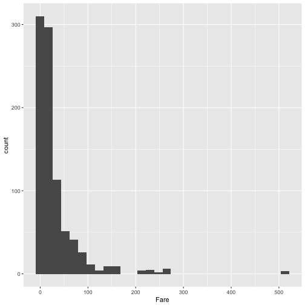

This code sets the dataframe as the `titanic` object in the user's working session, maps the values in the `Fare` column to the `x` aesthetic, and adds a histogram geom to generate a histogram. 

W> If R gets to the end of a line and there is not some indication that the call is not over (e.g., `%>%` for piping or `+` for `ggplot2` plots), R interprets that as a message to run the call without reading in further code. A common error when writing `ggplot2` code is to put the `+` to add a geom or element at the beginning of a line rather than the end of a previous line--- in this case, R will try to execute the call too soon. To avoid errors, be sure to end lines with `+`, don't start lines with it. 

There is some flexibility in writing the code to create this plot. For example, you could specify the aesthetic for the histogram in an `aes` statement when adding the geom (`geom_histogram`) rather than in the `ggplot` call:


```r
ggplot(data = titanic) + 
  geom_histogram(aes(x = Fare))
```

Similarly, you could specify the dataframe when adding the geom rather than in the `ggplot` call: 


```r
ggplot() + 
  geom_histogram(data = titanic, aes(x = Fare))
```

Finally, you can pipe the `titanic` dataframe into a `ggplot` call, since the `ggplot` function takes a dataframe as its first argument: 


```r
titanic %>%
  ggplot() + 
  geom_histogram(aes(x = Fare))
# or
titanic %>%
  ggplot(aes(x = Fare)) + 
  geom_histogram()
```

While all of these work, for simplicity we will use the syntax of specifying the data and aesthetics in the `ggplot` call for most examples in this subsection. Later, we'll show how this flexibility can be used to use data from differents dataframe for different geoms or change aesthetic mappings between geoms. 

A key thing to remember, however, is that `ggplot` is **not** flexible about whether you specify aesthetics within an `aes` call or not. We will discuss what happens if you do not later in the book, but it is very important that if you want to show values from a column of the data using aesthetics like color, size, shape, or position, you remember to make that specification within `aes`. Also, be sure that you specify the dataframe before or when you specify aesthetics (i.e., you can't specify aesthetics in the `ggplot` statement if you haven't specified the dataframe yet), and if you specify a dataframe within a geom, be sure to use `data = ` syntax rather than relying on parameter position, as `data` is not the first parameter expected for geom functions. 

I> When you run the code to create a plot in RStudio, the plot will be shown in the "Plots" tab in one of the RStudio panels. If you would like to save the plot, you can do so using the "Export" button in this tab. However, if you would like to use code in an R script to save a plot, you can do so (and it's more reproducible!). 
I> 
I> To save a plot using code in a script, take the following steps: (1) open a graphics device (e.g., using the function `pdf` or `png`); (2) run the code to draw the map; and (3) close the graphics device using the `dev.off` function. Note that the function you use to open a graphics device will depend on the type of device you want to open, but you close all devices with the same function (`dev.off`).


### Geoms

Geom functions add the graphical elements of the plot; if you do not include at least one geom, you'll get a blank plot space. Each geom function has its own arguments to adjust how the graph is created. For example, when adding a historgram geom, you can use the `bins` argument to change the number of bins used to create the histogram--- try:


```r
ggplot(titanic, aes(x = Fare)) + 
  geom_histogram(bins = 15)
```

As with any R functions, you can find out more about the arguments available for a geom function by reading the function's help file (e.g., `?geom_histogram`).

Geom functions differ in the aesthetic inputs they require. For example, the `geom_histogram` funciton only requires a single aesthetic (`x`). If you want to create a scatterplot, you'll need two aesthetics, `x` and `y`. In the `worldcup` dataset, the `Time` column gives the amount of time each player played in the World Cup 2010 and the `Passes` column gives the number of passes he made. To see the relationship between these two variables, you can create a ggplot object with the dataframe, mapping the x aesthetic to `Time` and the y aesthetic to `Passes`, and then adding a point geom:


```r
ggplot(worldcup, aes(x = Time, y = Passes)) + 
  geom_point()
```


All geom functions have both *required* and *accepted* aesthetics. For example, the `geom_point` function requires `x` and `y`, but the function will also accept `alpha` (transparency), `color`, `fill`, `group`, `size`, `shape`, and `stroke` aesthetics. If you try to create a geom without one its required aesthetics, you will get an error: 


```r
ggplot(worldcup, aes(x = Time)) + 
  geom_point()
```

```
Error: geom_point requires the following missing aesthetics: y
```


You can, however, add accepted aesthetics to the geom if you'd like; for example, to use color to show player position and size to show shots on goal for the World Cup data, you could call: 


```r
ggplot(worldcup, aes(x = Time, y = Passes,
                     color = Position, size = Shots)) + 
  geom_point()
```


The following table gives some of the geom functions you may find useful in `ggplot2`, along with the required aesthetics and some of the most useful some useful specific arguments for each geom function (there are other useful arguments that can be applied to many different geom functions, which will be covered later). The elements created by these geom functions are usually clear from the function names (e.g., `geom_point` plots points; `geom_segment` plots segments).  


|Function           |Common aesthetics        |Common arguments              |
|:------------------|:------------------------|:-----------------------------|
|`geom_point()`     |`x`, `y`                 |                              |
|`geom_line()`      |`x`, `y`                 |`arrow`, `na.rm`              |
|`geom_segment()`   |`x`, `y`, `xend`, `yend` |`arrow`, `na.rm`              |
|`geom_path()`      |`x`, `y`                 |`na.rm`                       |
|`geom_polygon()`   |`x`, `y`                 |                              |
|`geom_histogram()` |`x`                      |`bins`, `binwidth`            |
|`geom_abline()`    |`intercept`, `slope`     |                              |
|`geom_hline()`     |`yintercept`             |                              |
|`geom_vline()`     |`xintercept`             |                              |
|`geom_smooth()`    |`x`, `y`                 |`method`, `se`, `span`        |
|`geom_text()`      |`x`, `y`, `label`        |`parse`, `nudge_x`, `nudge_y` |


### Using multiple geoms

Several geoms can be added to the same `ggplot` object, which allows you to build up layers to create interesting graphs. For example, we previously made a scatterplot of time versus shots for World Cup 2010 data. You could make that plot more interesting by adding label points for noteworthy players with those players' team names and positions. First, you can create a subset of data with the information for noteworthy players and add a column with the text to include on the plot. Then you can add a text geom to the previous ggplot object:


```r
library(dplyr)
noteworthy_players <- worldcup %>% filter(Shots == max(Shots) | 
                                            Passes == max(Passes)) %>%
  mutate(point_label = paste(Team, Position, sep = ", "))

ggplot(worldcup, aes(x = Passes, y = Shots)) + 
  geom_point() + 
  geom_text(data = noteworthy_players, aes(label = point_label), 
            vjust = "inward", hjust = "inward") 
```

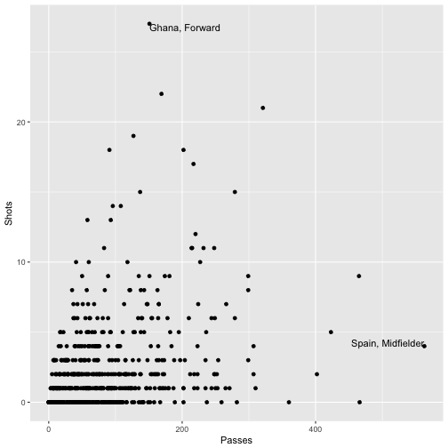

I> In this example, we're using data from different dataframes for different geoms. We'll discuss how that works more later in this section. 

As another example, there seemed to be some horizontal clustering in the scatterplot we made of player time versus passes made for the `worldcup` data. Soccer games last 90 minutes each, and different teams play a different number of games at the World Cup, based on how well they do. To check if horizontal clustering is at 90-minute intervals, you can plot a histogram of player time (`Time`), with reference lines every 90 minutes. First initialize the ggplot object, with the dataframe to use and appropriate mapping to aesthetics, then add geoms for a histogram as well as vertical reference lines:


```r
ggplot(worldcup, aes(x = Time)) + 
        geom_histogram(binwidth = 10) + 
        geom_vline(xintercept = 90 * 0:6,
                   color = "blue", alpha = 0.5)
```

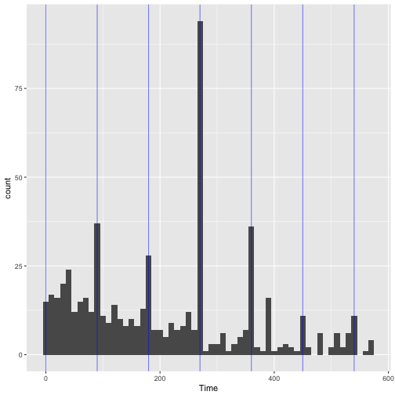

Based on this graph, player's times do cluster at 90-minute marks, especially at 270 minutes, which would be approximately after three games, the number played by all teams that fail to make it out of the group stage.

### Constant aesthetics

Instead of mapping an aesthetic to an element of your data, you can use a constant value for it. For example, you may want to make all the points green in the World Cup scatterplot. You can do that by specifying the color aesthetic **outside** of an `aes` call when adding the points geom. For example:


```r
ggplot(worldcup, aes(x = Time, y = Passes)) + 
  geom_point(color = "darkgreen")
```

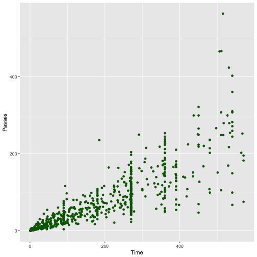

You can do this with any of the aesthetics for a geom, including color, fill, shape, and size. If you want to change the shape of points, in R, you use a number to specify the shape you want to use. Figure \@ref(fig:shapeexamples) shows the shapes that correspond to the numbers 1 to 25 in the `shape` aesthetic. This figure also provides an example of the difference between the *color* aesthetic (black for all these example points) and *fill* aesthetic (red for these examples). If a geom has both a border and an interior, the color aesthetic specifies the color of the border while the fill aesthetic specifies the color of the interior. You can see that, for point geoms, some shapes include a fill (21 for example), while some are either empty (1) or solid (19).


If you want to set color to be a constant value, you can do that in R using character strings for different colors. Figure \@ref(fig:colorexamples) gives an example of a few of the different blues available in R. To find images that show all these named choices for colors in R, google "R colors" and search by "Images" (for example, there is a pdf here: http://www.stat.columbia.edu/~tzheng/files/Rcolor.pdf).

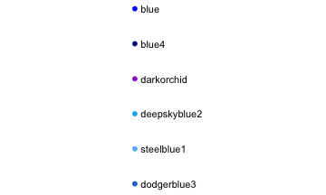

I> Later we will cover additioal ways of handling colors in R, including different color palettes you can use. However, these "named" colors just shown can be a fast way to customize constant colors in R plots.

### Other useful plot additions

There are also a number of elements besides geoms that you can add onto a `ggplot` object using `+`. A few that are used very frequently are: 


|Element        |Description             |
|:--------------|:-----------------------|
|`ggtitle`      |Plot title              |
|`xlab`, `ylab` |x- and y-axis labels    |
|`xlim`, `ylim` |Limits of x- and y-axis |

You can also use this syntax to customize plot scales and themes, which we will discuss later in this section. 

### Example plots

In this subsection, we'll show a few more examples of basic plots created with `ggplot2`. For the example plots in this subsection, we'll use a dataset in the `faraway` package called `nepali`. This gives data from a study of the health of a group of Nepalese children. You can load this data using:


```r
# install.packages("faraway") ## Uncomment if you do not have the faraway package installed
library(faraway)
data(nepali)
```

Each observation in this dataframe represents a measurement for a child, including some physiological measurements like height and weight, and some children were measured multiple times and so have multiple observations in this data. Before plotting this data, we cleaned it a bit. We used tidyverse functions to select a subset of the columns: child id, sex, weight, height, and age. We also used the `distinct` function from `dplyr` to limit the dataset to the first measurement for each child. 


```r
nepali <- nepali %>%
  select(id, sex, wt, ht, age) %>%
  mutate(id = factor(id),
         sex = factor(sex, levels = c(1, 2),
                      labels = c("Male", "Female"))) %>%
  distinct(id, .keep_all = TRUE)
```

After this cleaning, the data looks like this:


```r
head(nepali)
      id    sex   wt    ht age
1 120011   Male 12.8  91.2  41
2 120012 Female 14.9 103.9  57
3 120021 Female  7.7  70.1   8
4 120022 Female 12.1  86.4  35
5 120023   Male 14.2  99.4  49
6 120031   Male 13.9  96.4  46
```

We'll use this cleaned dataset to show how to use `ggplot2` to make histograms, scatterplots, and boxplots.

#### Histograms

Histograms show the distribution of a single variable. Therefore, `geom_histogram()` requires only one main aesthetic, `x`, which should be numeric. For example, to create a histogram of children's heights for the Nepali dataset (Figure \@ref(fig:nepalihist1)), create a ggplot object with the data `nepali` and with the height column (`ht`) mapped to the ggplot object's x aesthetic. Then add a histogram geom: 


```r
ggplot(nepali, aes(x = ht)) + 
  geom_histogram()
```


I> If you run the code with no arguments for `binwidth` or `bins` in `geom_histogram`, you will get a message saying "`stat_bin()` using `bins = 30`. Pick better value with `binwidth`.". This message is just saying that a default number of bins was used to create the histogram. You can use arguments to change the number of bins used, but often this default is fine. You may also get a message that observations with missing values were removed. 

You can add some elements to this plot to customize it a bit. For example (Figure \@ref(fig:nepalihist2)), you can add a figure title (`ggtitle`) and clearer labels for the x-axis (`xlab`). You can also change the range of values shown by the x-axis (`xlim`).


```r
ggplot(nepali, aes(x = ht)) + 
  geom_histogram(fill = "lightblue", color = "black") + 
  ggtitle("Height of children") + 
  xlab("Height (cm)") + xlim(c(0, 120))
```

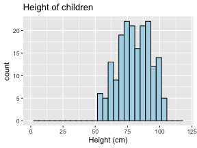

Note that these additional graphical elements are added on by adding function calls to `ggtitle`, `xlab`, and `xlim` to our ggplot object.

#### Scatterplots

A scatterplot shows the association between two variables. To create a scatterplot, add a point geom (`geom_point`) to a ggplot object. For example, to create a scatterplot of height versus age for the Nepali data (Figure \@ref(fig:nepaliscatter1)), you can run the following code: 


```r
ggplot(nepali, aes(x = ht, y = wt)) + 
  geom_point()
```

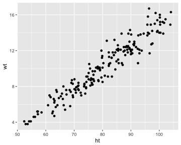

Again, you can use some of the options and additions to change the plot appearance. For example, to add a title, change the x- and y-axis labels, and change the color and size of the points on the scatterplot (Figure \@ref(fig:nepaliscatter2)), you can run:


```r
ggplot(nepali, aes(x = ht, y = wt)) + 
  geom_point(color = "blue", size = 0.5) + 
  ggtitle("Weight versus Height") + 
  xlab("Height (cm)") + ylab("Weight (kg)")
```

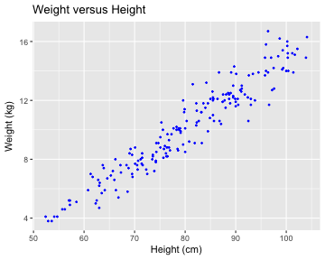

You can also try mapping a variable to the `color` aesthetic of the plot. For example, to use color to show the sex of each child in the scatterplot (Figure \@ref(fig:nepaliscatter3)), you can run add an additional mapping of this optional aesthetic to the `sex` column of the `nepali` dataframe with the following code:


```r
ggplot(nepali, aes(x = ht, y = wt, color = sex)) + 
  geom_point(size = 0.5) + 
  ggtitle("Weight versus Height") + 
  xlab("Height (cm)") + ylab("Weight (kg)")
```

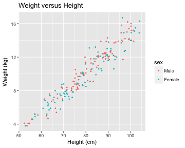

#### Boxplots 

Boxplots are one way to show the distribution of a continuous variable. You can add a boxplot geom with the `geom_boxplot` function. To plot a boxplot for a single, continuous variable, you can map that variable to `y` in the `aes` call and map `x` to the constant `1`. For example, to create a boxplot of the heights of children in the Nepali dataset (Figure \@ref(fig:nepaliboxplot1)), you can run:


```r
ggplot(nepali, aes(x = 1, y = ht)) + 
  geom_boxplot() + 
  xlab("")+ ylab("Height (cm)")
```

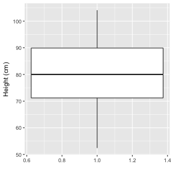

You can also create separate boxplots, one for each level of a factor (Figure \@ref(fig:nepaliboxplot2)). In this case, you'll need to map columns in the input dataframe to two aesthetics (`x` and `y`) when initializing the ggplot object The `y` variable is the variable for which the distribution will be shown, and the `x` variable should be a discrete (categorical or TRUE/FALSE) variable, which will be used to group the variable. 


```r
ggplot(nepali, aes(x = sex, y = ht)) + 
  geom_boxplot() + 
  xlab("Sex")+ ylab("Height (cm)") 
```

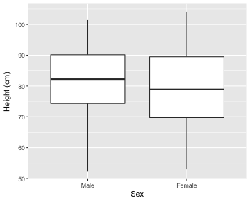

### Extensions of `ggplot2`

There are a number of packages that extend `ggplot2` and allow you to create a variety of interesting plots. For example, you can use the `ggpairs` function from the `GGally` package to plot all pairs of scatterplots for several variables (Figure \@ref(fig:ggallyexample)). 


```r
library(GGally)
ggpairs(nepali %>% select(sex, wt, ht, age))
```

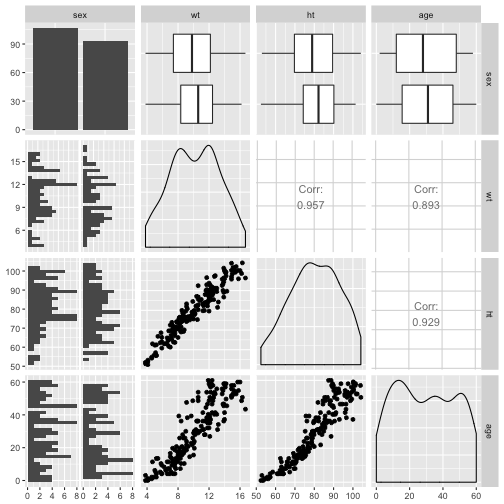

Notice how this output shows continuous and binary variables differently. For example, the center diagonal shows density plots for continuous variables, but a bar chart for the categorical variable. 

See https://www.ggplot2-exts.org to find more `ggplot2` extensions. Later in this course, we will give an overview of how to make your own extensions. 

## Customizing ggplot2 Plots

With slightly more complex code, you can create very interesting and customized plots using `ggplot2`. In this section, we'll provide an overview of some guidelines for creating good plots, based on the work of Edward Tufte and others, and show how you can customize ggplot objects to adhere to some of these guidelines. This overview will provide a framework for describing how to customize ggplot objects. We'll end the subsection by going over scales and color specifically. 

### Guidelines for good plots

A number of very thoughtful books and articles have been written about creating graphics that effectively communicate information. Some of the authors we highly recommend (and from whose work we've pulled and aggregated the guidelines for good graphics we'll go over) are: 

- Edward Tufte (his book *The Visual Display of Quantitative Information* is a classic)
- Howard Wainer
- Stephen Few
- Nathan Yau

In this section, we'll overview six guidelines for good graphics, based on the writings of these and other specialists in data display. The guidelines are: 

1. Aim for high data density. 
2. Use clear, meaningful labels.
3. Provide useful references.
4. Highlight interesting aspects of the data. 
5. Consider using small multiples.
6. Make order meaningful. 

I> While we overview some guidelines for effective plots here, this is mostly to provide a framework for showing how to customize ggplot objects. If you are interested in learning more about creating effective visualizations, you should read some of the thorough and thoughtful books written by the authors listed above. Howard Wainer's article ["How to display data badly"](http://www.jstor.org/stable/2683253?seq=1#page_scan_tab_contents) in *The American Statistician* is a particularly good place to start. 

For the examples in this subsection, we'll use `dplyr` for data cleaning and, for plotting, the packages `ggplot2`, `gridExtra`, and `ggthemes`, so you should load those packages if you plan to follow along with the examples.


```r
library(dplyr)
library(ggplot2)
library(gridExtra)
library(ggthemes)
```

You can load the data for the examples in this subsection with the following code: 


```r
# install.packages("faraway")  ## Uncomment and run if you do not have the `faraway` package installed
library(faraway)
data(nepali)
data(worldcup)

# install.packages("dlnm")     ## Uncomment and run if you do not have the `dlnm` package installed
library(dlnm)
data(chicagoNMMAPS)
chic <- chicagoNMMAPS
chic_july <- chic %>%
  filter(month == 7 & year == 1995)
```

#### High data density

> Guideline 1: **Aim for high data density.** 

You should try to increase, as much as possible, the **data to ink ratio** in your graphs. This is the ratio of "ink" providing information to all ink used in the figure. In other words, if an element of the plot is redundant, take it out. 

The two graphs in Figure \@ref(fig:datainkratio1) show the same information ("data"), but use very different amounts of ink. Each shows the number of players in each of four positions in the `worldcup` dataset. Notice how, in the plot on the right, a single dot for each category shows the same information that a whole filled bar is showing on the left. Further, the plot on the right has removed the gridded background, removing even more "ink" from the plot. 

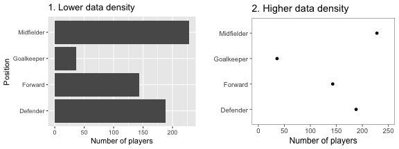

Figure \@ref(fig:datainkratio2) gives another example of two plots that show the same information but with very different data densities. This figure uses the `chicagoNMMAPS` data from the `dlnm` package, which includes daily mortality, weather, and air pollution data for Chicago, IL. Both plots show daily mortality counts during July 1995, when a very severe heat wave hit Chicago. Notice how many of the elements in the plot on the left, including the shading under the mortality time series and the colored background and grid lines, are unnecessary for interpreting the message from the data. 

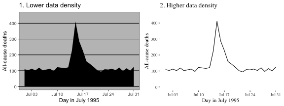

By increasing the data-to-ink ratio in a plot, you can help viewers see the message of the data more quickly. A cluttered plot is harder to interpret. Further, you leave room to add some of the other elements we'll talk about, including elements to highlight interesting data and useful references. Notice how the plots on the left in Figures \@ref(fig:datainkratio1) and \@ref(fig:datainkratio2) are already cluttered and leave little room for adding extra elements, while the plots on the right of those figures have much more room for additions. 

One quick way to increase data density in `ggplot2` is to change the *theme* for the plot, which will quickly change several elements of the plot's appearance. There are several themes that come with `ggplot2`, including a black-and-white theme and a minimal theme. To use a theme, you can add it to a ggplot object by using a theme function like `theme_bw`. For example, to use the "classic" theme for a scatterplot using the World Cup 2010 data, you can run:


```r
ggplot(worldcup, aes(x = Time, y = Shots)) + 
  geom_point() + 
  theme_classic()
```


A number of theme functions come directly with `ggplot2`. These include:

- `theme_linedraw`
- `theme_bw`
- `theme_minimal`
- `theme_void` 
- `theme_dark`
- `theme_classic`

You can find even more theme functions in packages that extend `ggplot2`. The `ggthemes` package, in particular, has some excellent additional themes. These include themes based on the graphing principles of Stephen Few (`theme_few`) and Edward Tufte (`theme_tufte`). Again, you can use one of these themes by adding it to a `ggplot` object:


```r
library(ggthemes)
ggplot(worldcup, aes(x = Time, y = Shots)) + 
  geom_point() + 
  theme_tufte()
```


The plots in Figure \@ref(fig:themeexamples) shows some examples of the effects of using different themes. All show the same information-- a plot of daily deaths in Chicago in July 1995. The top left graph shows the graph with the default theme. The other plots show the effects of adding different themes, including the black-and-white theme that comes with `ggplot2` (top right) and various themes from the `ggthemes` package. 

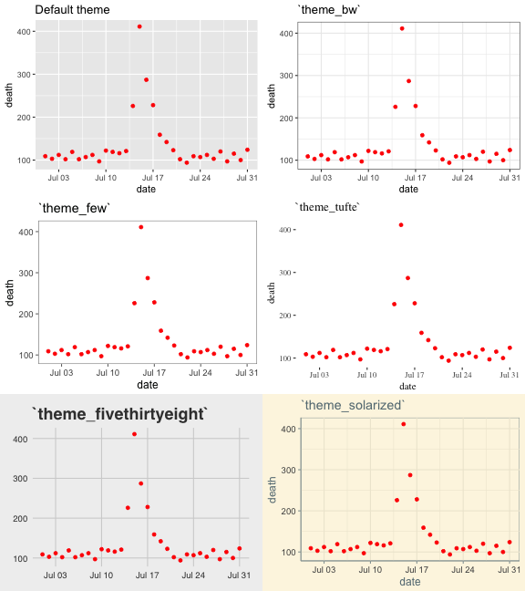

You can see that these themes can vary sustantially in their data-to-ink ratios. Between changing themes and choosing geoms carefully, you can reduce the data-to-ink ratio in a plot substantially. For example, here is the code for the two plots from \@ref(fig:datainkratio2):


```r
chicago_plot <- ggplot(chic_july, aes(x = date, y = death)) + 
  xlab("Day in July 1995") + 
  ylab("All-cause deaths") + 
  ylim(0, 450) 

chicago_plot + 
  geom_area(fill = "black") + 
  theme_excel() 

chicago_plot + 
  geom_line() + 
  theme_tufte() 
```

We will teach you how to make your own ggplot theme later in the course.

#### Meaningful labels

> Guideline 2: **Use clear, meaningful labels.** 

Graphs often default to use abbreviations for axis labels and other labeling. For example, the default is for `ggplot2` plots to use column names as labels for the x- and y-axes of a scatterplot. While this is convenient for exploratory plots, it's often not adequate for plots for presentations and papers. You'll want to use short and easy-to-type column names in your dataframe to make coding easier (e.g., "wt"), but you should use longer and more meaningful labeling in plots and tables that others need to interpret (e.g., "Weight (kg)").

Furthermore, text labels are often aligned in a way that makes them hard to read. For example, when plotting a categorical variable along the x-axis, it can be difficult to fit categorical labels that are long enough to be meaningful without rotating them and so making them harder to read. 

Figure \@ref(fig:labelsexample) gives an example of the same information (number of players in the World Cup data set by position) shown with labels that are harder to read and interpret (left) versus with clear, meaningful labels (right). Notice how the graph on the left is using abbreviations for the categorical variable ("DF" for "Defense"), abbreviations for axis labels ("Pos" for "Position" and "count" for "Number of players"), and has the player position labels in a vertical alignment. On the right graph, we have made the graph easier to quickly read and interpret by spelling out all labels and switching the x- and y-axes, so that there's room to fully spell out each position while still keeping the alignment horizontal, so the reader doesn't have to turn the page (or his head) to read the values.

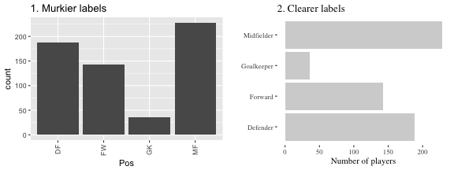

There are a few strategies you can use to make labels clearer when plotting with `ggplot2`: 

- You can use the `xlab` and `ylab` functions to customize the axis labels on a ggplot object, rather than using the column names in the original data. You can use the `name` parameter of the `scale` family of functions (e.g., `scale_x_continuous`) to relabel x- and y-axes--- these functions also give you the power to make other changes to the x- and y-axes (e.g., changing break points for the axis ticks). However, if you only need to change axis labels, `xlab` and `ylab` are often quicker.
- Use tidyverse functions to clean your data before plotting it. This is particularly useful if you need to change the labels of categorical data. You can pipe directly from tidyverse data cleaning into a ggplot call (see the example code below).
- Include units of measurement in axis titles when relevant. If units are dollars or percent, check out the `scales` package, which allows you to add labels directly to axis elements by including arguments like `labels = percent` in `scale` elements. See the helpfile for `scale_x_continuous` for some examples.
- If the x-variable requires longer labels, as is often the case with categorical data (for example, player positions Figure \@ref(fig:labelsexample)), consider flipping the coordinates, rather than abbreviating or rotating the labels. You can use `coord_flip` to do this.

For example, here is the code used to generate the plots similar to those in Figure \@ref(fig:labelsexample) (we first create a version of the `worldcup` data with worse column names and factor labels to show how to improve these when creating a ggplot object):


```r
library(forcats)
# Create a messier example version of the data
wc_example_data <- worldcup %>%
  dplyr::rename(Pos = Position) %>%
  mutate(Pos = fct_recode(Pos,
                          "DC" = "Defender",
                          "FW" = "Forward", 
                          "GK" = "Goalkeeper",
                          "MF" = "Midfielder"))

wc_example_data %>%
  ggplot(aes(x = Pos)) + 
  geom_bar() 

wc_example_data %>%
  mutate(Pos = fct_recode(Pos,
                          "Defender" = "DC",
                          "Forward" = "FW", 
                          "Goalkeeper" = "GK",
                          "Midfielder" = "MF")) %>%
  ggplot(aes(x = Pos)) +
  geom_bar(fill = "lightgray") + 
  xlab("") + 
  ylab("Number of players") + 
  coord_flip() + 
  theme_tufte()
```

I> In this code example, we've used the `fct_recode` function from the `forcats` package to both create the messier example data and also to clean up category names for the second plot. The `forcats` package has a number of useful functions for working with factors in R. 

W> In R, once you load a library, you do not specify that library when calling it's function (e.g., once you've loaded `dplyr`, you can call `rename`). Usually, R does a good job of finding the right function under this system. However, if you have several packages loaded that have functions with the same name, you can run into problems. As you add on packages for plotting and mapping, you may find that some of your data cleaning code suddenly doesn't work. If this happens, it may be that you've added code that loads the `plyr` package, which has several functions with the same name as `dplyr` functions. If this happens to you, try using the package::function notation to clarify that you want to use the `dplyr` function. You can see an example of this in the above code, where we've specified `dplyr::rename` when creating the messier example dataset. 

#### References

> Guideline 3: **Provide useful references.**

Data is easier to interpret when you add references. For example, if you show what it typical, it helps viewers interpret how unusual outliers are. 

Figure \@ref(fig:referenceexample1) shows daily mortality during July 1995 in Chicago, IL. The graph on the right has added shading showing the range of daily death counts in July in Chicago for neighboring years (1990--1994 and 1996--2000). This added reference helps clarify for viewers how unusual the number of deaths during the July 1995 heat wave was.

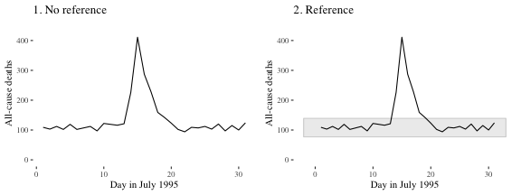

Another useful way to add references is to add a linear or smooth fit to the data, to show trends in the data. Figure \@ref(fig:referenceexample2) shows the relationship between passes and shots for Forwards in the `worldcup` dataset. The plot on the right has an added smooth function to help show the relationship between these two variables.

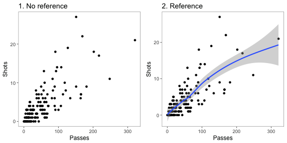

For scatterplots created with `ggplot2`, you can use the function `geom_smooth` to add a smooth or linear reference line. Here is the code that produces Figure \@ref(fig:referenceexample3):


```r
ggplot(filter(worldcup, Position == "Forward"), aes(x = Passes, y = Shots)) + 
        geom_point(size = 1.5) + 
        theme_few()  + 
        geom_smooth()
```

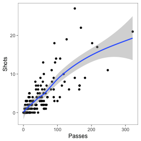

The most useful `geom_smooth` parameters to know are: 

- `method`: The default is to add a loess curve if the data includes less than 1000 points and a generalized additive model for 1000 points or more. However, you can change to show the fitted line from a linear model using `method = "lm"` or from a generalized linear model using `method = "glm"`.
- `span`: How wiggly or smooth the smooth line should be (smaller value: more flexible; larger value: more smooth)
- `se`: TRUE or FALSE, indicating whether to include shading for 95% confidence intervals.
- `level`: Confidence level for confidence interval (e.g., `0.90` for 90% confidence intervals)

Lines and polygons can also be useful for adding references, as in Figure \@ref(fig:referenceexample1). Useful geoms for such shapes include: 

- `geom_hline`, `geom_vline`: Add a horizontal or vertical line
- `geom_abline`: Add a line with an intercept and slope
- `geom_polygon`: Add a filled polygon
- `geom_path`: Add an unfilled polygon

You want these references to support the main data shown in the plot, but not overwhelm it. When adding these references: 

- Add reference elements first, so they will be plotted under the data, instead of on top of it. 
- Use `alpha` to add transparency to these elements. 
- Use colors that are unobtrusive (e.g., grays).
- For lines, consider using non-solid line types (e.g., `linetype = 3`).

#### Highlighting

> Guideline 4: **Highlight interesting aspects.** 

Consider adding elements to highlight noteworthy elements of the data. For example, in the graph on the right of Figure \@ref(fig:highlightexample1), the days of the heat wave (based on temperature measurements) have been highlighted over the mortality time series by using a thick red line. 

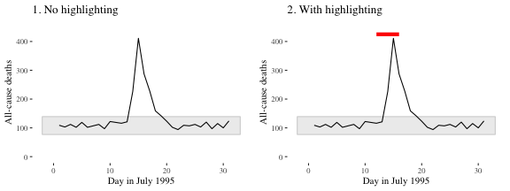

In Figure \@ref(fig:highlightpoints), the names of the players with the most shots and passes have been added to highlight these unusual points. 

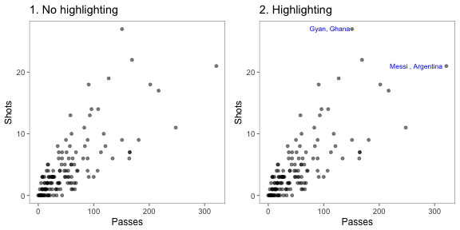

You can add highlighting elements using geoms like `geom_text` and `geom_line`. Often, you will need to use a different dataframe for this highlighting geom. For example, you may want to create a subset of the original dataframe with notable points to which you want to add text labels. You can specify a new dataframe for a geom using the `data` parameter in the function that adds that geom. For example, to create the right plot in Figure \@ref(fig:highlightpoints), we first created a subset dataframe with only the players with the most shots and passes (when creating this subset, we also included some code to create the text label we want to use in the plot): 


```r
noteworthy_players <- worldcup %>%
  filter(Shots == max(Shots) | Passes == max(Passes)) %>%
  mutate(point_label = paste0(Team, Position, sep = ", "))
noteworthy_players
   Team   Position Time Shots Passes Tackles Saves       point_label
1 Ghana    Forward  501    27    151       1     0    GhanaForward, 
2 Spain Midfielder  515     4    563       6     0 SpainMidfielder, 
```

Now you can create a ggplot object based on the `worldcup` data, add a point geom to create the scatterplot with all data, and then add the text geom with the data from noteworthy players to add labels for those players:


```r
ggplot(worldcup, aes(x = Passes, y = Shots)) + 
  geom_point(alpha = 0.5) + 
  geom_text(data = noteworthy_players, aes(label = point_label),
            vjust = "inward", hjust = "inward", color = "blue") +
  theme_few()
```

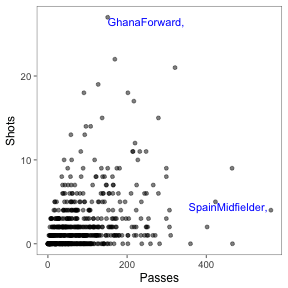

#### Small multiples

> Guideline 5: **When possible, use small multiples.**

*Small multiples* are graphs that use many small plots to show different subsets of the data. Typically in small multiples, all plots use the same ranges for the x- and y-axes. This makes it easier to compare across plots, and it also allows you to save room by limiting axis annotation. In `ggplot2`, you can use faceting to creates small multiples. 

For example, the `worldcup` dataset used in earlier examples includes each player's position. If you want to explore a relationship (e.g., time played vs. shots on goal), you could try using color: 


```r
data(worldcup)
worldcup %>%
  ggplot(aes(x = Time, y = Shots, color = Position)) + 
  geom_point() 
```

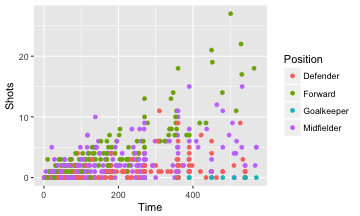

However, often it's clearer to see relationships if you use faceting instead to create a small separate plot for each position. You can do this with either the `facet_grid` function or the `facet_wrap` function:


```r
worldcup %>%
  ggplot(aes(x = Time, y = Shots)) + 
  geom_point() +
  facet_grid(. ~ Position) 
```

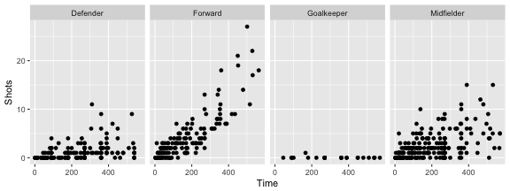

The `facet_grid` and `facet_wrap` functions differ in whether the small graphs are placed with one faceting variable per dimension (`facet_grid`) or whether the plots are wrapped across several rows (`facet_wrap`).

The `facet_grid` function can facet by one or two variables. One will be shown by rows, and one by columns:


```r
## Generic code
facet_grid([factor for rows] ~ [factor for columns])
```

The `facet_wrap()` function can facet by one or more variables, and it "wraps" the small graphs, so they don't all have to be in one row or column:


```r
## Generic code
facet_wrap(~ [formula with factor(s) for faceting],
           ncol = [number of columns])
```

For example, if you wanted to show relationships for the final two teams in World Cup 2010 (Spain and Holland) and facet by both position and team, you could run:


```r
worldcup %>%
  filter(Team %in% c("Spain", "Netherlands")) %>%
  ggplot(aes(x = Time, y = Shots)) + 
  geom_point() +
  facet_grid(Team ~ Position) 
```

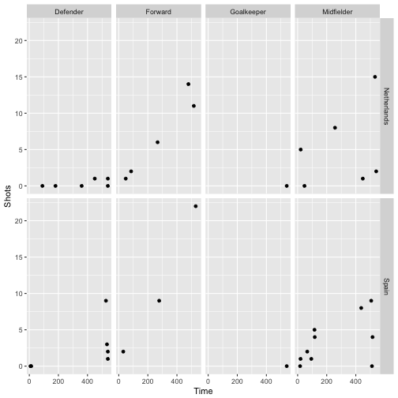

With `facet_wrap`, you can specify how many columns you want to use, which makes it useful if you want to facet across a variable with a lot of variables. For example, there are 32 teams in the World Cup. You can create a faceted graph of time played versus shots taken by team by running: 


```r
worldcup %>%
  ggplot(aes(x = Time, y = Shots)) + 
  geom_point(alpha = 0.25) +
  facet_wrap(~ Team, ncol = 6) 
```

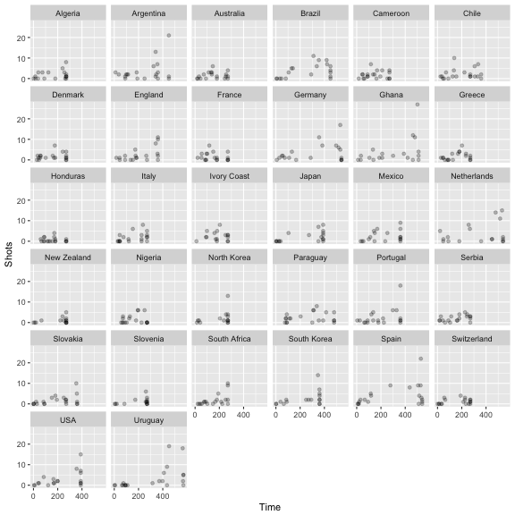

Often, when you facet a plot, you'll want to re-name your factors levels or re-order them. For this, you'll need to use the `factor()` function on the original vector, or use some of the tools from the `forcats` package. For example, to rename the `sex` factor levels from "1" and "2" to "Male" and "Female", you can run:


```r
nepali <- nepali %>%
  mutate(sex = factor(sex, levels = c(1, 2), 
                      labels = c("Male", "Female")))
```

Notice that the labels for the two graphs have now changed:


```r
ggplot(nepali, aes(ht, wt)) + 
        geom_point() + 
        facet_grid(. ~ sex)
```


To re-order the factor and show the plot for "Female" first, you can use `factor` to change the order of the levels:


```r
nepali <- nepali %>%
  mutate(sex = factor(sex, levels = c("Female", "Male")))
```

Now notice that the order of the plots has changed:


```r
ggplot(nepali, aes(ht, wt)) + 
        geom_point() + 
        facet_grid(. ~ sex)
```


#### Order

> Guideline 6: **Make order meaningful.** 

Adding order to plots can help highlight interesting findings. Often, factor or categorical variables are ordered by something that is not interesting, like alphabetical order (Figure \@ref(fig:plotorder), left plot). 

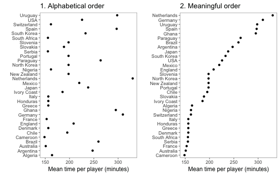

You can make the ranking of data clearer from a graph by using order to show rank (Figure \@ref(fig:plotorder), right). You can re-order factor variables in a graph by resetting the factor using the `factor` function and changing the order that levels are included in the `levels` parameter. For example, here is the code for the two plots in Figure \@ref(fig:plotorder):


```r
## Left plot
worldcup %>%
  group_by(Team) %>%
  summarize(mean_time = mean(Time)) %>%
  ggplot(aes(x = mean_time, y = Team)) + 
  geom_point() + 
  theme_few() + 
  xlab("Mean time per player (minutes)") + ylab("") 

## Right plot
worldcup %>%
  group_by(Team) %>%
  summarize(mean_time = mean(Time)) %>%
  arrange(mean_time) %>%                         # re-order and re-set
  mutate(Team = factor(Team, levels = Team)) %>% # factor levels before plotting
  ggplot(aes(x = mean_time, y = Team)) + 
  geom_point() + 
  theme_few() + 
  xlab("Mean time per player (minutes)") + ylab("") 
```

As another example, you can customize the faceted plot created in the previous subsection to order these plots from least to most average shots for a position using the following code. This example also has some added code to highlight the top players in each position in terms of shots on goal, as well as customizing colors and the theme. 


```r
worldcup %>%
  select(Position, Time, Shots) %>%
  group_by(Position) %>%
  mutate(ave_shots = mean(Shots),
         most_shots = Shots == max(Shots)) %>%
  ungroup() %>%
  arrange(ave_shots) %>%
  mutate(Position = factor(Position, levels = unique(Position))) %>%
  ggplot(aes(x = Time, y = Shots, color = most_shots)) + 
  geom_point(alpha = 0.5) + 
  scale_color_manual(values = c("TRUE" = "red", "FALSE" = "black"),
                     guide = FALSE) + 
  facet_grid(. ~ Position) + 
  theme_few()
```

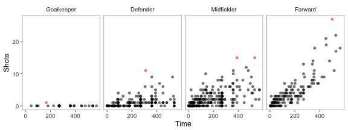

As another example of ordering, suppose you wanted to show how playing times were distributed among players from each team for the World Cup data, with teams ordered by the average time for all their players. You can link up `dplyr` tools with `ggplot` to do this by using `group_by` to group the data by team, `mutate` to average player time within each team, `arrange` to order teams by that average player time, and `mutate` to reset the factor levels of the `Team` variable, using this new order, before plotting with `ggplot`:


```r
worldcup %>%
  dplyr::select(Team, Time) %>%
  dplyr::group_by(Team) %>%
  dplyr::mutate(ave_time = mean(Time),
                min_time = min(Time),
                max_time = max(Time)) %>%
  dplyr::arrange(ave_time) %>%
  dplyr::ungroup() %>%
  dplyr::mutate(Team = factor(Team, levels = unique(Team))) %>%
  ggplot(aes(x = Time, y = Team)) + 
  geom_segment(aes(x = min_time, xend = max_time, yend = Team),
               alpha = 0.5, color = "gray") + 
  geom_point(alpha = 0.5) + 
  geom_point(aes(x = ave_time), size = 2, color = "red", alpha = 0.5) + 
  theme_minimal() + 
  ylab("")
```


### Scales and color

We'll finish this section by going into a bit more details about how to customize the scales and colors for ggplot objects, including more on scales and themes. 

There are a number of different scale functions that allow you to customize the scales of ggplot objects. Because color is often mapped to an aesthetic, you can adjust colors in many ggplot objects using scales, as well (the exception is if you are using a constant color for an element). The functions from the `scale` family follow the following convention: 


```r
## Generic code
scale_[aesthetic]_[vector type]
```

For example, to adjust the x-axis scale for a continuous variable, you'd use `scale_x_continuous`. You can use a `scale` function to change a variety of elements of an axis, including the axis label (which you could also change with `xlab` or `ylab`) as well as position and labeling of breaks. For aesthetics other than `x` and `y`, the "axis" will typically be the plot legend for that aesthetic, so these `scale` functions can be used to set the name, breaks, labels, and colors of plot legends. 

For example, here is a plot of Time versus Passes for the World Cup 2010 data, with the number of shots taken shown by size and position shown by color, using the default scales for each aesthetic:


```r
ggplot(worldcup, aes(x = Time, y = Passes, color = Position, size = Shots)) + 
  geom_point(alpha = 0.5)
```

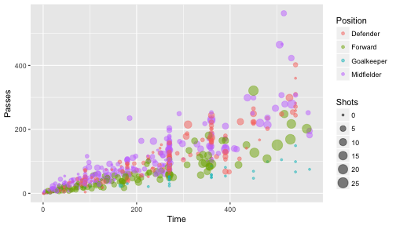

You may want to customize the x-axis for this plot, changing the scale to show breaks every 90 minutes (the approximate length of each game). Further, you may want to give that axis a different axis title. Because you want to change the `x` axis and the aesthetic mapping is continuous (this aesthetic is mapped to the "Time" column of the data, which is numeric), you can make this change using `scale_x_continuous`:


```r
ggplot(worldcup, aes(x = Time, y = Passes, color = Position, size = Shots)) + 
  geom_point(alpha = 0.5) + 
  scale_x_continuous(name = "Time played (minutes)", 
                     breaks = 90 * c(2, 4, 6),
                     minor_breaks = 90 * c(1, 3, 5))
```

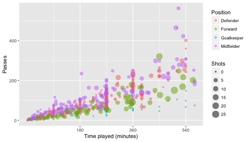

You may also want to change the legend for "Shots" to have the title "Shots on goal" and to only show the sizes for 0, 10, or 20 shots. The data on shots is mapped to the size aesthetic, and the data is continuous, so you can change that legend using `scale_size_continuous`: 


```r
ggplot(worldcup, aes(x = Time, y = Passes, color = Position, size = Shots)) + 
  geom_point(alpha = 0.5) + 
  scale_x_continuous(name = "Time played (minutes)", 
                     breaks = 90 * c(2, 4, 6),
                     minor_breaks = 90 * c(1, 3, 5)) + 
  scale_size_continuous(name = "Shots on goal",
                        breaks = c(0, 10, 20))
```


Legends for color and fill can be manipulated in a somewhat similar way, which we explain in more detail later in this subsection. 

The `scale` functions allow a number of different parameters. Some you may find helpful are: 


|Parameter    |Description                     |
|:------------|:-------------------------------|
|name         |Label or legend name            |
|breaks       |Vector of break points          |
|minor_breaks |Vector of minor break points    |
|labels       |Labels to use for each break    |
|limits       |Limits to the range of the axis |

For are mapping data that is in a date format, you can use date-specific `scale` functions like `scale_x_date` and `scale_x_datetime`. For example, here's a plot of deaths in Chicago in July 1995 using default values for the x-axis: 


```r
ggplot(chic_july, aes(x = date, y = death)) + 
  geom_line() 
```

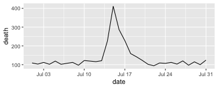

These date-specific scale functions allow you to change the formatting of the date (with the `date_labels` parameter), as well as do some of the tasks you would do with a non-date scale function, like change the name of the axis:


```r
ggplot(chic_july, aes(x = date, y = death)) + 
  geom_line() + 
  scale_x_date(name = "Date in July 1995",
               date_labels = "%m-%d")
```

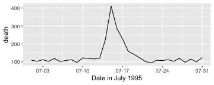

You can also use the `scale` functions to transform an axis. For example, to show the Chicago plot with "deaths" on a log scale, you can run:


```r
ggplot(chic_july, aes(x = date, y = death)) + 
  geom_line() +
  scale_y_log10(breaks = c(1:4 * 100))
```

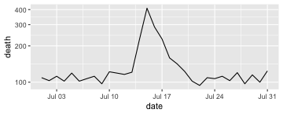

For color and fill aesthetics, the conventions for naming the `scale` functions vary a bit, and there are more options. For example, to adjust the color scale when you're mapping a discrete variable (i.e., categorical, like gender or animal breed) to color, one option is to use `scale_color_hue`, but you can also use `scale_color_manual` and a few other scale functions. To adjust the color scale for a continuous variable, like age, one option is the `scale_color_gradient` function. 

There are custom scale functions you can use if you want to pull specific color palettes. One option is to use one of the "Brewer" color palettes, which you can do with functions like `scale_color_brewer` and `scale_color_distiller`. 

The Brewer palettes fall into three categories: sequential, divergent, and qualitative. You should use sequential or divergent for continuous data and qualitative for categorical data. You can explore the Brewer palettes at http://colorbrewer2.org/. You can also use `display.brewer.pal` to show the palettes within R: 


```r
library(RColorBrewer)
display.brewer.pal(name = "Set1", n = 8)
display.brewer.pal(name = "PRGn", n = 8)
display.brewer.pal(name = "PuBuGn", n = 8)
```

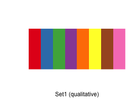

Once you have picked a Brewer palette you would like to use, you can specify it with the `palette` argument within brewer `scale` function. The following plot shows examples of the same plot with three different Brewer palettes (a dark theme is also added with the pastel palette to show those points more clearly):


```r
wc_example <- ggplot(worldcup, aes(x = Time, y = Passes,
                     color = Position, size = Shots)) + 
  geom_point(alpha = 0.5) 

a <- wc_example + 
  scale_color_brewer(palette = "Set1") + 
  ggtitle("Set1")
b <- wc_example + 
  scale_color_brewer(palette = "Dark2") + 
  ggtitle("Dark2")
c <- wc_example + 
  scale_color_brewer(palette = "Pastel2") + 
  ggtitle("Pastel2") + 
  theme_dark()
d <- wc_example + 
  scale_color_brewer(palette = "Accent") + 
  ggtitle("Accent")
grid.arrange(a, b, c, d, ncol = 2)
```

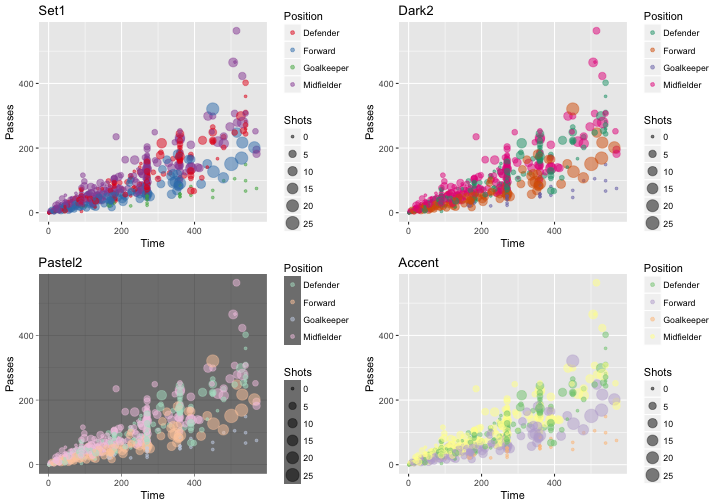

You can set discrete colors manually using `scale_color_manual` and `scale_fill_manual`:


```r
ggplot(worldcup, aes(x = Time, y = Passes,
                     color = Position, size = Shots)) + 
  geom_point(alpha = 0.5) + 
  scale_color_manual(values = c("blue", "red", 
                                "darkgreen", "darkgray"))
```

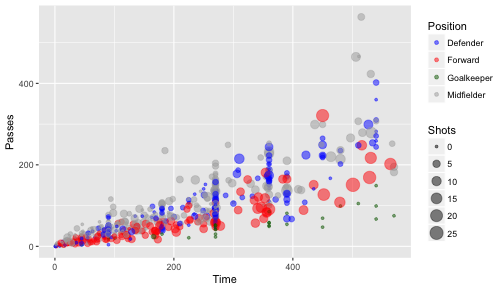

W> It is very easy to confuse the color and fill aesthetics. If you try to use a scale function for color or fill and it doesn't seem to be doing anything, make sure you've picked the correct aesthetic of these two. The fill aesthetic specifies the color to use for the interior of an element. The color aesthetic specifies the color to use for the border of an element. Many elements, including lines and some shapes of points, will only take a color aesthetic. In other cases, like polygon geoms, you may find you often accidently specify a color aesthetic when you meant to specify a fill aesthetic. 

##### Viridis color map

Some packages provide additional color palettes. For example, there is a package called `viridis` with four good color palettes that are gaining population in visualization. From the [package's GitHub repository](https://github.com/sjmgarnier/viridis): 

> "These four color maps are designed in such a way that they will analytically be perfectly perceptually-uniform, both in regular form and also when converted to black-and-white. They are also designed to be perceived by readers with the most common form of color blindness."

This package includes new color scale functions, `scale_color_viridis` and `scale_fill_viridis`, which can be added to a ggplot object to use one of the four palettes. For example, to use the viridis color palette for a plot of time versus shots for the World Cup data, you can run: 


```r
library(viridis)
Loading required package: viridisLite
worldcup %>%
  ggplot(aes(x = Time, y = Shots, color = Passes)) + 
  geom_point(size = 0.9) + 
  facet_wrap(~ Position) + 
  scale_color_viridis()
```

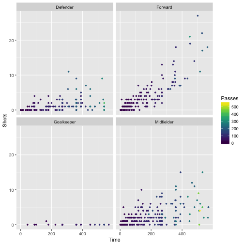

You can use these colors for discrete values, as well, by setting the `discrete` parameter in the `scale_color_viridis` function to `TRUE`:


```r
worldcup %>%
  ggplot(aes(x = Time, y = Shots, color = Position)) + 
  geom_point(alpha = 0.7) + 
  scale_color_viridis(discrete = TRUE)
```

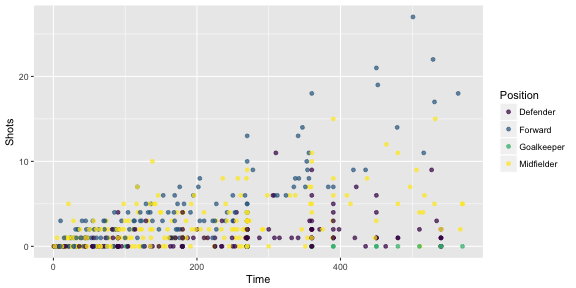

The `option` argument allows you to pick between four palettes: Magma, Inferno, Plasma, and Viridis. Here are examples of each of those palettes applies to the World Cup example plot:


```r
library(gridExtra)

worldcup_ex <- worldcup %>%
  ggplot(aes(x = Time, y = Shots, color = Passes)) + 
  geom_point(size = 0.9) 

magma_plot <- worldcup_ex + 
  scale_color_viridis(option = "A") + 
  ggtitle("magma")
inferno_plot <- worldcup_ex + 
  scale_color_viridis(option = "B") + 
  ggtitle("inferno")
plasma_plot <- worldcup_ex + 
  scale_color_viridis(option = "C") + 
  ggtitle("plasma")
viridis_plot <- worldcup_ex + 
  scale_color_viridis(option = "D") + 
  ggtitle("viridis")

grid.arrange(magma_plot, inferno_plot, plasma_plot, viridis_plot, ncol = 2)
```

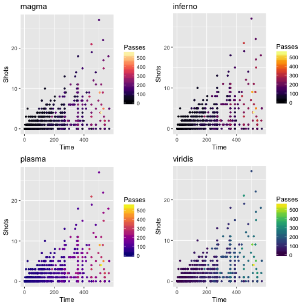

### To find out more

There are some excellent resources available for finding out more about creating plots using the `gpplot2` package.

If you want to get more practical tips on how to plot with `ggplot2`, check out:

- *R Graphics Cookbook* by Winston Chang: This "cookbook" style book is a useful reference to have to flip through when you have a specific task you want to figure out how to do with ggplot2 (e.g., flip the coordinate axes, remove the figure legend). 
- http://www.cookbook-r.com/Graphs/: Also created by Winston Chang, this website goes with the *R Graphics Cookbook* and is an excellent reference for quickly finding out how to do something specific in ggplot2. 
- Google images: If you want to find example code for how to create a specific type of plot in R, try googling the name of the plot and "R", and then search through the "Images" results. For example, if you wanted to plot a wind rose in R, google "wind rose r" and click on the "Images" tab. Often, the images that are returned will link back to a page that includes the example code to create the image (a blog post, for example).

For more technical details about plotting in R, check out:

- *ggplot2: Elegant Graphics for Data Analysis* by Hadley Wickham: Now in its second edition, this book was written by the creator of grid graphics and goes deeply into the details of why ggplot2 was created and how to use it.
- *R Graphics* by Paul Murrell: Also in its second edition, this book explains grid graphics, the graphics system that ggplot2 is built on. This course covers the basics of grid graphics in a later section to give you the tools to create your own ggplot2 extensions. However, if you want the full details on grid graphics, this book is where to find them. 

## Mapping 

Often, data will include a spatial component, and you will want to map the data either for exploratory data analysis or to present interesting aspects of the data to others. R has a range of capabilities for mapping data. The simplest techniques involve using data that includes latitude and longitude values and using these location values as the `x` and `y` aesthetics in a regular plot. R also has the ability to work with more complex spatial data objects and import shapefiles through extensions like the `sp` package. 

In this section, we will cover the basics of mapping in R and touch on some of the more advanced possibilities. We will also present some useful packages for making quick but attractive maps in R. R also now has the capability to make interactive maps using the `plotly` and `leaflet` packages; in the end of this section, we'll present these packages and explain a bit more about `htmlWidgets` in general. 

### Basics of mapping

#### Creating maps with ggplot2

The most basic way to map data in R is to create a regular ggplot object and map longitude to the x aesthetic and latitude to the y aesthetic. You can use this technique to create maps of geographic areas, like states or countries, and to map locations as points, lines, and other shapes. The `ggplot2` package includes a few datasets with geographic information that can be accessed with the `map_data` function. We'll pull one of these to use as an example of this basic method of mapping. 

You can use the `map_data` function from the `ggplot2` package to pull data for maps at different levels ("usa", "state", "world", "county"). The data you pull give locations of the borders of geographic polygons like states and counties. For example, you can get the polygon location data for U.S. states by running the following code:


```r
library(ggplot2)
us_map <- map_data("state")
head(us_map, 3)
       long      lat group order  region subregion
1 -87.46201 30.38968     1     1 alabama      <NA>
2 -87.48493 30.37249     1     2 alabama      <NA>
3 -87.52503 30.37249     1     3 alabama      <NA>
```

Notice that the dataframe includes columns with location (`long` and `lat`). It also includes a column describing the order in which these points should be connected to form a polygon (`order`), the name of the state (`region`), and a `group` column that separates the points into unique polygons that should be plotted (more on this in a minute).

If you plot the points for a couple of state, mapping longitude to the x aesthetic and latitude to the y aesthetic, you can see that the points show the outline of the state: 


```r
us_map %>% 
  filter(region %in% c("north carolina", "south carolina")) %>%
  ggplot(aes(x = long, y = lat)) +
  geom_point()
```

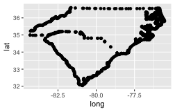

If you try to join these points by just using a path geom rather than a points geom, however, you'll have a problem:


```r
us_map %>% 
  filter(region %in% c("north carolina", "south carolina")) %>%
  ggplot(aes(x = long, y = lat)) +
  geom_path()
```

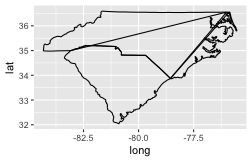

If you create a path for all the points in the map, without separating polygons for different geographic groupings (like states or islands), the path will be drawn without picking up the pen between one state's polygon and the next state's polygon, resulting in unwanted connecting lines. 

Mapping a group aesthetic in the ggplot object fixes this problem. This will plot a separate path or polygon for each separate polygon. In the U.S. states data, each polygon's group is specified by the `group` column. No two states share a group, and some states have more than one group (if, for example, they have islands). Here is the code for mapping the `group` column to the group aesthetic to create the map:


```r
us_map %>% 
  filter(region %in% c("north carolina", "south carolina")) %>%
  ggplot(aes(x = long, y = lat, group = group)) +
  geom_path()
```


I> You may have noticed that we used a path rather than line geom to plot the state borders in the previous maps. This is because the line geom connects points by their order on the x-axis. While you often want that for statistical graphs, for maps in `ggplot2` the x-axis is longitude, and we want to connect the points in a way that outlines the geographic areas. The `geom_path` function connects the points in the order they appear in the dataframe, which typically gives us the desired plot for mapping geographic areas. You likely will also sometimes want to use a polygon geom for mapping geographic areas, as shown in some of the following examples. 

If you would like to set the color inside each geographic area, you should use a polygon geom rather than a path geom. You can then use the fill aesthetic to set the color inside the polygon and the color aesthetic to set the color of the border. For example, to set the interior of the states to blue and the borders to black, you can run:


```r
us_map %>% 
  filter(region %in% c("north carolina", "south carolina")) %>%
  ggplot(aes(x = long, y = lat, group = group)) +
  geom_polygon(fill = "lightblue", color = "black")
```

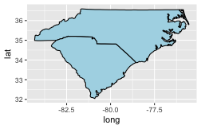

To get rid of the x- and y-axes and the background grid, you can add the "void" theme to the ggplot output:


```r
us_map %>% 
  filter(region %in% c("north carolina", "south carolina")) %>%
  ggplot(aes(x = long, y = lat, group = group)) +
  geom_polygon(fill = "lightblue", color = "black") + 
  theme_void()
```


To extend this code to map the full continental U.S., just remove the line of the pipe chain that filtered the state mapping data to North and South Carolina:


```r
us_map %>% 
  ggplot(aes(x = long, y = lat, group = group)) +
  geom_polygon(fill = "lightblue", color = "black") + 
  theme_void()
```

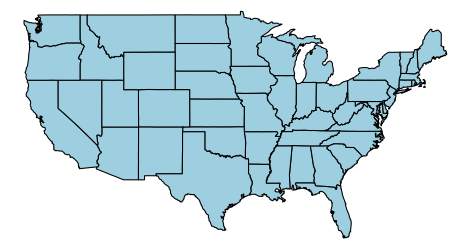

In the previous few graphs, we used a constant aesthetic for the fill color. However, you can map a variable to the fill to create a choropleth map with a ggplot object. For example, the `votes.repub` dataset in the `maps` package gives some voting data by state and year: 


```r
data(votes.repub)
head(votes.repub)
            1856  1860  1864  1868  1872  1876  1880  1884  1888  1892
Alabama       NA    NA    NA 51.44 53.19 40.02 36.98 38.44 32.28  3.95
Alaska        NA    NA    NA    NA    NA    NA    NA    NA    NA    NA
Arizona       NA    NA    NA    NA    NA    NA    NA    NA    NA    NA
Arkansas      NA    NA    NA 53.73 52.17 39.88 39.55 40.50 38.07 32.01
California 18.77 32.96 58.63 50.24 56.38 50.88 48.92 52.08 49.95 43.76
Colorado      NA    NA    NA    NA    NA    NA 51.28 54.39 55.31 41.13
            1896  1900  1904  1908  1912  1916  1920  1924  1928  1932
Alabama    28.13 34.67 20.65 24.38  8.26 21.97 30.98 27.01 48.49 14.15
Alaska        NA    NA    NA    NA    NA    NA    NA    NA    NA    NA
Arizona       NA    NA    NA    NA 12.74 35.37 55.41 41.26 57.57 30.53
Arkansas   25.11 35.04 40.25 37.31 19.73 28.01 38.73 29.28 39.33 12.91
California 49.13 54.48 61.90 55.46  0.58 46.26 66.24 57.21 64.70 37.40
Colorado   13.84 42.04 55.27 46.88 21.88 34.75 59.32 57.02 64.72 41.43
            1936  1940  1944  1948  1952  1956  1960 1964 1968 1972  1976
Alabama    12.82 14.34 18.20 19.04 35.02 39.39 41.75 69.5 14.0 72.4 43.48
Alaska        NA    NA    NA    NA    NA    NA 50.94 34.1 45.3 58.1 62.91
Arizona    26.93 36.01 40.90 43.82 58.35 60.99 55.52 50.4 54.8 64.7 58.62
Arkansas   17.86 20.87 29.84 21.02 43.76 45.82 43.06 43.9 30.8 68.9 34.97
California 31.70 41.35 42.99 47.14 56.39 55.40 50.10 40.9 47.8 55.0 50.89
Colorado   37.09 50.92 53.21 46.52 60.27 59.49 54.63 38.7 50.5 62.6 55.89
```

To create a choropleth for one of the years, you can tidy the data, join it with the U.S. data by state, and then map the voting percentages to the fill aesthetic:


```r
library(dplyr)
library(viridis)

votes.repub %>%
  tbl_df() %>%
  mutate(state = rownames(votes.repub),
         state = tolower(state)) %>%
  right_join(us_map, by = c("state" = "region")) %>%
  ggplot(aes(x = long, y = lat, group = group, fill = `1976`)) +
  geom_polygon(color = "black") + 
  theme_void() + 
  scale_fill_viridis(name = "Republican\nvotes (%)")
```

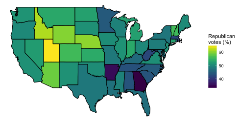

A few interesting things about this example are: 

- This code uses piping and tidyverse functions to clean the data, merge it with the geographic data, and pipe to ggplot. See earlier sections of this book to find out more about tidying data. 
- The `votes.repub` data initially is a matrix. The `tbl_df` function from `dplyr` is used to convert it to a tibble. 
- The state names were originally in the row names of `votes.repub`. The `mutate` function is used to move these into a column of the dataframe. The names are then converted to lowercase to allow easier merging with the geographic data. 
- The voting data includes Alaska and Hawaii, but the geographic data does not. Therefore, we've used `right_join` to join the two datasets, so only non-missing values from the `us_map` geographic data will be kept.
- Because the column names for the years do not follow the rules for naming R objects ("1976" starts with a number), we've surrounded the column name with backticks when calling it in the aesthetic statement.
- We want the borders of the states to always be black, so we've set that aesthetic as a constant rather than mapping it to a variable by including it in an `aes` call. 
- We've added a void theme (`theme_void`) to take out axes and background, and we added a custom color scale from the `viridis` package (`scale_fill_viridis`) to customize the colors used in the choropleth.

If you have data with point locations, you can add those points to a map created with ggplot, too, by adding a point geom. As an example, we'll use some data related to the popular ["Serial" podcast](http://serialpodcast.org). The podcast covered a murder in Baltimore. David Robinson [posted a dataset of locations related to the show on GitHub](https://github.com/dgrtwo/serial-ggvis/blob/master/serial-preprocessing.Rmd), which you can read in directly to R to use for some of the mapping examples in this subset: 


```r
library(readr)
serial <- read_csv(paste0("https://raw.githubusercontent.com/",
                          "dgrtwo/serial-ggvis/master/input_data/",
                          "serial_podcast_data/serial_map_data.csv"))
head(serial, 3)
# A tibble: 3 x 5
      x     y      Type  Name Description
  <int> <int>     <chr> <chr>       <chr>
1   356   437 cell-site  L688        <NA>
2   740   360 cell-site  L698        <NA>
3   910   340 cell-site  L654        <NA>
```

He figured out a way to convert the x and y coordinates in this data to latitude and longitude coordinates, and the following code cleans up the data using that algorithm. The murder occurred when cell phones were just becoming popular, and cell phone data was used in the case. The code also adds a column for whether of not the location is a cell tower.


```r
serial <- serial %>%
    mutate(long = -76.8854 + 0.00017022 * x,
           lat  = 39.23822 + 1.371014e-04 * y,
           tower = Type == "cell-site")
serial %>%
  slice(c(1:3, (n() - 3):(n())))
# A tibble: 7 x 8
      x     y          Type                            Name
  <int> <int>         <chr>                           <chr>
1   356   437     cell-site                            L688
2   740   360     cell-site                            L698
3   910   340     cell-site                            L654
4   960   830 base-location Campfield Early Learning Center
5   580  1230 base-location               Owings Mills Mall
6   720   496 base-location                   Adnan's house
7   954   410 base-location                    Jenn's house
# ... with 4 more variables: Description <chr>, long <dbl>, lat <dbl>,
#   tower <lgl>
```

We can use ggplot to map these data on a base map of Baltimore City and Baltimore County in Maryland. To do so, use the `map_data` function from `ggplot2` to pull the "county" map. By specifying the `region` parameter as "maryland", you can limit the returned geographic polygon data Maryland counties. 


```r
maryland <- map_data('county', region = 'maryland')
head(maryland)
       long      lat group order   region subregion
1 -78.64992 39.53982     1     1 maryland  allegany
2 -78.70148 39.55128     1     2 maryland  allegany
3 -78.74159 39.57420     1     3 maryland  allegany
4 -78.75878 39.58566     1     4 maryland  allegany
5 -78.74732 39.61430     1     5 maryland  allegany
6 -78.74732 39.63149     1     6 maryland  allegany
```

This data includes a column named `subregion` with the county. You can use that column to filter to just the data for Baltimore City ("baltimore city") or Baltimore County ("baltimore"): 


```r
baltimore <- maryland %>%
  filter(subregion %in% c("baltimore city", "baltimore"))
head(baltimore, 3)
       long      lat group order   region subregion
1 -76.88521 39.35074     3   114 maryland baltimore
2 -76.89094 39.37939     3   115 maryland baltimore
3 -76.88521 39.40804     3   116 maryland baltimore
```

If you create a ggplot object with this data and add a polygon geom, you will have a base map of these two counties: 


```r
ggplot(baltimore, aes(x = long, y = lat, group = group)) + 
  geom_polygon(fill = "lightblue", color = "black") + 
  theme_void()
```

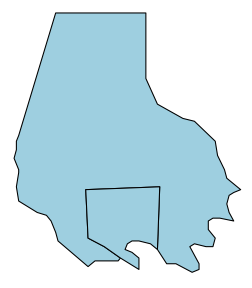

To add the locations from the `serial` data to this map, you just need to add a point geom, specifying the dataframe to use with the `data` parameter: 


```r
ggplot(baltimore, aes(x = long, y = lat, group = group)) + 
  geom_polygon(fill = "lightblue", color = "black") + 
  geom_point(data = serial, aes(group = NULL, color = tower)) + 
  theme_void() + 
  scale_color_manual(name = "Cell tower", values = c("black", "red"))
```


When you add a geom to a ggplot object with mapped aesthetics, the geom will inherit those aesthetics unless you explicitly override them with an `aes` call in the `geom` function. That is why we did not have to explicitly map longitude to x and latitude to y in the `aes` call when adding the points to the map (although, as a note, if the column names for the longitude and latitude columns had been different in the `baltimore` and `serial` dataframes, we would have needed to reset these aesthetics when adding the points). 

Further, we mapped the group column in the geographic data to the `group` aesthetic, so the polygons would be plotted correctly. However, the `serial` dataframe does not have a column for group. Therefore, we need to unset the `group` aesthetic mapping in the point geom. We do that by specifying `group = NULL` in the aes statement of the point geom. 

Note that we've also customized the map a bit by setting constant colors for the fill for the two counties (`fill = "lightblue"`) and by setting the colors and legend name for the points using `scale_color_manual`. By mapping the color of the points to the `tower` column in the dataframe, we show points that are cell towers in a different color than all other points. 

The `ggplot` function requires that you input data in a dataframe. In the examples shown in this section, we started with dataframes that included geographic locations (latitude and longitude) as columns. This is the required format of data for mapping with `ggplot2` (or with extensions like `ggmap`). Sometimes, however, you will want to plot geographic data in R that is in a different format. In particular, most R functions that read shapefiles will read the data into a spatial object rather than a dataframe. To map this data with `ggplot2` and related packages, you will need to transform the data into a dataframe. You can do this using the `fortify` function from `ggplot2`. We'll cover this process in more detail in a later section, when we present spatial objects.

I> For a great step-by-step example of creating a beautiful map of age distribution in Switzerland with `ggplot2`, see [this blog post](https://timogrossenbacher.ch/2016/12/beautiful-thematic-maps-with-ggplot2-only/) by Timo Grossenbacher. This tutorial also provides a good example of customizing ggplot output using grid graphics, which we cover in a later subsection.


### ggmap, Google Maps API

In the previous subsection, we used built-in datasets of geographic data to create the background when mapping point locations. This works well for locations for which `map_data` datasets exist at the appropriate aggregation level. However, there are only a few countries with data at a sub-country level available through this function. Further, you may want to use a base map that includes elements like roads or terrain. 

The `ggmap` package allows you to do this by using tools from Google Maps directly from R. This package allows you to pull a base map from Google Maps and a few other map servers, which you can then plot and to which you can add points, polygons, lines, and other elements using `ggplot2` functions. This package uses the Google Maps API, so you should read their [terms of service](http://developers.google.com/maps/terms) and make sure you follow them if using this package. 

You use the `get_map` function from this package to get base maps for different locations. To tell the function where you would like the map centered, you can either use the longitude and latitude of the center point of the map or you can use a character string to specify a location. If you do the second, `get_map` will use the Google Maps API to geocode the string to a latitude and longitude and then get the map (think of searching in Google Maps in the search box for a location). This will work well for most cities, and you can also use it with landmarks, but it might fail to geocode less well-known locations. You can also input an address as a character string when pulling a base map and Google will usually be able to successfully geocode and pull the right map. You can use the `zoom` parameter to set the amount the map is zoomed in on that location; this value should be between 3 and 20, with lower values more zoomed out and higher values more zoomed in.

For example, you can use the following code to pull a map of Beijing:


```r
## install.packages("ggmap")
library(ggmap)
beijing <- get_map("Beijing", zoom = 12)
```

I> If you find that you're getting an error like "Error: GeomRasterAnn was built with an incompatible version of ggproto" when you try to use the `ggmap` package, try reinstalling the package directly from GitHub using `install_github("dkahle/ggmap")` (you'll need the `devtools` package installed and loaded to use `install_github`). 

The `get_map` function returns a ggmap object. You can plot this object using the `ggmap` function:


```r
ggmap(beijing)
```

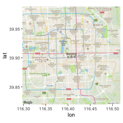

The output of `ggmap` is a ggplot object, so you can add elements to it in the same way you would work with any other ggplot object. For example, to set the void theme and add a title, you could run:


```r
ggmap(beijing) + 
  theme_void() + 
  ggtitle("Beijing, China")
```


While the default source for maps with `get_map` is Google Maps, you can also use the function to pull maps from OpenStreetMap and Stamen Maps. Further, you can specify the type of map, which allows you to pull a variety of maps including street maps and terrain maps. You specify where to get the map using the `source` parameter and what type of map to use with the `maptype` parameter. 

Here are example maps of Estes Park, in the mountains of Colorado, pulled using different map sources and map types. Also, note that we've used the option `extent = "device"` when calling `ggmap`, which specifies that the map should fill the whole plot area, instead of leaving room for axis labels and titles. Finally, as with any ggplot object, we can save each map to an object. We do that here so we can plot them together using the `grid.arrange` function, which we'll describe in more detail in a later section in this course. 


```r
map_1 <- get_map("Estes Park", zoom = 12,
                 source = "google", maptype = "terrain") %>%
  ggmap(extent = "device")

map_2 <- get_map("Estes Park", zoom = 12,
                 source = "stamen", maptype = "watercolor") %>%
  ggmap(extent = "device")

map_3 <- get_map("Estes Park", zoom = 12,
                 source = "google", maptype = "hybrid") %>%
  ggmap(extent = "device")

library(gridExtra)
grid.arrange(map_1, map_2, map_3, nrow = 1) 
```

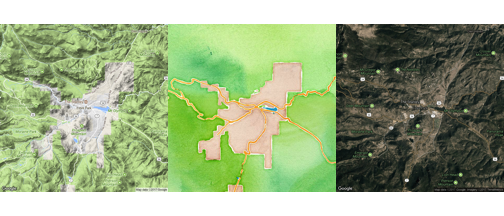

W> The `get_map` function is sending a request and getting a response from the Google API. Therefore, this function will not work if your computer is offline or if your computer is not able to access the Google API (for example, because of a firewall).

In the above examples, `get_map` is pulling a map based on a character string of the location (e.g., "Estes Park"). The `get_map` function also allows you to request a map based on latitude and longitude. For example, to get a map centered at a longitude of 2.35 degrees and a latitude of 48.86 degrees, you can run:


```r
get_map(c(2.35, 48.86), zoom = 10) %>%
  ggmap(extent = "device")
Warning: `panel.margin` is deprecated. Please use `panel.spacing` property
instead
```

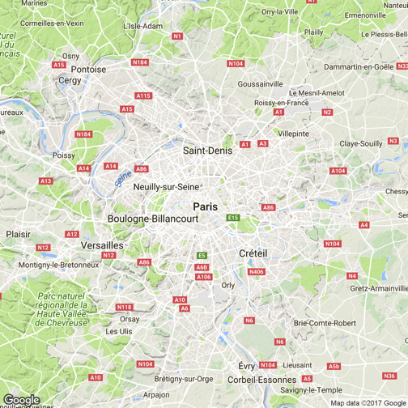

Once you have pulled one of these base maps into R, you can add ggplot elements to them, including point and polygon geoms for locations. For example, you could pull in a base map of the Baltimore County area and add the elements we plotted from the `serial` dataframe in the last subsection:


```r
get_map("Baltimore County", zoom = 10, 
        source = "stamen", maptype = "toner") %>%
  ggmap() + 
  geom_polygon(data = baltimore, aes(x = long, y = lat, group = group),
               color = "navy", fill = "lightblue", alpha = 0.2) + 
  geom_point(data = serial, aes(x = long, y = lat, color = tower)) + 
  theme_void() + 
  scale_color_manual(name = "Cell tower", values = c("black", "red"))
```


Note that we used `alpha` to add some transparency to the polygons so you could see the base map through them. 

Now that we've gone through some examples, here is a step-by-step review of how the mapping process works with `ggmap`: 

1. The `get_map` function pulls in a base map from the Google Maps API (or another map server like Stamen Maps). The returned value is a ggmap object. 
2. The `ggmap` function plots this ggmap object and returns a ggplot object. You can use this resulting ggplot object as you would any other ggplot object (e.g., add geoms, change theme).
3. Call other `ggplot2` functions on this output to add locations and customize the map. Map longitude in the data to the x aesthetic and latitude to the y aesthetic. Note that you are adding locations using a new dataframe for the geom. Just as with regular ggplot objects, if you use a new dataframe for a geom, you must specify it with the data parameter for that geom. Because geoms do not take dataframes as their first arguments, you can't specify the dataframe first without "data = " and rely on position with geoms. (By contrast, the ggplot function does take the data parameter as its first argument, so that's why you can get away with not using "data = " when specifying a dataframe in the original ggplot call for a regular ggplot object.)

You can use the `ggmap` package to do a number of other interesting tasks related to geographic data. For example, the package allows you to use the Google Maps API, through the `geocode` function, to get the latitude and longitude of specific locations based on character strings of the location or its address. For example, you can get the location of the Supreme Court of the United States by calling:


```r
geocode("Supreme Court of the United States")
        lon      lat
1 -77.00444 38.89064
```

You could also get its location by calling its address:


```r
geocode("1 First St NE, Washington, DC")
        lon      lat
1 -77.00465 38.89051
```

You can compute map distances, too, using the `mapdist` function with two locations: 


```r
mapdist("Baltimore, MD",
        "1 First St NE, Washington, DC") %>%
  select(from, to, miles)
           from                            to   miles
1 Baltimore, MD 1 First St NE, Washington, DC 37.8184
```

To find out more about how Google Maps is performing this and other tasks, you can read its [API documentation](https://developers.google.com/maps/documentation/distance-matrix/?csw=1).

I> For these GIS-style tasks, the `ggmap` package is not running its own algorithms but rather using the Google Maps API. This package cannot do other GIS tasks, like finding the centroids or areas of spatial polygons. To use R as a GIS for more substantive tasks, you'll need to use other R packages, like `sp` and `rgdal`. 

### Mapping US counties and states

If you need to map US states and counties, the `choroplethr` and `choroplethrMaps` packages offer functions for fast and straightforward mapping. This package also offers an interesting example of incorporating mapping functions within an R package. You can explore the code for the package, as well as some documentation, at the `choroplethr` package's GitHub page: https://github.com/trulia/choroplethr.

I> This subsection is included to illustrate an interesting mapping package that may prove useful to readers mapping US-based data. The package itself is also an interesting example of a package built to facilitate mapping. However, the details of this subsection are not necessary to master to understand the rest of the material on mapping, so you can skip this section if the applications do not appear relevant to your work.  

As an example, we'll use data on county-level population in 2012 that comes as the dataset `df_pop_county` with the `choroplethr` package. This dataset gives the population of each county (`value`) and the county FIPS number (`region`), which is a unique identification number for each US county. 


```r
library(choroplethr)
library(choroplethrMaps)
data(df_pop_county)
df_pop_county %>% slice(1:3)
# A tibble: 3 x 2
  region  value
   <dbl>  <dbl>
1   1001  54590
2   1003 183226
3   1005  27469
```

As long as you are using a dataframe with a numeric column named `region` with each county's FIPS code and a column named `value` with the value you'd like to map (population in this case), you can create a choropleth just by running the `county_choropleth` function on the dataframe. 


```r
county_choropleth(df_pop_county)
```

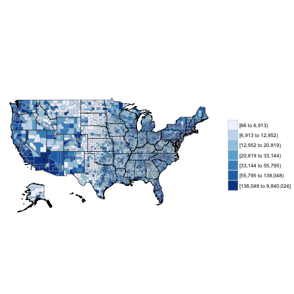

If you want to only plot some of states, you can use the `state_zoom` argument: 


```r
county_choropleth(df_pop_county, state_zoom = c("colorado", "wyoming"))
```

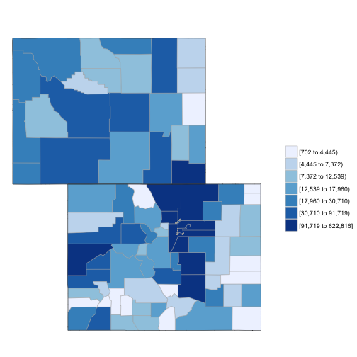

To plot values over a reference map from Google Maps, you can use the `reference_map` argument:


```r
county_choropleth(df_pop_county, state_zoom = c("north carolina"),
                  reference_map = TRUE)
```


This example is using one of the datasets that comes with the `choroplethr` package, but you can map any dataset that includes a column with county FIPS and a column with the value you would like to plot. All you have to do is (1) make sure the county FIPS is in a numeric class and (2) name the columns for FIPS and the value to plot as "region" and "value", respectively (the `rename` function from `dplyr` is useful here). For example, here is a dataframe giving storm events that were listed in NOAA's Storm Events database near Hurricane Floyd's track: 


```r
library(readr)
floyd_events <- read_csv("data/floyd_events.csv") 
floyd_events %>% slice(1:3)
# A tibble: 3 x 4
  begin_date   end_date  fips       type
      <date>     <date> <chr>      <chr>
1 1999-09-16 1999-09-17 25011 Heavy Rain
2 1999-09-16 1999-09-17 25001 Heavy Rain
3 1999-09-16 1999-09-17 25015 Heavy Rain
```

You can use the following code to plot the number of events listed for each US county by cleaning and summarizing the data in a pipe chain and then piping the output to the `county_choropleth` function. The choropleth mapping functions require that each county is included only once, so we used `group_by` and `summarize` to collapse the dataframe to have only a single observation for each county.  


```r
floyd_events %>% 
  group_by(fips) %>%
  dplyr::summarize(n_events = n()) %>%
  mutate(fips = as.numeric(fips)) %>%
  dplyr::rename(region = fips, 
         value = n_events) %>%
  county_choropleth(state_zoom = c("north carolina", "virginia"),
                    reference_map = TRUE)
```


The map created by `county_choropleth` (and the other maps created by functions in the `choroplethr` package) is a `ggplot` object, so you can add elements to it. For example, to create a map of flood events that includes the track of Hurricane Floyd on the map, you can run: 


```r
floyd_track <- read_csv("data/floyd_track.csv")

floyd_events %>% 
  dplyr::group_by(fips) %>%
  dplyr::summarize(flood = sum(grepl("Flood", type))) %>%
  dplyr::mutate(fips = as.numeric(fips)) %>%
  dplyr::rename(region = fips, 
                value = flood) %>%
  county_choropleth(state_zoom = c("north carolina", "maryland", 
                                   "delaware", "new jersey",
                                   "virginia", "south carolina",
                                   "pennsylvania", "new york",
                                   "connecticut", "massachusetts",
                                   "new hampshire", "vermont",
                                   "maine", "rhode island"),
                    reference_map = TRUE) + 
  geom_path(data = floyd_track, aes(x = -longitude, y = latitude,
                                    group = NA),
            color = "red")
```


To create county choropleths with the `choroplethr` package that are more customized, you can use the package's `CountyChoropleth`, which is an R6 object for creating custom county choropleths. To create an object, you can run `CountyChoropleth$new` with the data you'd like to map. As with `county_choropleth`, this data should have a column named "region" with county FIPS codes in a numeric class and a column named "values" with the values to plot. To map counties in which a flood event was reported around the time of Floyd, you can start by cleaning your data and then creating an object using `CountyChoropleth$new`:


```r
floyd_floods <- floyd_events %>% 
  filter(grepl("Flood", type)) %>%
  mutate(fips = as.numeric(fips)) %>%
  group_by(fips) %>%
  dplyr::summarize(value = 1) %>%
  ungroup() %>%
  dplyr::rename(region = fips) 

floyd_map <- CountyChoropleth$new(floyd_floods)
```

As a note, in cleaning the data here, we wanted to limit the dataset to only observations where the event type included the word "Flood" (this will pull events listed as "Flood" or "Flash Flood"), so we've used the `grepl` function to filter to just those observations. 

Once you have created a basic object using `CountyChoropleth`, you can use the methods for this type of object to customize the map substantially. For example, you can set the states using the `set_zoom` method:


```r
floyd_map$set_zoom(c("north carolina", "maryland", 
                     "delaware", "new jersey",
                     "virginia", "south carolina",
                     "pennsylvania", "new york",
                     "connecticut", "massachusetts",
                     "new hampshire", "vermont",
                     "maine", "rhode island"))
```

At any point, you can render the object using the `render` method (or `render_with_reference_map`, to plot the map with the Google reference map added):


```r
floyd_map$render()
```


To find out what options are available for this object type, in terms of methods you can use or attributes you can change, you can run:


```r
names(floyd_map)
 [1] ".__enclos_env__"           "add_state_outline"        
 [3] "ggplot_polygon"            "projection"               
 [5] "ggplot_scale"              "warn"                     
 [7] "legend"                    "title"                    
 [9] "choropleth.df"             "map.df"                   
[11] "user.df"                   "clone"                    
[13] "clip"                      "initialize"               
[15] "set_zoom"                  "render_state_outline"     
[17] "render_helper"             "render"                   
[19] "set_num_colors"            "get_zoom"                 
[21] "format_levels"             "theme_inset"              
[23] "theme_clean"               "get_scale"                
[25] "prepare_map"               "bind"                     
[27] "discretize"                "render_with_reference_map"
[29] "get_choropleth_as_polygon" "get_reference_map"        
[31] "get_y_scale"               "get_x_scale"              
[33] "get_bounding_box"          "get_max_lat"              
[35] "get_min_lat"               "get_max_long"             
[37] "get_min_long"             
```

The following code shows an example of customizing this county choropleth map: 


```r
floyd_map$add_state_outline <- TRUE
floyd_map$ggplot_scale <- scale_fill_manual(values = c("yellow"),
                                            guide = FALSE)
floyd_xlim <- floyd_map$get_bounding_box()[c(1, 3)]
floyd_ylim <- floyd_map$get_bounding_box()[c(2, 4)]

a <- floyd_map$render() + 
  geom_path(data = floyd_track, aes(x = -longitude, y = latitude,
                                    group = NA),
            color = "red", size = 2, alpha = 0.6) + 
            xlim(floyd_map$get_bounding_box()[c(1, 3)]) + 
            ylim(floyd_map$get_bounding_box()[c(2, 4)])
            
b <- floyd_map$render_with_reference_map() + 
  geom_path(data = floyd_track, aes(x = -longitude, y = latitude,
                                    group = NA),
            color = "red", size = 2, alpha = 0.6) + 
            xlim(floyd_xlim) + 
            ylim(floyd_ylim)
            
library(gridExtra)
grid.arrange(a, b, ncol = 2)
```


Here, we've used `$add_state_outline` to change the object to include state outlines (this only shows up when you render the map without a background reference map). We've also used `$ggplot_scale` to customize the colors used for plotting counties with flood events and to remove the map legend. The `get_bounding_box` method pulls the range of latitudes and longitudes for the current map. We're planning to add the hurricane track to the map, and the hurricane track extends well beyond this range. To later limit the map to these states, we're using this `get_bounding_box` method to get these boundaries, and then we've used those values for the `xlim` and `ylim` functions when we create the final `ggplot` objects. Finally, the rendered maps are `ggplot` objects, so to include the hurricane track, we can add `ggplot` elements to the map using `+`, as with any `ggplot` object. We used the `grid.arrange` function from the `gridExtra` package to put the two maps (with and without the background Google map) side-by-side.

### More advanced mapping -- Spatial objects

So far, we have relied on ggplot and related packages for mapping. However, there are other systems for mapping in R. In particular, geographic data in R is often stored in spatial objects (e.g., SpatialPolygons, SpatialPointsDataframe), particularly when it is read in from the shapefiles commonly used to store spatial data outside of R.

In this subsection we will introduce these spatial objects, show how to work with them in R (including how to convert them to dataframes so they can be used with the ggplot-based mapping covered in earlier subsections), and briefly describe shapefiles. 

#### Spatial objects in R

R has a series of special object types for spatial data. For many mapping / GIS tasks, you will need your data to be in one of these objects. These spatial objects include objects that just contain geographies (e.g., locations along the borders of countries) or objects that contain geographies and associated attributes of each element of the geography (e.g., county boundaries as well as the population of each country). The most common spatial objects in R are: 

- `SpatialPolygons`
- `SpatialPoints`
- `SpatialLines`
- `SpatialPolygonsDataFrame`
- `SpatialPointsDataFrame`
- `SpatialLinesDataFrame`

The `tigris` package lets you pull spatial data directly from the US Census. This data comes into R as a spatial object. To provide a basic overview of working with spatial object in R, we will use an example spatial object pulled with this package. 

I> The `tigris` package offers a very convenient way to pull a variety of geographic data for the United States. To find out more, check out the article ["tigris: An R Package to Access and Work with Geographic Data from the US Census Bureau"](https://journal.r-project.org/archive/accepted/walker.pdf) in *The R Journal*.

The `tigris` package includes a function called `tracts` that allows you to pull the geographic data on boundaries of U.S. Census tracts. You can use the `state` and `county` parameters to limit the result to certain counties, and you can set `cb = FALSE` if a lower-resolution (and smaller) file is adequate. To pull census tract boundaries for Denver, CO, you can run:


```r
library(tigris)
library(sp)
denver_tracts <- tracts(state = "CO", county = 31, cb = TRUE)
```

By running `class` on the returned object, you can see that this function has returned a SpatialPolygonsDataFrame object. 


```r
class(denver_tracts)
[1] "SpatialPolygonsDataFrame"
attr(,"package")
[1] "sp"
```

Spatial objects like this have a plot methods that can be called to plot the object. This means that you can map these census tract boundaries by calling:


```r
plot(denver_tracts)
```


There number of other methods for this specific object type. For example, `bbox` will print out the *bounding box* of the spatial object (range of latitudes and longitudes covered by the data).


```r
bbox(denver_tracts)
         min        max
x -105.10993 -104.60030
y   39.61443   39.91425
```

The `is.projected` and `proj4string` functions give you some information about the current Coordinate Reference System of the data (we describe more about Coordinate Reference Systems later in this subsection).


```r
is.projected(denver_tracts)
[1] FALSE
proj4string(denver_tracts)
[1] "+proj=longlat +datum=NAD83 +no_defs +ellps=GRS80 +towgs84=0,0,0"
```

If a spatial object includes attribute data (i.e., is an object type *DataFrame), you can access a "slot" in the spatial object to pull out an attribute dataframe using `@`. For example, here's the beginning of the dataframe for the `denver_tracts` spatial object:


```r
head(denver_tracts@data)
   STATEFP COUNTYFP TRACTCE             AFFGEOID       GEOID  NAME LSAD
25      08      031  000201 1400000US08031000201 08031000201  2.01   CT
26      08      031  000302 1400000US08031000302 08031000302  3.02   CT
27      08      031  001101 1400000US08031001101 08031001101 11.01   CT
28      08      031  002802 1400000US08031002802 08031002802 28.02   CT
29      08      031  003300 1400000US08031003300 08031003300    33   CT
30      08      031  004006 1400000US08031004006 08031004006 40.06   CT
     ALAND AWATER
25 2084579      0
26 1444043      0
27  898885      0
28  886798      0
29 1288718      0
30 1953041      0
```

For this spatial object, the data includes identifying information (state, county, tract), but also some attribute data (area of the tract that is land, area of the tract that is water).

You can add different layers of spatial objects onto the same plot. To do that, just use `add = TRUE` for added layers. For example, to add primary roads to the Denver census tract map, you can pull a spatial object with roads using the `primary_roads` function from the `tigris` package (note: this data includes roads across the U.S. and so might take a few seconds to download or render) and then use `plot` with `add = TRUE` to add the roads to the map:


```r
roads <- primary_roads()

plot(denver_tracts, col = "lightblue")
plot(roads, add = TRUE, col = "darkred")
```


Geographic data outside of R is often stored in shapefiles. If you read in a shapefile from a file (more details on shapefiles later in this section), it will automatically be read in as one of these shape objects. However, you can also convert other data into shape objects. For example, you could convert the dataframes with spatial data on U.S. state boundaries that we used earlier in this book into spatial objects. Functions from `sp` package (e.g., `SpatialPoints`, `SpatialPointsDataFrame`) can be used to convert data stored in dataframes into spatial objects.

There likely will also be cases when you have a spatial object but would like to plot it using ggplot-type mapping. In this case, you need to convert the spatial object to a dataframe, since ggplot will only input dataframes. You can use the `fortify` function from `ggplot2` to do this. For example, to convert the Denver census tracts spatial object to a dataframe, you could call:


```r
denver_tracts_df <- fortify(denver_tracts)
denver_tracts_df %>%
  dplyr::select(1:4) %>% dplyr::slice(1:5)
# A tibble: 5 x 4
       long      lat order  hole
      <dbl>    <dbl> <int> <lgl>
1 -105.0251 39.79400     1 FALSE
2 -105.0213 39.79398     2 FALSE
3 -105.0208 39.79109     3 FALSE
4 -105.0158 39.79107     4 FALSE
5 -105.0064 39.79105     5 FALSE
```

Now you can use the data in to create a map using `ggplot2` functions:


```r
denver_tracts_df %>%
  ggplot(aes(x = long, y = lat, group = group)) + 
  geom_polygon(fill = "lightblue", color = "black") + 
  theme_void()
```


#### Coordinate reference systems

Spatial objects will have a Coordinate Reference Systems (CRSs), which specifies how points on a curved earth are laid out on a two-dimensional map. A CRS can be geographic (e.g., WGS84, for longitude-latitude data) or projected (e.g., UTM, NADS83). The full details of map projections is beyond the scope of this course, but if you'd like to find out more details, [this section](http://docs.qgis.org/2.0/en/docs/gentle_gis_introduction/coordinate_reference_systems.html) of the documentation for QGIS is very helpful. For working with spatial objects in R, it is important to realize that spatial objects have a Coordinate Reference System attribute and that you can run into problems if you try to work directly with two spatial objects with different Coordinate Reference Systems.

To find out the CRS for a spatial object (like a SpatialPoints object) that already has a CRS, you can use `proj4string`. For example, to get the CRS of the Denver census tract data, you can run:


```r
proj4string(denver_tracts)
[1] "+proj=longlat +datum=NAD83 +no_defs +ellps=GRS80 +towgs84=0,0,0"
```

If you create a spatial object from a dataframe in R, rather than reading it in from a shapefile, you will need to specify the data's Coordinate Reference System. You can use `proj4string` to set this attribute by calling it on the left of the assignment arrow:


```r
## Generic code
proj4string(my_spatial_object) <- "+proj=longlat +datum=NAD83"
```

Note that this call does **not** create a projection or reproject the data. Rather, this call is specify to R the CRS the data currently is in. 

The `CRS` function from the `sp` package creates CRS class objects that can be used in this specification. You input projection arguments into this function as a character string (for example, `CRS("+proj=longlat +datum=NAD27")`). You can also, however, use a shorter EPSG code for a projection (for example, `CRS("+init=epsg:28992")`). The http://www.spatialreference.org website lists these projection strings and can be useful in determining a string to use when setting projection information or re-projecting data.


```r
library(sp)
CRS("+proj=longlat +datum=NAD27")
CRS arguments:
 +proj=longlat +datum=NAD27 +ellps=clrk66
+nadgrids=@conus,@alaska,@ntv2_0.gsb,@ntv1_can.dat 
CRS("+init=epsg:28992")
CRS arguments:
 +init=epsg:28992 +proj=sterea +lat_0=52.15616055555555
+lon_0=5.38763888888889 +k=0.9999079 +x_0=155000 +y_0=463000
+ellps=bessel
+towgs84=565.4171,50.3319,465.5524,-0.398957,0.343988,-1.87740,4.0725
+units=m +no_defs 
```

If a spatial object has a CRS and you want to change it, you should do so using the `spTransform` function from the `rgdal` package. You input the spatial object whose CRS you want to change as well as the CRS object to which to change it:


```r
## Generic code
my_spatial_object <- spTransform(my_spatial_object,
                                 CRS = CRS("+init=epsg:4267"))
```

If you want to ensure that the CRS of two spatial objects agree, you can use `proj4string` to pull the CRS from one of the spatial objects and specify that as the output CRS for an `spTransform` call on the other object, like:


```r
## Generic code
my_spatial_object <- spTransform(my_spatial_object,
                                 CRS = proj4string(another_sp_object))
```

If you are interested in finding out more, Melanie Frazier has created an excellent resource on Coordinate Reference Systems and maps in R: https://www.nceas.ucsb.edu/~frazier/RSpatialGuides/OverviewCoordinateReferenceSystems.pdf

The `coord_map` function in `ggplot2` can help you in plotting maps with different projections. This function does not change any aspect of the data being mapped, but rather changes the projection when mapping the data. In fact, since this function is used with ggplot-style mapping, all data being mapped will be in dataframes rather than spatial objects and so will not have specifications for CRS. The following examples, which are adapted from the help file for the `coord_map` function, show example output when the `coord_map` element is added to a map of the United States:


```r
usamap <- map_data("state") %>%
  ggplot(aes(long, lat, group = group)) +
  geom_polygon(fill = "white", colour = "black")

map_1 <- usamap + coord_map() + ggtitle("default") 
map_2 <- usamap + coord_map("gilbert") + ggtitle("+ coord_map('gilbert')")
map_3 <- usamap + coord_map("conic", lat0 = 30) + 
  ggtitle("+ coord_map('conic', lat0 = 30)")

grid.arrange(map_1, map_2, map_3, ncol = 1)
```


#### Shapefiles

*Shapefiles* are a file format that is often used for saving and sharing geographic data, particularly when using GIS software. This format is not R-specific, but R can read in and write out shapefiles. The format is typically not a single file, but rather a directory of related files in a directory. Shapefiles often include both geographic information and also data describing attributes (for example, a shapefile might include the locations of country borders as well as the population of each of the countries).  

To read shapefiles into R, use the `readOGR` function from the `rgdal` package. You can also write out spatial objects you've created or modified in R to shapefiles using the `writeOGR` from the same package. The `readShape*` family of functions from the `maptools` package can also be used to read shapefiles into R. These functions all read the spatial data in as a spatial object. For example, the shapefiles of country borders and populations would be read in as a SpatialPolygonsDataFrame object. Once you read a shapefile into R, you can work with the spatial object in the same way we showed how to work with the Denver census tracts spatial object earlier in this subsection.  

I> To find out more about shapefiles, R, and ggplot2, check out the wiki listing at https://github.com/tidyverse/ggplot2/wiki/plotting-polygon-shapefiles.

#### R as GIS

In addition to mapping, you can also use R for a number of GIS-style tasks, including:

- Clipping
- Creating buffers
- Measuring areas of polygons
- Counting points in polygons

These tasks can be done with GIS software, and if you are doing extensive GIS work, it may be worthwhile to use specialized software. However, if you just need to do a few GIS tasks as part of a larger workflow, you should consider using R for these steps. Some advantages to using R for GIS tasks are:

- R is free
- You can write all code in a script, so research is more reproducible
- You save time and effort by staying in one software system, rather than moving data between different software

To show some of the GIS-style tasks that can be done from R, we'll use some driver-level data from the Fatality Analysis Reporting System (FARS) for 2001--2010, which we have saved as `fars_colorado.RData`:


```r
load("data/fars_colorado.RData")
driver_data %>% 
  dplyr::select(1:5) %>% dplyr::slice(1:5)
# A tibble: 5 x 5
  state st_case county                date latitude
  <dbl>   <dbl>  <dbl>              <dttm>    <dbl>
1     8   80001     51 2001-01-01 10:00:00 39.10972
2     8   80002     31 2001-01-04 19:00:00 39.68215
3     8   80003     31 2001-01-03 07:00:00 39.63500
4     8   80004     31 2001-01-05 20:00:00 39.71304
5     8   80005     29 2001-01-05 10:00:00 39.09733
```

This data is currently in a dataframe, which means we can map it using `ggplot2`:  


```r
map_data("county", region = "Colorado") %>%
  ggplot(aes(x = long, y = lat, group = subregion)) + 
  geom_polygon(color = "gray", fill = NA) + 
  theme_void() + 
  geom_point(data = driver_data,
             aes(x = longitud, y = latitude, group = NULL),
             alpha = 0.5, size = 0.7) 
```


The dataset includes a column for the county in which each accident occurred, so you can also aggregate the data by county and use a function from the `choroplethr` package to quickly create a county-specific choropleth of accident counts (note that, because the data is driver specific, this will count every car in an accident): 


```r
library(stringr)
county_accidents <- driver_data %>%
  dplyr::mutate(county = str_pad(county, width = 3,
                          side = "left", pad = "0")) %>%
  tidyr::unite(region, state, county, sep = "") %>%
  dplyr::group_by(region) %>%
  dplyr::summarize(value = n()) %>%
  dplyr::mutate(region = as.numeric(region))
county_accidents %>% slice(1:4)
# A tibble: 4 x 2
  region value
   <dbl> <int>
1   8001   617
2   8003    77
3   8005   522
4   8007    41
```


```r
county_choropleth(county_accidents, state_zoom = "colorado")
```


As a note, this code uses the `str_pad` function from the `stringr` package to pad 1- or 2-digit county FIPS codes with leading zeros before pasting them to the state FIPS code and uses the `n` function from `dplyr` with `summarize` to count the number of observations ins each county. 

This technique of creating a choropleth only worked because we had a column in the data linking accidents to counties. In same cases, you will want to create a choropleth based on counts of points but will not have this linking information in the data. For example, we might want to look at accident counts by census tract in Denver. To do this, we'll need to link each accident (point) to a census tract (polygon), and then we can count up the number of points linked to each polygon. We can do this with some of the GIS-style tools available in R. 

To start, we've created a dataframe with only accidents in Denver (based on the `county` column in the accident data):


```r
denver_fars <- driver_data %>% 
  filter(county == 31)
```

Now, we want to count up how many of these accidents occurred in each of the census tract shapes we pulled from the US Census earlier in this section using the `tigris` package. We can do this using the `poly.counts` function from `GISTools` package. However, before we can use that function, we need to make sure both objects are spatial objects, rather than dataframes, and that they have the same CRS.

The census tract data is already in a spatial object. We can change put the `denver_fars` object in a spatial object by resetting its `coordinates` attribute to specify which of its columns show longitude and latitude. Next, we need to specify what CRS the data has. Because it is coming from a dataframe of longitude and latitude data, the WSG84 system should be reasonable:


```r
library(sp)
denver_fars_sp <- denver_fars 
coordinates(denver_fars_sp) <- c("longitud", "latitude")
proj4string(denver_fars_sp) <- CRS("+init=epsg:4326")
```

This object is now also a spatial object:


```r
class(denver_fars_sp)
[1] "SpatialPointsDataFrame"
attr(,"package")
[1] "sp"
```

To be able to pair up polygons and points, the spatial objects need to have the same CRS. To help later with calculating the area of each polygon, we'll use a projected CRS that is reasonable for Colorado and reproject the spatial data using the `spTransform` function:


```r
denver_tracts_proj <- spTransform(denver_tracts, 
                                  CRS("+init=epsg:26954"))
denver_fars_proj <- spTransform(denver_fars_sp, 
                                CRS(proj4string(denver_tracts_proj)))
```

Now that the objects with the accident locations and with the census tracts are both spatial objects with the same CRS, we can combine them on a map. Because they are spatial objects, we can do that using `plot`:


```r
plot(denver_tracts_proj)
plot(denver_fars_proj, add = TRUE, col = "red", pch = 1)
```


Now, that both datasets are in spatial objects and have the same CRS, you can use the `poly.counts` function to count how many of the accidents are in each census tract. This function inputs a spatial points object and a spatial polygons object and outputs a numeric vector with the count of points in each polygon:


```r
library(GISTools)
tract_counts <- poly.counts(denver_fars_proj, denver_tracts_proj)
head(tract_counts)
25 26 27 28 29 30 
 7  2  2  0  0  4 
```

You can use a choropleth to show these accident counts. In this case, the quickest way to do this is probably to use the `choropleth` function in the `GISTools` package. 


```r
choropleth(denver_tracts, tract_counts)
```


There are other functions in R that do other GIS tasks. For example, There is function in the `GISTools` package that calculates the area of each polygon. 


```r
head(poly.areas(denver_tracts_proj))
       25        26        27        28        29        30 
2100172.2 1442824.1  897886.3  881530.5 1282812.2 1948187.1 
```

You can use this functionality to create a choropleth of the rate of fatal accidents per population in Denver census tracts:


```r
choropleth(denver_tracts, 
           tract_counts / poly.areas(denver_tracts_proj))
```


#### Raster data

When mapping in R, you may also need to map *raster data*. You can think of raster data as data shown with pixels--- the graphing region is divided into even squares, and color is constant within each square. 

There is a function in the `raster` package that allows you to "rasterize" data. That is, you take spatial points data, divide the region into squares, and count the number of points (or other summary) within each square. When you do this, you need to set the x- and y-range for the raster squares. You can use `bbox` on a spatial object to get an idea of its ranges to help you specify these limits. You can use the `res` parameter in `raster` to set how large the raster boxes should be. For example, here is some code for rasterizing the accident data for Denver:


```r
library(raster)
bbox(denver_fars_sp)
                min       max
longitud -105.10973 -104.0122
latitude   39.61715   39.8381
denver_raster <- raster(xmn = -105.09, ymn = 39.60,
                        xmx = -104.71, ymx = 39.86,
                        res = 0.02)
den_acc_raster <- rasterize(geometry(denver_fars_sp),
                            denver_raster,
                            fun = "count")
```

You can use the `image` function to plot this raster alone:


```r
image(den_acc_raster, col = terrain.colors(5))
```


You can use `plot` with `add = TRUE` to add the raster to a base plot of Denver. In this case, you will likely want to set some transparency (`alpha`) so you can see the base map through the raster:


```r
plot(denver_tracts)
plot(den_acc_raster, add = TRUE, alpha = 0.5)
```


### Where to find more on mapping with R

There is a lot more you can learn about mapping in R than we could cover here. Here are some good resources if you would like to learn more:

- *Applied Spatial Data Analysis with R* by Roger Bivand 
- *An Introduction to R for Spatial Analysis and Mapping* by Chris Brunsdon and Lex Comber 
- [CRAN Spatial Data Task View](https://cran.r-project.org/web/views/Spatial.html)
- [R Spatial Cheatsheet](http://www.maths.lancs.ac.uk/~rowlings/Teaching/UseR2012/cheatsheet.html)

## htmlWidgets

### Overview of htmlWidgets

JavaScript has a number of libraries that can be used to create interactive graphics for documents viewed in a web browser. There are now several R packages that allow you to create plots built on these JavaScript libraries from within R. 

While these packages draw on JavaScript libraries, they do not require you to export your data from R or to write JavaScript code. However, because the output runs on JavaScript, the resulting plots will not be interactive if included in static output like pdf or Word documents that you create using R Markdown. The output will be interactive if viewed in the "Viewer" panel of RStudio or if included in a HTML document created with R Markdown, and they can be incorporated into Shiny web applications. 

There is a website with much more on these `htmlWidgets` at http://www.htmlwidgets.org. Some of the packages availabe to help you create interactive graphics from R using JavaScript graphics libraries are: 

- `leaflet`: Mapping 
- `dygraphs`: Time series
- `plotly`: A variety of plots, including maps
- `rbokeh`: A variety of plots, including maps
- `networkD3`: Network data
- `d3heatmap`: Heatmaps
- `DT`: Data tables
- `DiagrammeR`: Diagrams and flowcharts

The `leaflet` and `plotly` packages are two of the most useful and developed packages in this collection of htmlWidgets. In this section, we will overview what you can make with these two packages. 

I> If you are interested in learning all the details about the JavaScript on which these htmlWidgets are built, you may find the short book *Getting Started with D3* by Mike Dewar interesting.


### `plotly` package

W> This section on the `plotly` package requires the use of a web browser to see results. Therefore, we recommend that you go to the [web version of this book](https://bookdown.org/rdpeng/RProgDA/htmlwidgets.html#plotly-package) to view this particular section and to interact with the graphics examples.

The `plotly` package in R wraps the JavaScript `plotly.js` package, an open source library for creating interactive graphs. The `plotly.js` JavaScript library is built on `d3.js` (Data-Driven Documents), which is a key driver in interactive web-based data graphics today. The package allows the plotting of a variety of interactive plots; one of the most interesting feature is it's ability to plot 3-D point and surface plots that can be rotated to view them from different angles. You can find out more about the `plotly.js` JavaScript library at [plotly's website](https://plot.ly/javascript/).

Like some of the other packages we've looked at (e.g., `ggmap`), the `plotly` R package allows you to draw on functionality external to R, but while work entirely within R. Some of the functions in this package extend the `ggplot2` code you've learned.

There are two main ways of creating plots using the R `plotly` package: 

1. Use one of the package's functions to create a customized interactive graphic: 
    + `plot_ly`: Workhorse of `plotly`, renders most non-map types of graphs
    + `plot_geo`, `plot_mapbax`: Specific functions for creating `plotly` maps
2. Create a `ggplot` object and then convert it to a `plotly` object using the `ggplotly` function.

When using the first method, most graphics other than maps will be created using the `plot_ly` function. For example, if you want to plot an interactive scatterplot of time versus shots for the World Cup 2010 data (which we have created as a static plot earlier in this section), you can do so with the following code:  


```r
library(faraway) 
data(worldcup)
library(plotly)

plot_ly(worldcup, type = "scatter",
        x = ~ Time, y = ~ Shots, color = ~ Position)
Error in loadNamespace(name): there is no package called 'webshot'
```

If you view this plot in a format where it is interactive, you can see that labels pop up for each point as you pass the cursor over it. Further, there are some buttons at the top of the graph that allow interactive actions like zooming, panning, and selection of a subset of the graph.

This code specifies the dataframe with the data to plot, what type of plot to create, and mappings of variables to aesthetics. In this case, we want to show Time on the x-axis and Shots on the y-axis, so we specify those for the `x` and `y` parameters. Further, we want to show player position with color, so we map the `Position` column to color. 

This code uses a `~` syntax for mapping aesthetics that is a bit different from the ggplot syntax we've presented earlier. This syntax is necessary in the `plotly` call to let R know that these variables can be found as columns in the dataframe passed to the function. If you would like to use a constant value for an aesthetic, you must specify that the argument should be used "as-is", using the `I()` function. For example, to plot all points in blue, you could run:


```r
plot_ly(worldcup, type = "scatter",
        x = ~ Time, y = ~ Shots, color = I("blue"))
Error in loadNamespace(name): there is no package called 'webshot'
```

I> While you usually won't use `~` syntax like this when using `ggplot2` in interactive coding, you will use it to avoid non-standard evaluation when using `ggplot2` code in functions you write for a package. See the section on non-standard evaluation earlier in the book for more on this concept. 

By default, the pop-ups will show the mapped aesthetics when you move the cursor over each point. However, you can change this default to show something different when the viewer scrolls over each point. For example, the plot we created above for the World Cup data maps player time to the x aesthetic, shots to the y aesthetic, and color to the player's position. Therefore, by default these three values will be shown for a point if you move the cursor over the point. However, you might prefer to show each player's name, which is contained in the rownames of the `worldcup` data. You can do this by using `dplyr` tools to move the rownames to a column named `Name` and then mapping that column to the text aesthetic and specifying that aesthetic to the `hoverinfo` parameter:


```r
worldcup %>%
  mutate(Name = rownames(worldcup)) %>%
  plot_ly(x = ~ Time, y = ~ Shots, color = ~ Position) %>%
  add_markers(text = ~ Name, hoverinfo = "text")
Error in loadNamespace(name): there is no package called 'webshot'
```

You can use the `paste` function to create a more customized text label. Use HTML tags for any formatting. For example, to show both the player's name and team in a more attractive format, you could run:


```r
worldcup %>%
  mutate(Name = rownames(worldcup)) %>%
  plot_ly(x = ~ Time, y = ~ Shots, color = ~ Position) %>%
  add_markers(text = ~ paste("<b>Name:</b> ", Name, "<br />", 
                             "<b>Team:</b> ", Team),
              hoverinfo = "text")
Error in loadNamespace(name): there is no package called 'webshot'
```

If you aren't familiar with HTML syntax, you may find it helpful to use a HTML cheatsheet like [this one](http://web.stanford.edu/group/csp/cs21/htmlcheatsheet.pdf). 

Just like with `ggplot2`, the mappings you need depend on the type of plot you are creating. For example, scatterplots (`type = "scatter"`) need `x` and `y` defined, while a surface plot (`type = "surface"`) can be created with a single vector of elevation, using a mapping to the z aesthetic. 

The `plotly` package is designed so you can pipe data into `plot_ly` and add elements by piping into `add_*` functions (this idea is similar to adding elements to a `ggplot` object with `+`). For example, you could create the same scatterplot we just created by piping the World Cup data into `plotly`, and then piping that output to `add_markers`, without needing to specify that the type of plot should be a scatterplot as we did in the last code chunk:


```r
worldcup %>%
  plot_ly(x = ~ Time, y = ~ Shots, color = ~ Position) %>%
  add_markers()
```

The `add_*` functions for plotly include:

- `add_markers`
- `add_lines`
- `add_paths`
- `add_polygons`
- `add_segments`
- `add_histogram`

If you pipe to the `rangeslider` function, it allows the viewer to zoom in on part of the x range. This functionality can be particularly nice for time series. For example, you can read in data on the maximum winds for Hurricane Floyd at different points along its track. You can pipe the result of reading in the csv directly into the `plot_ly` call. To show a time series of wind speeds, map the time stamp to the x aesthetic and the wind to the y aesthetic. You can then add a line and range slider:


```r
read_csv("data/floyd_track.csv") %>%
  plot_ly(x = ~ datetime, y = ~ max_wind) %>% 
  add_lines() %>%
  rangeslider()
Error in loadNamespace(name): there is no package called 'webshot'
```

Notice that, in the output, you can change the range of data plotted in the top graph by interactively adjusting the window shown in the lower plot. 

You can make a 3-D scatterplot with `plot_ly` by mapping a variable to the `z` variable. For example, to plot a scatter plot of time, shots, and passes in the World Cup 2010 data, you can run (note that `size` is set with a constant value to make the points larger):


```r
worldcup %>%
  plot_ly(x = ~ Time, y = ~ Shots, z = ~ Passes,
          color = ~ Position, size = I(3)) %>%
  add_markers()
Error in loadNamespace(name): there is no package called 'webshot'
```

Again, if you move the cursor over the points in the scatterplot, you can see the value of the point. Further, the tool bar above the plot includes buttons that allow you to rotate the plot and look at it from different angles.

Similarly, you can create 3-D surface plots with the `plot_ly` function. In this case, if you have a matrix of data regularly spaced on x- and y-dimensions, with the cell values in the matrix giving values of a third variable, you can create a surface map with `plot_ly` by mapping the matrix values to the z aesthetic. The helpfile for `plot_ly` includes an example using the `volcano` data that comes with R. This data is in a matrix format, and each value gives the elevation for a particular pair of x- and y-coordinates for a volcano in New Zealand.


```r
class(volcano)
[1] "matrix"
volcano[1:4, 1:4]
     [,1] [,2] [,3] [,4]
[1,]  100  100  101  101
[2,]  101  101  102  102
[3,]  102  102  103  103
[4,]  103  103  104  104
```

You can use the following code to create a 3-D surface plot of this data. 


```r
plot_ly(z = ~ volcano, type = "surface")
Error in loadNamespace(name): there is no package called 'webshot'
```

The other way to create a `plotly` graph is to first create a `ggplot` object and then transform it into an interactive graphic using the `ggplotly` function. 

Earlier in this subsection, we used `plot_ly` to create an interactive scatterplot with the World Cup. We could have created the same plot by first creating a ggplot object with the scatterplot and then passing it to the `ggplotly` function: 


```r
worldcup_scatter <- worldcup %>%
  ggplot(aes(x = Time, y = Shots, color = Position)) + 
  geom_point() 
ggplotly(worldcup_scatter)
We recommend that you use the dev version of ggplot2 with `ggplotly()`
Install it with: `devtools::install_github('hadley/ggplot2')`
Error in loadNamespace(name): there is no package called 'webshot'
```

W> If you get an error when you try this code, make sure you have the latest versions of `ggplot2` and `plotly` installed. It may be necessary for you to install the development version of `plotly` directly from GitHub, which you can do using `devtools::install_github("ropensci/plotly")`.

If you would like to find out more about what you can do with the `plotly` package, the creator of the package has written a bookdown book on the package that you can read [here](https://cpsievert.github.io/plotly_book/). 

### Leaflet

Leaflet is a JavaScript library that you can use to create very attractive interactive maps. You will recognize the output, as maps created using Leaflet are now very common on websites. You can find out more about the JavaScript version here: http://leafletjs.com. The `leaflet` package allows you to create these maps from within R. As with other htmlWidgets, you can explore these maps in the "Viewer" pane of RStudio and also add them to HTML R Markdown output and Shiny web applications. 

For the examples in these section, we'll use the data on fatal accidents and census tracts in Denver, Colorado. This data is contained in the `denver_tracts` and `driver_data` datasets created in an earlier subsection of the book. If you need to, you can reload those using the following code (replace the filepath in the `load` call with the filepath to where you have saved this example data on your own computer):


```r
library(tigris)
denver_tracts <- tracts(state = "CO", county = 31, cb = TRUE)
load("data/fars_colorado.RData")
denver_fars <- driver_data %>% 
  filter(county == 31 & longitud < -104.5)
```

To start creating a leaflet map in R, you need to initialize a leaflet object (this is similar to how you initialize a ggplot object when creating plots with `ggplot2`). You do this with the `leaflet` function. If you just run `leaflet()` without adding any elements, however, you just get a blank leaflet area: 


```r
library(leaflet)
leaflet()
Error in loadNamespace(name): there is no package called 'webshot'
```

In `leaflet`, the map background is composed of *map tiles*, which you can pull from a number of different sources. To get a background for your leaflet map, you'll need to add tiles to the object created by `leaflet`. If you don't add any elements other than tiles, the leaflet map will zoom out to show the world:


```r
leaflet() %>%
  addTiles()
Error in loadNamespace(name): there is no package called 'webshot'
```

Once you have a leaflet object and map tiles, you'll add other elements to show your data. This is similar to adding geoms to a ggplot object. 

A common element you'll want to add are points showing locations. You can add points using markers (these will give the map "pins" you may be familiar with from Google maps) or circle markers. You add these elements by piping the current leaflet object into an `addMarkers` or `addCircleMarkers` function. These functions can input either a dataframe of data or a spatial object (`SpatialPoints`, `SpatialLines`, etc.). 

For example, to add markers for all the fatal accidents from the Denver dataset, you can call (note: this data is by driver, so there will be a point for every car involved in each accident):


```r
leaflet() %>%
  addTiles() %>%
  addMarkers(data = denver_fars, lng = ~ longitud, lat = ~ latitude)
Error in loadNamespace(name): there is no package called 'webshot'
```

In the call to `addMarkers`, the `lng` and `lat` parameters tell R which columns contain data on longitude and latitude for each point. These parameters are not needed if you are using a spatial object (e.g., `SpatialPointsDataFrame`). Further, R will try to guess which columns show longitude and latitude in a regular dataframe if you do not specify these parameters.

To use circles for your markers instead of pins, use `addCircleMarkers`. You can adjust the circle size with the `radius` parameter. 


```r
leaflet() %>%
  addTiles() %>%
  addCircleMarkers(data = denver_fars, radius = 2,
                   lng = ~ longitud, lat = ~ latitude)
Error in loadNamespace(name): there is no package called 'webshot'
```

If you have a lot of overlapping data, you may prefer to use the `clusterOptions` argument when adding markers. When using this option, markers are shown as clusters that group together when you zoom out but split up when you zoom in, so they can be useful when you have very dense points you would like to map, as in this example.


```r
leaflet() %>%
  addTiles() %>%
  addMarkers(data = denver_fars, 
                   lng = ~ longitud, lat = ~ latitude,
                   clusterOptions = markerClusterOptions())
Error in loadNamespace(name): there is no package called 'webshot'
```

The background map comes from the map tiles you add to the leaflet object. For the background, the default is to use map tiles from OpenStreetMap. However, you can use different tiles by changing the source of the tiles. To do this, use the `addProviderTiles` function in place of the `addTiles` function and specify the provider of the tiles you would like to use. To figure out what you would like to use, you can see previews of provider choices here: http://leaflet-extras.github.io/leaflet-providers/preview/index.html. 

For example, to use Stamen watercolor map tiles, you can call:


```r
leaflet() %>%
  addProviderTiles("Stamen.Watercolor") %>%
  addCircleMarkers(data = denver_fars, radius = 2,
                   lng = ~ longitud, lat = ~ latitude)
Error in loadNamespace(name): there is no package called 'webshot'
```

Similarly, to use Thunderforest TransportDark tiles, you can all:


```r
leaflet() %>%
  addProviderTiles("Thunderforest.TransportDark") %>%
  addCircleMarkers(data = denver_fars, radius = 2, color = I("red"),
                   lng = ~ longitud, lat = ~ latitude)
Error in loadNamespace(name): there is no package called 'webshot'
```

You can also add *pop-ups* that show information about a point when a user clicks on the point. To do this, use the `popup` option in the function in the function where you add the element to the leaflet object. The `popup` parameter requires a character vector, so if you want to show something currently in a different class vector, wrap it in `paste`. For example, to add popups giving the age of the driver for the map of accidents, you can run:


```r
leaflet() %>%
  addTiles() %>%
  addCircleMarkers(data = denver_fars, radius = 2, 
                   lng = ~ longitud, lat = ~ latitude,
                   popup = ~ paste(age))
Error in loadNamespace(name): there is no package called 'webshot'
```

You can build nicely formatted popups by adding HTML tags into the character string for the pop-up. For example, to make it clearer to viewers that the pop-up is showing age, you could use `paste` and some HTML formatting to create the character string for the `popup` parameter. 


```r
leaflet() %>%
  addTiles() %>%
  addCircleMarkers(data = denver_fars, radius = 2, 
                   lng = ~ longitud, lat = ~ latitude,
                   popup = ~ paste("<b>Driver age:</b>", age))
Error in loadNamespace(name): there is no package called 'webshot'
```

If you are going to make more complex pop-ups, you might want to create a column with the  pop-up strings before passing the data into the leaflet call. For example, you could create pop-ups that show driver age, the date and time of the accident, and blood alcohol content if that data is available:


```r
denver_fars <- denver_fars %>%
  mutate(popup_info = paste("<b>Driver age:</b>", age, "<br />",
                            "<b>Date:</b>", format(date, "%Y-%m-%d"), "<br />",
                            "<b>Time:</b>", format(date, "%H:%M"), "<br />"),
         popup_info = ifelse(!is.na(alc_res),
                             paste(popup_info,
                                   "<b>Blood alcohol</b>", alc_res, "<br />"),
                             popup_info)) 

denver_fars %>%
  leaflet() %>%
  addTiles() %>%
  addCircleMarkers(radius = 2, lng = ~ longitud, lat = ~ latitude,
                   popup = ~ popup_info)
Error in loadNamespace(name): there is no package called 'webshot'
```

In the popups, you can use HTML to format things like color, typeface, and size. You can also add links.

To use color to show a value, you need to do a few things. First, you need to the the `colorFactor` function (or another in its family) to create a function for mapping from values to colors. Then, you need to use this within the call to add the markers. For example, the `drunk_dr` column in the `denver_fars` data gives the number of drunk drivers involved in an accident. You can use the following code to show that value using color in the leaflet map:


```r
library(viridis)
pal <- colorFactor(viridis(5), denver_fars$drunk_dr)
leaflet() %>%
  addProviderTiles("OpenStreetMap.BlackAndWhite") %>%
  addCircleMarkers(data = denver_fars, radius = 2,
                   lng = ~ longitud, lat = ~ latitude,
                   popup = ~ popup_info,
                   color = ~ pal(drunk_dr)) 
Error in loadNamespace(name): there is no package called 'webshot'
```

The `colorFactor` function (and related functions) actually creates a new function, which is why its syntax in this call is a bit different than the syntax used to set other parameters. Note that in this code we are using the `viridis` function from the `viridis` package within the `pal` call to use a viridis color palette for the points. 

Once you have mapped a variable to color, you can add a legend to explain the mapping. You can do that with the `addLegend` function, which must include values for the color palette and values for each point from this color palette.


```r
library(viridis)
pal <- colorFactor(viridis(5), denver_fars$drunk_dr)
leaflet() %>%
  addProviderTiles("OpenStreetMap.BlackAndWhite") %>%
  addCircleMarkers(data = denver_fars, radius = 2,
                   lng = ~ longitud, lat = ~ latitude,
                   popup = ~ popup_info,
                   color = ~ pal(drunk_dr)) %>%
  addLegend(pal = pal, values = denver_fars$drunk_dr)
Error in loadNamespace(name): there is no package called 'webshot'
```

You can add polygons to leaflet objects with the `addPolygons` function. For example, you can use the following code to add the census tract boundaries for Denver to a leaflet object:


```r
leaflet() %>%
  addProviderTiles("OpenStreetMap.BlackAndWhite") %>%
  addPolygons(data = denver_tracts)
Error in loadNamespace(name): there is no package called 'webshot'
```

You can add popups for polygons, as well:


```r
leaflet() %>%
  addProviderTiles("OpenStreetMap.BlackAndWhite") %>%
  addPolygons(data = denver_tracts, 
              popup = paste0("Tract ID:  ", denver_tracts@data$NAME))
Error in loadNamespace(name): there is no package called 'webshot'
```

Note that, because the `denver_tracts` object is a spatial object, we've used `@data` to pull a value from the spatial objects attribute dataframe to use in the pop-ups, but we do not need to specify `lat` or `lng` in the `addPolygons` call. 

You can overlay multiple elements on a leaflet map. For example, you add elements to show both accidents and tracts by adding accidents using markers and adding census tracts using polygons:


```r
leaflet() %>%
  addProviderTiles("Thunderforest.Transport") %>%
  addPolygons(data = denver_tracts,
              popup = paste0("Tract ID:  ", denver_tracts@data$NAME),
              color = "#000000", fillColor = "969696", 
              weight = 2) %>%
  addCircleMarkers(data = denver_fars, lat = ~ latitude, 
                   lng = ~ longitud, radius = 2,
                   popup = ~ popup_info, opacity = 0.9,
                   color = ~ pal(drunk_dr)) %>%
  addLegend(pal = pal, values = denver_fars$drunk_dr, opacity = 0.9)
Error in loadNamespace(name): there is no package called 'webshot'
```

You can allow the user to pick which layers to show on the graph by adding `addLayersControls`. When using this function, add `group` specifications to each of your map layers, and then specify which to include as overlays in the `overlayGroups` parameter of `addLayersControl`. For example, this code adds layer control to the map of Denver accidents:


```r
leaflet() %>%
  addProviderTiles("Thunderforest.Transport") %>%
  addPolygons(data = denver_tracts,
              popup = paste0("Tract ID:  ", denver_tracts@data$NAME),
              color = "#000000", fillColor = "969696", 
              weight = 2, group = "tracts") %>%
  addCircleMarkers(data = denver_fars, lat = ~ latitude, 
                   lng = ~ longitud, radius = 2,
                   popup = ~ popup_info, opacity = 0.9,
                   color = ~ pal(drunk_dr),
                   group = "accidents") %>%
  addLegend(pal = pal, values = denver_fars$drunk_dr, opacity = 0.9) %>%
  addLayersControl(baseGroups = c("base map"), 
                   overlayGroups = c("tracts", "accidents"))
Error in loadNamespace(name): there is no package called 'webshot'
```

To find out more about using the R `leaflet` package, including tips for including leaflet maps in R Shiny applications, see http://rstudio.github.io/leaflet/. 

### Creating your own widget

If you find a JavaScript visualization library and would like to create bindings to R, you can create your own package for a new htmlWidget. 

There is advice on creating your own widget for R available at http://www.htmlwidgets.org/develop_intro.html.

## The grid Package

The `grid` package in R implements the primitive graphical functions that underlie the `ggplot2` plotting system. While one typically does not interact directly with the `grid` package (it is imported by the `ggplot2` package), it is necessary to understand some aspects of the `grid` package in order to build new geoms and graphical elements for `ggplot2`. In this section we will discuss key elements of the `grid` package that can be used in extending `ggplot2`.

While the grid package can be used to produce graphical output directly, it is seldom used for that purpose. Rather, the grid package provides a set of functions and classes that represent graphical objects or grobs, that can be manipulated like any other R object. With grobs, we can manipulate graphical elements (“edit” them) using standard R functions.

### Overview of grid graphics

Functions in the `ggplot2` package allow extensive customization of many plotting elements. For example, as described in previous sections, you can use `ggplot2` functions to change the theme of a plot (and you can also change specific elements of the theme for a plot), to customize the colors used within the plot, and to create faceted "small multiple" graphs. You can even include mathematical annotation on ggplot objects using `ggplot2` functions (see https://github.com/tidyverse/ggplot2/wiki/Plotmath for some examples) and change coordinate systems (for example, a pie chart can be created by using polar coordinates on a barchart geom).

Grid graphics is a low-level system for plotting within R and is as a separate system from base R graphics. By "low-level", we mean that grid graphics functions are typically used to modify very specific elements of a plot, rather than being functions to use for a one-line plotting call. For example, if you want to quickly plot a scatterplot of data, you should use ggplot2, but if you want to create a plot with an inset plot with tilted axis labels, then you may need to go to grid graphics.

The `ggplot2` package is built on top of grid graphics, so the grid graphics system "plays well" with ggplot2 objects. In particular, ggplot objects can be added to larger plot output using grid graphics functions, and grid graphics functions can be used to add elements to ggplot objects. Grid graphics functions can also be used to create almost any imaginable plot from scratch. A few other graphics packages, including the `lattice` package, are also built using grid graphics. 

Since it does take more time and code to create plots using grid graphics compared to plotting with `ggplot2`, it is usually only worth using grid graphics when you need to create a very unusual plot that cannot be created using `ggplot2`. As people add more geoms and other extensions to ggplot, there are more capabilities for creating customized plots directly in ggplot2 without needing to use the lower-level functions from the `grid` package. However, they are useful to learn because they provide you the tools to create your own extensions, including geoms. 

I> The grid package is now a base package, which means it is installed automatically when you install R. This means you won't have to install it using `install.packages()` before you use it. You will, however, have to load the package with `library()` when you want to use it in an R session.

Grid graphics and R's base graphics are two separate systems. You cannot easily edit a plot created using base graphics with grid graphics functions. If you have to integrate output from these two systems, you may be able to using the `gridBase` package, but it will not be as straightforward as editing an object build using grid graphics (including ggplot objects). While we have focused on plotting using ggplot2 in this course, we have covered a few plots created using base R, specifically the maps created by running a plot call on a spatial object, like a SpatialPoints object. 

### Grobs

The most critical concept of grid graphics to understand for extending ggplot2 it the concept of grobs. Grobs are graphical objects that you can make and change with grid graphics functions. For example, you may create a circle grob or points grobs. Once you have created one or more of these grobs, you can add them to or take them away from larger grid graphics objects, including ggplot objects. These grobs are the actual objects that get printed to a graphics device when you print a grid graphics plot; if you tried to create a grid graphics plot without any grobs, you would get a blank plot.

The grid package has a Grob family of functions that either make or change grobs. If you want to build a custom geom for ggplot that is unusual enough that you cannot rely on inheriting from an existing geom, you will need to use functions from the Grob family of functions to code your geom. 
You can create a variety of different types of grobs to plot different elements. Possible grobs that can be created using functions in the `grid` package include circles, rectangles, points, lines, polygons, curves, axes, rasters, segments, and plot frames. You can create grobs using the functions from the `*Grob` family of functions in the `grid` package; these functions include `circleGrob`, `linesGrob`, `polygonGrob`, `rasterGrob`, `rectGrob`, `segmentsGrob`, `legendGrob`, `xaxisGrob`, and `yaxisGrob`. 

I> Other packages, including the `gridExtra` package, provide functions that can be used to create addition grobs beyond those provided by the `grid` package. For example, the `gridExtra` package includes a function called `tableGrob` to create a table grob that can be added to grid graphics objects.

Functions that create grobs typically include parameters to specify the location where the grobs should be placed. For example, the `pointsGrob` function includes `x` and `y` parameters, while the segmentsGrob includes parameters for the starting and ending location of each segment (`x0`, `x1`, `y0`, `y1`).

The grob family of functions also includes a parameter called `gp` for setting graphical parameters like color, fill, line type, line width, etc., for grob objects. The input to this function must be a `gpar` object, which can be created using the `gpar` function. For example, to create a gray circle grob, you could run: 


```r
library(grid)
my_circle <- circleGrob(x = 0.5, y = 0.5, r = 0.5,
                        gp = gpar(col = "gray", lty = 3))
```

Aesthetics that you can set by specifying a `gpar` object for the `gp` parameter of a grob include color (`col`), fill (`fill`), transparency (`alpha`), line type (`lty`), line width (`lwd`), line end and join styles (`lineend` and `linejoin`, respectively), and font elements (`fontsize`, `fontface`, `fontfamily`). See the helpfile for `gpar` for more on `gpar` objects.

Once you have created a grob object, you can use the `grid.draw` function to plot it to the current graphics device. For example, to plot the circle grob we just created, you could run: 


```r
grid.draw(my_circle)
```


In this case, the circle will fill up the full graphics device and will be centered in the middle of the plot region. Later in this subsection, we'll explain how to use coordinates and coordinate systems to place a grob and how to use viewports to move into subregions of the plotting space. 

You can edit a grob after you have drawn it using the `grid.edit` function. For example, the following code creates a circle grob, draws it, creates and draws a rectangle grob, and then goes back and edits the circle grob within the plot region to change the line type and color (run this code one line at a time within your R session to see the changes). Note that the grob is assigned a name to allow referencing it with the `grid.edit` call. 


```r
my_circle <- circleGrob(name = "my_circle",
                        x = 0.5, y = 0.5, r = 0.5,
                        gp = gpar(col = "gray", lty = 3))
grid.draw(my_circle)

my_rect <- rectGrob(x = 0.5, y = 0.5, width = 0.8, height = 0.3)
grid.draw(my_rect)
```


```r

grid.edit("my_circle", gp = gpar(col = "red", lty = 1))
```


As mentioned earlier, `ggplot2` was built using the grid system, which means that ggplot objects often integrate well into grid graphics plots. In many ways, ggplot objects can be treated as grid graphics grobs. For example, you can use the `grid.draw` function from `grid` to write a ggplot object to the current graphics device: 


```r
wc_plot <- ggplot(worldcup, aes(x = Time, y = Passes)) + 
  geom_point()
grid.draw(wc_plot)
```


This functionality means that ggplot objects can be added to plots with other grobs. For example, once you have defined `my_circle` and `wc_plot` using the code above, try running the following code (clear your graphics device first using the broom icon in the RStudio Plots panel):


```r
grid.draw(wc_plot)
grid.draw(my_circle)
```


In this case, the resulting plot is not very useful, but this functionality will be more interesting once we introduce how to use viewports and coordinate systems. 

You can also edit elements of a ggplot object using grid graphics functions. First, you will need to list out all the graphics elements in the ggplot object, so you can find the name of the one you want to change. Then you can use `grid.edit` to edit that element of the plot.

To find the names of the elements in this ggplot object, first plot the object to RStudio's graphics device (as done with the last call), then run `grid.force`, run `grid.ls()` to find the name of the element you want to change, then use `grid.edit` to change it. As a note, the exact names of elements will change each time you print out the plot, so you will need to write the `grid.edit` call based on the `grid.ls` results for a specific plotting of the ggplot object. 

For example, you can run this call to print out the World Cup plot coded earlier and list the names of all elements:


```r
wc_plot
grid.force()
grid.ls()
```

```
layout
  background.1-7-10-1
  panel.6-4-6-4
    grill.gTree.1413
      panel.background..rect.1404
      panel.grid.minor.y..polyline.1406
      panel.grid.minor.x..polyline.1408
      panel.grid.major.y..polyline.1410
      panel.grid.major.x..polyline.1412
    NULL
    geom_point.points.1400
    NULL
    panel.border..zeroGrob.1401
  spacer.7-5-7-5
  spacer.7-3-7-3
  spacer.5-5-5-5
  spacer.5-3-5-3
  axis-t.5-4-5-4
  axis-l.6-3-6-3
    axis.line.y..zeroGrob.1432
    axis
      axis.1-1-1-1
        GRID.text.1429
      axis.1-2-1-2
  axis-r.6-5-6-5
  axis-b.7-4-7-4
    axis.line.x..zeroGrob.1425
    axis
      axis.1-1-1-1
      axis.2-1-2-1
        GRID.text.1422
  xlab-t.4-4-4-4
  xlab-b.8-4-8-4
    GRID.text.1416
  ylab-l.6-2-6-2
    GRID.text.1419
  ylab-r.6-6-6-6
  subtitle.3-4-3-4
  title.2-4-2-4
  caption.9-4-9-4
```

Then, you can change the color of the points to red and the y-axis label to be bold by using `grid.edit` on those elements (note that if you are running this code yourself, you will need to get the exact names from the `grid.ls` output on your device):


```r
grid.edit("geom_point.points.1400", gp = gpar(col = "red"))
grid.edit("GRID.text.1419", gp = gpar(fontface = "bold"))
```

You can use the `ggplotGrob` function from the `ggplot2` package to explicitly make a ggplot grob from a ggplot object. 

A `gTree` grob contains one or more "children" grobs. It can very useful for creating grobs that need to contain multiple elements, like a boxplot, which needs to include a rectangle, lines, and points, or a labeling grob that includes text surrounded by a rectangle. For example, to create a grob that looks like a lollipop, you can run: 


```r
candy <- circleGrob(r = 0.1, x = 0.5, y = 0.6)
stick <- segmentsGrob(x0 = 0.5, x1 = 0.5, y0 = 0, y1 = 0.5)
lollipop <- gTree(children = gList(candy, stick))
grid.draw(lollipop)
```


You can use the `grid.ls` function to list all the children grobs in a `gTree`: 


```r
grid.ls(lollipop)
GRID.gTree.8194
  GRID.circle.8192
  GRID.segments.8193
```

I> In a later section, we show how to make your own geoms to add to ggplot starting from grid grobs. Bob Rudis has created a `geom_lollipop` in his `ggalt` package that allows you to create "lollipop charts" as an alternative to bar charts. For more, see the [GitHub repository for `ggalt`](https://github.com/hrbrmstr/ggalt) and [his blog post on `geom_lollipop`](https://rud.is/b/2016/04/07/geom_lollipop-by-the-chartettes/).

### Viewports

Much of the power of grid graphics comes from the ability to move in and out of working spaces around the full graph area. As an example, say you would like to create a map of the states of the US with a small pie chart added at the centroid of each state showing the distribution of population in that state by education level. This kind of plot is where grid graphics shines (although it appears that you now can create such a plot directly in ggplot2). In this case, you want to zoom in at the coordinates of a state centroid, have your own smaller working space at that location, add a pie chart showing data specific to that state within that working space, then zoom out and do the process again for a different state centroid.

In grid graphics, these smaller working spaces within the larger plot are called *viewports*. Viewports are the plotting windows that you can move into and out of to customize plots using grid graphics. You can navigate to one of the viewports, make some changes, and then pop back up and navigate deeply into another viewport in the plot. In short, viewports provide a way to navigate around and work within different subspaces on a plot.

Using grid graphics, you will create plots by making viewports, navigating into them, writing grobs, and then moving to a different viewport to continue plotting.

To start, you can make a new viewport with the `viewport` function. For example, to create a viewport in the top right quarter of the full plotting area and write a rounded rectangle and the `lollipop` grob we defined earlier in this section (we've written a rectangle grob before creating a using the viewport, so you can see the area of the full plotting area), you can run: 


```r
grid.draw(rectGrob())
sample_vp <- viewport(x = 0.5, y = 0.5, 
                      width = 0.5, height = 0.5,
                      just = c("left", "bottom"))
pushViewport(sample_vp)
grid.draw(roundrectGrob())
grid.draw(lollipop)
popViewport()
```


This code creates a viewport using the `viewport` function, navigates into it using `pushViewport`, writes the grobs using `grid.draw`, and the navigates out of the viewport using `popViewport`.

In this code, the `x` and `y` parameters of the `viewport` function specify the viewport's location, and the `just` parameter specifies how to justify the viewport in relation to this location. By default, these locations are specified based on a range of 0 to 1 on each side of the plotting area, so `x = 0.5` and `y = 0.5` specifies the center of the plotting area, while `just = c("left", "bottom")` specifies that the viewport should have this location at its bottom left corner. If you wanted to place the viewport in the center of the plotting area, for example, you could run: 


```r
grid.draw(rectGrob())
sample_vp <- viewport(x = 0.5, y = 0.5, 
                      width = 0.5, height = 0.5,
                      just = c("center", "center"))
pushViewport(sample_vp)
grid.draw(roundrectGrob())
grid.draw(lollipop)
popViewport()
```


The `width` and `height` parameters specify the size of the viewport, again based on default units that 1 is the full width of one side of the plotting area (later in this section, we discuss how to use different coordinate systems). For example, if you wanted to make the viewport smaller, you could run: 


```r
grid.draw(rectGrob())
sample_vp <- viewport(x = 0.75, y = 0.75, 
                      width = 0.25, height = 0.25,
                      just = c("left", "bottom"))
pushViewport(sample_vp)
grid.draw(roundrectGrob())
grid.draw(lollipop)
popViewport()
```


You can only operate in one viewport at a time. Once you are in that viewport, you can write grobs within the viewport. If you want to place the next grob in a different viewport, you will need to navigate out of that viewport before you can do so. Notice that all the previous code examples use `popViewport` to navigate out of the viewport after writing the desired grobs. We could then create a new viewport somewhere else and write new grobs there: 


```r
grid.draw(rectGrob())

sample_vp_1 <- viewport(x = 0.75, y = 0.75, 
                      width = 0.25, height = 0.25,
                      just = c("left", "bottom"))
pushViewport(sample_vp_1)
grid.draw(roundrectGrob())
grid.draw(lollipop)
popViewport()

sample_vp_2 <- viewport(x = 0, y = 0, 
                      width = 0.5, height = 0.5,
                      just = c("left", "bottom"))
pushViewport(sample_vp_2)
grid.draw(roundrectGrob())
grid.draw(lollipop)
popViewport()
```


You can also nest viewports inside each other. In this case, a new viewport is defined relative to the current viewport. For example, if you are in a viewport and position a new viewport at `x = 0.5` and `y = 0.5`, this viewport will be centered in your current viewport rather than in the overall plotting area. 


```r
grid.draw(rectGrob())

sample_vp_1 <- viewport(x = 0.5, y = 0.5, 
                      width = 0.5, height = 0.5,
                      just = c("left", "bottom"))
sample_vp_2 <- viewport(x = 0.1, y = 0.1, 
                      width = 0.4, height = 0.4,
                      just = c("left", "bottom"))

pushViewport(sample_vp_1)
grid.draw(roundrectGrob(gp = gpar(col = "red")))
pushViewport(sample_vp_2)
grid.draw(roundrectGrob())
grid.draw(lollipop)
popViewport(2)
```


Note that in this code we use the call `popViewport(2)` to navigate back to the main plotting area. This is because we have navigated down to a viewport within a viewport, so we need to pop up two levels to get out of the viewports. 

Given this ability to nest viewports, a grid graphics object can end up with a complex tree of viewports and grobs. Any of these elements can be customized, as long as you can navigate back down to the specific element you want to change.  

You can use the `grid.ls` function to list all the elements of the plot in the current graphics device, if it was created using grid graphics. 


```r
grid.draw(rectGrob())

sample_vp_1 <- viewport(x = 0.5, y = 0.5, 
                      width = 0.5, height = 0.5,
                      just = c("left", "bottom"))
pushViewport(sample_vp_1)
grid.draw(roundrectGrob())
grid.draw(lollipop)
popViewport()
```


```r

grid.ls()
GRID.rect.8207
GRID.roundrect.8208
GRID.gTree.8194
  GRID.circle.8192
  GRID.segments.8193
```

For ggplot objects, you can also use `grid.ls`, but you should first run `grid.force` to set the grobs as they appear in the current graph (or as they will appear when you plot this specific ggplot object), so you can see child grobs in the listing: 


```r
worldcup %>%
  ggplot(aes(x = Time, y = Passes)) + 
  geom_point()
grid.force()
```


```r
grid.ls()
layout
  background.1-7-10-1
  panel.6-4-6-4
    grill.gTree.8223
      panel.background..rect.8214
      panel.grid.minor.y..polyline.8216
      panel.grid.minor.x..polyline.8218
      panel.grid.major.y..polyline.8220
      panel.grid.major.x..polyline.8222
    NULL
    geom_point.points.8210
    NULL
    panel.border..zeroGrob.8211
  spacer.7-5-7-5
  spacer.7-3-7-3
  spacer.5-5-5-5
  spacer.5-3-5-3
  axis-t.5-4-5-4
  axis-l.6-3-6-3
    axis.line.y..zeroGrob.8242
    axis
      axis.1-1-1-1
        GRID.text.8239
      axis.1-2-1-2
  axis-r.6-5-6-5
  axis-b.7-4-7-4
    axis.line.x..zeroGrob.8235
    axis
      axis.1-1-1-1
      axis.2-1-2-1
        GRID.text.8232
  xlab-t.4-4-4-4
  xlab-b.8-4-8-4
    GRID.text.8226
  ylab-l.6-2-6-2
    GRID.text.8229
  ylab-r.6-6-6-6
  subtitle.3-4-3-4
  title.2-4-2-4
  caption.9-4-9-4
```

You can use ggplot objects in plots with viewports. For example, you can use the following code to add an inset map for the map we created earlier in this section of Baltimore County and Baltimore City in Maryland. The following code creates ggplot objects with the main plot and the inset map and uses viewports to create a plot showing both. Note that in the viewport we've added two rectangle grobs, one in white with some transparency to provide the background of the map inset, and one with no fill and color set to black to provide the inset border.


```r
balt_counties <- map_data("county", region = "maryland") %>%
  mutate(our_counties = subregion %in% c("baltimore", "baltimore city"))
balt_map <- get_map("Baltimore County", zoom = 10) %>%
  ggmap(extent = "device") + 
  geom_polygon(data = filter(balt_counties, our_counties == TRUE),
               aes(x = long, y = lat, group = group),
               fill = "red", color = "darkred", alpha = 0.2)
Warning: `panel.margin` is deprecated. Please use `panel.spacing` property
instead
maryland_map <- balt_counties %>%
  ggplot(aes(x = long, y = lat, group = group, fill = our_counties)) + 
  geom_polygon(color = "black") + 
  scale_fill_manual(values = c("white", "darkred"), guide = FALSE) + 
  theme_void() + 
  coord_map()

grid.draw(ggplotGrob(balt_map))
md_inset <- viewport(x = 0, y = 0, 
                     just = c("left", "bottom"),
                     width = 0.35, height = 0.35)
pushViewport(md_inset)
grid.draw(rectGrob(gp = gpar(alpha = 0.5, col = "white")))
grid.draw(rectGrob(gp = gpar(fill = NA, col = "black")))
grid.draw(ggplotGrob(maryland_map))
popViewport()
```


### Grid graphics coordinate systems

Once you have created a grob and moved into the viewport in which you want to plot it, you need a way to specify where in the viewport to write the grob. The numbers you use to specify x- and y-placements for a grob will depend on the coordinate system you use. In grid graphics, you have a variety of options for the units to use in this coordinate system, and picking the right units for this coordinate system will make it much easier to create the plot you want. 

There are several units that can be used for coordinate systems, and you typically will use different units to place objects. For example, you may want to add points to a plot based on the current x- and y-scales in that plot region, in which case you can use *native* units. The native unit is often the most useful when creating extensions for ggplot2, for example. The *npc* units are also often useful in designing new plots-- these set the x- and y-ranges to go from 0 to 1, so you can use these units if you need to place an object in, for example, the exact center of a viewport (`c(0.5, 0.5)` in npc units), or create a viewport in the top right quarter of the plot region. Grid graphics also allows the use of some units with absolute values, including inches (`inches`), centimeters (`cm`), and millimeters (`mm`).

You can specify the coordinate system you would like to use when placing an object by with the `unit` function (`unit([numeric vector], units = "native")`). For example, if you create a viewport with the x-scale going from 0 to 100 and the y-scale going from 0 to 10 (specified using `xscale` and `yscale` in the `viewport` function), you can use `native` when drawing a grob in that viewport to base the grob position on these scale values. 


```r
ex_vp <- viewport(x = 0.5, y = 0.5, 
                  just = c("center", "center"),
                  height = 0.8, width = 0.8,
                  xscale = c(0, 100), yscale = c(0, 10))
pushViewport(ex_vp)
grid.draw(rectGrob())
grid.draw(circleGrob(x = unit(20, "native"), y = unit(5, "native"),
                     r = 0.1, gp = gpar(fill = "lightblue")))
grid.draw(circleGrob(x = unit(85, "native"), y = unit(8, "native"),
                     r = 0.1, gp = gpar(fill = "darkred")))
popViewport()
```


### The `gridExtra` package

The `gridExtra` package provides useful extensions to the grid system, with an emphasis on higher-level functions to work with grid graphic objects, rather than the lower-level utilities in the grid package that are used to create and edit specific lower-level elements of a plot. This package has particularly useful functions that allow you to arrange and write multiple grobs to a graphics device and to include tables in grid graphics objects. 

The `grid.arrange` function from the `gridExtra` package makes it easy to create a plot with multiple grid objects plotted on it. For example, you can use it to write out one or more grobs you've created to a graphics device: 


```r
library(gridExtra)
grid.arrange(lollipop, circleGrob(),
             rectGrob(), lollipop, 
             ncol = 2)
```


Note that this code is being used to arrange both grobs that were previously created and saved to an R object (the `lollipop` grob created in earlier code in this section) and grobs that are created within the `grid.arrange` call (the grobs created with `circleGrob` and `rectGrob`). The `ncol` parameter is used to specify the number of columns to include in the output.

Because `ggplot2` was built on grid graphics, you can also use this function to plot multiple ggplot objects to a graphics device. For example, say you wanted to create a plot that has two plots based on the World Cup data side-by-side. To create this plot, you can assign the ggplot objects for each separate graph to objects in your R global environment (`time_vs_shots` and `player_positions` in this example), and then input these objects to a `grid.arrange` call:


```r
time_vs_shots <- ggplot(worldcup, aes(x = Time, y = Shots)) + 
  geom_point()
player_positions <- ggplot(worldcup, aes(x = Position)) + 
  geom_bar()

grid.arrange(time_vs_shots, player_positions, ncol = 2)
```


You can use the `layout_matrix` parameter to specify different layouts. For example, if you want the scatterplot to take up one-third of the plotting area and the bar chart to take up two-thirds, you could specify that with a matrix with one "1" (for the first plot) and two "2s", all in one row:


```r
grid.arrange(time_vs_shots, player_positions,
             layout_matrix = matrix(c(1, 2, 2), ncol = 3))
```


You can fill multiple rows in the plotting device. To leave a space blank, use `NA` in the layout matrix at that positions. For example:


```r
grid.arrange(time_vs_shots, player_positions,
             layout_matrix = matrix(c(1, NA, NA, NA, 2, 2), 
                                    byrow = TRUE, ncol = 3))
```


The `gridExtra` also has a function, `tableGrob`, that facilitates in adding tables to grid graphic objects. For example, to add a table with the average time and shots for players on the top four teams in the 2010 World Cup, you can create a table grob using `tableGrob` and then add it to a larger plot created using grid graphics:


```r
worldcup_table <- worldcup %>%
  filter(Team %in% c("Germany", "Spain", "Netherlands", "Uruguay")) %>%
  group_by(Team) %>%
  dplyr::summarize(`Average time` = round(mean(Time), 1),
                   `Average shots` = round(mean(Shots), 1)) %>%
  tableGrob()

grid.draw(ggplotGrob(time_vs_shots))
wc_table_vp <- viewport(x = 0.22, y = 0.85, 
                        just = c("left", "top"),
                        height = 0.1, width = 0.2)
pushViewport(wc_table_vp)
grid.draw(worldcup_table)
popViewport()
```


These tables can be customized with different trend and can be modified by adding other grob elements (for example, to highlight certain cells). To find out more, see the [vignette for table grobs](ftp://cran.r-project.org/pub/R/web/packages/gridExtra/vignettes/tableGrob.html).

### Find out more about grid graphics

Grid graphics provide an extensive graphics system that can allow you to create almost any plot you can imagine in R. In this section, we have only scraped the surface of the grid graphics system, so you might want to study grid graphics in greater depth, especially if you often need to create very tailored, unusual graphs. 

There are a number of resources you can use to learn more about grid graphics. The most comprehensive is the *R Graphics* book by Paul Murrell, the creator of grid graphics. This book is now in its second edition, and its first edition was written before ggplot2 became so popular. It is worth try to get the second edition, which includes some content specifically on ggplot2 and how that package relates to grid graphics. The vignettes that go along with the grid package are also by Paul Murrell and give a useful introduction to grid graphics, and the vignettes for the gridExtra package are also a useful next step for finding out more. 

- Links to pdfs of vignettes for the grid graphics package are available at https://stat.ethz.ch/R-manual/R-devel/library/grid/doc/index.html
- Links to pdfs of vignettes for the gridGraphics package are available on the package's CRAN page: https://cran.r-project.org/web/packages/gridExtra/index.html


## Building a New Theme

Building and modifying a theme in `ggplot2` is a key feature of the `ggplot2` package and system for building data graphics. The original base graphics system in R did not have a notion of a "theme" for how graphical elements are presented---users were left to individually customize each graphic without any clear way to programmatically implement shared elements across plots.

The `ggplot2` package implements the notion of a theme for its plots by allowing you to modify many different elements of a plot and to store all those modifications as a special "theme" object. Those elements that can be modified are documented in the help page `?theme`, which documents the `theme()` function. 

The default theme for `ggplot2` is encapsulated by the `theme_gray()` function. Like other elements in the `ggplot2` universe, themes can be "added" using the `+` operator to plot commands in order to change the look and feel of a plot. Adding a theme (either existing or custom built by you) will override elements of any default theme.

For example, here is a plot that uses the `theme_classic()` function:


```r
library(ggplot2)
ggplot(data = mtcars, aes(x = disp, y = mpg)) + 
        geom_point() + 
        theme_classic()
```


Notice how the look and the feel of the plot is substantially different from the default gray theme of `ggplot2`. The key differences in the `theme_classic()` setup are the background color (white instead of gray), the colors of the grid lines (none instead of white), and the presence of solid black x- and y-axes. Other elements are the same, like the plotting character (solid circle) and fonts. 

I> Note that themes in `ggplot2` only allow you to modify the **non-data** elements of a plot. Things like the title, axis labels, background, etc. can be modified with a theme. If you want to change data elements, like the plotting symbol or colors, you can modify those things separately in their respective `geom_*` functions.

### Why Build a New Theme?

Why would one want to build a new theme? For many people, it is a matter of personal preference with respect to colors, shapes, fonts, positioning of labels, etc. Because plots, much like writing, are an expression of your ideas, it is often desirable to customize those plots so that they accurately represent your vision.

In corporate or institutional settings, developing themes can be a powerful branding tool. Plots that are distributed on the web or through marketing materials that have a common theme can be useful for reinforcing a brand. For example, plots made by the [FiveThirtyEight.com](http://fivethirtyeight.com) web site have a distinct look and feel (see [this article](http://fivethirtyeight.com/features/when-should-you-buy-into-a-movies-hype/) by Walt Hickey for one of many examples). When you see one of those plots you instinctively know that it is a "FiveThirtyEight" plot. Developing a theme for your organization can help to get others to better understand what your organization is about when it produces data graphics. 

Another advantage of having a pre-programmed theme is that it removes the need for you to think about it later! One key reason why news organizations like FiveThirtyEight or the New York Times have common themes for their data graphics is because they are constantly producing those graphics on a daily basis. If every plot required a custom look and feel with a separate palette of colors, the entire process would grind to a halt. If you are in an environment where there is a need for reproducible graphics with a consistent feel, then developing a custom theme is probably a good idea. While using the default `ggplot2` theme is perfectly fine from a data presentation standpoint, why not try to stand out from the crowd?


### Default Theme

As noted above, `ggplot2` has a default theme, which is `theme_gray()`. This theme produces the familiar gray-background-white-grid-lines plot. You can obtain the default theme using the `theme_get()` function.


```r
x <- theme_get()
class(x)
[1] "theme" "gg"   
```

The object returned by `theme_get()` is rather large so it's not recommended to print it to the console. Notice that the object returned by `theme_get()` is an S3 object of class `"theme"` and `"gg"`. This is the kind of object you will need to create or modify in order to customize your theme.

You can modify the default theme by using the `theme_set()` function and passing it a `theme` object. For example, if we want all my plots to use the `theme_minimal()` theme, we could do


```r
new_theme <- theme_minimal()
theme_set(new_theme)
```

Now your plots will use the `theme_minimal()` theme without you having to specify it.


```r
ggplot(data = mtcars, aes(disp, mpg)) + 
        geom_point() + 
        facet_grid( . ~ gear)
```


Quitting R will erase the default theme setting. If you load `ggplot2` in a future session it will revert to the default gray theme. If you'd like for `ggplot2` to always use a different theme (either yours or one of the built-in ones), you can set a load hook and put it in your `.Rprofile` file. For example, the following hook sets the default theme to be `theme_minimal()` every time the `ggplot2` package is loaded.


```r
setHook(packageEvent("ggplot2", "onLoad"), 
        function(...) ggplot2::theme_set(ggplot2::theme_minimal()))
```

Of course, you can always override this default theme by adding a theme object to any of your plots that you construct in `ggplot2`.


### Creating a New Theme

Perhaps the easiest thing to start with when customizing your own theme is to modify an existing theme (i.e. one that comes built-in to `ggplot2`). In case your are interested in thoroughly exploring this area and learning from others, there is also the [`ggthemes` package](https://cran.r-project.org/package=ggthemes) on CRAN which provides a number of additional themes for `ggplot2`.

Looking at the help page `?theme` you'll see that there are many things to modify. We will start simple here by illustrating the general approach to making theme modifications. We will begin with the `theme_bw()` theme. This theme is a simple black and white theme that has little ornamentation and few features.

#### Modifying theme attributes

Suppose we want to make the default color for plot titles to be dark red. We can change just that element by adding a `theme()` modification to the existing theme.


```r
newtheme <- theme_bw() + theme(plot.title = element_text(color = "darkred"))
```

Note that in our call to `theme()`, when we modify the `plot.title` attribute, we cannot simply say `color = "darkred"`. This must be wrapped in a call to the `element_text()` function so that the elements of `plot.title` are appropriately modified. In the help page for `theme()`, you will see that each attribute of a theme is modified by using one of four `element_*` functions:

* `element_text()`: specify the display of text elements

* `element_line()`: specify the display of lines (i.e. axis lines)

* `element_rect()`: specify the display of borders and backgrounds

* `element_blank()`: draw nothing

All of these functions work in the same way (although they contain different elements) and each of them returns a list of values inheriting from the class "element". The `ggplot2` functions know how to handle objects of this class and will modify the theme of a plot accordingly.

Let's change a few more things about our new theme. We can make the box surrounding the plot to look a little different by modifying the `panel.border` element of the theme. First let's take a look at what the value is by default.


```r
newtheme$panel.border
List of 5
 $ fill         : logi NA
 $ colour       : chr "grey20"
 $ size         : NULL
 $ linetype     : NULL
 $ inherit.blank: logi TRUE
 - attr(*, "class")= chr [1:2] "element_rect" "element"
```

You can see that this is an object of class `element_rect` and there are 5 elements in this list, including the `fill`, `colour` (or `color`), `size`, and `linetype`. These attributes have the same meaning as they do in the usual `ggplot2` context.

We can modify the `color` attribute to make it "steelblue" and modify the `size` attribute to make it a little bigger.


```r
newtheme <- newtheme + 
        theme(panel.border = element_rect(color = "steelblue", size = 2))
```

Now let's see what a typical plot might look like. The following is a plot of minutes played an shots attempted from the `worldcup` dataset in the `faraway` package.


```r
library(faraway)
ggplot(data = worldcup, aes(Time, Shots)) + 
        geom_point() + 
        ggtitle("World Cup Data") + 
        newtheme
```


This may not be your idea of a great-looking theme, but it is certainly different! If we were to facet the data by `Position` the theme attributes would extend to the individual panels, which is a nice thing to get for free.


```r
ggplot(data = worldcup, aes(Time, Shots)) + 
        geom_point() + 
        facet_wrap(facets = ~ Position, ncol = 2) + 
        ggtitle("World Cup Data") + 
        newtheme
```


#### Complete themes

When using the `theme()` function to modify specific elements of an existing theme, the default value for the argument `complete` is `FALSE`. This simply indicates, that the `theme()` function is *not* returning a complete theme where every element is appropriately specified. Rather, it is just modifying the theme element that you specified.

Setting `complete = TRUE` in the call to `theme()` tells `ggplot2` that the `theme()` function is returning a complete theme along the lines of `theme_gray()` or `theme_bw()`. In particular, all of the theme elements will inherit from the `blank` element, meaning that there will be no values to "fall back" on in the event that you do not specify them. Setting `complete = TRUE` only if you plan to specify every single theme element that is meaningful to you. If you are creating a brand new theme specific to you, then you may well be doing that. But if you are simply tweaking an existing theme, it's appropriate to set `complete = FALSE`. 


### Summary

Building a new theme allows you to customize the look and feel of a plot to match your personal preferences. It also allows you to define a consistent "branded" presentation of your data graphics that can be clearly identified with your organization or company. 

## Building New Graphical Elements

Some of the key elements of a data graphic made with `ggplot2` are geoms and stats. The fact is, the `ggplot2` package comes with tremendous capabilities that allow users to make a wide range of interesting and rich data graphics. These graphics can be made through a combination of calls to various `geom_*` and `stat_*` functions (as well as other classes of functions). 

So why would one want to build a new geom or stat on top of all that `ggplot2` already provides?

There are two key reasons for building new geoms and stats for `ggplot2`:

1. **Implement a new feature**. There may be something very specific to your application that is not yet implemented---a new statistical modeling approach or a novel plotting symbol. In this case you don't have much choice and need to extend the functionality of `ggplot2`.

2. **Simplify a complex workflow**. With certain types of analyses you may find yourself producing the same kind of plot elements repeatedly. These elements may involve a combination of points, lines, facets, or text and essentially encapsulate a single idea. In that case it may make sense to develop a new geom to literally encapsulate the collection of plot elements and to make it simpler to include these things in your future plots. 

Building new stats and geoms is the plotting equivalent of writing functions (that may sound a little weird because stats and geoms *are* functions, but they are thought of a little differently from generic functions). While the action taken by a function can typically be executed using separate expressions outside of a function context, it is often convenient for the user to encapsulate those actions into a clean function. In addition, writing a function allows you to easily parameterize certain elements of that code. Creating new geoms and stats similarly allows for a simplification of code and for allowing users to easily tweak certain elements of a plot without having to wade through an entire mess of code every time. 


### Building a Geom

New geoms in `ggplot2` inherit from a top level class called `Geom` and are constructed using a two step process.

1. The `ggproto()` function is used to construct a new class corresponding to your new geom. This new class specifies a number of attributes and functions that describe how data should be drawn on a plot. 

2. The `geom_*` function is constructed as a regular function. This function returns a layer to that can be added to a plot created with the `ggplot()` function.

The basic setup for a new geom class will look something like the following.

```r
GeomNEW <- ggproto("GeomNEW", Geom,
        required_aes = <a character vector of required aesthetics>,
        default_aes = aes(<default values for certain aesthetics>),
        draw_key = <a function used to draw the key in the legend>,
        draw_panel = function(data, panel_scales, coord) {
                ## Function that returns a grid grob that will 
                ## be plotted (this is where the real work occurs)
        }
)
```

The `ggproto` function is used to create the new class. Here, "NEW" will be replaced by whatever name you come up with that best describes what your new geom is adding to a plot. The four things listed inside the class are required of all geoms and must be specified. 

The required aesthetics should be straightforward---if your new geom makes a special kind of scatterplot, for example, you will likely need `x` and `y` aesthetics. Default values for aesthetics can include things like the plot symbol (i.e. `shape`) or the color.

Implementing the `draw_panel` function is the hard part of creating a new geom. Here you must have some knowledge of the `grid` package in order to access the underlying elements of a `ggplot2` plot, which based on the `grid` system. However, you can implement a reasonable amount of things with knowledge of just a few elements of `grid`. 

The `draw_panel` function has three arguments to it. The `data` element is a data frame containing one column for each aesthetic specified, `panel_scales` is a list containing information about the x and y scales for the current panel, and `coord` is an object that describes the coordinate system of your plot. 

The `coord` and the `panel_scales` objects are not of much use except that they transform the data so that you can plot them. 


```r
library(grid)
GeomMyPoint <- ggproto("GeomMyPoint", Geom,
        required_aes = c("x", "y"),
        default_aes = aes(shape = 1),
        draw_key = draw_key_point,
        draw_panel = function(data, panel_scales, coord) {
                ## Transform the data first
                coords <- coord$transform(data, panel_scales)
                
                ## Let's print out the structure of the 'coords' object
                str(coords)
                
                ## Construct a grid grob
                pointsGrob(
                        x = coords$x,
                        y = coords$y,
                        pch = coords$shape
                )
        })
```

I> In this example we print out the structure of the `coords` object with the `str()` function just so you can see what is in it. Normally, when building a new geom you wouldn't do this.

In addition to creating a new Geom class, you need to create the actually function that will build a layer based on your geom specification. Here, we call that new function `geom_mypoint()`, which is modeled after the built in `geom_point()` function.


```r
geom_mypoint <- function(mapping = NULL, data = NULL, stat = "identity",
                         position = "identity", na.rm = FALSE, 
                         show.legend = NA, inherit.aes = TRUE, ...) {
        ggplot2::layer(
                geom = GeomMyPoint, mapping = mapping,  
                data = data, stat = stat, position = position, 
                show.legend = show.legend, inherit.aes = inherit.aes,
                params = list(na.rm = na.rm, ...)
        )
}
```

Now we can use our new geom on the `worldcup` dataset.


```r
ggplot(data = worldcup, aes(Time, Shots)) + geom_mypoint()
```


```
'data.frame':	595 obs. of  5 variables:
 $ x    : num  0.0694 0.6046 0.3314 0.4752 0.1174 ...
 $ y    : num  0.0455 0.0455 0.0455 0.0791 0.1128 ...
 $ PANEL: int  1 1 1 1 1 1 1 1 1 1 ...
 $ group: int  -1 -1 -1 -1 -1 -1 -1 -1 -1 -1 ...
 $ shape: num  1 1 1 1 1 1 1 1 1 1 ...
 - attr(*, "vars")= chr "PANEL"
```

From the `str()` output we can see that the `coords` object contains the `x` and `y` aesthetics, as well as the `shape` aesthetic that we specified as the default. Note that both `x` and `y` have been rescaled to be between 0 and 1. This is the normalized parent coordinate system.

### Example: An Automatic Transparency Geom

One problem when making scatterplots of large amounts of data is *overplotting*. In particular, with `ggplot2`'s default solid circle as the plotting shape, if there are many overlapping points all you will see is a solid mass of black. 

One solution to this problem of overplotting is to make the individual points *transparent* by setting the alpha channel. The alpha channel is a number between 0 and 1 where 0 is totally transparent and 1 is completely opaque. With transparency, if two points overlap each other, they will be darker than a single point sitting by itself. Therefore, you can see more of the "density" of the data when the points are transparent.

The one requirement for using transparency in scatterplots is computing the amount of transparency, or the the alpha channel. Often this will depend on the number of points in the plot. For a simple plot with a few points, no transparency is needed. For a plot with hundreds or thousands of points, transparency is required. Computing the exact amount of transparency may require some experimentation.

The following example creates a geom that computes the alpha channel based on the number of points that are being plotted. First we create the Geom class, which we call `GeomAutoTransparent`. This class sets the `alpha` aesthetic to be 0.3 if the number of data points is between 100 and 200 and 0.15 if the number of data points is over 200. If the number of data points is 100 or less, no transparency is used.


```r
GeomAutoTransparent <- ggproto("GeomAutoTransparent", Geom,
        required_aes = c("x", "y"),
        default_aes = aes(shape = 19),
        draw_key = draw_key_point,
        draw_panel = function(data, panel_scales, coord) {
                ## Transform the data first
                coords <- coord$transform(data, panel_scales)
                
                ## Compute the alpha transparency factor based on the
                ## number of data points being plotted
                n <- nrow(data)
                if(n > 100 && n <= 200)
                        coords$alpha <- 0.3
                else if(n > 200)
                        coords$alpha <- 0.15
                else
                        coords$alpha <- 1
                ## Construct a grid grob
                grid::pointsGrob(
                        x = coords$x,
                        y = coords$y,
                        pch = coords$shape,
                        gp = grid::gpar(alpha = coords$alpha)
                )
        })
```

Now we need to create the corresponding geom function, which we slightly modify from `geom_point()`. Note that the `geom` argument to the `layer()` function takes our new `GeomAutoTransparent` class as its argument.
 

```r
geom_transparent <- function(mapping = NULL, data = NULL, stat = "identity",
                         position = "identity", na.rm = FALSE, 
                         show.legend = NA, inherit.aes = TRUE, ...) {
        ggplot2::layer(
                geom = GeomAutoTransparent, mapping = mapping,  
                data = data, stat = stat, position = position, 
                show.legend = show.legend, inherit.aes = inherit.aes,
                params = list(na.rm = na.rm, ...)
        )
}
```


Now we can try out our new `geom_transparent()` function with differing amounts of data to see how the transparency works. Here is the entire `worldcup` dataset, which has 595 observations.


```r
ggplot(data = worldcup, aes(Time, Shots)) + geom_transparent()
```


Here we take a random sample of 150 observations. The transparency should be a little less in this plot.


```r
library(dplyr)
ggplot(data = sample_n(worldcup, 150), aes(Time, Shots)) +
        geom_transparent()
```


Here we take a random sample of 50 observations. There should be no transparency used in this plot.


```r
ggplot(data = sample_n(worldcup, 50), aes(Time, Shots)) + 
        geom_transparent()
```


We can also reproduce a faceted plot from the previous section with our new geom and the features of the geom will propagate to the panels.


```r
ggplot(data = worldcup, aes(Time, Shots)) + 
        geom_transparent() + 
        facet_wrap(~ Position, ncol = 2) + 
        newtheme
```


Notice that the data for the "Midfielder", "Defender", and "Forward" panels have some transparency because there are more points there but the "Goalkeeper" panel has no transparency because it has relatively few points.

It's worth noting that in this example, a different approach might have been to *not* create a new geom, but rather to compute an "alpha" column in the dataset that was a function of the number of data points (or the number of data points in each subgroup). Then you could have just set the `alpha` aesthetic to be equal to that column and `ggplot2` would have naturally mapped the appropriate alpha value to the the right subgroup. However, there a few issues with that approach: 

1. It involves adding  a column to the data that isn't fundamentally related to the data (it is related to *presenting* the data); and 

2. Some version of that alpha computation would need to be done every time you plotted the data in a different way. For example if you faceted on a different grouping variable, you'd need to compute the alpha value based on the number of points in the new subgroups. 

The advantage of creating a geom in this case is that it abstracts the computation, removes the need to modify the data each time, and allows for a simpler communication of what is trying to be done in this plotting code.


### Building a Stat


In addition to geoms, we can also build a new *stat* in ggplot2, which can be used to abstract out any computation that may be needed in the creation/drawing of a geom on a plot. Separating out any complex computation that may be needed by a geom can simplify the writing of the geom down the road. 

Building a stat looks a bit like building a geom but there are different functions and classes that need to be specified. Analogous to creating a geom, we need to use the `ggproto()` function to create a new class that will usually inhert from the `Stat` class. Then we will need to specify a `stat_*` function that will create the layer that will be used by `ggplot2` and related `geom_*` functions.

The template for building a `stat` will look something like the following:

```r
StatNEW <- ggproto("StatNEW", Stat,
                   compute_group = <a function that does computations>,
                   default_aes = aes(<default values for certain aesthetics>),
                   required_aes = <a character vector of required aesthetics>)
```

The `ggproto()` function is used to create the new class and "NEW"" will be replaced by whatever name you come up with that best describes what your new stat is computing.

The ultimate goal of a stat is to render the data in some way to make it suitable for plotting. To that end, the `compute_group()` function must return a data frame so that the plotting machinery in `ggplot2` (which typically expects data frames) will know what to do. 

If the output of your stat can be used as input to a standard/pre-existing geom, then there is no need to write a custom geom to go along with your stat. Your stat only needs format its output in a manner that existing geoms will recognize. For example, if you want to render the data in a special way, but ultimately plot them as polygons, you may be able to take advantage of the existing `geom_polygon()` function.

### Example: Normal Confidence Intervals

One task that is common in the course of data analysis or statistical modeling is plotting a set of parameter estimates along with a 95% confidence interval around those points. Given an estimate and a standard error, basic statistical theory says that we can approximate a 95% confidence interval for the parameter by taking the estimate and adding/subtracting 1.96 times the standard error. We can build a simple stat that takes an estimate and standard error and constructs the data that would be needed by `geom_segment()` in order to draw the approximate 95% confidence intervals. 

Let's take the `airquality` dataset that comes with R and compute the monthly mean levels of ozone along with standard errors for those monthly means.


```r
library(datasets)
library(dplyr)
data("airquality")
monthly <- dplyr::group_by(airquality, Month) %>%
        dplyr::summarize(ozone = mean(Ozone, na.rm = TRUE),
                  stderr = sd(Ozone, na.rm = TRUE) / sqrt(sum(!is.na(Ozone))))
monthly
# A tibble: 5 x 3
  Month    ozone   stderr
  <int>    <dbl>    <dbl>
1     5 23.61538 4.358573
2     6 29.44444 6.069301
3     7 59.11538 6.204298
4     8 59.96154 7.782126
5     9 31.44828 4.483024
```

A simple plot of the monthly means might look as follows.


```r
ggplot(monthly, aes(x = Month, y = ozone)) + 
        geom_point() + 
        ylab("Ozone (ppb)")
```


But the above plot does not show the variability we might expect around those monthly means. We can create a stat to do the work for us and feed the information to `geom_segment()`. First, we need to recall that `geom_segment()` needs the aesthetics `x`, `xend`, `y`, and `yend`, which specify the beginning and endpoints of each line segment. Therefore, your stat should also specify this information. The `compute_group()` function defined within the call to `ggproto()` should provide this.


```r
StatConfint <- ggproto("StatConfint", Stat,
                       compute_group = function(data, scales) {
                               ## Compute the line segment endpoints
                               x <- data$x
                               xend <- data$x
                               y <- data$y - 1.96 * data$stderr
                               yend <- data$y + 1.96 * data$stderr
                               
                               ## Return a new data frame
                               data.frame(x = x, xend = xend,
                                          y = y, yend = yend)
                       },
                       required_aes = c("x", "y", "stderr")
)
```

Next we can define a separate `stat_*` function that builds the layer for ggplot functions.


```r
stat_confint <- function(mapping = NULL, data = NULL, geom = "segment",
                           position = "identity", na.rm = FALSE, 
                           show.legend = NA, inherit.aes = TRUE, ...) {
        ggplot2::layer(
                stat = StatConfInt, 
                data = data, 
                mapping = mapping, 
                geom = geom, 
                position = position, 
                show.legend = show.legend, 
                inherit.aes = inherit.aes,
                params = list(na.rm = na.rm, ...)
        )
}
```

With the new stat we can revise our original plot to include approximate 95% confidence intervals around the monthly means for ozone.


```r
ggplot(data = monthly, aes(x = Month, y = ozone, stderr = stderr)) + 
        geom_point() + 
        ylab("Ozone (ppb)") + 
        geom_segment(stat = "confint")
Error: Found object is not a stat.
```

From the new plot we can see that the variability about the mean in August is somewhat greater than it is in July or September.

The advantage writing a separate stat in this case is that it removes the cruft of computing the `+/- 1.96 * stderr` every time you want to plot the confidence intervals. If you are making these kinds of plots commonly, it can be handy to clean up the code by abstracting the computation into a separate `stat_*` function. 


### Combining Geoms and Stats

Combining geoms and stats gives you a way of creating new graphical elements that make use of special computations that you define. In addition, if you require some custom drawing that is not immediately handled by an existing geom, then you may consider writing a separate geom to handle the data computed by your stat. In this section we show how to combine stats with geoms to create a custom plot.

The example we will use is creating a "skinny boxplot", which looks something like this.


```r
## This code is not runnable yet!
library(ggplot2)
library(datasets)
data(airquality)
mutate(airquality, Month = factor(Month)) %>%
        ggplot(aes(Month, Ozone)) + 
        geom_skinnybox()
```


This boxplot differs from the traditional boxplot (e.g. `geom_boxplot()`) in the following ways:

1. The "whiskers" extend to the minimum and the maximum of the data
2. The medians are represented by a point rather than a line
3. There is no box indicating the region between the 25th and 75th percentiles

While it's certainly possible to manipulate existing R functions to create such a plot, doing so would not necessarily make it clear to any reader of the code that this is what you were doing. Also, if you play to make a lot of these kinds of plots, having a dedicated geom can make things a bit more compact and streamlined.

First we can create a stat that computes the relevant summary statistics from the data: minimum, first quartile, median, third quartile, and the maximum.


```r
StatSkinnybox <- ggproto("StatSkinnybox", Stat, 
                         compute_group = function(data, scales) {
                                 probs <- c(0, 0.25, 0.5, 0.75, 1)
                                 qq <- quantile(data$y, probs, na.rm = TRUE) 
                                 out <- qq %>% as.list %>% data.frame
                                 names(out) <- c("ymin", "lower", "middle", 
                                                 "upper", "ymax")
                                 out$x <- data$x[1]
                                 out
                         },
                         required_aes = c("x", "y")
                         )

stat_skinnybox <- function(mapping = NULL, data = NULL, geom = "skinnybox",
                           position = "identity", show.legend = NA, 
                           outliers = TRUE, inherit.aes = TRUE, ...) {
        ggplot2::layer(
                stat = StatSkinnybox, 
                data = data, 
                mapping = mapping, 
                geom = geom, 
                position = position, 
                show.legend = show.legend, 
                inherit.aes = inherit.aes,
                params = list(outliers = outliers, ...)
        )        
}
```

With the stat available to process the data, we can move on to writing the geom. This set of functions is responsible for drawing the appropriate graphics in the plot region. First we can create the `GeomSkinnybox` class with the `ggproto()` function. In that the critical function is the `draw_panel()` function, which we implement separately because of its length. Note that in the `draw_panel_function()` function, we need to manually rescale the "lower", "upper", and "middle" portions of the boxplot or else they will not appear on the plot (they will be in the wrong units). 


```r
library(scales)
draw_panel_function <- function(data, panel_scales, coord) {
        coords <- coord$transform(data, panel_scales) %>%
                mutate(lower = rescale(lower, from = panel_scales$y.range),
                       upper = rescale(upper, from = panel_scales$y.range),
                       middle = rescale(middle, from = panel_scales$y.range))
        med <- pointsGrob(x = coords$x,
                          y = coords$middle,
                          pch = coords$shape)
        lower <- segmentsGrob(x0 = coords$x,
                              x1 = coords$x,
                              y0 = coords$ymin,
                              y1 = coords$lower,
                              gp = gpar(lwd = coords$size))
        upper <- segmentsGrob(x0 = coords$x,
                              x1 = coords$x,
                              y0 = coords$upper,
                              y1 = coords$ymax,
                              gp = gpar(lwd = coords$size))
        gTree(children = gList(med, lower, upper))
}

GeomSkinnybox <- ggproto("GeomSkinnybox", Geom,
                         required_aes = c("x", "ymin", "lower", "middle", 
                                          "upper", "ymax"),
                         default_aes = aes(shape = 19, lwd = 2),
                         draw_key = draw_key_point,
                         draw_panel = draw_panel_function
                         )
```


Finally, we have the actual `geom_skinnybox()` function, which draws from the `stat_skinnybox()` function and the `GeomSkinnybox` class.


```r
geom_skinnybox <- function(mapping = NULL, data = NULL, stat = "skinnybox", 
                           position = "identity", show.legend = NA, 
                           na.rm = FALSE, inherit.aes = TRUE, ...) {
        layer(
                data = data, 
                mapping = mapping,
                stat = stat,
                geom = GeomSkinnybox,
                position = position,
                show.legend = show.legend,
                inherit.aes = inherit.aes,
                params = list(na.rm = na.rm, ...)
        )
}
```

Now we can actually run the code presented above and make our "skinny" boxplot.


```r
mutate(airquality, Month = factor(Month)) %>%
        ggplot(aes(Month, Ozone)) + 
        geom_skinnybox()
```


### Summary

Building new geoms can be a useful way to implement a completely new graphical procedure or to simplify a complex graphical task that must be used repeatedly in many plots. Building a new geom requires defining a new Geom class via `ggproto()` and defining a new `geom_*` function that builds a layer based on the new Geom class. 

Some further resources that are worth investigating if you are interested in building new graphical elements are

* [R Graphics](https://www.amazon.com/Graphics-Second-Chapman-Hall-CRC/dp/1439831769/) by Paul Murrell, describes the grid graphical system on which `ggplot2` is based.

* [Extending `ggplot2` vignette](http://docs.ggplot2.org/dev/vignettes/extending-ggplot2.html), provides further details about how to build new geoms and stats.

* [`ggplot2` Extensions](https://www.ggplot2-exts.org/index.html) web site, provides numerous examples of `ggplot2` extensions that members of the community have developed.
